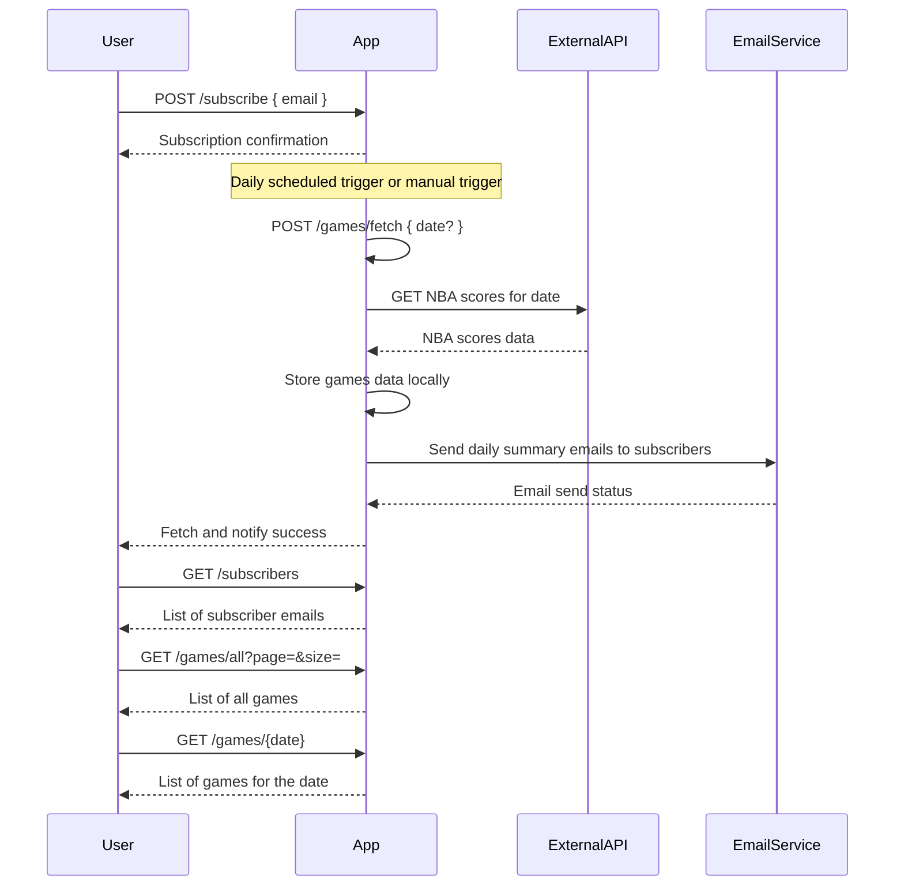

# Functional Requirements and API Design

## API Endpoints

### 1. Subscribe User  
**POST /subscribe**  
- Description: Add a user email to the notification list.  
- Request Body:  
```json
{
  "email": "user@example.com"
}
```  
- Response:  
```json
{
  "message": "Subscription successful",
  "email": "user@example.com"
}
```

### 2. Fetch and Store NBA Scores  
**POST /games/fetch**  
- Description: Trigger fetching NBA scores for the current day from the external API, store them locally, and send notifications to subscribers.  
- Request Body:  
```json
{
  "date": "YYYY-MM-DD"  // Optional, defaults to current date if not provided
}
```  
- Response:  
```json
{
  "message": "Scores fetched, stored, and notifications sent",
  "date": "YYYY-MM-DD",
  "gamesCount": 15
}
```

### 3. Get Subscribers  
**GET /subscribers**  
- Description: Retrieve all subscribed email addresses.  
- Response:  
```json
[
  "email1@example.com",
  "email2@example.com"
]
```

### 4. Get All Games  
**GET /games/all**  
- Description: Retrieve all stored NBA games (with optional pagination and filtering).  
- Query Parameters (optional):  
  - `page` (int)  
  - `size` (int)  
- Response:  
```json
[
  {
    "date": "YYYY-MM-DD",
    "homeTeam": "Team A",
    "awayTeam": "Team B",
    "homeScore": 100,
    "awayScore": 98,
    "otherDetails": "..."
  },
  ...
]
```

### 5. Get Games by Date  
**GET /games/{date}**  
- Description: Retrieve all NBA games for a specified date (`YYYY-MM-DD`).  
- Response:  
```json
[
  {
    "date": "YYYY-MM-DD",
    "homeTeam": "Team A",
    "awayTeam": "Team B",
    "homeScore": 100,
    "awayScore": 98,
    "otherDetails": "..."
  },
  ...
]
```

---

# Mermaid Diagram: User and App Interaction Sequence

