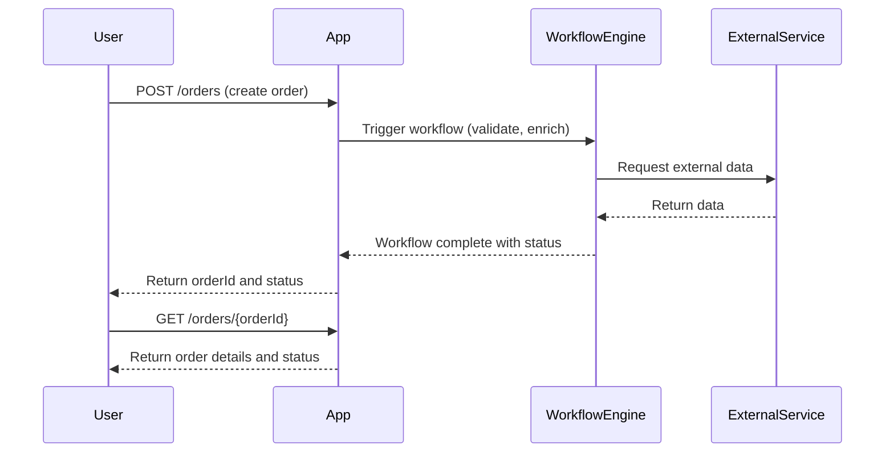
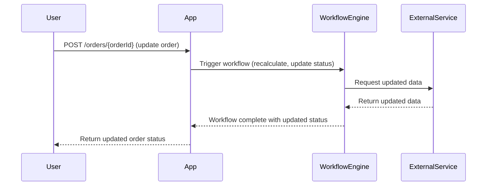
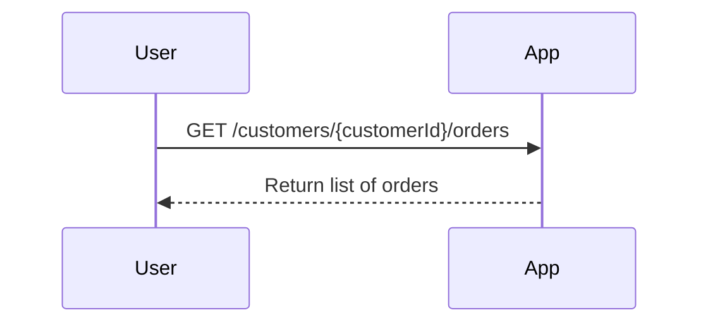

```markdown
# Functional Requirements and API Design

## Main Entity: Order

---

## API Endpoints

### 1. Create Order / Trigger Workflow  
`POST /orders`  
- Description: Create a new order and trigger associated workflows (e.g., validation, external data fetch, calculations)  
- Request Body (JSON):  
```json
{
  "customerId": "string",
  "items": [
    {
      "productId": "string",
      "quantity": "integer"
    }
  ],
  "orderDate": "string (ISO8601 date-time)"
}
```  
- Response Body (JSON):  
```json
{
  "orderId": "string",
  "status": "string",
  "workflowStatus": "string"
}
```

---

### 2. Update Order / Trigger Workflow  
`POST /orders/{orderId}`  
- Description: Update existing order details and trigger workflows (e.g., re-calculation, status update)  
- Request Body (JSON):  
```json
{
  "items": [
    {
      "productId": "string",
      "quantity": "integer"
    }
  ],
  "status": "string"
}
```  
- Response Body (JSON):  
```json
{
  "orderId": "string",
  "status": "string",
  "workflowStatus": "string"
}
```

---

### 3. Retrieve Order Details  
`GET /orders/{orderId}`  
- Description: Retrieve order details and current status (read-only, no external data fetch or calculations)  
- Response Body (JSON):  
```json
{
  "orderId": "string",
  "customerId": "string",
  "items": [
    {
      "productId": "string",
      "quantity": "integer"
    }
  ],
  "orderDate": "string (ISO8601 date-time)",
  "status": "string",
  "workflowStatus": "string"
}
```

---

### 4. List Orders by Customer  
`GET /customers/{customerId}/orders`  
- Description: List all orders for a customer (read-only)  
- Response Body (JSON):  
```json
[
  {
    "orderId": "string",
    "orderDate": "string (ISO8601 date-time)",
    "status": "string"
  }
]
```

---

## Business Logic Notes  
- All external data retrieval or calculations triggered by order creation or updates are handled asynchronously in the POST endpoints.  
- GET endpoints are strictly for retrieving stored results without triggering workflows or external calls.

---

## User-App Interaction Sequence Diagram



---

## Order Update and Workflow Trigger



---

## Order Retrieval by Customer


```
