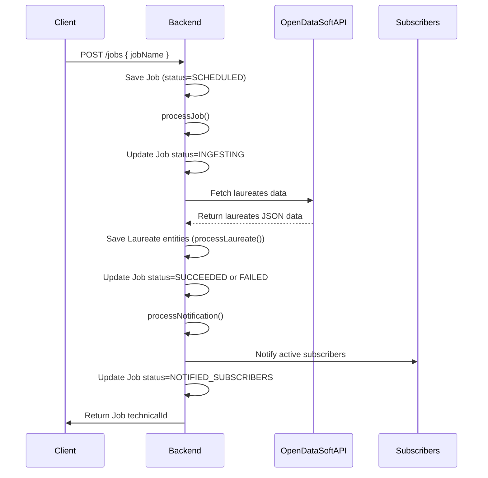
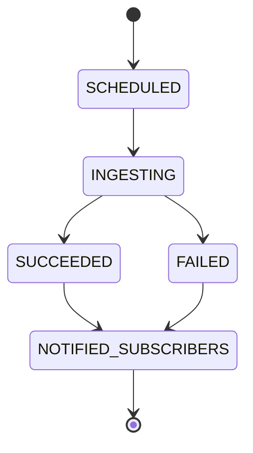

# Functional Requirements

---

## 1. Entity Definitions

```plaintext
Job:
- jobName: String (name/identifier of the ingestion job)
- status: String (workflow state of the job, e.g., SCHEDULED, INGESTING, SUCCEEDED, FAILED, NOTIFIED_SUBSCRIBERS)
- createdAt: DateTime (timestamp when the job was created)
- completedAt: DateTime (timestamp when the job finished processing)
- errorDetails: String (optional error message if job failed)

Laureate:
- laureateId: Integer (unique identifier from source)
- firstname: String (first name of laureate)
- surname: String (surname of laureate)
- born: Date (date of birth)
- died: Date (date of death, nullable)
- borncountry: String (country of birth)
- borncountrycode: String (ISO country code of birth)
- borncity: String (city of birth)
- gender: String (gender of laureate)
- year: String (year laureate won the prize)
- category: String (Nobel Prize category)
- motivation: String (award motivation text)
- affiliationName: String (affiliation institution name)
- affiliationCity: String (affiliation city)
- affiliationCountry: String (affiliation country)

Subscriber:
- subscriberId: String (unique subscriber identifier)
- contactType: String (e.g., "email", "webhook")
- contactAddress: String (email address or webhook URL)
- active: Boolean (indicates if subscriber is active)
```

---

## 2. Process Method Flows

### processJob() Flow:

1. Initial State: Job created with status = SCHEDULED
2. Transition: Change status to INGESTING
3. Data Ingestion: Fetch Nobel laureates data from OpenDataSoft API
4. For each record:
   - Save Laureate entity (triggers processLaureate())
5. On Ingestion Success:
   - Update Job status to SUCCEEDED
6. On Ingestion Failure:
   - Update Job status to FAILED
   - Record errorDetails
7. Notification:
   - Trigger processNotification() to notify all active Subscribers
8. Final State:
   - Update Job status to NOTIFIED_SUBSCRIBERS

### processLaureate() Flow:

1. Validation:
   - Validate required fields (e.g., laureateId, firstname, surname, year, category)
2. Enrichment:
   - Normalize country codes
   - Calculate derived data if needed (e.g., age at award)
3. Persist enriched Laureate data

### processNotification() Flow:

1. Retrieve all active Subscribers
2. For each Subscriber:
   - Send notification containing the new laureate data or job status update
3. Mark notifications as sent (if needed)

---

## 3. API Endpoints Design

| Entity     | Endpoint                           | Method | Request Body                        | Response                    | Notes                                 |
|------------|----------------------------------|--------|-----------------------------------|-----------------------------|---------------------------------------|
| Job        | `/jobs`                          | POST   | `{ "jobName": "string" }`          | `{ "technicalId": "string" }` | Creates new Job, triggers ingestion   |
| Job        | `/jobs/{technicalId}`            | GET    | N/A                               | Job entity details           | Retrieve Job by technicalId           |
| Laureate   | `/laureates/{technicalId}`       | GET    | N/A                               | Laureate entity details      | Retrieve Laureate by technicalId      |
| Subscriber | `/subscribers`                   | POST   | `{ "subscriberId": "string", "contactType": "string", "contactAddress": "string", "active": true }` | `{ "technicalId": "string" }` | Add new Subscriber                    |
| Subscriber | `/subscribers/{technicalId}`     | GET    | N/A                               | Subscriber entity details    | Retrieve Subscriber by technicalId    |

---

## 4. Request / Response JSON Formats

### Create Job (POST /jobs)

Request:
```json
{
  "jobName": "Daily Nobel Laureates Ingestion"
}
```

Response:
```json
{
  "technicalId": "job_123456789"
}
```

---

### Get Job by technicalId (GET /jobs/{technicalId})

Response:
```json
{
  "jobName": "Daily Nobel Laureates Ingestion",
  "status": "NOTIFIED_SUBSCRIBERS",
  "createdAt": "2024-06-01T10:00:00Z",
  "completedAt": "2024-06-01T10:10:00Z",
  "errorDetails": null
}
```

---

### Get Laureate by technicalId (GET /laureates/{technicalId})

Response:
```json
{
  "laureateId": 853,
  "firstname": "Akira",
  "surname": "Suzuki",
  "born": "1930-09-12",
  "died": null,
  "borncountry": "Japan",
  "borncountrycode": "JP",
  "borncity": "Mukawa",
  "gender": "male",
  "year": "2010",
  "category": "Chemistry",
  "motivation": "for palladium-catalyzed cross couplings in organic synthesis",
  "affiliationName": "Hokkaido University",
  "affiliationCity": "Sapporo",
  "affiliationCountry": "Japan"
}
```

---

### Create Subscriber (POST /subscribers)

Request:
```json
{
  "subscriberId": "sub_001",
  "contactType": "email",
  "contactAddress": "user@example.com",
  "active": true
}
```

Response:
```json
{
  "technicalId": "sub_001"
}
```

---

### Get Subscriber by technicalId (GET /subscribers/{technicalId})

Response:
```json
{
  "subscriberId": "sub_001",
  "contactType": "email",
  "contactAddress": "user@example.com",
  "active": true
}
```

---

## 5. Visual Representation




