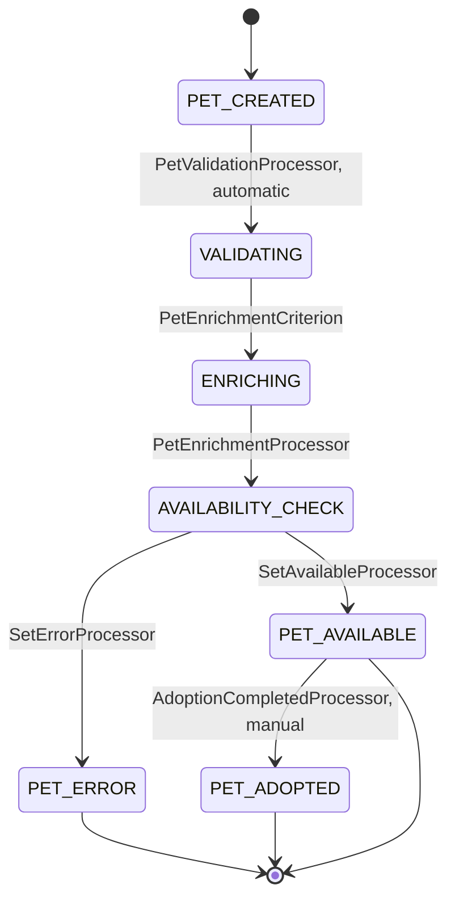
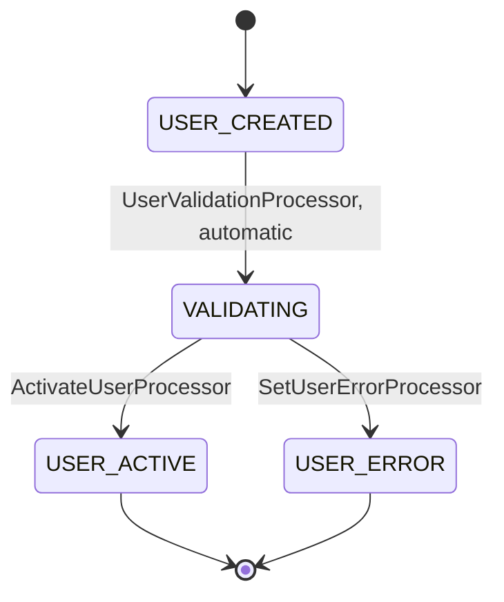
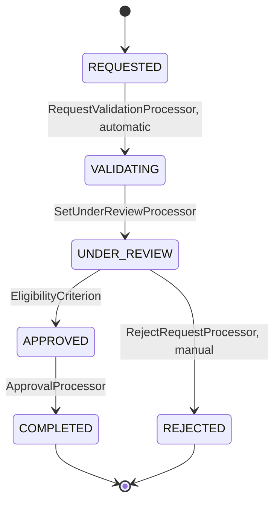

### 1. Entity Definitions

```
Pet:
- id: String (business id, unique within app)
- name: String (pet name)
- species: String (e.g., Cat, Dog)
- breed: String (breed or description)
- age: Integer (years)
- status: String (Available, PendingAdoption, Adopted)
- source: String (origin of record, e.g., petstore, manual)
- externalId: String (id from Petstore API if applicable)
- ownerId: String (user id when adopted)
- createdAt: String (ISO datetime)

User:
- id: String (business id)
- username: String (login handle)
- email: String (contact email)
- fullName: String (display name)
- phone: String (contact phone)
- registeredAt: String (ISO datetime)

AdoptionRequest:
- id: String (business id)
- petId: String (reference to Pet.id)
- userId: String (reference to User.id)
- message: String (applicant message)
- status: String (Requested, UnderReview, Approved, Rejected, Cancelled)
- requestedAt: String (ISO datetime)
- processedBy: String (admin user id who processed)
```

Note: You asked for a Petstore-data-backed app. I kept to 3 entities (Pet, User, AdoptionRequest) as default. If you want an explicit orchestration Job entity (ImportJob) add it and I will expand.

---

### 2. Entity workflows

Pet workflow:
1. Initial State: PET_CREATED when a Pet entity is persisted (source may be petstore/manual)
2. Validation: Automatic - basic field checks (PetValidationProcessor)
3. Enrichment: Automatic - if source == petstore and externalId present, call PetEnrichmentProcessor to fetch and enrich details from Petstore data
4. Availability Check: Automatic - set status to Available or PendingAdoption depending on enrichment and completeness
5. Adoption Link: Manual - when adoption completes, transition PET_ADOPTED and set ownerId
6. Final: PET_ADOPTED or PET_AVAILABLE (terminal states) / PET_ERROR if processing failed



Processors/Criterions needed:
- PetValidationProcessor (processor) — validate required fields, set validation errors
- PetEnrichmentCriterion (criterion) — returns true if source == petstore and externalId present
- PetEnrichmentProcessor (processor) — call Petstore to enrich fields (breed, age, pictures)
- SetAvailableProcessor (processor) — mark status Available
- SetErrorProcessor (processor) — set status PET_ERROR, record reason

Pseudo behaviour: PetEnrichmentProcessor should be resilient: on failure set retry metadata and potentially SetErrorProcessor.

---

User workflow:
1. Initial State: USER_CREATED when persisted
2. Validation: Automatic - UserValidationProcessor (email format, uniqueness criterion)
3. Activation: Automatic - If validated, set status active and trigger WelcomeNotificationProcessor
4. Manual: User updates profile (manual transitions)
5. Final: USER_ACTIVE or USER_ERROR



Processors/Criterions needed:
- UserValidationProcessor (processor) — check email format, required fields
- ActivateUserProcessor (processor) — set registeredAt, status active
- SetUserErrorProcessor (processor) — capture validation errors
- WelcomeNotificationProcessor (optional asynchronous processor invoked by ActivateUserProcessor)

---

AdoptionRequest workflow:
1. Initial State: REQUESTED when persisted (user posts adoption request)
2. Validation: Automatic - RequestValidationProcessor (pet exists, user exists, pet available)
3. Review: Manual - Admin or automated eligibility check via EligibilityCriterion
4. Processing: Automatic - if approved, ApprovalProcessor updates Pet (PET_ADOPTED) and notifies parties
5. Completion: Approved -> COMPLETED (Adoption executed) or Rejected -> REJECTED



Processors/Criterions needed:
- RequestValidationProcessor (processor) — check pet exists, pet.status == Available, user exists
- SetUnderReviewProcessor (processor) — mark status UnderReview
- EligibilityCriterion (criterion) — automated checks (e.g., user age, prior adoptions) — returns true to proceed
- ApprovalProcessor (processor) — set AdoptionRequest.status Approved, update Pet.ownerId and Pet.status Adopted, notify user and admin
- RejectRequestProcessor (processor) — set status Rejected and notify applicant

---

### 3. Pseudo code for processor classes

PetValidationProcessor
```pseudo
function process(pet):
    errors = []
    if not pet.name: errors.add("name required")
    if not pet.species: errors.add("species required")
    if errors:
        pet.metadata.validationErrors = errors
        pet.status = "PET_ERROR"
    else:
        pet.metadata.validated = true
    return pet
```

PetEnrichmentProcessor
```pseudo
function process(pet):
    if pet.source == "petstore" and pet.externalId:
        external = CallPetstoreAPI(pet.externalId)  // external call
        if external.success:
            pet.breed = pet.breed or external.breed
            pet.age = pet.age or external.age
            pet.metadata.images = external.images
        else:
            pet.metadata.enrichmentRetries = (pet.metadata.enrichmentRetries or 0) + 1
            if pet.metadata.enrichmentRetries > 2:
                pet.status = "PET_ERROR"
    return pet
```

RequestValidationProcessor
```pseudo
function process(request):
    pet = findPet(request.petId)
    user = findUser(request.userId)
    if not pet or not user:
        request.status = "REJECTED"
        request.metadata.reason = "missing pet or user"
    elif pet.status != "Available":
        request.status = "REJECTED"
        request.metadata.reason = "pet not available"
    else:
        request.metadata.validated = true
    return request
```

ApprovalProcessor
```pseudo
function process(request):
    request.status = "Approved"
    pet = findPet(request.petId)
    pet.ownerId = request.userId
    pet.status = "Adopted"
    notifyUser(request.userId, "Your adoption is approved")
    notifyAdmin("Adoption completed for pet " + pet.id)
    return (request, pet)
```

---

### 4. API Endpoints Design Rules

General rules applied:
- All POST endpoints create an entity and trigger its workflow (event-driven).
- POST responses return only {"technicalId": "..."} (technicalId is a datastore-assigned id, not part of entity fields).
- For each POST-created entity there is a GET by technicalId to retrieve processing results.
- No GET-by-condition endpoints added unless you ask.

Endpoints and JSON formats:

1) Create Pet
POST /pets
Request:
```json
{
  "id": "pet-123",
  "name": "Whiskers",
  "species": "Cat",
  "breed": "Tabby",
  "age": 2,
  "source": "petstore",
  "externalId": "ps-987"
}
```
Response:
```json
{
  "technicalId": "tch-pet-0001"
}
```

GET Pet by technicalId
GET /pets/{technicalId}
Response:
```json
{
  "technicalId": "tch-pet-0001",
  "id": "pet-123",
  "name": "Whiskers",
  "species": "Cat",
  "breed": "Tabby",
  "age": 2,
  "status": "Available",
  "source": "petstore",
  "externalId": "ps-987",
  "ownerId": null,
  "createdAt": "2025-09-13T12:00:00Z",
  "metadata": { "validated": true, "images": ["..."] }
}
```

2) Create User
POST /users
Request:
```json
{
  "id": "user-77",
  "username": "catfan",
  "email": "catfan@example.com",
  "fullName": "Cat Fan",
  "phone": "+123456789"
}
```
Response:
```json
{
  "technicalId": "tch-user-0001"
}
```

GET User by technicalId
GET /users/{technicalId}
Response:
```json
{
  "technicalId": "tch-user-0001",
  "id": "user-77",
  "username": "catfan",
  "email": "catfan@example.com",
  "fullName": "Cat Fan",
  "phone": "+123456789",
  "registeredAt": "2025-09-13T12:01:00Z"
}
```

3) Create AdoptionRequest
POST /adoption-requests
Request:
```json
{
  "id": "req-500",
  "petId": "pet-123",
  "userId": "user-77",
  "message": "I have a loving home!"
}
```
Response:
```json
{
  "technicalId": "tch-req-0001"
}
```

GET AdoptionRequest by technicalId
GET /adoption-requests/{technicalId}
Response:
```json
{
  "technicalId": "tch-req-0001",
  "id": "req-500",
  "petId": "pet-123",
  "userId": "user-77",
  "message": "I have a loving home!",
  "status": "UnderReview",
  "requestedAt": "2025-09-13T12:05:00Z"
}
```

Notes / Business rules:
- POST triggers Cyoda workflows automatically for each entity persisted.
- External enrichment (Petstore data) is handled by PetEnrichmentProcessor as part of the Pet workflow when source == petstore.
- Approval of an adoption request must update both AdoptionRequest and Pet entities (atomicity handled by workflow processors).
- If you want query endpoints (GET by condition) or an explicit ImportJob orchestration entity for scheduled ingestion from Petstore, tell me and I will add an ImportJob entity and its POST/GET endpoints and workflows.

Would you like me to:
- add an explicit ImportJob orchestration entity for scheduled Petstore syncs, or
- include GET-by-condition (e.g., GET /pets?status=Available) endpoints?