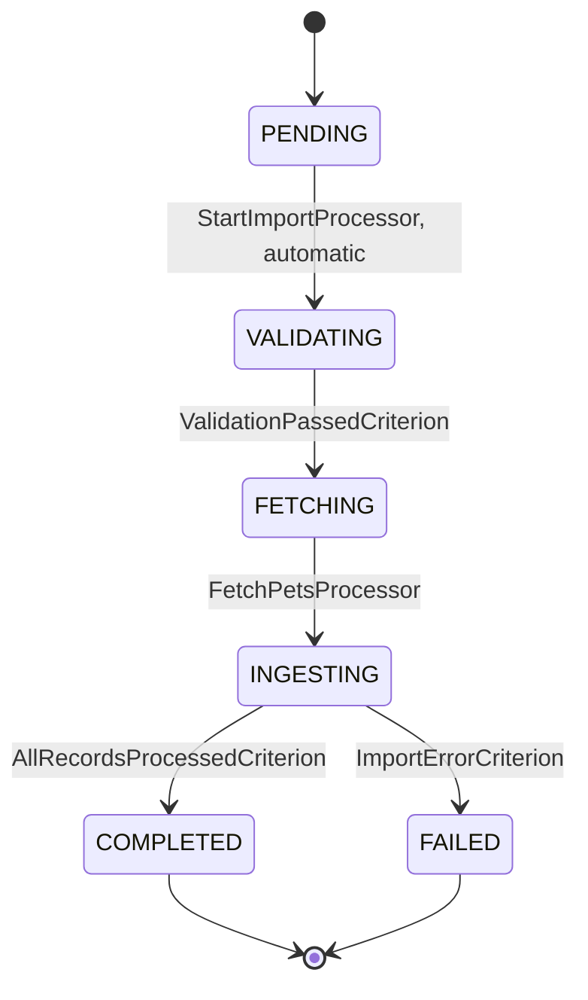
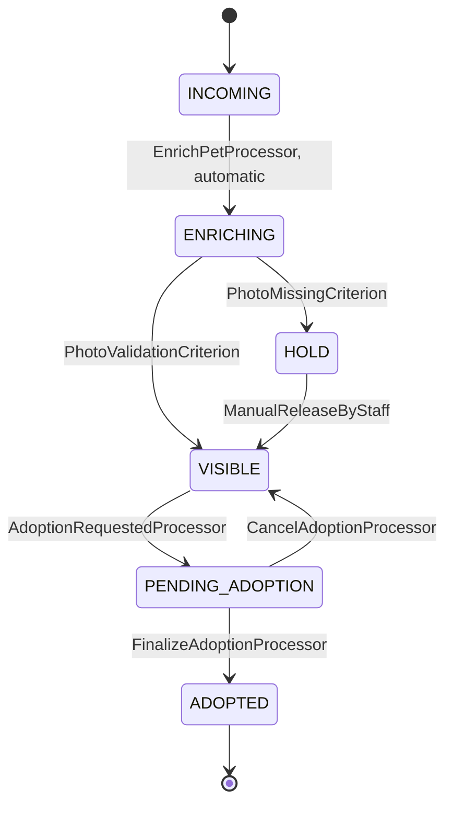
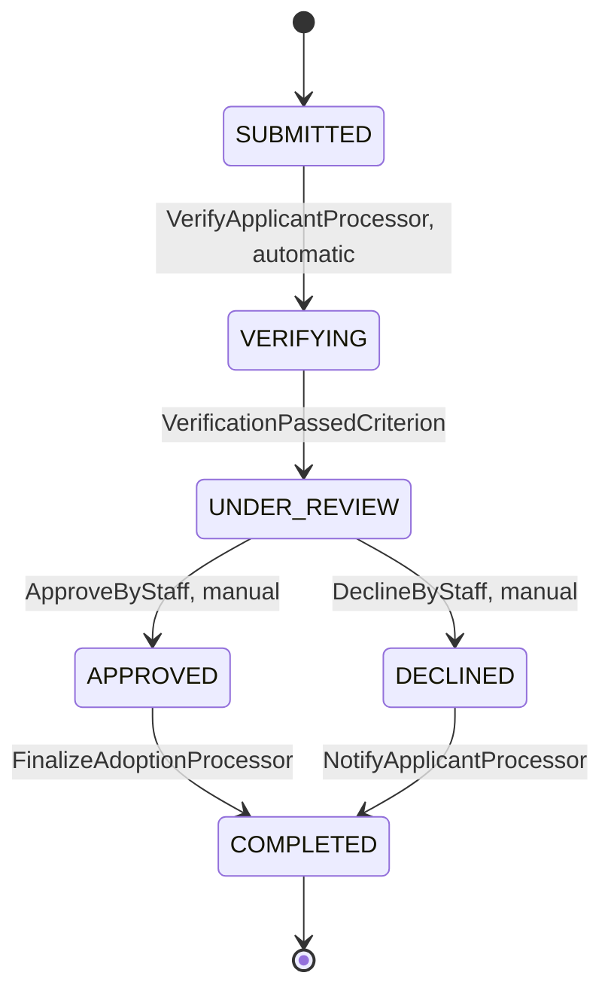

### 1. Entity Definitions
```
Pet:
- id: String (external Petstore id)
- name: String (pet name)
- species: String (e.g., dog, cat)
- breed: String
- ageMonths: Integer (age in months)
- gender: String
- status: String (available pending adopted hold)
- photos: Array<String> (urls)
- sourceOrigin: String (Petstore)
- technicalMetadata: Map (ingestion metadata)
- createdAt: String (ISO8601)

AdoptionRequest:
- requestId: String (business id)
- petId: String (links to Pet.id)
- applicantName: String
- contactInfo: Map (email/phone/address)
- requestedAt: String (ISO8601)
- status: String (submitted under_review approved declined cancelled)
- verificationCompleted: Boolean
- decisionNotes: String

ImportJob:
- jobId: String (business id)
- sourceUrl: String (Petstore base url)
- initiatedBy: String (system or user)
- startedAt: String
- completedAt: String
- status: String (pending running completed failed)
- importedCount: Integer
- errorSummary: String
```

### 2. Entity workflows

ImportJob workflow:
1. Initial State: job created with pending
2. Validate: check sourceUrl & credentials (automatic)
3. Fetch: retrieve pets from Petstore (automatic)
4. Ingest: for each pet create Pet entity (automatic; each Pet creation triggers Pet workflow)
5. Completion: mark completed or failed and summarise errors (automatic)


```mermaid
stateDiagram-v2
    [*] --> PENDING
    PENDING --> VALIDATING : StartImportProcessor, automatic
    VALIDATING --> FETCHING : ValidationPassedCriterion
    FETCHING --> INGESTING : FetchPetsProcessor
    INGESTING --> COMPLETED : AllRecordsProcessedCriterion
    INGESTING --> FAILED : ImportErrorCriterion
    COMPLETED --> [*]
    FAILED --> [*]
```

Processors/Criterion (ImportJob):
- ValidateSourceCriterion
- StartImportProcessor (pseudocode below)
- FetchPetsProcessor
- CreatePetEventProcessor
- AllRecordsProcessedCriterion

Pet workflow:
1. Initial State: created by ImportJob as INCOMING
2. Enrichment: validate fields, download/validate photos (automatic)
3. Publishable check: photos & required fields present (automatic)
4. Visible: set status available and show in listings (automatic)
5. Adoption flow: when AdoptionRequest approved move to adopted (automatic), or manual hold by staff (manual)


```mermaid
stateDiagram-v2
    [*] --> INCOMING
    INCOMING --> ENRICHING : EnrichPetProcessor, automatic
    ENRICHING --> HOLD : PhotoMissingCriterion
    ENRICHING --> VISIBLE : PhotoValidationCriterion
    VISIBLE --> PENDING_ADOPTION : AdoptionRequestedProcessor
    PENDING_ADOPTION --> ADOPTED : FinalizeAdoptionProcessor
    PENDING_ADOPTION --> VISIBLE : CancelAdoptionProcessor
    HOLD --> VISIBLE : ManualReleaseByStaff
    ADOPTED --> [*]
```

Processors/Criterion (Pet):
- ValidatePetCriterion
- EnrichPetProcessor
- PhotoValidationCriterion
- PublishPetProcessor
- FinalizeAdoptionProcessor

AdoptionRequest workflow:
1. Initial State: submitted
2. Verification: verify applicant details (automatic/manual)
3. Review: staff reviews application (manual)
4. Decision: approved or declined (manual)
5. Completion: if approved, FinalizeAdoptionProcessor updates Pet and notifies applicant (automatic)


```mermaid
stateDiagram-v2
    [*] --> SUBMITTED
    SUBMITTED --> VERIFYING : VerifyApplicantProcessor, automatic
    VERIFYING --> UNDER_REVIEW : VerificationPassedCriterion
    UNDER_REVIEW --> APPROVED : ApproveByStaff, manual
    UNDER_REVIEW --> DECLINED : DeclineByStaff, manual
    APPROVED --> COMPLETED : FinalizeAdoptionProcessor
    DECLINED --> COMPLETED : NotifyApplicantProcessor
    COMPLETED --> [*]
```

Processors/Criterion (AdoptionRequest):
- VerifyApplicantProcessor
- VerificationPassedCriterion
- CheckPetAvailabilityCriterion
- FinalizeAdoptionProcessor
- NotifyApplicantProcessor

### 3. Pseudo code for processor classes (concise)

StartImportProcessor:
```
function process(job){
  validateSource(job.sourceUrl)
  job.status = running
  save(job)
}
```
FetchPetsProcessor:
```
function process(job){
  pets = fetchFromSource(job.sourceUrl)
  for p in pets:
    emitEvent create Pet with p data
  job.importedCount = count(pets)
}
```
EnrichPetProcessor:
```
function process(pet){
  pet.technicalMetadata.enrichedAt = now()
  if photos missing mark pet.flagMissingPhoto
  save(pet)
}
```
FinalizeAdoptionProcessor:
```
function process(request){
  if CheckPetAvailabilityCriterion(request.petId):
    pet = loadPet(request.petId)
    pet.status = adopted
    pet.owner = {name: request.applicantName, contact: request.contactInfo}
    save(pet)
    request.status = approved
    notifyApplicant(request)
}
```

### 4. API Endpoints Design Rules (JSON examples)

Rules applied:
- POST returns only technicalId
- Orchestration entity ImportJob: POST + GET by technicalId
- Business entity AdoptionRequest: POST (triggers process) + GET by technicalId
- Pet: GET by technicalId, GET all optional

POST /import-jobs
Request:
```json
{
  "sourceUrl":"https://petstore.example/api",
  "initiatedBy":"system"
}
```
Response:
```json
{
  "technicalId":"job-abc-123"
}
```

GET /import-jobs/{technicalId}
Response:
```json
{
  "jobId":"job-1",
  "sourceUrl":"https://petstore.example/api",
  "status":"running",
  "importedCount":10,
  "startedAt":"2025-08-22T10:00:00Z"
}
```

POST /adoption-requests
Request:
```json
{
  "petId":"pet-789",
  "applicantName":"Jane Doe",
  "contactInfo":{"email":"jane@example.com","phone":"123"}
}
```
Response:
```json
{
  "technicalId":"req-xyz-456"
}
```

GET /adoption-requests/{technicalId}
Response:
```json
{
  "requestId":"req-1",
  "petId":"pet-789",
  "status":"under_review",
  "requestedAt":"2025-08-22T11:00:00Z"
}
```

GET /pets/{technicalId}
Response:
```json
{
  "id":"pet-789",
  "name":"Mittens",
  "species":"cat",
  "status":"available",
  "photos":["https://..."]
}
```

If you want more entities (Owner, Appointment, Inventory) I can expand to up to 10 and add their EDA workflows. Which additional entities would you prefer next?