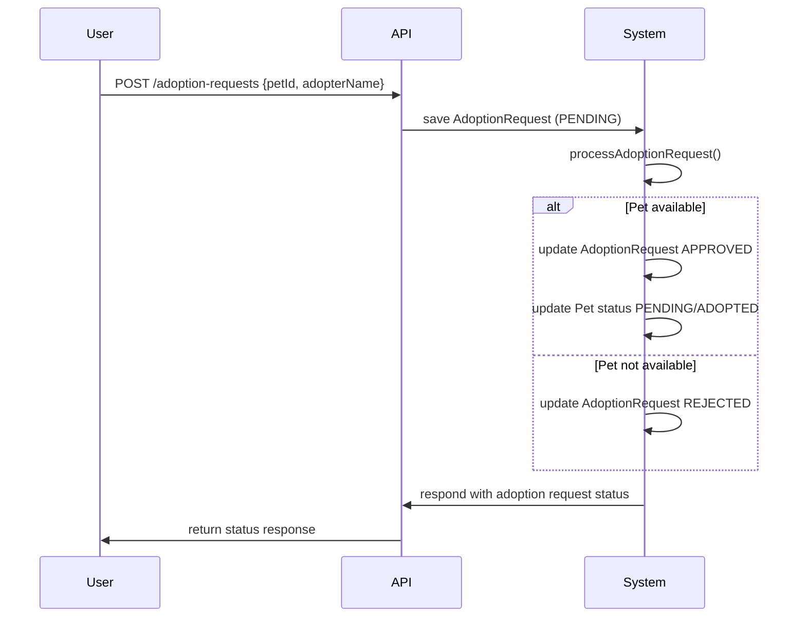

### 1. Entity Definitions

``` 
PurrfectPetsJob:  (Orchestration entity)
- jobId: String (unique identifier for the job)
- jobType: String (e.g., "PetDataSync", "AdoptionProcessing")
- createdAt: DateTime (job creation timestamp)
- status: StatusEnum (PENDING, PROCESSING, COMPLETED, FAILED)

Pet:  (Business entity)
- petId: String (unique pet identifier)
- name: String (pet's name)
- species: String (e.g., Cat, Dog)
- breed: String (pet breed)
- age: Integer (pet age in years)
- status: StatusEnum (AVAILABLE, ADOPTED, PENDING)

AdoptionRequest:  (Business entity)
- requestId: String (unique adoption request identifier)
- petId: String (referencing Pet)
- adopterName: String (person requesting adoption)
- requestDate: DateTime (when request was made)
- status: StatusEnum (PENDING, APPROVED, REJECTED)
```

---

### 2. Process Method Flows

```
processPurrfectPetsJob() Flow:
1. Initial State: Job created with PENDING status
2. Validation: Verify jobType is valid and required params exist
3. Processing:
   - If jobType = PetDataSync → fetch and sync pet data from Petstore API
   - If jobType = AdoptionProcessing → process adoption requests queue
4. Completion: Update job status to COMPLETED or FAILED based on results
5. Notification: Optionally notify downstream components or logs
```

```
processPet() Flow:
1. Initial State: New Pet entity created with AVAILABLE status
2. Validation: Check pet data completeness and validity (species, age, etc.)
3. Processing: Save pet data, update search indexes or caches if needed
4. Completion: Confirm pet availability to users
```

```
processAdoptionRequest() Flow:
1. Initial State: AdoptionRequest created with PENDING status
2. Validation: Verify pet exists and is AVAILABLE
3. Processing: 
   - If valid, mark adoption request APPROVED and update Pet status to PENDING or ADOPTED
   - If invalid, mark request REJECTED
4. Completion: Persist updated statuses and notify interested parties
```

---

### 3. API Endpoints Design

| HTTP Method | Endpoint                     | Purpose                                      | Request Body Example                         | Response Example                            |
|-------------|------------------------------|----------------------------------------------|----------------------------------------------|----------------------------------------------|
| POST        | /jobs                        | Create a new Job (triggers processing)      | `{ "jobType": "PetDataSync" }`                | `{ "jobId": "123", "status": "PENDING" }`    |
| POST        | /pets                        | Add a new Pet (triggers pet processing)     | `{ "name": "Whiskers", "species": "Cat", "breed": "Siamese", "age": 2 }` | `{ "petId": "p1", "status": "AVAILABLE" }`  |
| POST        | /adoption-requests           | Create adoption request (triggers adoption processing) | `{ "petId": "p1", "adopterName": "Alice" }` | `{ "requestId": "r1", "status": "PENDING" }` |
| GET         | /pets/{petId}                | Retrieve pet details                          | N/A                                          | `{ "petId": "p1", "name": "Whiskers", ... }`|
| GET         | /adoption-requests/{requestId} | Retrieve adoption request status             | N/A                                          | `{ "requestId": "r1", "status": "APPROVED" }`|
| GET         | /jobs/{jobId}                | Retrieve job status and results               | N/A                                          | `{ "jobId": "123", "status": "COMPLETED" }`  |

---

### 4. Request/Response Formats

**Example: Creating a Pet**

Request:
```json
{
  "name": "Whiskers",
  "species": "Cat",
  "breed": "Siamese",
  "age": 2
}
```

Response:
```json
{
  "petId": "p1",
  "status": "AVAILABLE"
}
```

**Example: Creating Adoption Request**

Request:
```json
{
  "petId": "p1",
  "adopterName": "Alice"
}
```

Response:
```json
{
  "requestId": "r1",
  "status": "PENDING"
}
```

---

### Mermaid Diagrams

**Entity lifecycle state diagram for PurrfectPetsJob**


```mermaid
stateDiagram-v2
    [*] --> PENDING
    PENDING --> PROCESSING : processPurrfectPetsJob()
    PROCESSING --> COMPLETED : success
    PROCESSING --> FAILED : error
    COMPLETED --> [*]
    FAILED --> [*]
```

**Event-driven processing chain**

```mermaid
graph TD
    CreateJob[Create PurrfectPetsJob entity]
    CreateJob --> processJob[processPurrfectPetsJob()]
    processJob -->|PetDataSync| SyncPets[Sync Pet data from Petstore API]
    processJob -->|AdoptionProcessing| ProcessAdoptions[Process Adoption Requests]
    SyncPets --> JobComplete[Job COMPLETED]
    ProcessAdoptions --> JobComplete
```

**User interaction sequence flow for Adoption**


```mermaid
sequenceDiagram
    participant User
    participant API
    participant System

    User->>API: POST /adoption-requests {petId, adopterName}
    API->>System: save AdoptionRequest (PENDING)
    System->>System: processAdoptionRequest()
    alt Pet available
        System->>System: update AdoptionRequest APPROVED
        System->>System: update Pet status PENDING/ADOPTED
    else Pet not available
        System->>System: update AdoptionRequest REJECTED
    end
    System->>API: respond with adoption request status
    API->>User: return status response
```

---

Please let me know if you would like any additional refinements!