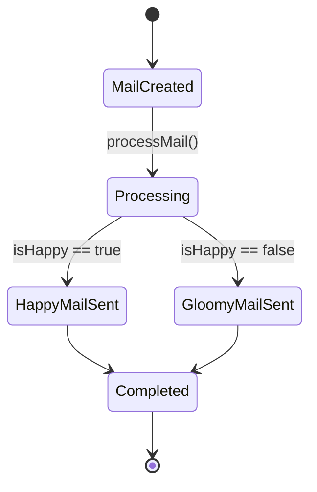
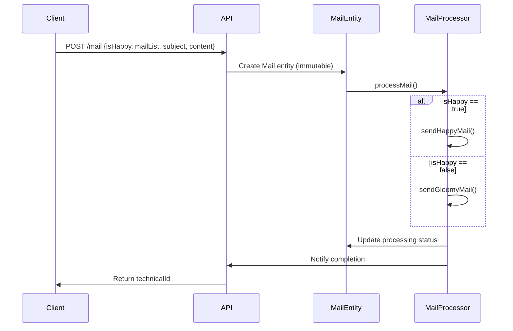
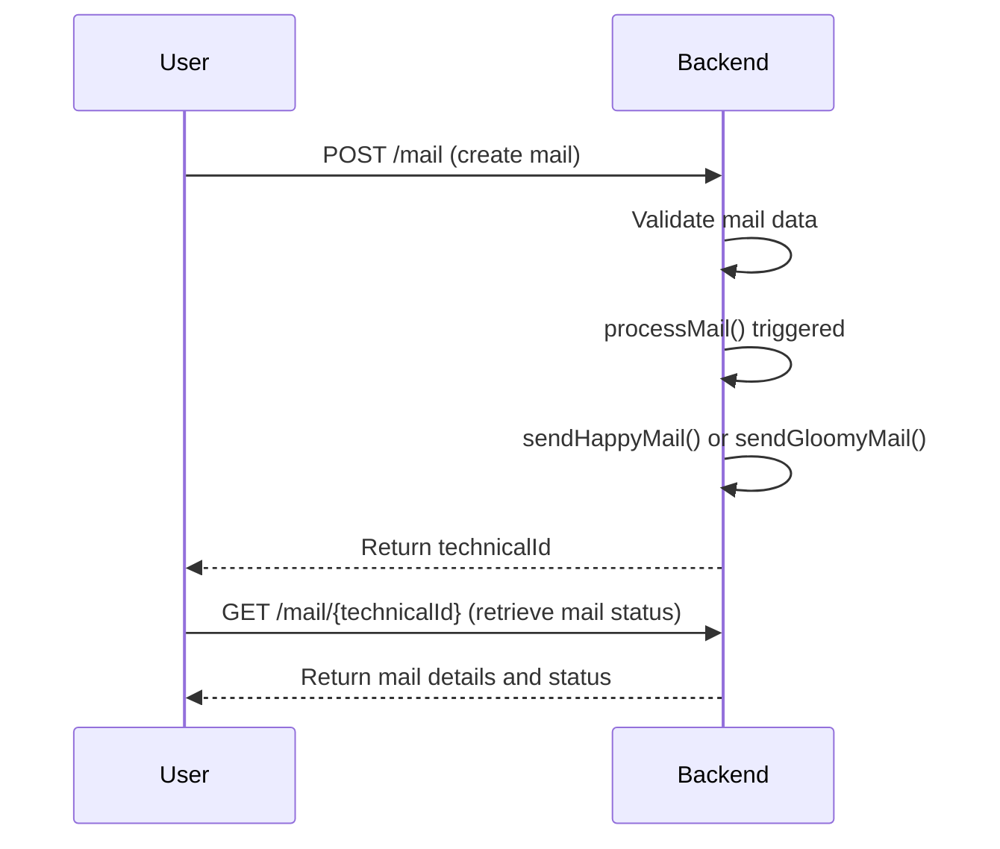

### 1. Entity Definitions

``` 
Mail:
- isHappy: Boolean (Indicates whether the mail is happy or gloomy)
- mailList: List<String> (List of recipient email addresses)
- subject: String (Subject of the mail)
- content: String (The body content of the mail)
```

### 2. Process Method Flows

```
processMail() Flow:
1. Initial State: Mail entity is created (immutable)
2. Validation: Validate mailList contains valid email addresses and content is not empty
3. Decision: Based on isHappy field, route to either sendHappyMail() or sendGloomyMail() processor
4. Processing:
   - sendHappyMail(): Send mail to mailList with happy-themed content
   - sendGloomyMail(): Send mail to mailList with gloomy-themed content
5. Completion: Mark mail processing as completed (internal status/logging)
6. Notification: Optionally notify sender or system about mail dispatch status
```

### 3. API Endpoints Design

| Endpoint            | Method | Purpose                                               | Request Body                                           | Response                          |
|---------------------|--------|-------------------------------------------------------|-------------------------------------------------------|----------------------------------|
| `/mail`             | POST   | Create a new Mail entity (triggers processMail event) | `{ "isHappy": true, "mailList": [...], "subject": "...", "content": "..." }` | `{ "technicalId": "uuid" }`      |
| `/mail/{technicalId}`| GET    | Retrieve Mail processing result by technicalId        | N/A                                                   | `{ "technicalId": "...", "isHappy": true, "mailList": [...], "subject": "...", "content": "...", "status": "COMPLETED" }` |

- No update or delete endpoints due to EDA immutability principle.
- No GET by condition endpoint unless explicitly requested later.

### 4. Request/Response Formats

**POST /mail Request**  
```json
{
  "isHappy": true,
  "mailList": ["user1@example.com", "user2@example.com"],
  "subject": "Happy Greetings",
  "content": "Wishing you a wonderful day!"
}
```

**POST /mail Response**  
```json
{
  "technicalId": "123e4567-e89b-12d3-a456-426614174000"
}
```

**GET /mail/{technicalId} Response**  
```json
{
  "technicalId": "123e4567-e89b-12d3-a456-426614174000",
  "isHappy": true,
  "mailList": ["user1@example.com", "user2@example.com"],
  "subject": "Happy Greetings",
  "content": "Wishing you a wonderful day!",
  "status": "COMPLETED"
}
```

---

### Visual Representation

**Entity Lifecycle State Diagram**


```mermaid
stateDiagram-v2
    [*] --> MailCreated
    MailCreated --> Processing : processMail()
    Processing --> HappyMailSent : isHappy == true
    Processing --> GloomyMailSent : isHappy == false
    HappyMailSent --> Completed
    GloomyMailSent --> Completed
    Completed --> [*]
```

**Event-Driven Processing Chain**


```mermaid
sequenceDiagram
    participant Client
    participant API
    participant MailEntity
    participant MailProcessor

    Client->>API: POST /mail {isHappy, mailList, subject, content}
    API->>MailEntity: Create Mail entity (immutable)
    MailEntity->>MailProcessor: processMail()
    alt isHappy == true
        MailProcessor->>MailProcessor: sendHappyMail()
    else isHappy == false
        MailProcessor->>MailProcessor: sendGloomyMail()
    end
    MailProcessor->>MailEntity: Update processing status
    MailProcessor->>API: Notify completion
    API->>Client: Return technicalId
```

**User Interaction Sequence Flow**


```mermaid
sequenceDiagram
    participant User
    participant Backend

    User->>Backend: POST /mail (create mail)
    Backend->>Backend: Validate mail data
    Backend->>Backend: processMail() triggered
    Backend->>Backend: sendHappyMail() or sendGloomyMail()
    Backend-->>User: Return technicalId
    User->>Backend: GET /mail/{technicalId} (retrieve mail status)
    Backend-->>User: Return mail details and status
```

---

This completes your functional requirements specification based on Event-Driven Architecture using Cyoda platform conventions. Please let me know if you want to expand or adjust anything further.