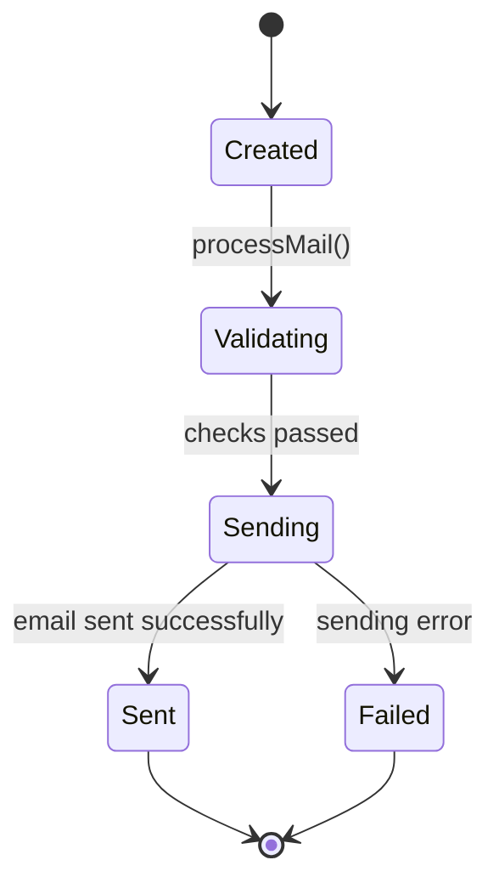
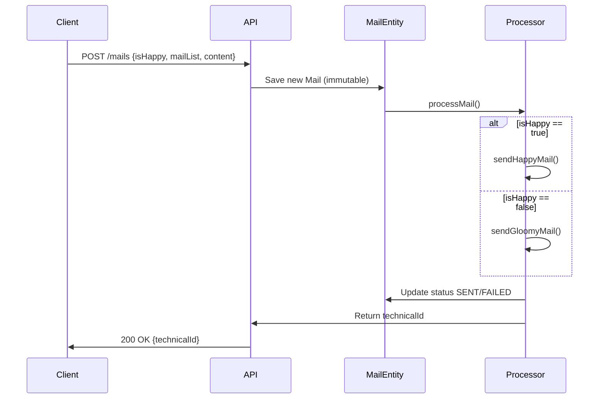
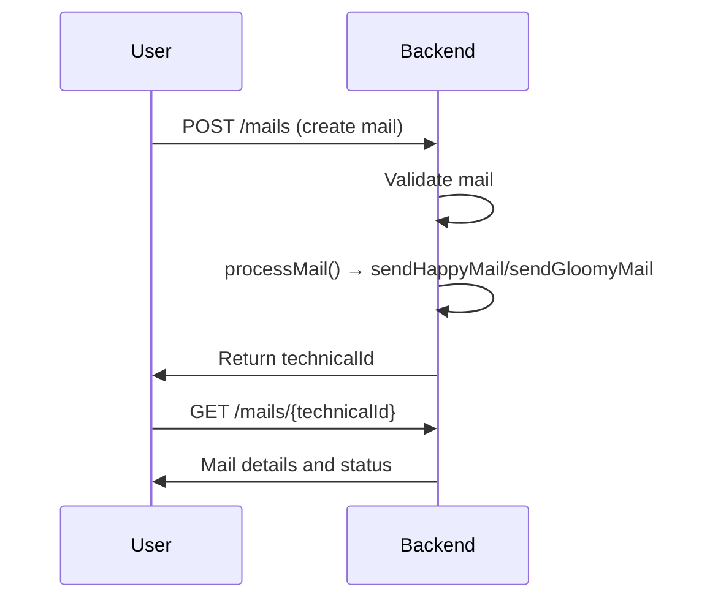

### 1. Entity Definitions

```
Mail:
- isHappy: boolean (indicates if the mail is happy or gloomy)
- mailList: List<String> (list of recipient email addresses)
- content: String (the actual mail content)
- status: String (represents current mail processing state, e.g., PENDING, SENT, FAILED)
```

---

### 2. Process Method Flows

```
processMail() Flow:
1. Initial State: Mail entity created with isHappy flag, mailList, content; status = PENDING
2. Validation: 
   - Run checkMailHappy() if isHappy == true
   - Run checkMailGloomy() if isHappy == false
3. Processing:
   - If isHappy == true → sendHappyMail() processor sends happy mails to mailList
   - If isHappy == false → sendGloomyMail() processor sends gloomy mails to mailList
4. Completion: Update mail status to SENT or FAILED based on sending result
5. Notification: Log or notify system of mail sending outcome (optional)
```

---

### 3. API Endpoints Design

- **POST /mails**
  - Creates a new `Mail` entity (immutable creation)
  - Triggers `processMail()` event automatically
  - Request JSON:
    ```json
    {
      "isHappy": true,
      "mailList": ["user1@example.com", "user2@example.com"],
      "content": "Your happy message here"
    }
    ```
  - Response JSON:
    ```json
    {
      "technicalId": "generated-uuid-or-id"
    }
    ```

- **GET /mails/{technicalId}**
  - Retrieves Mail entity processing results by technicalId
  - Response JSON example:
    ```json
    {
      "isHappy": true,
      "mailList": ["user1@example.com", "user2@example.com"],
      "content": "Your happy message here",
      "status": "SENT"
    }
    ```

- **GET /mails?isHappy=true|false** (optional)
  - Retrieves mails filtered by `isHappy` field if explicitly requested

---

### 4. Request/Response Formats

**POST /mails Request:**

```json
{
  "isHappy": true,
  "mailList": ["recipient@example.com"],
  "content": "Hello! This is a happy mail."
}
```

**POST /mails Response:**

```json
{
  "technicalId": "123e4567-e89b-12d3-a456-426614174000"
}
```

**GET /mails/{technicalId} Response:**

```json
{
  "isHappy": true,
  "mailList": ["recipient@example.com"],
  "content": "Hello! This is a happy mail.",
  "status": "SENT"
}
```

---

### 5. Mermaid Diagrams

**Mail Lifecycle State Diagram**


```mermaid
stateDiagram-v2
    [*] --> Created
    Created --> Validating : processMail()
    Validating --> Sending : checks passed
    Sending --> Sent : email sent successfully
    Sending --> Failed : sending error
    Sent --> [*]
    Failed --> [*]
```

**Event-Driven Processing Chain**


```mermaid
sequenceDiagram
    participant Client
    participant API
    participant MailEntity
    participant Processor

    Client->>API: POST /mails {isHappy, mailList, content}
    API->>MailEntity: Save new Mail (immutable)
    MailEntity->>Processor: processMail()
    alt isHappy == true
        Processor->>Processor: sendHappyMail()
    else isHappy == false
        Processor->>Processor: sendGloomyMail()
    end
    Processor->>MailEntity: Update status SENT/FAILED
    Processor->>API: Return technicalId
    API->>Client: 200 OK {technicalId}
```

**User Interaction Sequence Flow**


```mermaid
sequenceDiagram
    participant User
    participant Backend

    User->>Backend: POST /mails (create mail)
    Backend->>Backend: Validate mail
    Backend->>Backend: processMail() → sendHappyMail/sendGloomyMail
    Backend->>User: Return technicalId
    User->>Backend: GET /mails/{technicalId}
    Backend->>User: Mail details and status
```

---

If you need any further adjustments or additions, please let me know.  
Thank you!