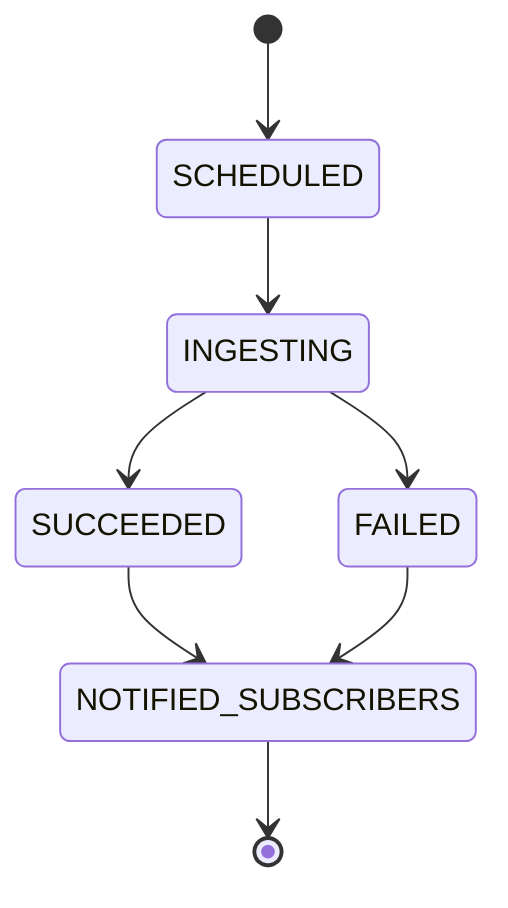
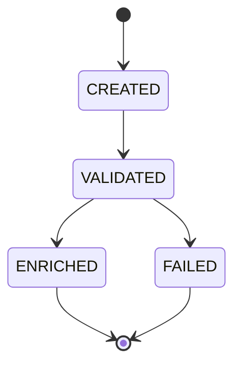
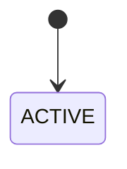

# Functional Requirements for Nobel Laureates Data Ingestion Backend

---

## 1. Entity Definitions

```
Job:
- jobName: String (Description of the ingestion job)
- status: String (Job status: SCHEDULED, INGESTING, SUCCEEDED, FAILED, NOTIFIED_SUBSCRIBERS)
- scheduleInfo: String (Optional scheduling metadata)
- createdAt: DateTime (Job creation timestamp)
- completedAt: DateTime (Job completion timestamp)

Laureate:
- laureateId: Integer (Unique laureate identifier from source)
- firstname: String (First name)
- surname: String (Surname)
- born: Date (Birth date)
- died: Date (Death date, nullable)
- borncountry: String (Birth country)
- borncountrycode: String (Birth country code)
- borncity: String (Birth city)
- gender: String (Gender)
- year: String (Award year)
- category: String (Nobel Prize category)
- motivation: String (Award motivation)
- affiliationName: String (Affiliation institution name)
- affiliationCity: String (Affiliation city)
- affiliationCountry: String (Affiliation country)

Subscriber:
- contactType: String (Contact type: email, webhook, etc.)
- contactValue: String (Contact address or URL)
- preferences: String (Optional notification preferences)
- subscribedAt: DateTime (Subscription timestamp)
```

---

## 2. Entity Workflows

### Job Workflow
1. Job created with status **SCHEDULED**  
2. Status changes to **INGESTING** when ingestion starts  
3. Laureate entities created immutably as data ingests  
4. Job status updated to **SUCCEEDED** or **FAILED** based on ingestion result  
5. Notifications sent to Subscribers  
6. Job status updated to **NOTIFIED_SUBSCRIBERS**  


```mermaid
stateDiagram-v2
    [*] --> SCHEDULED
    SCHEDULED --> INGESTING
    INGESTING --> SUCCEEDED
    INGESTING --> FAILED
    SUCCEEDED --> NOTIFIED_SUBSCRIBERS
    FAILED --> NOTIFIED_SUBSCRIBERS
    NOTIFIED_SUBSCRIBERS --> [*]
```

---

### Laureate Workflow
1. Laureate entity immutably created upon ingestion event  
2. Validation and enrichment processing handled asynchronously  


```mermaid
stateDiagram-v2
    [*] --> CREATED
    CREATED --> VALIDATED
    VALIDATED --> ENRICHED
    VALIDATED --> FAILED
    ENRICHED --> [*]
    FAILED --> [*]
```

---

### Subscriber Workflow
1. Subscriber entity created immutably via POST endpoint  
2. Active and eligible for notifications  


```mermaid
stateDiagram-v2
    [*] --> ACTIVE
```

---

## 3. API Endpoints

### Job Entity

- **POST** `/jobs`  
  Request Body:
  ```json
  {
    "jobName": "string",
    "scheduleInfo": "string (optional)"
  }
  ```
  Response Body:
  ```json
  {
    "technicalId": "string"
  }
  ```

- **GET** `/jobs/{technicalId}`  
  Response Body:
  ```json
  {
    "jobName": "string",
    "status": "string",
    "scheduleInfo": "string",
    "createdAt": "string (ISO datetime)",
    "completedAt": "string (ISO datetime or null)"
  }
  ```

---

### Laureate Entity

- **GET** `/laureates/{technicalId}`  
  Response Body:
  ```json
  {
    "laureateId": "integer",
    "firstname": "string",
    "surname": "string",
    "born": "string (ISO date)",
    "died": "string (ISO date or null)",
    "borncountry": "string",
    "borncountrycode": "string",
    "borncity": "string",
    "gender": "string",
    "year": "string",
    "category": "string",
    "motivation": "string",
    "affiliationName": "string",
    "affiliationCity": "string",
    "affiliationCountry": "string"
  }
  ```

---

### Subscriber Entity

- **POST** `/subscribers`  
  Request Body:
  ```json
  {
    "contactType": "string",
    "contactValue": "string",
    "preferences": "string (optional)"
  }
  ```
  Response Body:
  ```json
  {
    "technicalId": "string"
  }
  ```

- **GET** `/subscribers/{technicalId}`  
  Response Body:
  ```json
  {
    "contactType": "string",
    "contactValue": "string",
    "preferences": "string",
    "subscribedAt": "string (ISO datetime)"
  }
  ```

---

This document fully captures the functional requirements, entities, workflows, and API contracts as confirmed.

You may use this specification directly for documentation and implementation.

If you have no further questions, I will now finalize and close the discussion.