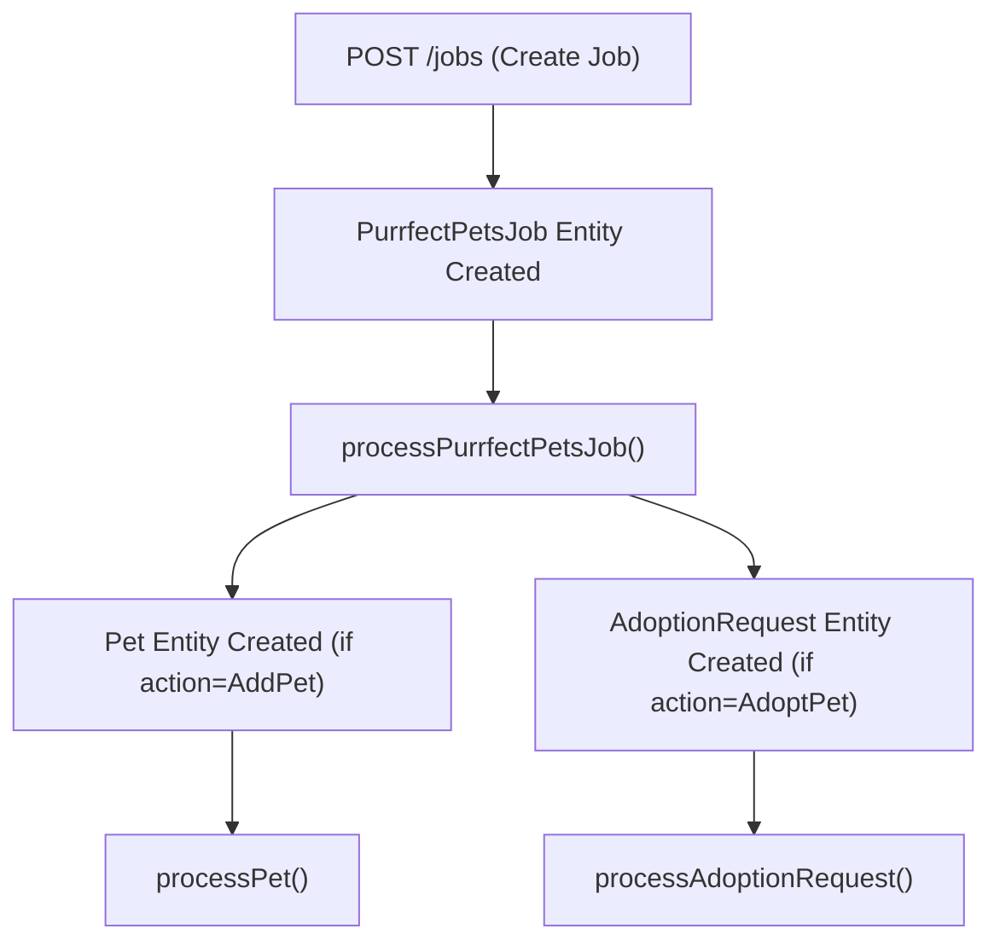
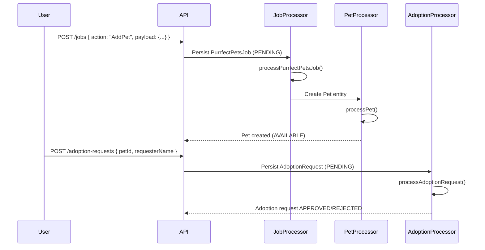

### 1. Entity Definitions

``` 
PurrfectPetsJob:  
- jobId: String (unique identifier for the orchestration job)  
- action: String (type of operation e.g., "AddPet", "SyncPets")  
- payload: JSON (input data for the job)  
- status: StatusEnum (PENDING, PROCESSING, COMPLETED, FAILED)  

Pet:  
- petId: String (unique pet identifier)  
- name: String (pet's name)  
- category: String (e.g., "Cat", "Dog", "Bird")  
- breed: String (pet breed)  
- age: Integer (age in years)  
- status: StatusEnum (AVAILABLE, ADOPTED, PENDING)  

AdoptionRequest:  
- requestId: String (unique identifier for adoption request)  
- petId: String (associated pet's ID)  
- requesterName: String (name of person applying for adoption)  
- requestDate: DateTime (when the request was made)  
- status: StatusEnum (PENDING, APPROVED, REJECTED)  
```

### 2. Process Method Flows

``` 
processPurrfectPetsJob() Flow:  
1. Initial State: Job created with PENDING status  
2. Validation: Verify job action and payload correctness  
3. Execution: Depending on action, trigger relevant business logic (e.g., add pet, sync pets, create adoption request)  
4. Persistence: Save resulting entities (Pet, AdoptionRequest) immutably  
5. Completion: Update job status to COMPLETED or FAILED  
6. Notification: Log and optionally send notifications on job completion  

processPet() Flow:  
1. Initial State: Pet entity created with AVAILABLE status  
2. Validation: Check mandatory fields (name, category, breed)  
3. Processing: Enrich or verify pet data (e.g., validate breed against allowed list)  
4. Completion: Confirm pet is ready for adoption or listing  

processAdoptionRequest() Flow:  
1. Initial State: AdoptionRequest created with PENDING status  
2. Validation: Verify pet availability and requester data  
3. Processing: Check if pet is AVAILABLE for adoption  
4. Completion: Update request status to APPROVED or REJECTED based on business rules  
5. Update Pet status to ADOPTED if approved  
```

### 3. API Endpoints & JSON Formats

**POST /jobs** – Create a new orchestration job  
Request:  
```json  
{  
  "action": "AddPet",  
  "payload": {  
    "name": "Whiskers",  
    "category": "Cat",  
    "breed": "Siamese",  
    "age": 2  
  }  
}  
```  
Response:  
```json  
{  
  "jobId": "job-123",  
  "status": "PENDING"  
}  
```  

**GET /pets/{petId}** – Retrieve pet details  
Response:  
```json  
{  
  "petId": "pet-456",  
  "name": "Whiskers",  
  "category": "Cat",  
  "breed": "Siamese",  
  "age": 2,  
  "status": "AVAILABLE"  
}  
```  

**POST /adoption-requests** – Submit adoption request  
Request:  
```json  
{  
  "petId": "pet-456",  
  "requesterName": "Alice Johnson"  
}  
```  
Response:  
```json  
{  
  "requestId": "req-789",  
  "status": "PENDING"  
}  
```  

### 4. Mermaid Diagrams

**Entity Lifecycle State Diagram (PurrfectPetsJob)**  

```mermaid  
stateDiagram-v2  
    [*] --> PENDING  
    PENDING --> PROCESSING : processPurrfectPetsJob()  
    PROCESSING --> COMPLETED : success  
    PROCESSING --> FAILED : error  
    COMPLETED --> [*]  
    FAILED --> [*]  
```  

**Event-Driven Processing Chain**  

```mermaid  
graph TD  
    POST_jobs["POST /jobs (Create Job)"] --> PurrfectPetsJobCreated["PurrfectPetsJob Entity Created"]  
    PurrfectPetsJobCreated --> processJob["processPurrfectPetsJob()"]  
    processJob --> PetCreated["Pet Entity Created (if action=AddPet)"]  
    processJob --> AdoptionRequestCreated["AdoptionRequest Entity Created (if action=AdoptPet)"]  
    PetCreated --> processPet["processPet()"]  
    AdoptionRequestCreated --> processAdoptionRequest["processAdoptionRequest()"]  
```  

**User Interaction Sequence Flow (Add Pet + Adoption Request)**  

```mermaid  
sequenceDiagram  
    participant User  
    participant API  
    participant JobProcessor  
    participant PetProcessor  
    participant AdoptionProcessor  

    User->>API: POST /jobs { action: "AddPet", payload: {...} }  
    API->>JobProcessor: Persist PurrfectPetsJob (PENDING)  
    JobProcessor->>JobProcessor: processPurrfectPetsJob()  
    JobProcessor->>PetProcessor: Create Pet entity  
    PetProcessor->>PetProcessor: processPet()  
    PetProcessor-->>API: Pet created (AVAILABLE)  
    User->>API: POST /adoption-requests { petId, requesterName }  
    API->>AdoptionProcessor: Persist AdoptionRequest (PENDING)  
    AdoptionProcessor->>AdoptionProcessor: processAdoptionRequest()  
    AdoptionProcessor-->>API: Adoption request APPROVED/REJECTED  
```