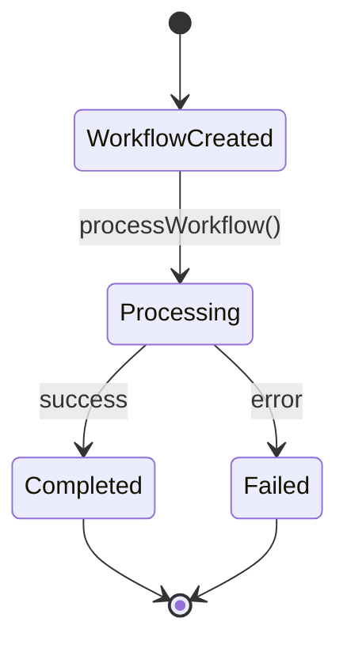
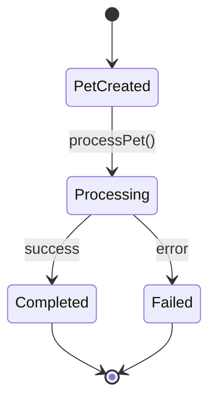
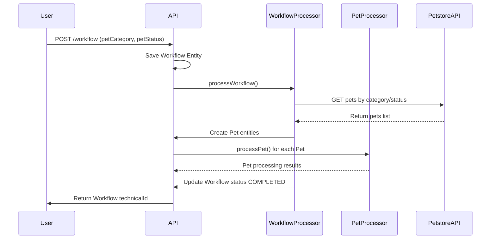

### 1. Entity Definitions

``` 
Workflow:
- name: String (the name or title of the workflow instance)
- createdAt: String (ISO timestamp when workflow was created)
- status: String (current state of the workflow, e.g. PENDING, COMPLETED, FAILED)
- petCategory: String (category of pets to process in this workflow, e.g. dogs, cats)
- petStatus: String (filter pets by status, e.g. available, pending, sold)

Pet:
- petId: Long (pet identifier from Petstore API)
- name: String (pet name)
- category: String (category of the pet)
- status: String (availability status of the pet)
- tags: String (comma separated tags or keywords)
- photoUrls: String (comma separated URLs of pet photos)
```

---

### 2. Process Method Flows

```
processWorkflow() Flow:
1. Initial State: Workflow entity created with status = PENDING
2. Validation: Check if petCategory and petStatus fields are valid (non-empty)
3. Fetch Pets: Query Petstore API for pets filtered by petCategory and petStatus
4. Generate Pet entities: For each pet retrieved, create immutable Pet entity records
5. Completion: Update Workflow status to COMPLETED if all pets processed successfully; else FAILED
6. Notification: (Optional) Trigger notification or logging about workflow completion status
```

```
processPet() Flow:
1. Initial State: Pet entity created (immutable record)
2. Validation: Validate pet fields like petId, name, category, status
3. Processing: Enrich pet data if needed (e.g., add fun descriptions or tags)
4. Completion: Mark Pet processing as COMPLETED (internally or by status field)
```

---

### 3. API Endpoints Design

| Endpoint                      | Method | Description                                      | Request Body Example                    | Response Format          |
|------------------------------|--------|------------------------------------------------|---------------------------------------|--------------------------|
| `/workflow`                   | POST   | Create new Workflow (triggers processWorkflow) | `{ "name": "Daily Pet Fetch", "petCategory": "dogs", "petStatus": "available" }` | `{ "technicalId": "uuid-1234" }` |
| `/workflow/{technicalId}`     | GET    | Retrieve Workflow details by technicalId        | N/A                                   | Workflow JSON entity     |
| `/pet/{technicalId}`          | GET    | Retrieve Pet entity by technicalId               | N/A                                   | Pet JSON entity          |
| `/pet`                       | POST   | Create new Pet entity (optional, if external add needed) | Full Pet JSON entity                  | `{ "technicalId": "uuid-5678" }` |

- No update or delete endpoints to follow EDA immutability principle.
- Pet entities are primarily created internally by Workflow processing, but POST /pet is optional if manual addition is needed.

---

### 4. Request / Response JSON Formats

**POST /workflow**

Request:
```json
{
  "name": "Daily Pet Fetch",
  "petCategory": "cats",
  "petStatus": "available"
}
```

Response:
```json
{
  "technicalId": "uuid-1234"
}
```

---

**GET /workflow/{technicalId}**

Response:
```json
{
  "name": "Daily Pet Fetch",
  "createdAt": "2024-06-01T12:00:00Z",
  "status": "COMPLETED",
  "petCategory": "cats",
  "petStatus": "available"
}
```

---

**GET /pet/{technicalId}**

Response:
```json
{
  "petId": 123,
  "name": "Whiskers",
  "category": "cats",
  "status": "available",
  "tags": "cute,fluffy",
  "photoUrls": "https://example.com/photo1.jpg,https://example.com/photo2.jpg"
}
```

---

### 5. Visual Representations

**Workflow Entity Lifecycle**


```mermaid
stateDiagram-v2
    [*] --> WorkflowCreated
    WorkflowCreated --> Processing : processWorkflow()
    Processing --> Completed : success
    Processing --> Failed : error
    Completed --> [*]
    Failed --> [*]
```

---

**Pet Entity Lifecycle**


```mermaid
stateDiagram-v2
    [*] --> PetCreated
    PetCreated --> Processing : processPet()
    Processing --> Completed : success
    Processing --> Failed : error
    Completed --> [*]
    Failed --> [*]
```

---

**Event-Driven Processing Chain**

```mermaid
graph LR
    A[POST /workflow] --> B[Save Workflow Entity]
    B --> C[processWorkflow()]
    C --> D[Fetch Pets from Petstore API]
    D --> E[Create Pet Entities]
    E --> F[processPet() for each Pet]
    F --> G[Workflow Completed or Failed]
```

---

**User Interaction Sequence Flow**


```mermaid
sequenceDiagram
    participant User
    participant API
    participant WorkflowProcessor
    participant PetProcessor
    participant PetstoreAPI

    User->>API: POST /workflow (petCategory, petStatus)
    API->>API: Save Workflow Entity
    API->>WorkflowProcessor: processWorkflow()
    WorkflowProcessor->>PetstoreAPI: GET pets by category/status
    PetstoreAPI-->>WorkflowProcessor: Return pets list
    WorkflowProcessor->>API: Create Pet entities
    API->>PetProcessor: processPet() for each Pet
    PetProcessor-->>API: Pet processing results
    WorkflowProcessor-->>API: Update Workflow status COMPLETED
    API->>User: Return Workflow technicalId
```

---

This completes the confirmed functional requirements for the "Purrfect Pets" API app using an Event-Driven Architecture approach on Cyoda platform.