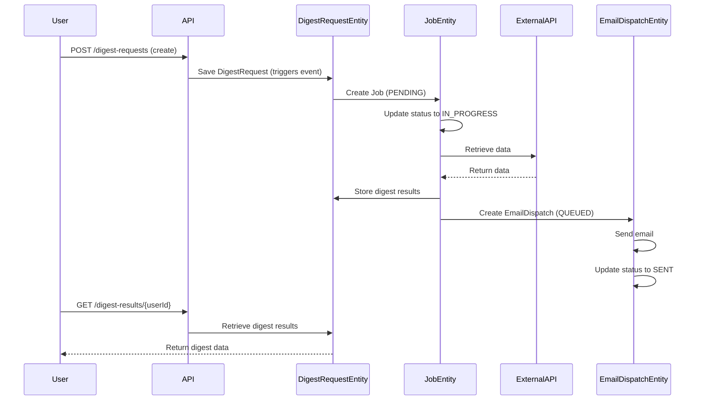

# Functional Requirements for Digest Request Processing (Event-Driven Architecture)

## 1. Business Entities

- **Job**  
  Orchestration entity representing the processing of a digest request.  
  Fields: `id`, `status` (e.g., PENDING, IN_PROGRESS, COMPLETED), `createdAt`, `updatedAt`

- **DigestRequest**  
  Business entity capturing the user's request for a digest.  
  Fields: `id`, `userId`, `requestTime`, `parameters` (criteria for digest)

- **EmailDispatch**  
  Orchestration entity tracking email sending status for a digest.  
  Fields: `id`, `jobId`, `emailAddress`, `status` (e.g., QUEUED, SENT), `sentAt`

---

## 2. API Endpoints

### POST /digest-requests  
Add or update a DigestRequest entity (triggers event to start processing)  
**Request:**  
```json
{
  "userId": "string",
  "parameters": "string or JSON object"
}
```  
**Response:**  
```json
{
  "digestRequestId": "string",
  "status": "CREATED"
}
```

### POST /jobs  
Add or update a Job entity (usually created internally, but can be exposed if needed)  
**Request:**  
```json
{
  "id": "string (optional for update)",
  "status": "string"
}
```  
**Response:**  
```json
{
  "jobId": "string",
  "status": "UPDATED or CREATED"
}
```

### GET /digest-results/{userId}  
Retrieve the processed digest results for a user (read-only, no external calls)  
**Response:**  
```json
{
  "userId": "string",
  "digestData": "object or array",
  "lastUpdated": "timestamp"
}
```

---

## 3. Event Processing Workflows

- **On DigestRequest Creation or Update:**  
  - Trigger Job creation with status `PENDING`  
  - Job event triggers data retrieval from external API based on DigestRequest parameters  
  - Retrieved data is processed and stored as digest results internally  
  - Create EmailDispatch entity with status `QUEUED`

- **On Job Update (e.g., status IN_PROGRESS to COMPLETED):**  
  - Trigger EmailDispatch sending process  
  - Update EmailDispatch status to `SENT` upon successful email dispatch

---

## 4. Request/Response Formats

- See API Endpoints section above for JSON format examples.

---

## 5. Mermaid Diagram: User-App Interaction and Event Processing Flow


```mermaid
sequenceDiagram
    participant User
    participant API
    participant DigestRequestEntity
    participant JobEntity
    participant ExternalAPI
    participant EmailDispatchEntity

    User->>API: POST /digest-requests (create)
    API->>DigestRequestEntity: Save DigestRequest (triggers event)
    DigestRequestEntity->>JobEntity: Create Job (PENDING)
    JobEntity->>JobEntity: Update status to IN_PROGRESS
    JobEntity->>ExternalAPI: Retrieve data
    ExternalAPI-->>JobEntity: Return data
    JobEntity->>DigestRequestEntity: Store digest results
    JobEntity->>EmailDispatchEntity: Create EmailDispatch (QUEUED)
    EmailDispatchEntity->>EmailDispatchEntity: Send email
    EmailDispatchEntity->>EmailDispatchEntity: Update status to SENT
    User->>API: GET /digest-results/{userId}
    API->>DigestRequestEntity: Retrieve digest results
    DigestRequestEntity-->>User: Return digest data
```

---

Thank you!