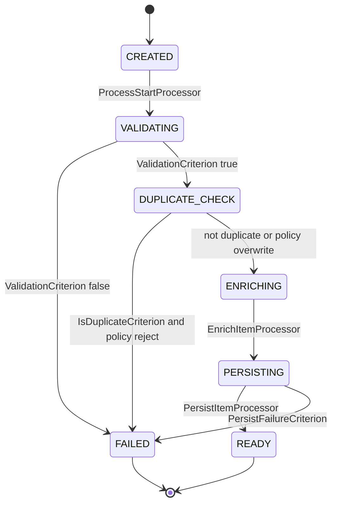
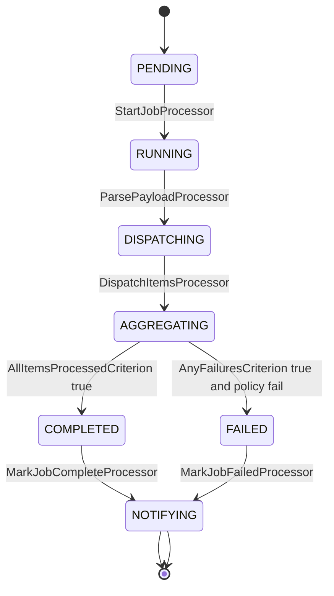
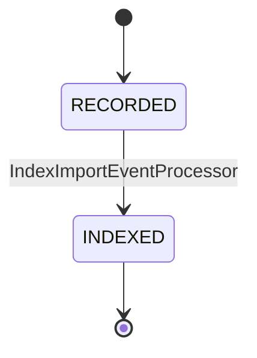
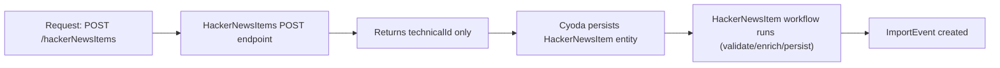

### 1. Entity Definitions
```
HackerNewsItem:
- id: number (Hacker News item id as in Firebase JSON, required)
- type: string (item type from HN JSON, required)
- originalJson: JSON (the full JSON payload as received, stored)
- importTimestamp: string (ISO8601 UTC, added when accepted)
- status: string (processing status: PENDING/ENRICHED/FAILED, freeform)

ImportJob:
- jobName: string (human name or description for this import)
- requestedBy: string (who asked to run the job)
- payload: JSON (single item or array of HN JSON payloads to import)
- createdAt: string (ISO8601 UTC)
- status: string (PENDING/RUNNING/COMPLETED/FAILED)
- processedCount: number (how many items processed)
- failureCount: number (how many items failed)

ImportEvent:
- eventId: string (unique event/audit id)
- itemId: number (HN id associated with the event)
- timestamp: string (ISO8601 UTC)
- status: string (SUCCESS/FAILURE)
- errors: array of string (validation or processing errors)
```

Notes:
- Max entities = 3 (default). I used 3 as requested. No additional entities added.

### 2. Entity workflows

HackerNewsItem workflow:
1. Initial State: CREATED (entity persisted -> triggers workflow)
2. Validation (automatic): check presence of id and type
3. Duplicate check (automatic): decide overwrite/skip/reject (policy required)
4. Enrichment (automatic): add importTimestamp
5. Persist result (automatic): final storage of originalJson including importTimestamp
6. Emit ImportEvent (automatic): log success or failure
7. Final state: READY or FAILED

mermaid

```mermaid
stateDiagram-v2
    [*] --> CREATED
    CREATED --> VALIDATING : ProcessStartProcessor
    VALIDATING --> FAILED : ValidationCriterion false
    VALIDATING --> DUPLICATE_CHECK : ValidationCriterion true
    DUPLICATE_CHECK --> FAILED : IsDuplicateCriterion and policy reject
    DUPLICATE_CHECK --> ENRICHING : not duplicate or policy overwrite
    ENRICHING --> PERSISTING : EnrichItemProcessor
    PERSISTING --> READY : PersistItemProcessor
    PERSISTING --> FAILED : PersistFailureCriterion
    READY --> [*]
    FAILED --> [*]
```

Processors and criteria (HackerNewsItem):
- Criteria:
  - ValidationCriterion (checks id and type present)
  - IsDuplicateCriterion (checks existing item with same id)
- Processors:
  - ProcessStartProcessor (entry point)
  - EnrichItemProcessor (adds importTimestamp)
  - PersistItemProcessor (persists final JSON)
  - CreateImportEventProcessor (creates ImportEvent)
  - NotifyProcessor (optional: notify subscribers)

ImportJob workflow:
1. Initial State: PENDING (job created via POST -> returns technicalId)
2. Parse payload (automatic): validate structure (single vs array)
3. Dispatch items (automatic): for each item create/persist HackerNewsItem entity (each creation is an event)
4. Aggregate results (automatic): collect successes/failures and counts
5. Completion (automatic): mark job COMPLETED or FAILED
6. Notification (automatic/manual): notify requester of result

mermaid

```mermaid
stateDiagram-v2
    [*] --> PENDING
    PENDING --> RUNNING : StartJobProcessor
    RUNNING --> DISPATCHING : ParsePayloadProcessor
    DISPATCHING --> AGGREGATING : DispatchItemsProcessor
    AGGREGATING --> COMPLETED : AllItemsProcessedCriterion true
    AGGREGATING --> FAILED : AnyFailuresCriterion true and policy fail
    COMPLETED --> NOTIFYING : MarkJobCompleteProcessor
    NOTIFYING --> [*]
    FAILED --> NOTIFYING : MarkJobFailedProcessor
    NOTIFYING --> [*]
```

Processors and criteria (ImportJob):
- Criteria:
  - AllItemsProcessedCriterion
  - AnyFailuresCriterion
- Processors:
  - StartJobProcessor
  - ParsePayloadProcessor
  - DispatchItemsProcessor (creates HackerNewsItem entities; each create triggers that entity workflow)
  - AggregateResultsProcessor
  - MarkJobCompleteProcessor

ImportEvent workflow:
1. Initial State: RECORDED (created whenever an item is processed)
2. Indexing/Retention (automatic): store in audit log, maybe TTL/archival
3. Final state: LOGGED

mermaid

```mermaid
stateDiagram-v2
    [*] --> RECORDED
    RECORDED --> INDEXED : IndexImportEventProcessor
    INDEXED --> [*]
```

Processors and criteria (ImportEvent):
- Criteria: none required for simple audit
- Processors:
  - CreateImportEventProcessor
  - IndexImportEventProcessor

### 3. Pseudo code for processor classes (concise, functional descriptions)

// HackerNewsItem processors
- ProcessStartProcessor
  - input: HackerNewsItem entity
  - action: invoke ValidationCriterion; route to next step

- EnrichItemProcessor
  - pseudocode:
    - if entity.originalJson exists
      - entity.importTimestamp = now_utc()
      - entity.originalJson.importTimestamp = entity.importTimestamp
    - return entity

- PersistItemProcessor
  - pseudocode:
    - write entity.originalJson to datastore as final representation
    - set entity.status = READY
    - emit ImportEvent (status SUCCESS)
    - return

- CreateImportEventProcessor
  - pseudocode:
    - create ImportEvent with itemId, timestamp, status, errors
    - persist ImportEvent

// ImportJob processors
- StartJobProcessor
  - set job.status = RUNNING; job.startedAt = now

- ParsePayloadProcessor
  - validate job.payload is either object or array
  - return list of item payloads or fail job

- DispatchItemsProcessor
  - for each payload in list:
    - create HackerNewsItem entity with originalJson = payload and status = PENDING
    - persist HackerNewsItem (this triggers HackerNewsItem workflow)
  - track processedCount and failureCount

- AggregateResultsProcessor
  - query ImportEvents for this job (or count responses)
  - update job.processedCount and job.failureCount

- MarkJobCompleteProcessor
  - if failureCount == 0 set job.status = COMPLETED else FAILED
  - persist job

### 4. API Endpoints Design Rules

Rules applied:
- POST endpoints return only technicalId (opaque id for the created entity)
- GET endpoints only retrieve stored results
- GET by technicalId present for entities created via POST
- A GET by non-technical field (HN id) is provided because you explicitly requested retrieval by id

Endpoints:

1) Create import job (orchestrator)
- POST /importJobs
- Request:
  {
    "jobName": "single_item_import",
    "requestedBy": "alice",
    "payload": { ... }   // single HN JSON or array of HN JSON
  }
- Response:
  {
    "technicalId": "job-<uuid>"
  }

2) Get import job by technicalId
- GET /importJobs/technical/{technicalId}
- Response:
  {
    "jobName": "...",
    "requestedBy": "...",
    "createdAt": "...",
    "status": "...",
    "processedCount": 10,
    "failureCount": 1
  }

3) Create single HackerNewsItem (alternate: allowed; triggers item workflow)
- POST /hackerNewsItems
- Request:
  { ... full Hacker News JSON payload ... }
- Response:
  {
    "technicalId": "item-<uuid>"
  }

4) Get HackerNewsItem by technicalId
- GET /hackerNewsItems/technical/{technicalId}
- Response:
  {
    "id": 12345,
    "type": "story",
    "originalJson": { ... includes importTimestamp if persisted ... },
    "importTimestamp": "2025-08-18T12:34:56Z",
    "status": "READY"
  }

5) Get HackerNewsItem by HN id (explicit requirement)
- GET /hackerNewsItems/by-id/{id}
- Response: the stored original JSON (exact JSON stored, including importTimestamp)
  e.g.
  {
    "id": 12345,
    "type": "story",
    "by": "alice",
    "text": "...",
    "importTimestamp": "2025-08-18T12:34:56Z"
  }

Mermaid visualization for request/response (example for single item import):

```mermaid
flowchart LR
    A["Request: POST /hackerNewsItems"] --> B["HackerNewsItems POST endpoint"]
    B --> C["Returns technicalId only"]
    C --> D["Cyoda persists HackerNewsItem entity"]
    D --> E["HackerNewsItem workflow runs (validate/enrich/persist)"]
    E --> F["ImportEvent created"]
```

Questions to finalize rules (please answer):
1. On duplicate HN id: should the system overwrite the existing item, skip (keep existing), or reject the new submission with error?
2. Do you want an audit/history (multiple versions per id) or only one stored version per HN id?
3. Do you require bulk import reporting (detailed per-item failures) returned by GET importJob?  

If you confirm duplicates and audit policy, I will update the workflows and criteria to reflect that policy and produce final Cyoda-ready entities and processors.