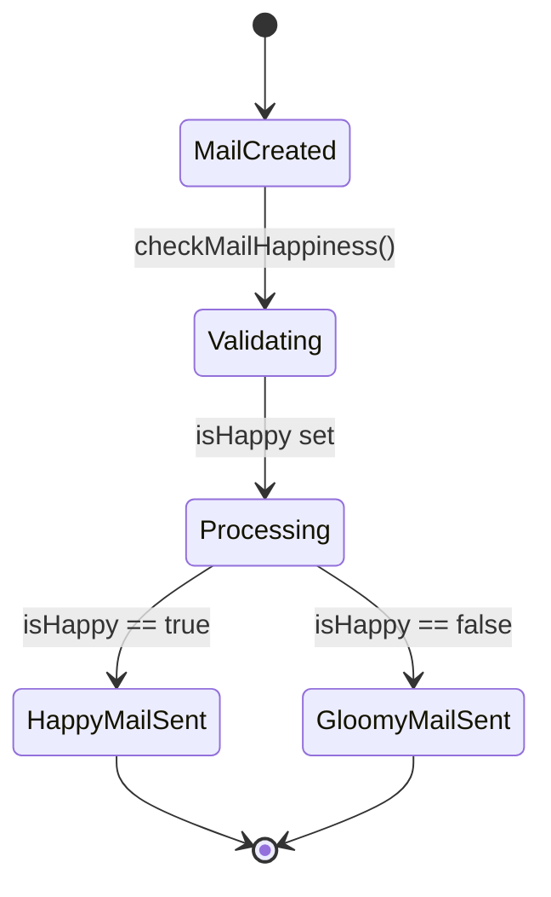
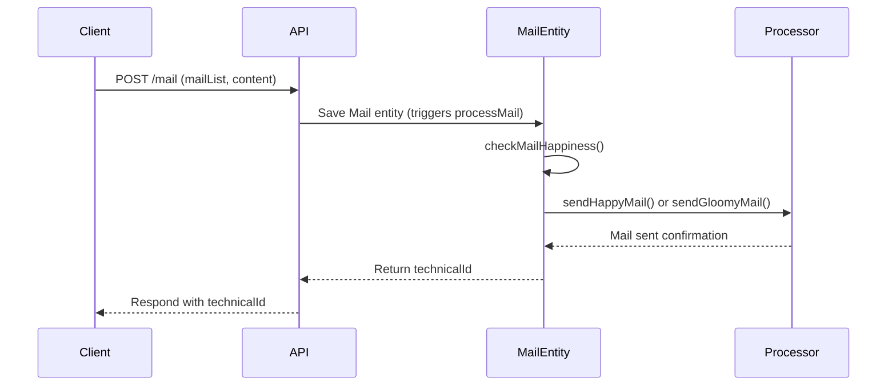
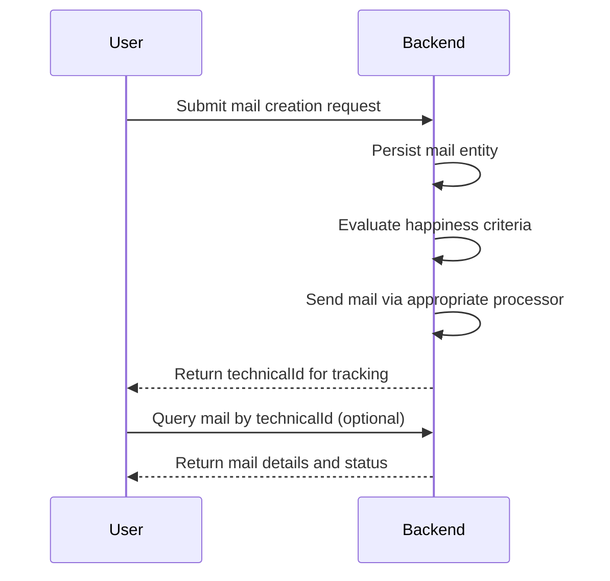

### 1. Entity Definitions

``` 
Mail:
- isHappy: Boolean (Indicates whether the mail is classified as happy)
- mailList: List<String> (List of recipient email addresses)
- content: String (Mail content used for happiness criteria evaluation)
```

### 2. Process Method Flows

```
processMail() Flow:
1. Initial State: Mail entity created with provided content and recipients.
2. Validation: CheckMailHappiness criteria is executed to set the isHappy flag.
3. Processing: 
   - If isHappy == true, trigger sendHappyMail() processor to send happy mail.
   - Otherwise, trigger sendGloomyMail() processor to send gloomy mail.
4. Completion: Mail sending result is logged or persisted as appropriate.
5. Notification: Optionally notify stakeholders or systems about mail sent status.
```

### 3. API Endpoints Design

| HTTP Method | Endpoint           | Description                                  | Request Body               | Response                  |
|-------------|--------------------|----------------------------------------------|----------------------------|---------------------------|
| POST        | `/mail`            | Create a new Mail entity (triggers processMail) | `{ mailList: [...], content: "..." }` | `{ technicalId: "uuid" }` |
| GET         | `/mail/{technicalId}` | Retrieve Mail entity by technicalId           | N/A                        | Full mail entity with status and isHappy |
| GET         | `/mail` (optional) | Retrieve list of mails (only if explicitly requested) | N/A                     | List of mail entities     |

### 4. Request/Response Formats

**POST /mail Request Example**

```json
{
  "mailList": ["user1@example.com", "user2@example.com"],
  "content": "Wishing you a happy day!"
}
```

**POST /mail Response Example**

```json
{
  "technicalId": "123e4567-e89b-12d3-a456-426614174000"
}
```

**GET /mail/{technicalId} Response Example**

```json
{
  "isHappy": true,
  "mailList": ["user1@example.com", "user2@example.com"],
  "content": "Wishing you a happy day!"
}
```

---

### Mermaid Diagrams

**Entity Lifecycle State Diagram**


```mermaid
stateDiagram-v2
    [*] --> MailCreated
    MailCreated --> Validating : checkMailHappiness()
    Validating --> Processing : isHappy set
    Processing --> HappyMailSent : isHappy == true
    Processing --> GloomyMailSent : isHappy == false
    HappyMailSent --> [*]
    GloomyMailSent --> [*]
```

**Event-Driven Processing Chain**


```mermaid
sequenceDiagram
    participant Client
    participant API
    participant MailEntity
    participant Processor

    Client->>API: POST /mail (mailList, content)
    API->>MailEntity: Save Mail entity (triggers processMail)
    MailEntity->>MailEntity: checkMailHappiness()
    MailEntity->>Processor: sendHappyMail() or sendGloomyMail()
    Processor-->>MailEntity: Mail sent confirmation
    MailEntity-->>API: Return technicalId
    API-->>Client: Respond with technicalId
```

**User Interaction Sequence Flow**


```mermaid
sequenceDiagram
    participant User
    participant Backend

    User->>Backend: Submit mail creation request
    Backend->>Backend: Persist mail entity
    Backend->>Backend: Evaluate happiness criteria
    Backend->>Backend: Send mail via appropriate processor
    Backend-->>User: Return technicalId for tracking
    User->>Backend: Query mail by technicalId (optional)
    Backend-->>User: Return mail details and status
```

---

This document reflects the confirmed functional requirements for your Happy Mail backend application based on Event-Driven Architecture principles on the Cyoda platform. Please let me know if you need further refinement or additional details!