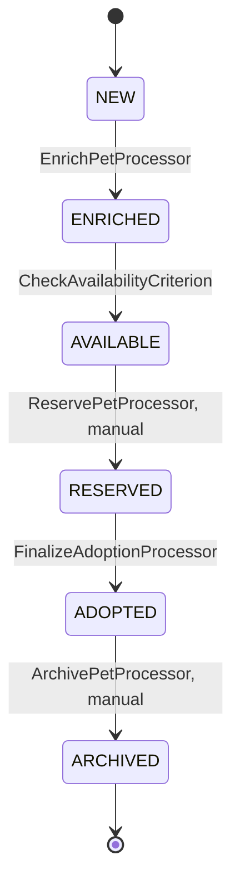
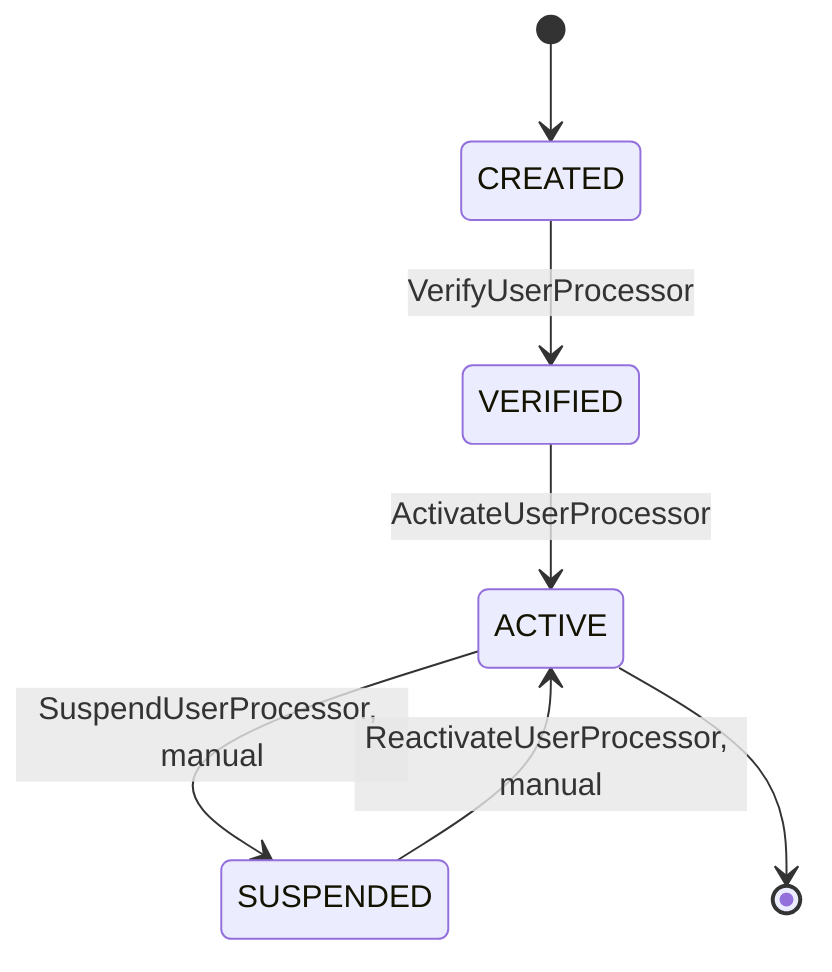
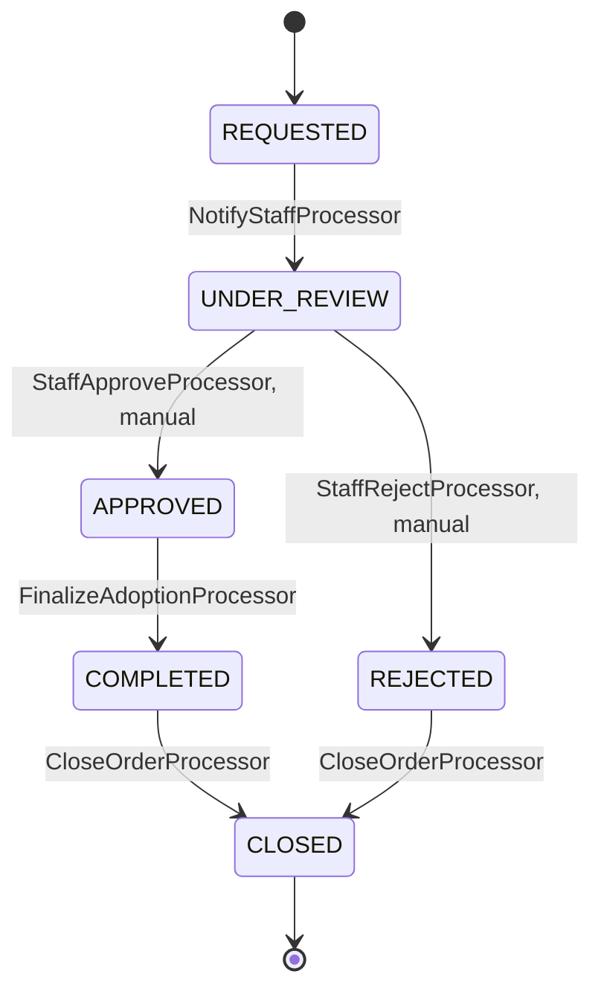

### 1. Entity Definitions
```
Pet:
- id: String (app pet id or Petstore reference)
- name: String (pet name)
- species: String (cat/dog/etc)
- breed: String (breed info)
- ageRange: String (puppy/kitten/adult)
- gender: String (male/female)
- status: String (available/reserved/adopted/archived)
- description: String (notes)
- images: List<String> (URLs)
- tags: List<String> (traits)
- sourceRef: String (Petstore id)

User:
- id: String (app user id)
- name: String (full name)
- email: String (contact)
- role: String (customer/staff)
- favorites: List<String> (pet ids)
- adoptionHistory: List<String> (adoptionOrder ids)
- badges: List<String> (earned badges)
- status: String (created/verified/active/suspended)

AdoptionOrder:
- id: String (order id)
- petId: String (pet being adopted)
- userId: String (requesting user)
- status: String (requested/under_review/approved/rejected/completed/cancelled)
- requestDate: String (ISO timestamp)
- decisionDate: String (ISO timestamp)
- notes: String (staff notes)
```

### 2. Entity workflows

Pet workflow:
1. Initial State: Pet persisted (NEW) -> triggers enrichment and availability checks (automatic)
2. Enrichment: populate images/tags from Petstore or admin (automatic)
3. Available: Pet listed for users
4. Reserved: manual when a user is approved for adoption (manual)
5. Adopted: automatic when adoption finalized (automatic)
6. Archived: manual (retire pet)


```mermaid
stateDiagram-v2
    [*] --> NEW
    NEW --> ENRICHED : EnrichPetProcessor
    ENRICHED --> AVAILABLE : CheckAvailabilityCriterion
    AVAILABLE --> RESERVED : ReservePetProcessor, manual
    RESERVED --> ADOPTED : FinalizeAdoptionProcessor
    ADOPTED --> ARCHIVED : ArchivePetProcessor, manual
    ARCHIVED --> [*]
```

Processors/Criteria:
- Processors: EnrichPetProcessor, ReservePetProcessor, FinalizeAdoptionProcessor, ArchivePetProcessor
- Criteria: CheckAvailabilityCriterion, IsFromPetstoreCriterion

User workflow:
1. Initial State: User created (CREATED) -> verification triggered (automatic)
2. Verified: email/identity checked (automatic/manual)
3. Active: user can favorite/adopt (automatic)
4. Suspended: manual if violations


```mermaid
stateDiagram-v2
    [*] --> CREATED
    CREATED --> VERIFIED : VerifyUserProcessor
    VERIFIED --> ACTIVE : ActivateUserProcessor
    ACTIVE --> SUSPENDED : SuspendUserProcessor, manual
    SUSPENDED --> ACTIVE : ReactivateUserProcessor, manual
    ACTIVE --> [*]
```

Processors/Criteria:
- Processors: VerifyUserProcessor, ActivateUserProcessor, SuspendUserProcessor, RecalculateBadgesProcessor
- Criteria: IsEmailValidCriterion, IsApprovedByStaffCriterion

AdoptionOrder workflow:
1. Initial State: AdoptionOrder created (REQUESTED) -> validation & notify staff (automatic)
2. Under Review: staff evaluates (manual)
3. Approved/Rejected: staff decision (manual)
4. Completed: on approved + pet status updated to ADOPTED (automatic)
5. Closed: final archival (automatic/manual)


```mermaid
stateDiagram-v2
    [*] --> REQUESTED
    REQUESTED --> UNDER_REVIEW : NotifyStaffProcessor
    UNDER_REVIEW --> APPROVED : StaffApproveProcessor, manual
    UNDER_REVIEW --> REJECTED : StaffRejectProcessor, manual
    APPROVED --> COMPLETED : FinalizeAdoptionProcessor
    COMPLETED --> CLOSED : CloseOrderProcessor
    REJECTED --> CLOSED : CloseOrderProcessor
    CLOSED --> [*]
```

Processors/Criteria:
- Processors: CreateAdoptionProcessor, NotifyStaffProcessor, StaffApproveProcessor, FinalizeAdoptionProcessor, CloseOrderProcessor
- Criteria: PetAvailableCriterion, MaxPerUserCriterion

### 3. Pseudo code for processor classes (short)
```java
class EnrichPetProcessor {
  void process(Pet pet) {
    if(pet.sourceRef != null) pet.images = fetchImages(pet.sourceRef);
    pet.tags = deriveTags(pet);
    persist(pet);
  }
}

class VerifyUserProcessor {
  void process(User user) {
    if(isEmailValid(user.email)) user.status = VERIFIED;
    persist(user);
  }
}

class FinalizeAdoptionProcessor {
  void process(AdoptionOrder order) {
    if(checkPetAvailable(order.petId)) {
      updatePetStatus(order.petId, ADOPTED);
      order.status = COMPLETED;
      persist(order);
      notifyUser(order.userId, order.id);
    } else {
      order.status = REJECTED;
      persist(order);
    }
  }
}
```

### 4. API Endpoints Design Rules

Rules applied:
- Every POST that creates an entity triggers Cyoda workflows.
- POST returns only technicalId.
- GET by technicalId available for all POST-created entities.
- GET all provided as optional read endpoint.

Endpoints and JSON formats:

POST /pets
```json
Request:
{
  "id":"petstore123",
  "name":"Mittens",
  "species":"cat",
  "breed":"Tabby",
  "ageRange":"kitten",
  "gender":"female",
  "description":"Playful",
  "images":["https://..."],
  "tags":["friendly"],
  "sourceRef":"petstore123"
}
Response:
{
  "technicalId":"tech-pet-0001"
}
```

GET /pets/{technicalId}
```json
Response:
{
  "technicalId":"tech-pet-0001",
  "id":"petstore123",
  "name":"Mittens",
  "species":"cat",
  "breed":"Tabby",
  "ageRange":"kitten",
  "gender":"female",
  "status":"available",
  "description":"Playful",
  "images":["https://..."],
  "tags":["friendly"],
  "sourceRef":"petstore123"
}
```

POST /users
```json
Request:
{
  "name":"Alex Doe",
  "email":"alex@example.com",
  "role":"customer"
}
Response:
{
  "technicalId":"tech-user-0001"
}
```

GET /users/{technicalId}
```json
Response:
{
  "technicalId":"tech-user-0001",
  "id":"user-42",
  "name":"Alex Doe",
  "email":"alex@example.com",
  "role":"customer",
  "favorites":[],
  "adoptionHistory":[],
  "badges":[],
  "status":"created"
}
```

POST /adoptions
```json
Request:
{
  "petId":"petstore123",
  "userId":"user-42",
  "notes":"Would love to adopt on weekends"
}
Response:
{
  "technicalId":"tech-adopt-0001"
}
```

GET /adoptions/{technicalId}
```json
Response:
{
  "technicalId":"tech-adopt-0001",
  "id":"order-100",
  "petId":"petstore123",
  "userId":"user-42",
  "status":"requested",
  "requestDate":"2025-08-21T12:00:00Z",
  "notes":"Would love to adopt on weekends"
}
```

If you want, I can expand to up to 10 entities (events like BadgeGrant, RescueEvent, Review) or add GET-by-condition endpoints for searches — which would you prefer to add next?