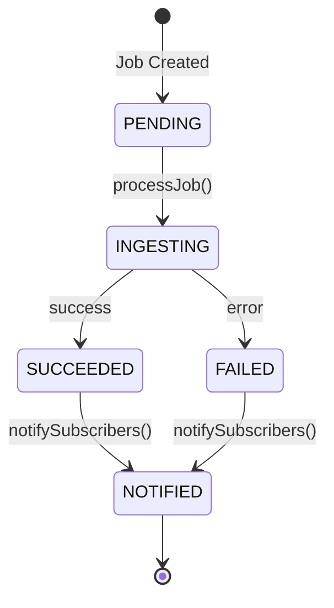
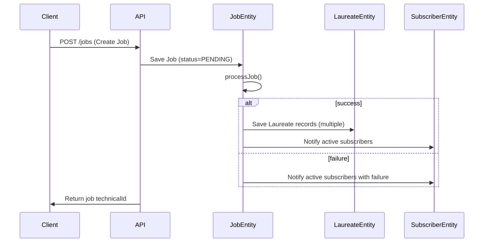
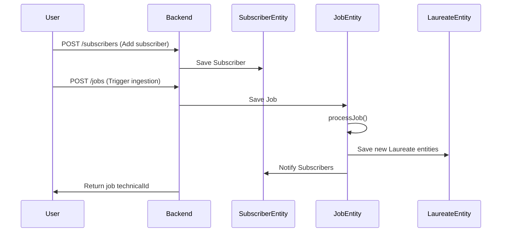

### 1. Entity Definitions

``` 
Job:
- jobName: String (Unique descriptive name of the ingestion job)
- status: String (Job status: PENDING, INGESTING, SUCCEEDED, FAILED, NOTIFIED)
- scheduledAt: String (ISO 8601 timestamp when the job is scheduled to run)
- startedAt: String (ISO 8601 timestamp when ingestion started)
- finishedAt: String (ISO 8601 timestamp when ingestion finished)
- message: String (Optional message describing success or failure reason)

Laureate:
- laureateId: String (Unique identifier from source data)
- firstname: String (Laureate first name)
- surname: String (Laureate surname)
- born: String (Date of birth in ISO 8601 format)
- died: String (Date of death in ISO 8601 format or null if alive)
- bornCountry: String (Country of birth)
- bornCity: String (City of birth)
- gender: String (Gender information)
- year: String (Award year)
- category: String (Prize category)
- motivation: String (Reason for award)
- affiliationName: String (Affiliation institution name)
- affiliationCity: String (Affiliation city)
- affiliationCountry: String (Affiliation country)

Subscriber:
- contactType: String (Type of contact: e.g., email, webhook)
- contactValue: String (Email address or webhook URL)
- active: Boolean (Whether subscriber is active)
```

---

### 2. Process Method Flows

```
processJob() Flow:
1. Initial State: Job entity created with status = PENDING
2. Validation: Check required job fields (jobName, scheduledAt)
3. Transition: Update status to INGESTING and set startedAt timestamp
4. Data Ingestion: 
   - Call OpenDataSoft API for Nobel laureates
   - For each laureate record, save a new Laureate entity (immutable creation)
5. Completion:
   - On success, update Job status to SUCCEEDED and finishedAt timestamp
   - On failure, update Job status to FAILED and log error message
6. Notification:
   - Trigger notifications to all active Subscribers
   - Update Job status to NOTIFIED
```

```
processLaureate() Flow:
1. Validation: Check mandatory laureate fields (laureateId, firstname, surname, year, category)
2. Enrichment: Normalize and enrich data if needed (e.g., standardize country codes)
3. Persistence: Save laureate data immutably (no updates/deletes)
```

```
processSubscriber() Flow:
1. Validation: Ensure contactType and contactValue are present and valid
2. Persistence: Save subscriber entity immutably
3. No further processing required on creation
```

---

### 3. API Endpoints Design

| Entity     | POST Endpoint                 | Description                            | Response                   | GET by technicalId Endpoint       | GET by Condition Endpoint        |
|------------|------------------------------|------------------------------------|----------------------------|----------------------------------|---------------------------------|
| Job        | `/jobs`                      | Create new Job (triggers ingestion) | `{ "technicalId": "string" }` | `/jobs/{technicalId}`            | *Not provided by default*        |
| Laureate   | *No POST endpoint* (created via Job ingestion) | *No direct creation*                 | *N/A*                      | `/laureates/{technicalId}`       | *Only if explicitly requested*  |
| Subscriber | `/subscribers`               | Register new Subscriber              | `{ "technicalId": "string" }` | `/subscribers/{technicalId}`     | *Only if explicitly requested*  |

---

### 4. Request/Response Formats

**POST /jobs**  
_Request:_  
```json
{
  "jobName": "NobelIngestion2024",
  "scheduledAt": "2024-07-01T09:00:00Z"
}
```

_Response:_  
```json
{
  "technicalId": "job-123456"
}
```

---

**GET /jobs/{technicalId}**  
_Response:_  
```json
{
  "jobName": "NobelIngestion2024",
  "status": "SUCCEEDED",
  "scheduledAt": "2024-07-01T09:00:00Z",
  "startedAt": "2024-07-01T09:01:00Z",
  "finishedAt": "2024-07-01T09:05:00Z",
  "message": "Ingestion completed successfully"
}
```

---

**POST /subscribers**  
_Request:_  
```json
{
  "contactType": "email",
  "contactValue": "subscriber@example.com",
  "active": true
}
```

_Response:_  
```json
{
  "technicalId": "sub-987654"
}
```

---

**GET /subscribers/{technicalId}**  
_Response:_  
```json
{
  "contactType": "email",
  "contactValue": "subscriber@example.com",
  "active": true
}
```

---

### 5. Visual Representations

**Job Entity Lifecycle**


```mermaid
stateDiagram-v2
  [*] --> PENDING : Job Created
  PENDING --> INGESTING : processJob()
  INGESTING --> SUCCEEDED : success
  INGESTING --> FAILED : error
  SUCCEEDED --> NOTIFIED : notifySubscribers()
  FAILED --> NOTIFIED : notifySubscribers()
  NOTIFIED --> [*]
```

---

**Event-Driven Processing Chain**


```mermaid
sequenceDiagram
  participant Client
  participant API
  participant JobEntity
  participant LaureateEntity
  participant SubscriberEntity
  Client->>API: POST /jobs (Create Job)
  API->>JobEntity: Save Job (status=PENDING)
  JobEntity->>JobEntity: processJob()
  alt success
    JobEntity->>LaureateEntity: Save Laureate records (multiple)
    JobEntity->>SubscriberEntity: Notify active subscribers
  else failure
    JobEntity->>SubscriberEntity: Notify active subscribers with failure
  end
  API->>Client: Return job technicalId
```

---

**User Interaction Sequence Flow**


```mermaid
sequenceDiagram
  participant User
  participant Backend
  User->>Backend: POST /subscribers (Add subscriber)
  Backend->>SubscriberEntity: Save Subscriber
  User->>Backend: POST /jobs (Trigger ingestion)
  Backend->>JobEntity: Save Job
  JobEntity->>JobEntity: processJob()
  JobEntity->>LaureateEntity: Save new Laureate entities
  JobEntity->>SubscriberEntity: Notify Subscribers
  Backend->>User: Return job technicalId
```

---

This completes the functional requirements for the Nobel laureates ingestion and notification backend application using Event-Driven Architecture principles on Cyoda platform.