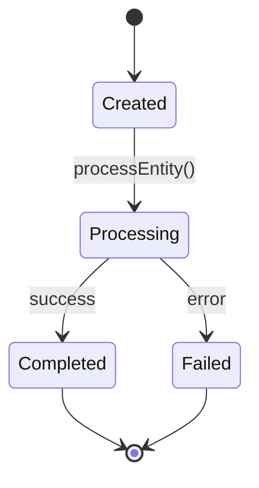
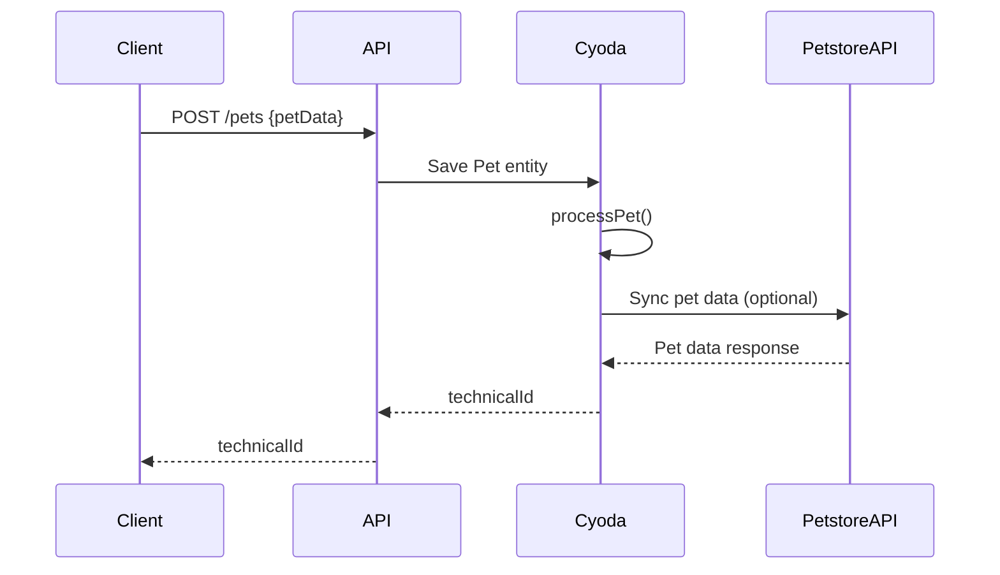
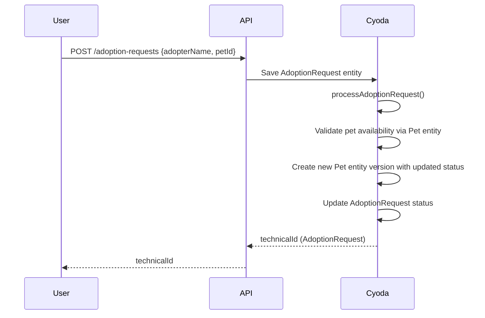

### 1. Entity Definitions

``` 
Workflow:
- name: String (Name of the workflow, e.g., "Adoption Process")
- description: String (Description of what this workflow orchestrates)
- status: String (Current workflow status, e.g., PENDING, COMPLETED, FAILED)
- createdAt: String (Timestamp when workflow was created)
- petId: String (Reference to the Pet entity associated with this workflow)

Pet:
- name: String (Pet's name)
- category: String (Pet category, e.g., dog, cat)
- photoUrls: String (URLs of pet photos)
- tags: String (Tags describing the pet)
- status: String (Pet status in Petstore, e.g., available, pending, sold)
- createdAt: String (Timestamp when pet entity was created)

AdoptionRequest:
- adopterName: String (Name of the person requesting adoption)
- adopterContact: String (Contact info for adopter)
- petId: String (Reference to the Pet entity to be adopted)
- requestDate: String (Timestamp when adoption request was created)
- status: String (Status of the request, e.g., PENDING, APPROVED, REJECTED)
```

---

### 2. Process Method Flows

```
processWorkflow() Flow:
1. Initial State: Workflow created with PENDING status.
2. Validation: Check if referenced petId exists and pet status is "available".
3. Processing: Trigger associated AdoptionRequest processing or other linked business logic.
4. Completion: Update Workflow status to COMPLETED or FAILED based on downstream processing.
5. Notification: Optionally notify interested parties about workflow completion.

processPet() Flow:
1. Initial State: Pet entity created (immutable).
2. Validation: Validate required fields like name, category, and status.
3. Processing: Sync or enrich pet data if needed from Petstore API.
4. Completion: Mark pet creation as successful.
5. Notification: Optionally trigger workflows or events related to new pets.

processAdoptionRequest() Flow:
1. Initial State: AdoptionRequest created with PENDING status.
2. Validation: Confirm petId exists and pet status is "available".
3. Processing: If valid, update pet status to "pending" or "sold" by creating a new Pet entity version.
4. Completion: Update AdoptionRequest status to APPROVED or REJECTED.
5. Notification: Send confirmation or rejection notification.
```

---

### 3. API Endpoints Design

| HTTP Method | Endpoint                       | Purpose                               | Request Body                           | Response          |
|-------------|-------------------------------|-------------------------------------|--------------------------------------|-------------------|
| POST        | /workflows                    | Create new Workflow (orchestration) | `{ name, description, petId }`       | `{ technicalId }`  |
| GET         | /workflows/{technicalId}      | Retrieve Workflow by technicalId    | N/A                                  | Workflow entity    |
| POST        | /pets                        | Create new Pet (immutable)           | `{ name, category, photoUrls, tags, status }` | `{ technicalId }`  |
| GET         | /pets/{technicalId}           | Retrieve Pet by technicalId          | N/A                                  | Pet entity        |
| POST        | /adoption-requests           | Create new AdoptionRequest           | `{ adopterName, adopterContact, petId }` | `{ technicalId }`  |
| GET         | /adoption-requests/{technicalId} | Retrieve AdoptionRequest by technicalId | N/A                              | AdoptionRequest entity |

*No update or delete endpoints per EDA principles unless explicitly requested.*

---

### 4. Request/Response Formats

**POST /pets Request:**

```json
{
  "name": "Whiskers",
  "category": "cat",
  "photoUrls": "http://example.com/cat1.jpg",
  "tags": "cute,small",
  "status": "available"
}
```

**POST /pets Response:**

```json
{
  "technicalId": "pet_1234abcd"
}
```

**GET /pets/{technicalId} Response:**

```json
{
  "name": "Whiskers",
  "category": "cat",
  "photoUrls": "http://example.com/cat1.jpg",
  "tags": "cute,small",
  "status": "available",
  "createdAt": "2024-06-01T12:00:00Z"
}
```

*(Similar structure applies to Workflow and AdoptionRequest entities)*

---

### 5. Visual Representations

**Entity Lifecycle State Diagrams**


```mermaid
stateDiagram-v2
    [*] --> Created
    Created --> Processing : processEntity()
    Processing --> Completed : success
    Processing --> Failed : error
    Completed --> [*]
    Failed --> [*]
```

*(Applies to all entities: Workflow, Pet, AdoptionRequest)*

---

**Event-Driven Processing Chain**


```mermaid
sequenceDiagram
    participant Client
    participant API
    participant Cyoda
    participant PetstoreAPI

    Client->>API: POST /pets {petData}
    API->>Cyoda: Save Pet entity
    Cyoda->>Cyoda: processPet()
    Cyoda->>PetstoreAPI: Sync pet data (optional)
    PetstoreAPI-->>Cyoda: Pet data response
    Cyoda-->>API: technicalId
    API-->>Client: technicalId
```

---

**User Interaction Sequence Flow for Adoption**


```mermaid
sequenceDiagram
    participant User
    participant API
    participant Cyoda

    User->>API: POST /adoption-requests {adopterName, petId}
    API->>Cyoda: Save AdoptionRequest entity
    Cyoda->>Cyoda: processAdoptionRequest()
    Cyoda->>Cyoda: Validate pet availability via Pet entity
    Cyoda->>Cyoda: Create new Pet entity version with updated status
    Cyoda->>Cyoda: Update AdoptionRequest status
    Cyoda-->>API: technicalId (AdoptionRequest)
    API-->>User: technicalId
```

---

If you need any further additions or clarifications, feel free to ask!