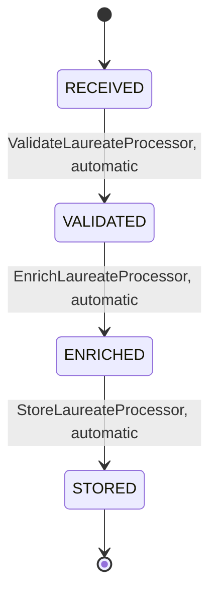
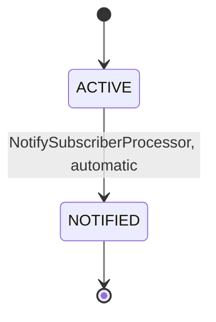

# Functional Requirements for Nobel Laureates Data Ingestion Application

This document outlines the functional requirements for the Nobel Laureates Data Ingestion application using an Event-Driven Architecture (EDA) approach. It includes entity definitions, workflows, processor classes, and API specifications.

## 1. Entity Definitions
```
Job:
- id: String (unique identifier for the job)
- status: String (current status of the job - SCHEDULED, INGESTING, SUCCEEDED, FAILED, NOTIFIED_SUBSCRIBERS)
- createdTimestamp: Date (timestamp when the job was created)
- updatedTimestamp: Date (timestamp of the last update to the job)

Laureate:
- id: Integer (unique identifier for the laureate)
- firstname: String (first name of the laureate)
- surname: String (last name of the laureate)
- born: Date (birth date of the laureate)
- died: Date (death date of the laureate, if applicable)
- borncountry: String (country where the laureate was born)
- borncountrycode: String (ISO code of the born country)
- borncity: String (city where the laureate was born)
- gender: String (gender of the laureate)
- year: Integer (year of the award)
- category: String (category of the award)
- motivation: String (motivation for the award)
- name: String (affiliated institution)
- city: String (city of the institution)
- country: String (country of the institution)

Subscriber:
- id: String (unique identifier for the subscriber)
- contactInfo: String (email or webhook URL for notifications)
```

## 2. Entity Workflows

### Job workflow:
1. Initial State: Job created with SCHEDULED status
2. Validation: Check job parameters and data sources
3. Processing: Execute data ingestion from the API
4. Completion: Update status to SUCCEEDED or FAILED
5. Notification: Notify all subscribers about job completion


```mermaid
stateDiagram-v2
    [*] --> SCHEDULED
    SCHEDULED --> INGESTING : StartIngestionProcessor, automatic
    INGESTING --> SUCCEEDED : DataIngestionProcessor, automatic
    INGESTING --> FAILED : ErrorHandlingProcessor, automatic
    SUCCEEDED --> NOTIFIED_SUBSCRIBERS : NotifySubscribersProcessor, automatic
    FAILED --> NOTIFIED_SUBSCRIBERS : NotifySubscribersProcessor, automatic
    NOTIFIED_SUBSCRIBERS --> [*]
```

### Laureate workflow:
1. Initial State: Laureate data received
2. Validation: Ensure required fields are populated
3. Enrichment: Enhance or normalize data (e.g., calculating age)
4. Storage: Persist laureate information into the database


```mermaid
stateDiagram-v2
    [*] --> RECEIVED
    RECEIVED --> VALIDATED : ValidateLaureateProcessor, automatic
    VALIDATED --> ENRICHED : EnrichLaureateProcessor, automatic
    ENRICHED --> STORED : StoreLaureateProcessor, automatic
    STORED --> [*]
```

### Subscriber workflow:
1. Initial State: Subscriber created
2. Notification: Receive notifications of laureate ingestion


```mermaid
stateDiagram-v2
    [*] --> ACTIVE
    ACTIVE --> NOTIFIED : NotifySubscriberProcessor, automatic
    NOTIFIED --> [*]
```

## 3. Pseudo Code for Each Processor Class

### Job Processor classes:
```java
class StartIngestionProcessor {
    void process(Job job) {
        // Trigger the ingestion process
    }
}

class DataIngestionProcessor {
    void process(Job job) {
        // Ingest data from the API and update job status
    }
}

class NotifySubscribersProcessor {
    void process(Job job) {
        // Send notifications to subscribers
    }
}

class ErrorHandlingProcessor {
    void process(Job job) {
        // Handle errors and update job status
    }
}
```

### Laureate Processor classes:
```java
class ValidateLaureateProcessor {
    void process(Laureate laureate) {
        // Validate laureate data
    }
}

class EnrichLaureateProcessor {
    void process(Laureate laureate) {
        // Enrich laureate data
    }
}

class StoreLaureateProcessor {
    void process(Laureate laureate) {
        // Persist laureate information to the database
    }
}
```

### Subscriber Processor classes:
```java
class NotifySubscriberProcessor {
    void process(Subscriber subscriber) {
        // Send notification to the subscriber
    }
}
```

## 4. API Endpoints Design Rules
- **POST /jobs**: Create a new job and trigger the ingestion process.
  - **Response**: 
  ```json
  {
    "technicalId": "job_id"
  }
  ```

- **GET /jobs/{technicalId}**: Retrieve job details by technicalId.

- **POST /laureates**: Process and save a new laureate data (triggered by job completion).

- **GET /laureates/{technicalId}**: Retrieve laureate details by technicalId.

- **POST /subscribers**: Add a new subscriber to receive notifications.
  - **Response**: 
  ```json
  {
    "technicalId": "subscriber_id"
  }
  ```

- **GET /subscribers/{technicalId}**: Retrieve subscriber details by technicalId.

This finalized version captures the functional requirements needed for your Nobel Laureate Data Ingestion project while adhering to an Event-Driven Architecture approach.