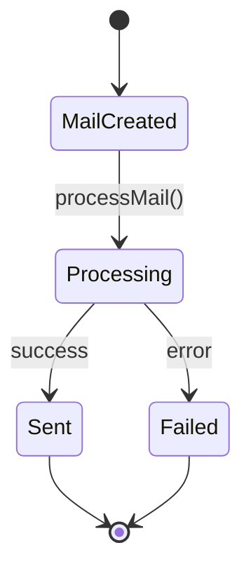

OK. Here's the well-formatted final version of the functional requirements for the Happy Mail Sender application, based on the user's specifications and the EDA approach:

```markdown
## Functional Requirements: Happy Mail Sender (Event-Driven Architecture)

### 1. Entity Definitions

```
Mail:
  - isHappy: Boolean (Indicates whether mail content is happy or gloomy)
  - mailList: List<String> (List of recipient email addresses)
  - contentHappy: String (Content of the happy mail)
  - contentGloomy: String (Content of the gloomy mail)
```

### 2. Process Method Flows

```
processMail() Flow:
1. Initial State: Mail entity created with isHappy, mailList, contentHappy, contentGloomy.
2. Processing: Determine if mail is happy or gloomy based on isHappy field.
3. Completion: Send happy mail using contentHappy if isHappy is true, send gloomy mail using contentGloomy if isHappy is false.
```

### 3. Event Processing Workflows

1.  **Mail Creation**: When a `Mail` entity is created via the POST endpoint, the `processMail()` method is automatically triggered.
2.  **Happy/Gloomy Determination**: Inside `processMail()`, the `isHappy` field is checked.
3.  **Mail Sending**: Based on the `isHappy` value, either `sendHappyMail` or `sendGloomyMail` processor is called, sending the mail to addresses in `mailList` using respective `contentHappy` or `contentGloomy`.

### 4. API Endpoints

**POST /mails (create Mail entity)**

*   Description: Creates a new Mail entity, triggering the `processMail()` method.
*   Request Body:

```json
{
  "isHappy": true,
  "mailList": ["recipient1@example.com", "recipient2@example.com"],
  "contentHappy": "Happy mail content",
  "contentGloomy": "Gloomy mail content"
}
```

*   Response:

```json
{
  "technicalId": "uniqueMailId123"
}
```

**GET /mails/{technicalId} (retrieve Mail entity by technicalId)**

*   Description: Retrieves a Mail entity by its unique technical ID.
*   Response:

```json
{
  "technicalId": "uniqueMailId123",
  "isHappy": true,
  "mailList": ["recipient1@example.com", "recipient2@example.com"],
  "contentHappy": "Happy mail content",
  "contentGloomy": "Gloomy mail content"
}
```

### 5. Visual Representations

**Entity Lifecycle State Diagram:**


```mermaid
stateDiagram-v2
    [*] --> MailCreated
    MailCreated --> Processing : processMail()
    Processing --> Sent : success
    Processing --> Failed : error
    Sent --> [*]
    Failed --> [*]
```

**Event-Driven Processing Chain:**

```mermaid
sequenceDiagram
    participant User
    participant API
    participant processMail()
    participant sendHappyMail
    participant sendGloomyMail

    User->>API: POST /mails
    API->>processMail(): triggers processMail()
    alt isHappy == true
    processMail()->>sendHappyMail: sendHappyMail(mailList, contentHappy)
    sendHappyMail-->>API: Success
    else isHappy == false
    processMail()->>sendGloomyMail: sendGloomyMail(mailList, contentGloomy)
    sendGloomyMail-->>API: Success
    end
    API-->>User: 200 OK
```
```
