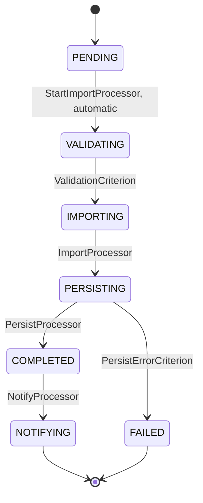
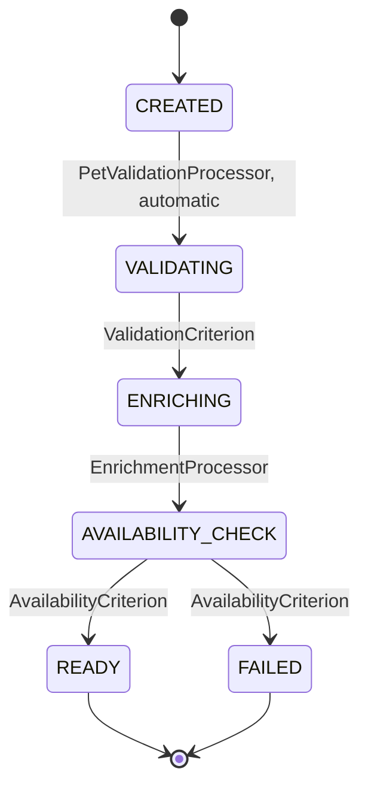
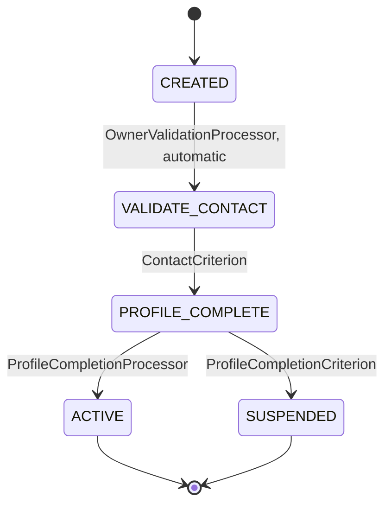

### 1. Entity Definitions

```
Pet:
- id: String (business identifier, e.g., store pet id)
- name: String (pet name)
- breed: String (breed or species)
- age: Integer (age in years)
- description: String (short description)
- status: String (AVAILABLE, PENDING_ADOPTION, ADOPTED)
- source: String (origin of record e.g., Petstore)

Owner:
- id: String (business identifier)
- name: String (owner full name)
- contactEmail: String (email for notifications)
- contactPhone: String (phone number)
- address: String (postal address)
- preferences: String (preferred pet types/descriptions)

PetImportJob:
- requestId: String (business id for the job request)
- sourceUrl: String (Petstore API endpoint or source descriptor)
- requestedAt: String (timestamp)
- status: String (PENDING, RUNNING, COMPLETED, FAILED)
- importedCount: Integer (number of pets created/updated)
- errors: String (summary or link to error log)
```

(Using 3 entities as default. If you want more, tell me up to 10.)

---

### 2. Entity workflows

PetImportJob workflow:
1. Initial State: Job created with PENDING status (POST creates job event)
2. Validation: Validate sourceUrl and request parameters (automatic)
3. Importing: Fetch Petstore data and map to Pet entities (automatic)
4. Persisting: Persist Pet entities (automatic)
5. Completion: Mark COMPLETED or FAILED; record importedCount and errors (automatic)
6. Notification: Notify interested Owners/administrators (automatic)


```mermaid
stateDiagram-v2
    [*] --> PENDING
    PENDING --> VALIDATING : StartImportProcessor, automatic
    VALIDATING --> IMPORTING : ValidationCriterion
    IMPORTING --> PERSISTING : ImportProcessor
    PERSISTING --> COMPLETED : PersistProcessor
    PERSISTING --> FAILED : PersistErrorCriterion
    COMPLETED --> NOTIFYING : NotifyProcessor
    NOTIFYING --> [*]
    FAILED --> [*]
```

Processors/Criteria:
- StartImportProcessor (initiates job)
- ValidationCriterion (checks sourceUrl reachable)
- ImportProcessor (maps remote items to Pet DTO)
- PersistProcessor (creates/updates Pet entities)
- PersistErrorCriterion (detects fatal errors)
- NotifyProcessor (sends summary)

Pet workflow:
1. Initial State: Pet persisted (CREATED) by a process (import or manual)
2. Validation: Verify required fields and business rules (automatic)
3. Enrichment: Add derived attributes (age bucket, normalized breed) (automatic)
4. Availability Check: Determine status AVAILABLE or PENDING_ADOPTION (automatic/manual)
5. Finalization: Pet READY or FAILED (automatic)


```mermaid
stateDiagram-v2
    [*] --> CREATED
    CREATED --> VALIDATING : PetValidationProcessor, automatic
    VALIDATING --> ENRICHING : ValidationCriterion
    ENRICHING --> AVAILABILITY_CHECK : EnrichmentProcessor
    AVAILABILITY_CHECK --> READY : AvailabilityCriterion
    AVAILABILITY_CHECK --> FAILED : AvailabilityCriterion
    READY --> [*]
    FAILED --> [*]
```

Processors/Criteria:
- PetValidationProcessor (checks name, breed)
- ValidationCriterion (detects missing required fields)
- EnrichmentProcessor (normalize breed, compute derived fields)
- AvailabilityCriterion (decides AVAILABLE vs PENDING_ADOPTION)

Owner workflow:
1. Initial State: Owner persisted (CREATED) by user or process
2. ValidateContact: Verify email/phone format and optionally confirm (manual/automatic)
3. ProfileComplete: Check if profile has required fields (automatic)
4. Active: Owner ACTIVE and eligible to adopt (automatic/manual)
5. Suspended: Owner SUSPENDED on failed checks (manual)


```mermaid
stateDiagram-v2
    [*] --> CREATED
    CREATED --> VALIDATE_CONTACT : OwnerValidationProcessor, automatic
    VALIDATE_CONTACT --> PROFILE_COMPLETE : ContactCriterion
    PROFILE_COMPLETE --> ACTIVE : ProfileCompletionProcessor
    PROFILE_COMPLETE --> SUSPENDED : ProfileCompletionCriterion
    ACTIVE --> [*]
    SUSPENDED --> [*]
```

Processors/Criteria:
- OwnerValidationProcessor (email/phone checks)
- ContactCriterion (contact reachable or properly formatted)
- ProfileCompletionProcessor (marks profile as complete)
- ProfileCompletionCriterion (detects missing address/preferences)

---

### 3. Pseudo code for processor classes

PetImportJob - ImportProcessor (pseudo)
```java
class ImportProcessor {
    void process(PetImportJob job) {
        List<RemotePet> items = fetchFrom(job.sourceUrl);
        for (RemotePet r : items) {
            Pet pet = mapToPet(r);
            PersistProcessor.persistPet(pet);
        }
        job.importedCount = items.size();
    }
}
```

Pet - PetValidationProcessor (pseudo)
```java
class PetValidationProcessor {
    void process(Pet pet) {
        if (pet.name == null || pet.breed == null) {
            markFailed(pet, "Missing required fields");
            return;
        }
        // pass to enrichment
        EnrichmentProcessor.process(pet);
    }
}
```

Pet - EnrichmentProcessor (pseudo)
```java
class EnrichmentProcessor {
    void process(Pet pet) {
        pet.description = normalizeDescription(pet.description);
        pet.age = computeAge(pet.age);
        pet.status = determineInitialStatus(pet);
        save(pet);
    }
}
```

Owner - OwnerValidationProcessor (pseudo)
```java
class OwnerValidationProcessor {
    void process(Owner owner) {
        if (!isValidEmail(owner.contactEmail)) markSuspended(owner);
        else markProfileCompleteIfEligible(owner);
    }
}
```

NotifyProcessor (job completion)
```java
class NotifyProcessor {
    void process(PetImportJob job) {
        sendSummaryToAdmin(job);
    }
}
```

---

### 4. API Endpoints Design Rules

Rules applied: only PetImportJob has POST (orchestration). Business entities are created/updated by processors; all entities exposed via GET retrieval by technicalId.

Endpoints:

- Create import job (starts event)
POST /jobs/import-pets
Request:
```json
{
  "sourceUrl": "https://petstore.example/api/pets",
  "requestedAt": "2025-08-28T12:00:00Z"
}
```
Response (must return only technicalId):
```json
{
  "technicalId": "job-tech-12345"
}
```

- Get job by technicalId
GET /jobs/{technicalId}
Response:
```json
{
  "requestId": "req-987",
  "sourceUrl": "https://petstore.example/api/pets",
  "requestedAt": "2025-08-28T12:00:00Z",
  "status": "COMPLETED",
  "importedCount": 42,
  "errors": ""
}
```

- Retrieve a Pet (read-only results of processing)
GET /pets/{technicalId}
Response:
```json
{
  "id": "pet-123",
  "name": "Whiskers",
  "breed": "Siamese",
  "age": 2,
  "description": "Playful kitten",
  "status": "AVAILABLE",
  "source": "Petstore"
}
```

- List pets (optional)
GET /pets
Response: array of pet objects (same shape as above)

- Retrieve an Owner
GET /owners/{technicalId}
Response:
```json
{
  "id": "owner-77",
  "name": "Alex Doe",
  "contactEmail": "alex@example.com",
  "contactPhone": "+123456789",
  "address": "123 Cat Lane",
  "preferences": "small cats"
}
```

Notes:
- POST endpoints trigger Cyoda workflows automatically when entity is persisted.
- POST endpoints must return only technicalId per rule.
- GET endpoints are read-only and return stored results.
- If you want Owner or Pet created manually via POST (instead of being created by import/process), tell me and I will add POST definitions that will return only technicalId.

Would you like to:
- Add an Adoption entity and its workflow?
- Allow manual POST creation of Owners or Pets?
- Add notification channels (email/SMS) to the job notifications?