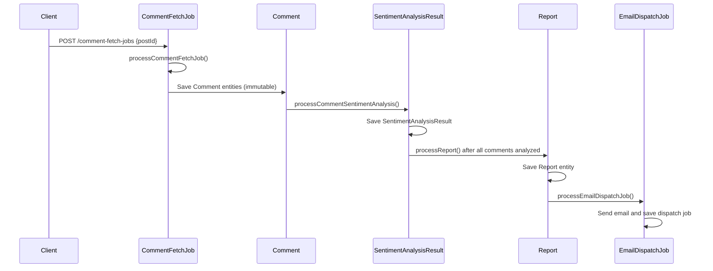
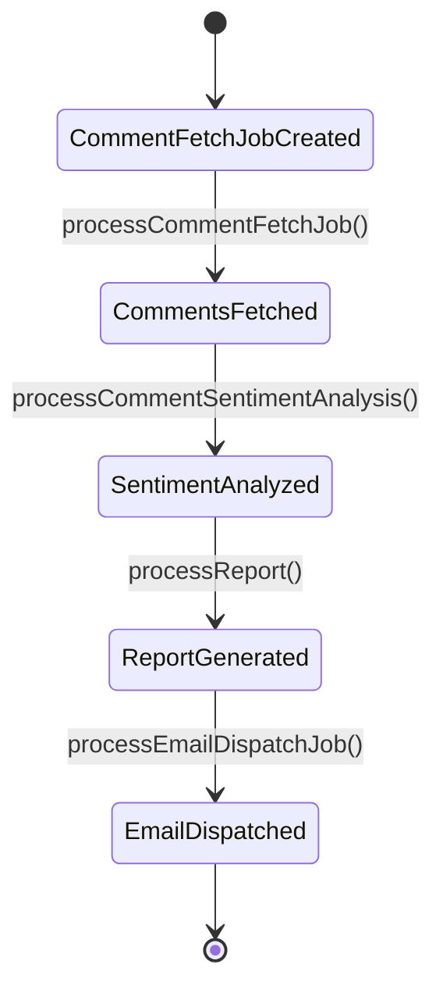

# Functional Requirements – Event-Driven Architecture (EDA) Specification

---

## 1. Entity Definitions

```
CommentFetchJob:
- postId: String (Identifier of the post to fetch comments for, validated format)
- requestedAt: String (Timestamp of job creation)

Comment:
- postId: String (Identifier of the post the comment belongs to)
- commentId: String (Unique identifier from source API)
- name: String (Name of the commenter)
- email: String (Email of the commenter)
- body: String (Comment text)

SentimentAnalysisResult:
- postId: String (Identifier of the post)
- commentId: String (Identifier of the comment analyzed)
- sentiment: String (Sentiment classification: positive, negative, neutral)
- analyzedAt: String (Timestamp of analysis)

Report:
- postId: String (Identifier of the post)
- generatedAt: String (Timestamp of report creation)
- summary: String (Plain text summary of sentiment analysis and key highlights)

EmailDispatchJob:
- reportId: String (Identifier of the report to send)
- recipientEmail: String (Email address to send the report to)
- requestedAt: String (Timestamp of email dispatch request)
```

---

## 2. Process Method Flows

```
processCommentFetchJob() Flow:
1. Initial State: CommentFetchJob created with postId and requestedAt.
2. Fetch: Call external API to retrieve comments by postId.
3. Persistence: Save each Comment entity immutably with data from API.
4. Completion: Mark job as completed or failed (optional status field if needed).

processCommentSentimentAnalysis() Flow:
1. Trigger: Each new Comment entity triggers this process.
2. Analyze: Perform sentiment analysis on Comment.body.
3. Persistence: Save SentimentAnalysisResult entity with sentiment and timestamps.

processReport() Flow:
1. Trigger: After all Comments for a postId have corresponding SentimentAnalysisResults.
2. Aggregate: Summarize sentiments and extract key highlights from SentimentAnalysisResults.
3. Persistence: Create a Report entity with summary and metadata.

processEmailDispatchJob() Flow:
1. Trigger: When a Report entity is created.
2. Dispatch: Send the report summary via email to the recipientEmail.
3. Persistence: Save EmailDispatchJob entity recording dispatch request and timestamps.
4. Completion: Optionally track email sent status.
```

---

## 3. API Endpoints and Request/Response Formats

### POST /comment-fetch-jobs  
_Request_  
```json
{
  "postId": "123"
}
```
_Response_  
```json
{
  "technicalId": "generated-id"
}
```

### GET /comment-fetch-jobs/{technicalId}  
_Response_  
```json
{
  "postId": "123",
  "requestedAt": "2024-06-01T12:00:00Z"
}
```

### GET /comments?postId=123  
_Response_  
```json
[
  {
    "postId": "123",
    "commentId": "1",
    "name": "John Doe",
    "email": "john@example.com",
    "body": "Sample comment"
  }
]
```

### GET /sentiment-analysis-results?postId=123  
_Response_  
```json
[
  {
    "postId": "123",
    "commentId": "1",
    "sentiment": "positive",
    "analyzedAt": "2024-06-01T12:05:00Z"
  }
]
```

### GET /reports/{technicalId}  
_Response_  
```json
{
  "postId": "123",
  "generatedAt": "2024-06-01T12:10:00Z",
  "summary": "Sentiment analysis report for post 123..."
}
```

### POST /email-dispatch-jobs  
_Request_  
```json
{
  "reportId": "report-uuid",
  "recipientEmail": "user@example.com"
}
```
_Response_  
```json
{
  "technicalId": "email-dispatch-job-uuid"
}
```

---

## 4. Mermaid Diagrams


```mermaid
sequenceDiagram
  participant Client
  participant CommentFetchJob
  participant Comment
  participant SentimentAnalysisResult
  participant Report
  participant EmailDispatchJob
  Client->>CommentFetchJob: POST /comment-fetch-jobs {postId}
  CommentFetchJob->>CommentFetchJob: processCommentFetchJob()
  CommentFetchJob->>Comment: Save Comment entities (immutable)
  Comment->>SentimentAnalysisResult: processCommentSentimentAnalysis()
  SentimentAnalysisResult->>SentimentAnalysisResult: Save SentimentAnalysisResult
  SentimentAnalysisResult->>Report: processReport() after all comments analyzed
  Report->>Report: Save Report entity
  Report->>EmailDispatchJob: processEmailDispatchJob()
  EmailDispatchJob->>EmailDispatchJob: Send email and save dispatch job
```


```mermaid
stateDiagram-v2
  [*] --> CommentFetchJobCreated
  CommentFetchJobCreated --> CommentsFetched : processCommentFetchJob()
  CommentsFetched --> SentimentAnalyzed : processCommentSentimentAnalysis()
  SentimentAnalyzed --> ReportGenerated : processReport()
  ReportGenerated --> EmailDispatched : processEmailDispatchJob()
  EmailDispatched --> [*]
```

---

This completes the finalized functional requirements for your event-driven backend application, preserving all specified business logic, entities, events, and API definitions for direct use.