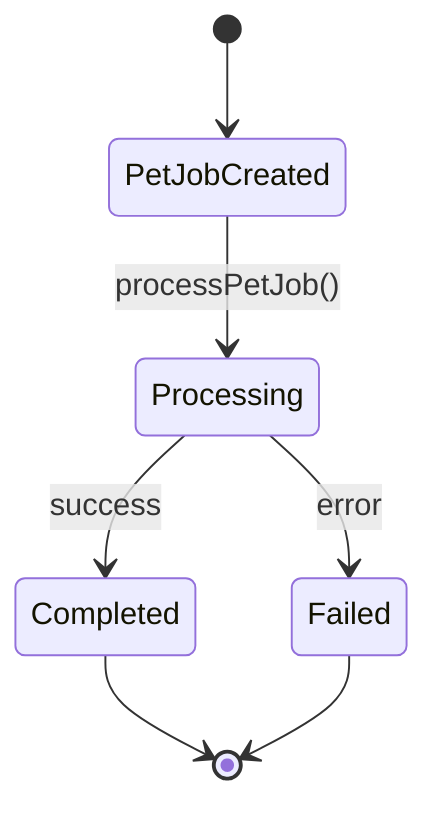
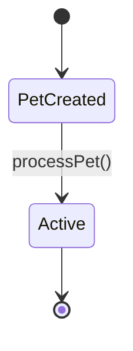
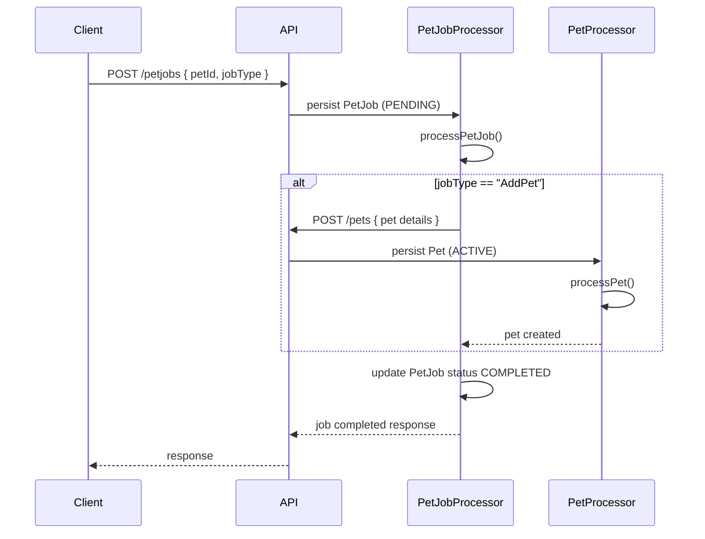

Certainly! Here is the well-formatted final version of your "Purrfect Pets" API functional requirements using Event-Driven Architecture:

---

### 1. Entity Definitions

```
PetJob:  (Orchestration entity)
- id: UUID (unique identifier)
- petId: UUID (reference to Pet entity)
- jobType: String (type of job, e.g., "AddPet", "UpdateStatus")
- createdAt: DateTime (job creation timestamp)
- status: StatusEnum (PENDING, PROCESSING, COMPLETED, FAILED)

Pet:  (Business domain entity)
- id: UUID (unique pet identifier)
- name: String (pet's name)
- type: String (pet type, e.g., "Cat", "Dog")
- age: Integer (pet's age in years)
- description: String (brief pet description)
- status: StatusEnum (ACTIVE, INACTIVE)

CatFact:  (Business domain entity for fun facts)
- id: UUID (unique identifier)
- fact: String (interesting cat fact)
- source: String (source of the fact)
- status: StatusEnum (PUBLISHED, ARCHIVED)
```

---

### 2. Process Method Flows

```
processPetJob() Flow:
1. Initial State: PetJob created with PENDING status.
2. Validation: Verify the jobType and referenced petId.
3. Processing:
   - If jobType = "AddPet", trigger pet creation workflow.
   - If jobType = "UpdateStatus", handle status change.
4. Completion: Update PetJob status to COMPLETED or FAILED.
5. Notification: Log results or notify downstream systems.

processPet() Flow:
1. Initial State: Pet entity created with ACTIVE status.
2. Validation: Ensure pet fields are valid and type is supported.
3. Processing: Store pet data, optionally trigger related jobs.
4. Completion: Confirm pet is persisted with ACTIVE status.
5. Notification: Log creation event.

processCatFact() Flow:
1. Initial State: CatFact created with PUBLISHED status.
2. Validation: Validate fact content and source.
3. Processing: Store fact for retrieval.
4. Completion: Confirm fact is available.
5. Notification: Log fact publication.
```

---

### 3. API Endpoints Design

| Method | Endpoint           | Purpose                                   | Request Body Example                   | Response Example                    |
|--------|--------------------|-------------------------------------------|--------------------------------------|-----------------------------------|
| POST   | /petjobs           | Create a new PetJob (triggers processing) | `{ "petId": "uuid", "jobType": "AddPet" }` | `{ "id": "uuid", "status": "PENDING" }` |
| POST   | /pets              | Add a new Pet                             | `{ "name": "Whiskers", "type": "Cat", "age": 3, "description": "Friendly cat" }` | `{ "id": "uuid", "status": "ACTIVE" }` |
| POST   | /catfacts          | Publish a new CatFact                      | `{ "fact": "Cats sleep 70% of their lives.", "source": "Cat Encyclopedia" }` | `{ "id": "uuid", "status": "PUBLISHED" }` |
| GET    | /pets/{id}         | Retrieve pet details                      | N/A                                  | `{ "id": "uuid", "name": "Whiskers", "type": "Cat", "age": 3, "description": "Friendly cat", "status": "ACTIVE" }` |
| GET    | /catfacts          | Retrieve list of cat facts                | N/A                                  | `[ { "id": "uuid", "fact": "...", "source": "...", "status": "PUBLISHED" }, ... ]` |

---

### 4. Request/Response Formats

**Create PetJob Request**

```json
{
  "petId": "123e4567-e89b-12d3-a456-426614174000",
  "jobType": "AddPet"
}
```

**PetJob Response**

```json
{
  "id": "987e6543-e21b-12d3-a456-426614174999",
  "status": "PENDING"
}
```

---

### Visual Representations

#### PetJob Entity Lifecycle State Diagram


```mermaid
stateDiagram-v2
    [*] --> PetJobCreated
    PetJobCreated --> Processing : processPetJob()
    Processing --> Completed : success
    Processing --> Failed : error
    Completed --> [*]
    Failed --> [*]
```

#### Pet Entity Lifecycle State Diagram


```mermaid
stateDiagram-v2
    [*] --> PetCreated
    PetCreated --> Active : processPet()
    Active --> [*]
```

#### Event-Driven Processing Chain


```mermaid
sequenceDiagram
    participant Client
    participant API
    participant PetJobProcessor
    participant PetProcessor

    Client->>API: POST /petjobs { petId, jobType }
    API->>PetJobProcessor: persist PetJob (PENDING)
    PetJobProcessor->>PetJobProcessor: processPetJob()
    alt jobType == "AddPet"
        PetJobProcessor->>API: POST /pets { pet details }
        API->>PetProcessor: persist Pet (ACTIVE)
        PetProcessor->>PetProcessor: processPet()
        PetProcessor-->>PetJobProcessor: pet created
    end
    PetJobProcessor->>PetJobProcessor: update PetJob status COMPLETED
    PetJobProcessor-->>API: job completed response
    API-->>Client: response
```

---

Thank you! If you need any further enhancements or additional entities later, just let me know.