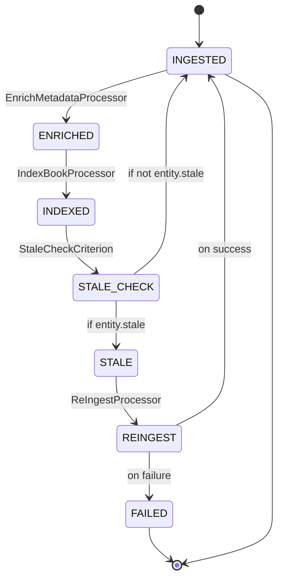
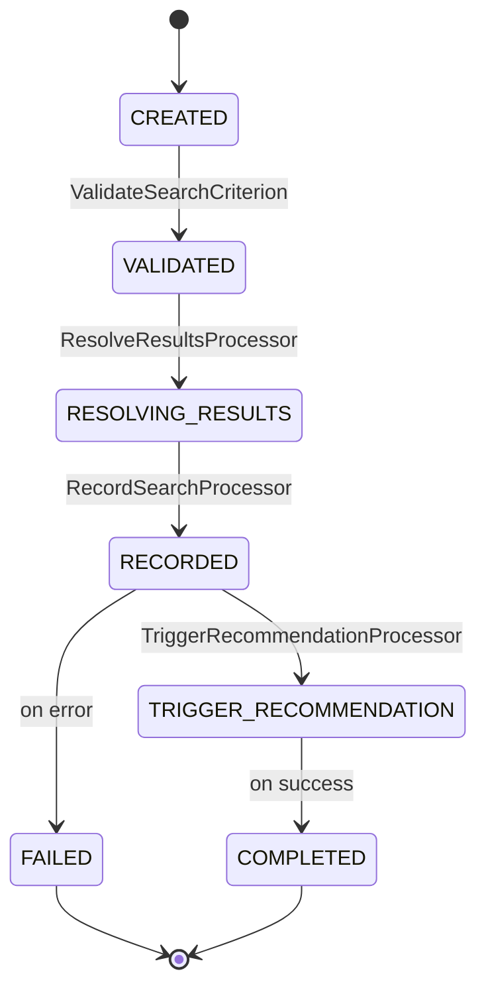
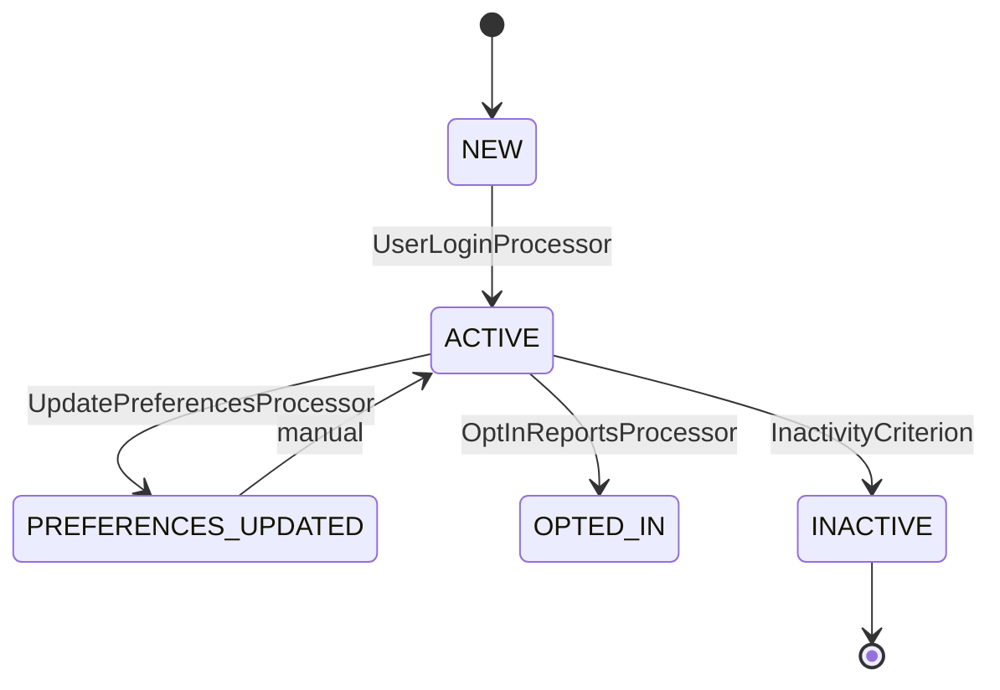
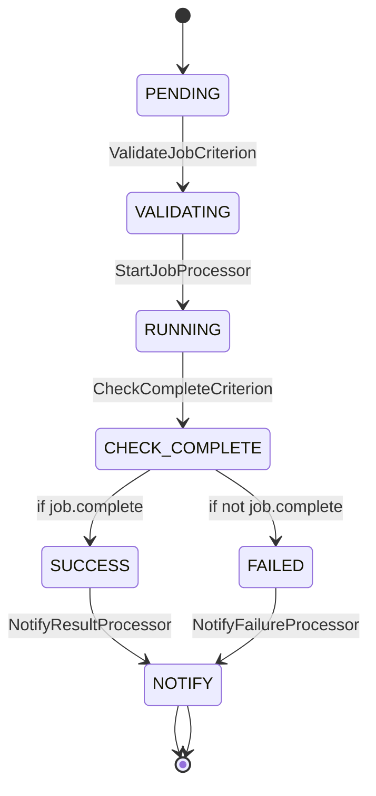
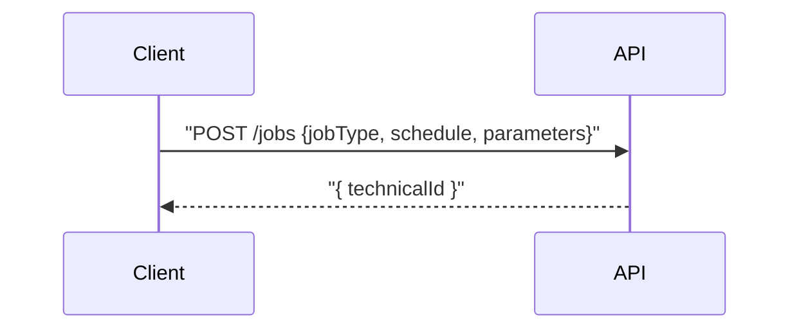
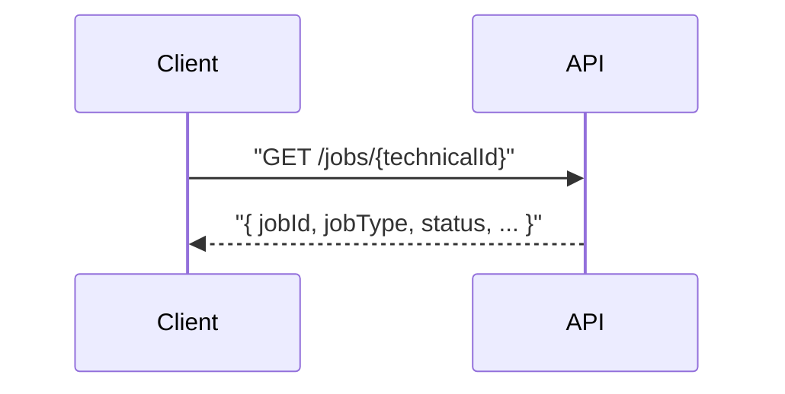
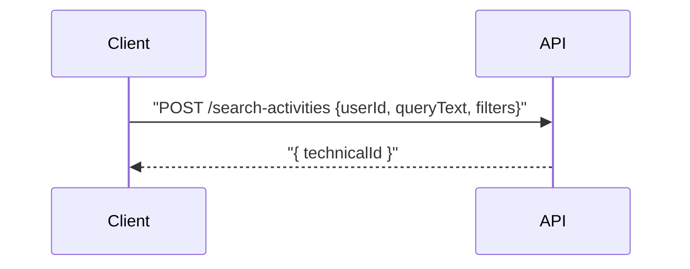
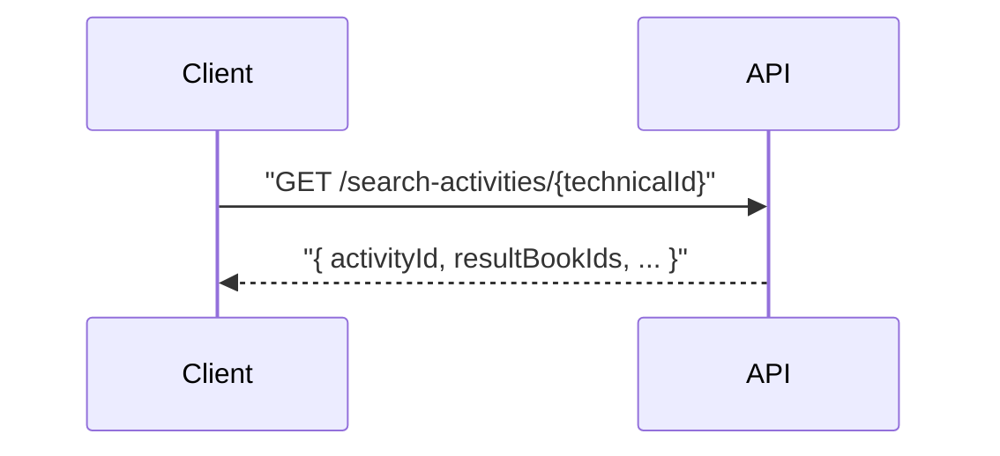
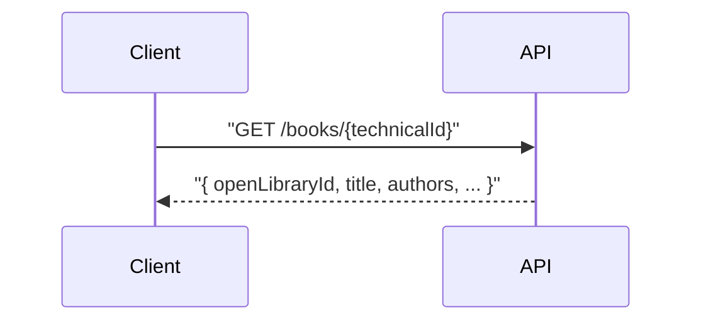
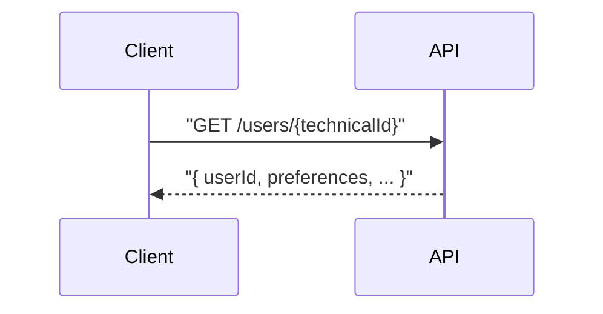

Note: You did not explicitly list entities. To cover both orchestration and business needs I selected 4 entities (within the 10-entity limit): Book, User, SearchActivity, Job. If you want a different set or fewer entities, tell me and I will adapt.

### 1. Entity Definitions
```
Book:
- title: String (display title)
- authors: Array[String] (author names)
- coverImageUrl: String (URL for cover)
- publicationYear: Integer (year of publication)
- genres: Array[String] (genre tags)
- openLibraryId: String (external source id)
- summary: String (short description)
- lastIngestedAt: String (timestamp)

User:
- userId: String (application user id)
- displayName: String (user friendly name)
- preferences: Object (preferred genres[], favoriteAuthors[])
- optInReports: Boolean (weekly report opt-in)
- lastActiveAt: String (timestamp)

SearchActivity:
- activityId: String (search event id)
- userId: String? (nullable for anonymous)
- queryText: String (raw user query)
- timestamp: String (when search happened)
- filters: Object (genres[], yearRange, authors[])
- resultBookIds: Array[String] (books returned)
- clickedBookIds: Array[String] (books clicked)

Job:
- jobId: String (orchestration technical id)
- jobType: String (INGESTION | WEEKLY_REPORT | RECOMMENDATION_RUN)
- schedule: String? (cron or schedule descriptor)
- status: String (PENDING | RUNNING | COMPLETED | FAILED)
- parameters: Object (type-specific parameters)
- startedAt: String?
- finishedAt: String?
```

### 2. Entity workflows

Book workflow:
1. Initial State: INGESTED (entity persisted after ingestion job)
2. Enrichment: Metadata enriched (cover, summary, genres)
3. Indexing: Book indexed for search/facets
4. Staleness Check: If older than threshold mark STALE
5. Update: Re-ingested and returned to INGESTED or FAILED


```mermaid
stateDiagram-v2
    [*] --> INGESTED
    INGESTED --> ENRICHED : EnrichMetadataProcessor
    ENRICHED --> INDEXED : IndexBookProcessor
    INDEXED --> STALE_CHECK : StaleCheckCriterion
    STALE_CHECK --> STALE : if entity.stale
    STALE_CHECK --> INGESTED : if not entity.stale
    STALE --> REINGEST : ReIngestProcessor
    REINGEST --> INGESTED : on success
    REINGEST --> FAILED : on failure
    FAILED --> [*]
    INGESTED --> [*]
```

Book processors & criteria:
- Processors: EnrichMetadataProcessor, IndexBookProcessor, ReIngestProcessor
- Criteria: StaleCheckCriterion (checks lastIngestedAt > threshold)
Pseudo code (example):
- EnrichMetadataProcessor.process(book) -> call external source, populate coverImageUrl, genres, summary; mark enriched=true.

SearchActivity workflow:
1. Created: POST search => CREATED
2. Validate: Validate filters and query
3. Resolve Results: Fetch matching Book IDs (from index)
4. Record Clicks: On user clicks append clickedBookIds
5. Trigger downstream actions: trigger RecommendationJob for personalized suggestions, update user preferences, and feed analytics
6. Completed


```mermaid
stateDiagram-v2
    [*] --> CREATED
    CREATED --> VALIDATED : ValidateSearchCriterion
    VALIDATED --> RESOLVING_RESULTS : ResolveResultsProcessor
    RESOLVING_RESULTS --> RECORDED : RecordSearchProcessor
    RECORDED --> TRIGGER_RECOMMENDATION : TriggerRecommendationProcessor
    TRIGGER_RECOMMENDATION --> COMPLETED : on success
    RECORDED --> FAILED : on error
    FAILED --> [*]
    COMPLETED --> [*]
```

SearchActivity processors & criteria:
- Processors: ResolveResultsProcessor, RecordSearchProcessor, TriggerRecommendationProcessor
- Criteria: ValidateSearchCriterion (non-empty query, filter sanity)
Pseudo code example:
- ResolveResultsProcessor.process(activity) -> query search index using activity.queryText + filters; fill resultBookIds.

User workflow:
1. Initial State: NEW (user created by signup or implicit first action)
2. Active: User performs searches or clicks
3. Preferences Updated: After interactions or manual edits
4. Opt-In: If user opts into reports
5. Inactive: No activity for configured duration


```mermaid
stateDiagram-v2
    [*] --> NEW
    NEW --> ACTIVE : UserLoginProcessor
    ACTIVE --> PREFERENCES_UPDATED : UpdatePreferencesProcessor
    PREFERENCES_UPDATED --> ACTIVE : manual
    ACTIVE --> OPTED_IN : OptInReportsProcessor
    ACTIVE --> INACTIVE : InactivityCriterion
    INACTIVE --> [*]
```

User processors & criteria:
- Processors: UserLoginProcessor, UpdatePreferencesProcessor, OptInReportsProcessor
- Criteria: InactivityCriterion (lastActiveAt older than threshold)

Job workflow (orchestration):
1. Created: POST /jobs -> PENDING (job created)
2. Validation: Validate parameters and resources
3. Running: Execute job (daily ingestion, weekly report, or recommendation batch)
4. Completion: SUCCESS or FAILED
5. Notify: Send status/outputs to subscribers (admins or users opt-in)


```mermaid
stateDiagram-v2
    [*] --> PENDING
    PENDING --> VALIDATING : ValidateJobCriterion
    VALIDATING --> RUNNING : StartJobProcessor
    RUNNING --> CHECK_COMPLETE : CheckCompleteCriterion
    CHECK_COMPLETE --> SUCCESS : if job.complete
    CHECK_COMPLETE --> FAILED : if not job.complete
    SUCCESS --> NOTIFY : NotifyResultProcessor
    NOTIFY --> [*]
    FAILED --> NOTIFY : NotifyFailureProcessor
    NOTIFY --> [*]
```

Job processors & criteria:
- Processors: StartJobProcessor, ExecuteIngestionProcessor, ExecuteReportProcessor, NotifyResultProcessor
- Criteria: ValidateJobCriterion, CheckCompleteCriterion

### 3. Pseudo code for processor classes (concise)

EnrichMetadataProcessor
```
class EnrichMetadataProcessor {
  process(book) {
    external = fetchFromOpenLibrary(book.openLibraryId)
    book.coverImageUrl = external.cover
    book.genres = mergeTags(book.genres, external.subjects)
    book.summary = external.summary
    book.lastIngestedAt = now()
    save(book)
  }
}
```

IndexBookProcessor
```
class IndexBookProcessor {
  process(book) {
    indexService.index(book.openLibraryId, {title, authors, genres, year})
  }
}
```

ResolveResultsProcessor
```
class ResolveResultsProcessor {
  process(activity) {
    results = searchIndex.query(activity.queryText, activity.filters)
    activity.resultBookIds = results.map(r => r.openLibraryId)
    save(activity)
  }
}
```

StartJobProcessor (simplified)
```
class StartJobProcessor {
  process(job) {
    if job.jobType == INGESTION then ExecuteIngestionProcessor.process(job)
    if job.jobType == WEEKLY_REPORT then ExecuteReportProcessor.process(job)
    job.finishedAt = now()
    job.status = COMPLETED
    save(job)
  }
}
```

TriggerRecommendationProcessor
```
class TriggerRecommendationProcessor {
  process(activity) {
    enqueue Job { jobType: RECOMMENDATION_RUN, parameters: { userId: activity.userId } }
  }
}
```

Criteria example (StaleCheckCriterion)
```
class StaleCheckCriterion {
  evaluate(book) {
    return now() - book.lastIngestedAt > 24h
  }
}
```

### 4. API Endpoints Design Rules (concise)

Rules applied:
- POST endpoints create events and return only technicalId (jobId or activityId)
- GET endpoints only retrieve stored results
- GET by technicalId present for all POST-created entities
- Business entities (Book, User) are readable via GET by technicalId

Endpoints:

1) Create Job (orchestration)
- POST /jobs
- Request JSON:
  { jobType: String, schedule?: String, parameters?: Object }
- Response JSON (only technicalId):
  { technicalId: String }

Mermaid for request/response:

```mermaid
sequenceDiagram
    participant Client
    participant API
    Client->>API: "POST /jobs {jobType, schedule, parameters}"
    API-->>Client: "{ technicalId }"
```

2) Get Job by technicalId
- GET /jobs/{technicalId}
- Response JSON:
  { jobId, jobType, schedule, status, parameters, startedAt, finishedAt }

Mermaid:

```mermaid
sequenceDiagram
    participant Client
    participant API
    Client->>API: "GET /jobs/{technicalId}"
    API-->>Client: "{ jobId, jobType, status, ... }"
```

3) Create SearchActivity (user search event)
- POST /search-activities
- Request:
  { userId?: String, queryText: String, filters?: Object }
- Response:
  { technicalId: String }

Mermaid:

```mermaid
sequenceDiagram
    participant Client
    participant API
    Client->>API: "POST /search-activities {userId, queryText, filters}"
    API-->>Client: "{ technicalId }"
```

4) Get SearchActivity by technicalId
- GET /search-activities/{technicalId}
- Response:
  { activityId, userId, queryText, timestamp, filters, resultBookIds, clickedBookIds }

Mermaid:

```mermaid
sequenceDiagram
    participant Client
    participant API
    Client->>API: "GET /search-activities/{technicalId}"
    API-->>Client: "{ activityId, resultBookIds, ... }"
```

5) Read Book (search/index returns books but creation via process)
- GET /books/{technicalId}
- Response:
  { openLibraryId, title, authors, coverImageUrl, publicationYear, genres, summary, lastIngestedAt }

Mermaid:

```mermaid
sequenceDiagram
    participant Client
    participant API
    Client->>API: "GET /books/{technicalId}"
    API-->>Client: "{ openLibraryId, title, authors, ... }"
```

6) Read User
- GET /users/{technicalId}
- Response:
  { userId, displayName, preferences, optInReports, lastActiveAt }

Mermaid:

```mermaid
sequenceDiagram
    participant Client
    participant API
    Client->>API: "GET /users/{technicalId}"
    API-->>Client: "{ userId, preferences, ... }"
```

Notes and assumptions:
- POST /jobs triggers Cyoda to start Job workflow automatically.
- POST /search-activities is a user-facing event that triggers SearchActivity workflow and downstream processes (recommendation, analytics).
- Book and User are mainly written by processors (ingestion, preference update) and exposed via GET endpoints.
- Retention, error retry, and security (auth) are out of scope here — specify if needed.