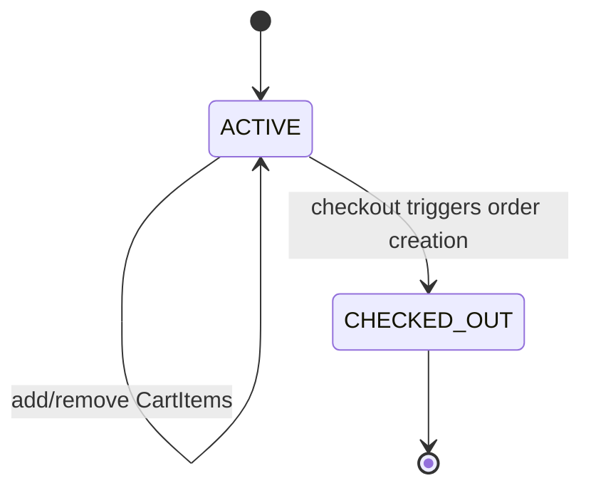
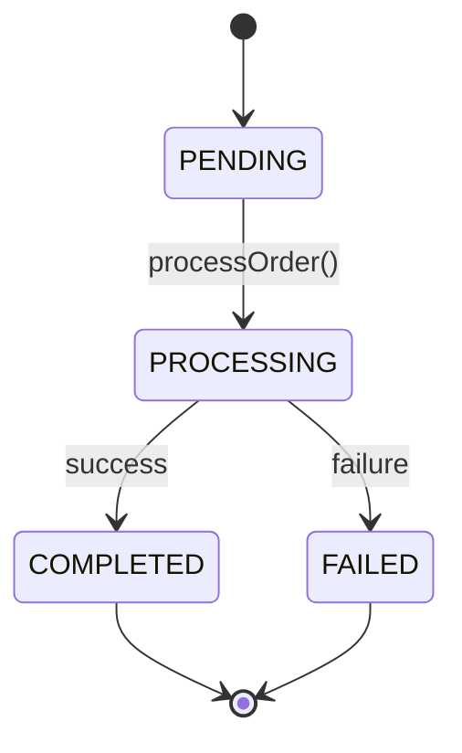
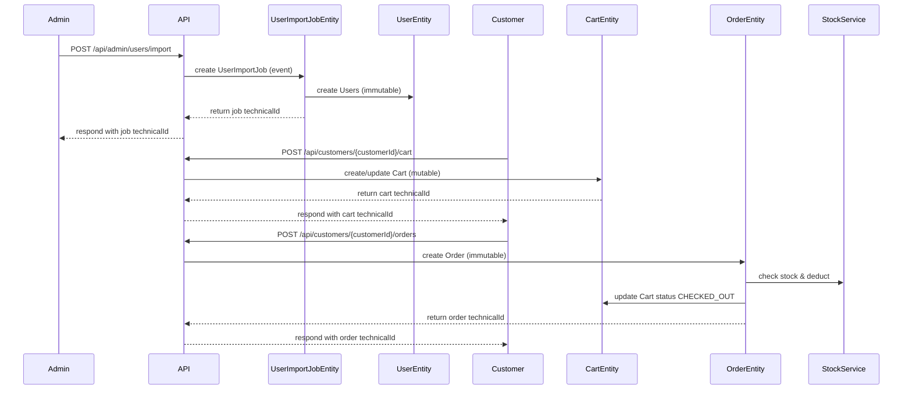

### 1. Entity Definitions

```
UserImportJob:
- jobId: String (unique identifier for the import job)
- importData: String (raw user data in JSON or CSV format)
- status: String (job processing status: PENDING, PROCESSING, COMPLETED, FAILED)
- createdAt: DateTime (timestamp of job creation)

User:
- userId: String (unique identifier for user)
- name: String (user's full name)
- email: String (user email)
- role: String (user role: Admin or Customer)
- createdAt: DateTime (user creation timestamp)

Cart:
- cartId: String (unique identifier for the shopping cart)
- customerId: String (reference to Customer userId)
- items: List of CartItem (list of current products in cart)
- status: String (cart status: ACTIVE, CHECKED_OUT)
- createdAt: DateTime (cart creation timestamp)

CartItem:
- productId: String (reference to product)
- quantity: Integer (number of product units added)

Order:
- orderId: String (unique identifier for the order)
- customerId: String (reference to Customer userId)
- items: List of OrderItem (products and quantities purchased)
- status: String (order status: PENDING, COMPLETED, FAILED)
- createdAt: DateTime (order creation timestamp)

OrderItem:
- productId: String (reference to product)
- quantity: Integer (number of product units ordered)
- price: Decimal (price per unit at order time)
```

---

### 2. Entity Workflows

```
UserImportJob workflow:
1. Initial State: UserImportJob created with PENDING status
2. Validation: Validate importData format and required fields
3. Processing: Parse importData and create immutable User entities
4. Completion: Update UserImportJob status to COMPLETED or FAILED
5. Notification: (Optional) Notify Admin of import results
```


```mermaid
stateDiagram-v2
    [*] --> PENDING
    PENDING --> PROCESSING : processUserImportJob()
    PROCESSING --> COMPLETED : success
    PROCESSING --> FAILED : error
    COMPLETED --> [*]
    FAILED --> [*]
```

```
Cart workflow:
1. Initial State: Cart created with status ACTIVE
2. Validation: Check product availability for CartItems
3. Processing: Update Cart entity with new items (mutable allowed)
4. Completion: Save updated Cart with status ACTIVE or CHECKED_OUT
```


```mermaid
stateDiagram-v2
    [*] --> ACTIVE
    ACTIVE --> ACTIVE : add/remove CartItems
    ACTIVE --> CHECKED_OUT : checkout triggers order creation
    CHECKED_OUT --> [*]
```

```
Order workflow:
1. Initial State: Order created with PENDING status on checkout
2. Validation: Check stock availability for all OrderItems
3. Processing: Deduct stock quantities, update Cart status to CHECKED_OUT
4. Completion: Update Order status to COMPLETED or FAILED
5. Notification: (Optional) Notify Customer or Admin of order result
```


```mermaid
stateDiagram-v2
    [*] --> PENDING
    PENDING --> PROCESSING : processOrder()
    PROCESSING --> COMPLETED : success
    PROCESSING --> FAILED : failure
    COMPLETED --> [*]
    FAILED --> [*]
```

---

### 3. API Endpoints

| Method | Endpoint                                   | Description                            | Request Body                                                                                   | Response                     |
|--------|--------------------------------------------|--------------------------------------|------------------------------------------------------------------------------------------------|------------------------------|
| POST   | /api/admin/users/import                    | Create UserImportJob to import users | `{ "importData": "string" }`                                                                   | `{ "technicalId": "jobId" }` |
| GET    | /api/admin/users/import/{jobId}            | Get UserImportJob status by jobId     | -                                                                                              | Full UserImportJob entity     |
| GET    | /api/users/{userId}                         | Get User by userId                    | -                                                                                              | Full User entity              |
| POST   | /api/customers/{customerId}/cart            | Create or update Cart for customer   | `{ "items": [ { "productId": "string", "quantity": int } ] }`                                  | `{ "technicalId": "cartId" }`|
| GET    | /api/customers/{customerId}/cart            | Retrieve current Cart for customer   | -                                                                                              | Full Cart entity              |
| POST   | /api/customers/{customerId}/orders          | Create Order (checkout) for customer | `{ "cartId": "string" }`                                                                        | `{ "technicalId": "orderId" }`|
| GET    | /api/customers/{customerId}/orders/{orderId} | Get Order by orderId                  | -                                                                                              | Full Order entity             |

---

### 4. Request/Response Formats

- **UserImportJob Request:**

```json
{
  "importData": "[{\"name\":\"Alice\", \"email\":\"alice@example.com\", \"role\":\"Admin\"}, {\"name\":\"Bob\", \"email\":\"bob@example.com\", \"role\":\"Customer\"}]"
}
```

- **UserImportJob Response:**

```json
{
  "technicalId": "job-1234"
}
```

- **Cart Create/Update Request:**

```json
{
  "items": [
    { "productId": "prod-123", "quantity": 2 },
    { "productId": "prod-456", "quantity": 1 }
  ]
}
```

- **Cart Create/Update Response:**

```json
{
  "technicalId": "cart-789"
}
```

- **Order Create Request:**

```json
{
  "cartId": "cart-789"
}
```

- **Order Create Response:**

```json
{
  "technicalId": "order-5678"
}
```

---

### 5. API Request/Response Flow Diagram


```mermaid
sequenceDiagram
    participant Admin
    participant API
    participant UserImportJobEntity
    participant UserEntity

    Admin->>API: POST /api/admin/users/import
    API->>UserImportJobEntity: create UserImportJob (event)
    UserImportJobEntity->>UserEntity: create Users (immutable)
    UserImportJobEntity-->>API: return job technicalId
    API-->>Admin: respond with job technicalId

    participant Customer
    participant CartEntity

    Customer->>API: POST /api/customers/{customerId}/cart
    API->>CartEntity: create/update Cart (mutable)
    CartEntity-->>API: return cart technicalId
    API-->>Customer: respond with cart technicalId

    participant OrderEntity
    participant StockService

    Customer->>API: POST /api/customers/{customerId}/orders
    API->>OrderEntity: create Order (immutable)
    OrderEntity->>StockService: check stock & deduct
    OrderEntity->>CartEntity: update Cart status CHECKED_OUT
    OrderEntity-->>API: return order technicalId
    API-->>Customer: respond with order technicalId
```

---

This document preserves all confirmed business logic, technical details, entity definitions, process flows, and API specifications for the order management system built on Cyoda’s Event-Driven Architecture principles. It is ready for direct use in documentation or development.