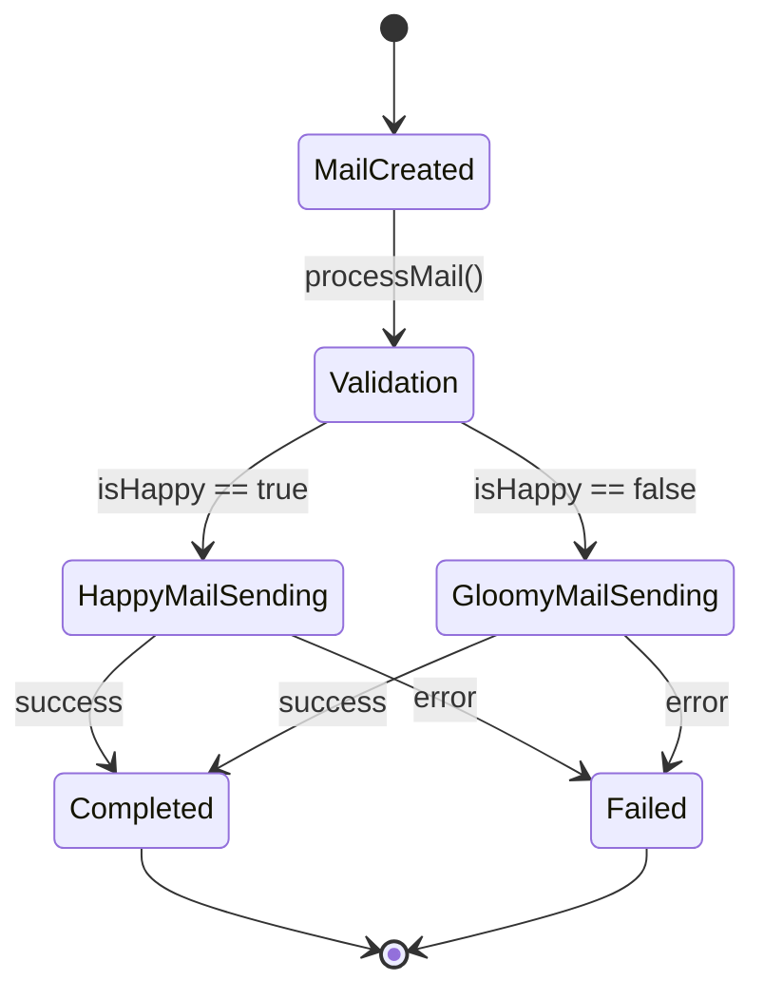
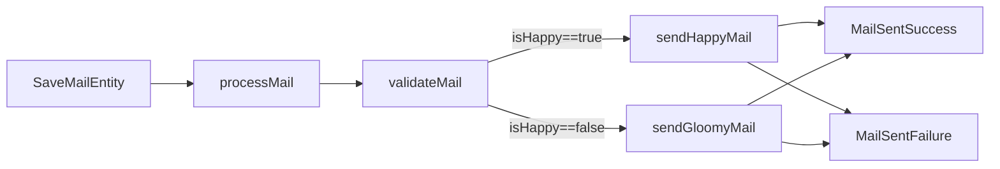
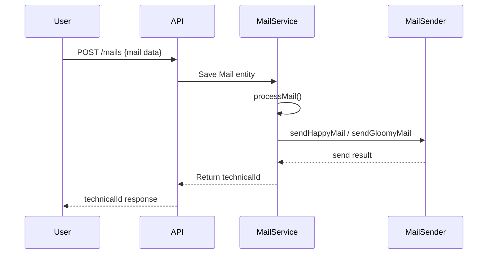

### 1. Entity Definitions
``` 
Mail:
- isHappy: boolean (Indicates if the mail is happy or gloomy)
- mailList: List<String> (List of recipient email addresses)
- content: String (The content/body of the mail)
- subject: String (The subject of the mail)
```

### 2. Process Method Flows

```
processMail() Flow:
1. Initial State: Mail entity is created with `isHappy`, `mailList`, `subject`, and `content`.
2. Validation: Validate the mail entity using checkMailHappyCriteria() and checkMailGloomyCriteria() if explicitly requested.
3. Classification:
    - If `isHappy == true`, route to sendHappyMail processor.
    - If `isHappy == false`, route to sendGloomyMail processor.
4. Processing:
    - sendHappyMail: Send mail with happy content to all recipients in `mailList`.
    - sendGloomyMail: Send mail with gloomy content to all recipients in `mailList`.
5. Completion: Log success or failure of mail sending.
6. Notification: (Optional) Notify sender or system of mail send status.
```

### 3. API Endpoints Design

- **POST /mails**
  - Description: Creates a new `Mail` entity. Triggers `processMail()` event to handle sending.
  - Request Body:
  ```json
  {
    "isHappy": true,
    "mailList": ["recipient1@example.com", "recipient2@example.com"],
    "subject": "Your subject here",
    "content": "Mail content here"
  }
  ```
  - Response:
  ```json
  {
    "technicalId": "uuid-generated-id"
  }
  ```

- **GET /mails/{technicalId}**
  - Description: Retrieve stored mail sending result/status by `technicalId`.
  - Response Example:
  ```json
  {
    "technicalId": "uuid-generated-id",
    "isHappy": true,
    "mailList": ["recipient1@example.com", "recipient2@example.com"],
    "subject": "Your subject here",
    "content": "Mail content here",
    "status": "COMPLETED"
  }
  ```

### 4. Event Processing Workflow Details

- When a new `Mail` is saved, Cyoda triggers `processMail()`.
- Inside `processMail()`:
  - Validate the mail fields (non-empty `mailList`, valid emails).
  - If explicit criteria checks are requested, invoke `checkMailHappyCriteria()` or `checkMailGloomyCriteria()`.
  - Depending on the `isHappy` flag, trigger either `processMailSendHappyMail()` or `processMailSendGloomyMail()`.
- Each processor sends mails accordingly and updates status.

---

### Mermaid Diagrams

**Entity lifecycle state diagram for Mail:**

```mermaid
stateDiagram-v2
    [*] --> MailCreated
    MailCreated --> Validation : processMail()
    Validation --> HappyMailSending : isHappy == true
    Validation --> GloomyMailSending : isHappy == false
    HappyMailSending --> Completed : success
    GloomyMailSending --> Completed : success
    HappyMailSending --> Failed : error
    GloomyMailSending --> Failed : error
    Completed --> [*]
    Failed --> [*]
```

**Event-driven processing chain:**

```mermaid
graph LR
    SaveMailEntity --> processMail
    processMail --> validateMail
    validateMail -->|isHappy==true| sendHappyMail
    validateMail -->|isHappy==false| sendGloomyMail
    sendHappyMail --> MailSentSuccess
    sendGloomyMail --> MailSentSuccess
    sendHappyMail --> MailSentFailure
    sendGloomyMail --> MailSentFailure
```

**User interaction sequence flow:**

```mermaid
sequenceDiagram
    participant User
    participant API
    participant MailService
    participant MailSender

    User->>API: POST /mails {mail data}
    API->>MailService: Save Mail entity
    MailService->>MailService: processMail()
    MailService->>MailSender: sendHappyMail / sendGloomyMail
    MailSender-->>MailService: send result
    MailService-->>API: Return technicalId
    API-->>User: technicalId response
```

---

This completes the confirmed functional requirements for the Happy/Gloomy Mail sender application using Event-Driven Architecture on Cyoda platform.