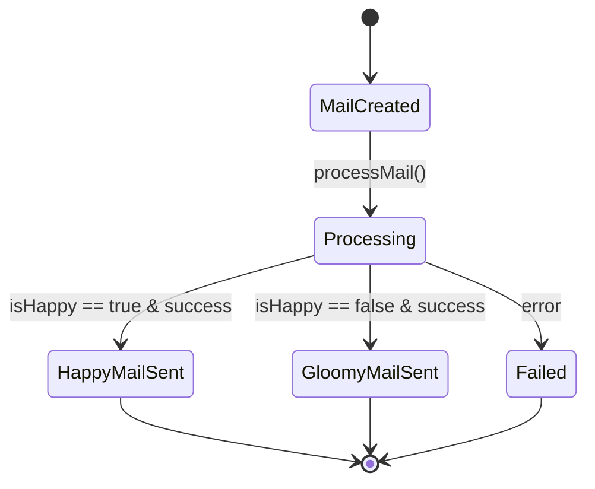
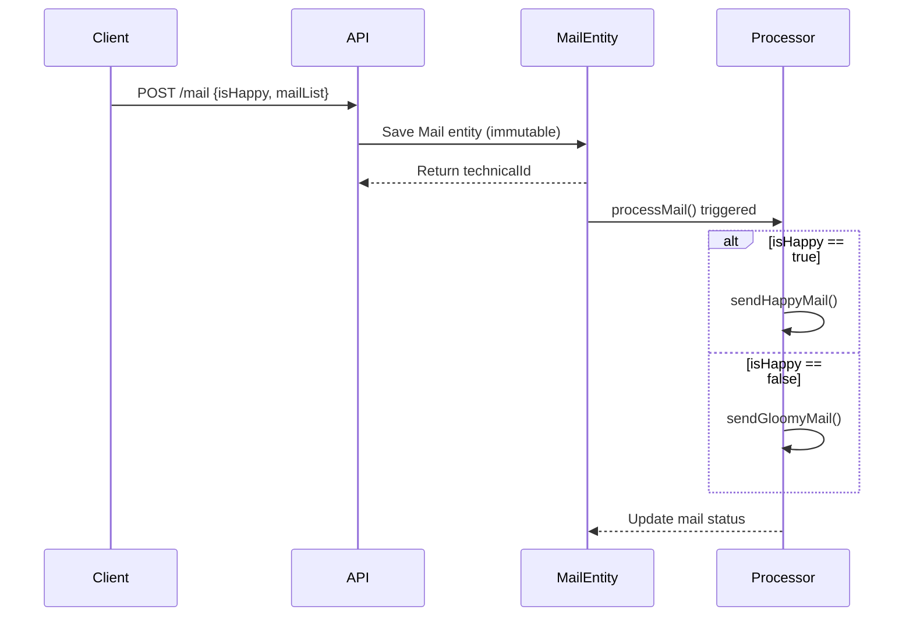

### 1. Entity Definitions

``` 
Mail:
- isHappy: Boolean (Indicates if the mail content is happy or gloomy)
- mailList: List<String> (List of email addresses to receive the mail)
```

### 2. Process Method Flows

```
processMail() Flow:
1. Initial State: Mail entity is created with isHappy and mailList fields populated.
2. Validation: (Optional) Validate mailList is not empty and email addresses are in the correct format.
3. Processing:
   - If isHappy == true, invoke sendHappyMail processor to send happy mails.
   - If isHappy == false, invoke sendGloomyMail processor to send gloomy mails.
4. Completion: Mail sending process results are recorded (success/failure).
5. Notification: (Optional) Notify system or user about the mail send status.
```

### 3. API Endpoints Design

- **POST /mail**
  - Description: Creates a new Mail entity, triggers `processMail()` event.
  - Request Body:
    ```json
    {
      "isHappy": true,
      "mailList": ["user1@example.com", "user2@example.com"]
    }
    ```
  - Response:
    ```json
    {
      "technicalId": "string"
    }
    ```

- **GET /mail/{technicalId}**
  - Description: Retrieves the Mail entity processing result/status by `technicalId`.
  - Response (example):
    ```json
    {
      "technicalId": "string",
      "isHappy": true,
      "mailList": ["user1@example.com", "user2@example.com"],
      "status": "COMPLETED",
      "result": "Happy mails sent successfully"
    }
    ```

### 4. Event Processing Workflows

- On POST /mail, the system saves a new immutable `Mail` entity.
- Cyoda automatically triggers `processMail()` event.
- `processMail()` evaluates `isHappy` field and routes to either `sendHappyMail` or `sendGloomyMail` processor.
- Each processor sends emails accordingly.
- Processing status is saved and retrievable via GET endpoint.

---

### Visual Representation

**Mail Entity Lifecycle State Diagram:**


```mermaid
stateDiagram-v2
    [*] --> MailCreated
    MailCreated --> Processing : processMail()
    Processing --> HappyMailSent : isHappy == true & success
    Processing --> GloomyMailSent : isHappy == false & success
    Processing --> Failed : error
    HappyMailSent --> [*]
    GloomyMailSent --> [*]
    Failed --> [*]
```

**Event-Driven Processing Chain:**


```mermaid
sequenceDiagram
    participant Client
    participant API
    participant MailEntity
    participant Processor

    Client->>API: POST /mail {isHappy, mailList}
    API->>MailEntity: Save Mail entity (immutable)
    MailEntity-->>API: Return technicalId
    MailEntity->>Processor: processMail() triggered
    alt isHappy == true
        Processor->>Processor: sendHappyMail()
    else isHappy == false
        Processor->>Processor: sendGloomyMail()
    end
    Processor-->>MailEntity: Update mail status
```

---

This completes the functional requirements definition for your Happy Mail application using Event-Driven Architecture on Cyoda platform.