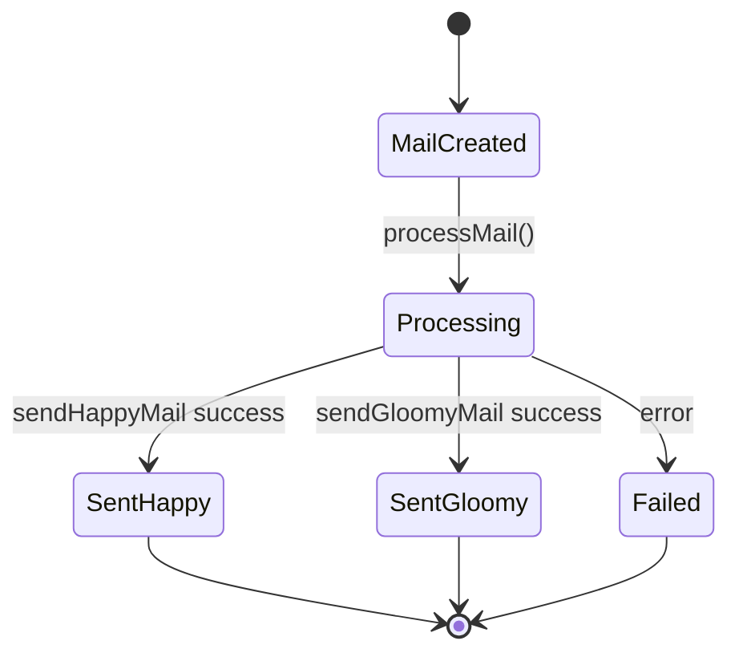
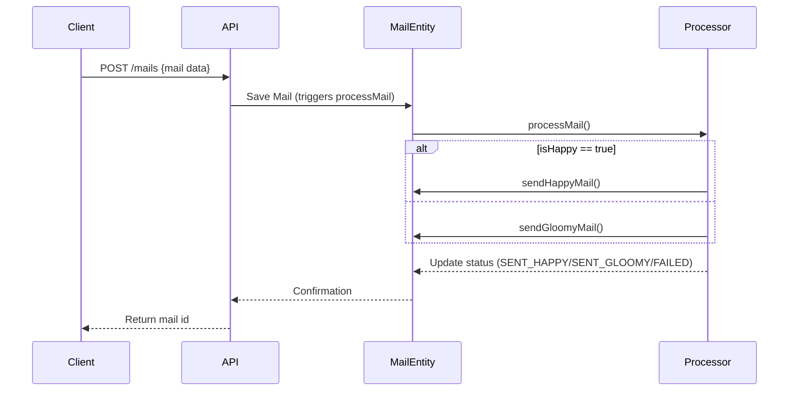

Certainly! Here is the well-formatted final version of your functional requirements following the Event-Driven Architecture principles:

---

### 1. Entity Definitions

``` 
Mail:
- id: UUID (unique identifier)
- isHappy: Boolean (marks if mail is happy or gloomy)
- mailList: List<String> (list of recipient email addresses)
- content: String (email message content)
- status: MailStatusEnum (PENDING, SENT_HAPPY, SENT_GLOOMY, FAILED)
```

---

### 2. Process Method Flows

```
processMail() Flow:
1. Initial State: Mail entity created with status = PENDING
2. Validation: checkMailIsHappy() or checkMailIsGloomy() determines mail mood based on 'isHappy' boolean
3. Processing: 
   - if isHappy = true → sendHappyMail() processor sends happy email template/message
   - else → sendGloomyMail() processor sends gloomy email template/message
4. Completion: Update status to SENT_HAPPY or SENT_GLOOMY depending on processing result; on failure, status = FAILED
5. Notification: Optionally trigger event to notify system/log about sent mail
```

---

### 3. API Endpoints

- **POST /mails**  
  Request:  
  ```json
  {
    "isHappy": true,
    "mailList": ["email1@example.com", "email2@example.com"],
    "content": "Your happy message here"
  }
  ```  
  Response:  
  ```json
  {
    "id": "generated-uuid"
  }
  ```

- **GET /mails/{id}**  
  Response:  
  ```json
  {
    "id": "uuid",
    "isHappy": true,
    "mailList": ["email1@example.com", "email2@example.com"],
    "content": "Your happy message here",
    "status": "SENT_HAPPY"
  }
  ```

---

### 4. Mermaid Diagrams

**Entity lifecycle state diagram**


```mermaid
stateDiagram-v2
    [*] --> MailCreated
    MailCreated --> Processing : processMail()
    Processing --> SentHappy : sendHappyMail success
    Processing --> SentGloomy : sendGloomyMail success
    Processing --> Failed : error
    SentHappy --> [*]
    SentGloomy --> [*]
    Failed --> [*]
```

**Event-driven processing chain**


```mermaid
sequenceDiagram
    participant Client
    participant API
    participant MailEntity
    participant Processor

    Client->>API: POST /mails {mail data}
    API->>MailEntity: Save Mail (triggers processMail)
    MailEntity->>Processor: processMail()
    alt isHappy == true
        Processor->>MailEntity: sendHappyMail()
    else
        Processor->>MailEntity: sendGloomyMail()
    end
    Processor-->>MailEntity: Update status (SENT_HAPPY/SENT_GLOOMY/FAILED)
    MailEntity-->>API: Confirmation
    API-->>Client: Return mail id
```

---

If you need any further refinement or additional features, please feel free to ask!