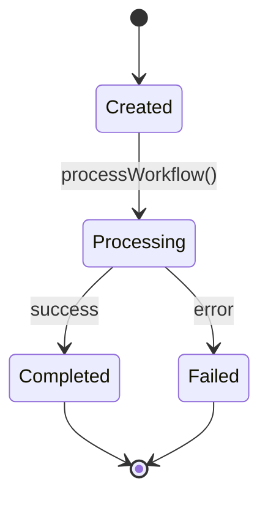
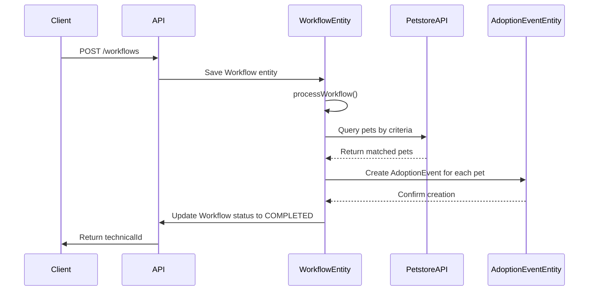
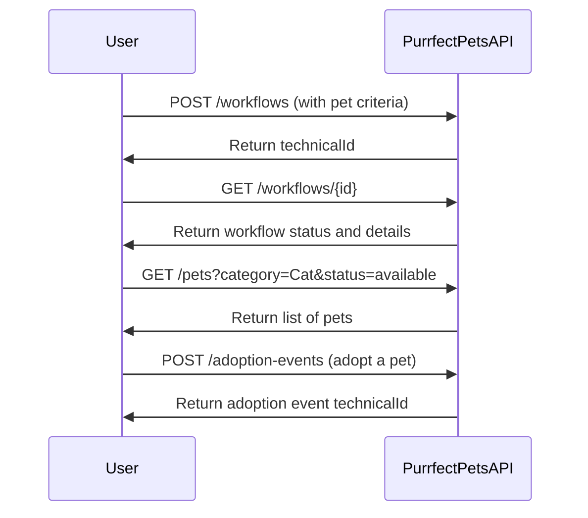

### 1. Entity Definitions

```
Workflow:
- workflowName: String (Name of the workflow)
- description: String (Optional description of the workflow purpose)
- status: String (Current workflow status, e.g., PENDING, COMPLETED, FAILED)
- petCriteria: String (JSON or text describing pet selection/filter criteria)
- createdAt: String (Timestamp of workflow creation)

Pet:
- petId: Long (Pet identifier from Petstore API)
- name: String (Name of the pet)
- category: String (Pet category e.g., Dog, Cat)
- photoUrls: String (Comma-separated URLs of pet photos)
- tags: String (Comma-separated tags for filtering/fun)
- status: String (Pet availability status: available, pending, sold)

AdoptionEvent:
- petId: Long (Referenced pet identifier)
- adopterName: String (Name of the person adopting the pet)
- adoptedAt: String (Timestamp of adoption event)
- story: String (Optional adoption story or notes)
```

---

### 2. Process Method Flows

```
processWorkflow() Flow:
1. Initial State: Workflow created with status = PENDING
2. Validation: Validate petCriteria format and completeness using checkWorkflowCriteria()
3. Processing: Query Petstore API using petCriteria to find matching pets
4. Creation: For each matched pet, create AdoptionEvent entity (immutable event)
5. Completion: Update Workflow status to COMPLETED if successful, FAILED if errors occur
6. Notification: (Optional) Trigger notifications or logs about adoption events created

processAdoptionEvent() Flow:
1. Initial State: AdoptionEvent created as new immutable event
2. Validation: Validate adopterName and petId existence
3. Processing: Update pet status to “pending” or “adopted” by creating a new Pet entity version (immutable)
4. Completion: Mark AdoptionEvent as processed (optional flag or status)
5. Notification: Log adoption event and notify downstream systems or users
```

---

### 3. API Endpoint Design

| Entity         | POST Endpoint                     | Returns           | GET by technicalId              | GET by condition             |
|----------------|---------------------------------|-------------------|-------------------------------|-----------------------------|
| Workflow       | POST /workflows                 | `technicalId`     | GET /workflows/{technicalId}  | Optional: GET /workflows?status=&workflowName= |
| AdoptionEvent  | POST /adoption-events           | `technicalId`     | GET /adoption-events/{technicalId} | Not required               |
| Pet            | No POST endpoint (managed via Workflow and AdoptionEvent processing) | N/A               | GET /pets/{technicalId}       | Optional: GET /pets?category=&status=&tags= |

---

### 4. Request/Response Formats

**POST /workflows**  
_Request:_  
```json
{
  "workflowName": "Find available cats",
  "description": "Workflow to find all available cats for adoption",
  "petCriteria": "{\"category\":\"Cat\",\"status\":\"available\"}"
}
```

_Response:_  
```json
{
  "technicalId": "abc123-workflow"
}
```

---

**GET /workflows/{technicalId}**  
_Response:_  
```json
{
  "workflowName": "Find available cats",
  "description": "Workflow to find all available cats for adoption",
  "status": "COMPLETED",
  "petCriteria": "{\"category\":\"Cat\",\"status\":\"available\"}",
  "createdAt": "2024-06-01T10:00:00Z"
}
```

---

**POST /adoption-events**  
_Request:_  
```json
{
  "petId": 12345,
  "adopterName": "Jane Doe",
  "story": "Found this lovely cat and decided to give her a forever home."
}
```

_Response:_  
```json
{
  "technicalId": "evt789-adoption"
}
```

---

**GET /pets/{technicalId}**  
_Response:_  
```json
{
  "petId": 12345,
  "name": "Whiskers",
  "category": "Cat",
  "photoUrls": "http://example.com/cat1.jpg,http://example.com/cat2.jpg",
  "tags": "cute,friendly",
  "status": "pending"
}
```

---

### 5. Mermaid Diagrams

**Workflow Entity Lifecycle**


```mermaid
stateDiagram-v2
    [*] --> Created
    Created --> Processing : processWorkflow()
    Processing --> Completed : success
    Processing --> Failed : error
    Completed --> [*]
    Failed --> [*]
```

---

**AdoptionEvent Entity Lifecycle**


```mermaid
stateDiagram-v2
    [*] --> Created
    Created --> Processing : processAdoptionEvent()
    Processing --> Completed : success
    Processing --> Failed : error
    Completed --> [*]
    Failed --> [*]
```

---

**Event-Driven Processing Chain**


```mermaid
sequenceDiagram
    participant Client
    participant API
    participant WorkflowEntity
    participant PetstoreAPI
    participant AdoptionEventEntity
    Client->>API: POST /workflows
    API->>WorkflowEntity: Save Workflow entity
    WorkflowEntity->>WorkflowEntity: processWorkflow()
    WorkflowEntity->>PetstoreAPI: Query pets by criteria
    PetstoreAPI-->>WorkflowEntity: Return matched pets
    WorkflowEntity->>AdoptionEventEntity: Create AdoptionEvent for each pet
    AdoptionEventEntity-->>WorkflowEntity: Confirm creation
    WorkflowEntity->>API: Update Workflow status to COMPLETED
    API->>Client: Return technicalId
```

---

**User Interaction Sequence**


```mermaid
sequenceDiagram
    participant User
    participant PurrfectPetsAPI
    User->>PurrfectPetsAPI: POST /workflows (with pet criteria)
    PurrfectPetsAPI->>User: Return technicalId
    User->>PurrfectPetsAPI: GET /workflows/{id}
    PurrfectPetsAPI->>User: Return workflow status and details
    User->>PurrfectPetsAPI: GET /pets?category=Cat&status=available
    PurrfectPetsAPI->>User: Return list of pets
    User->>PurrfectPetsAPI: POST /adoption-events (adopt a pet)
    PurrfectPetsAPI->>User: Return adoption event technicalId
```

---

Please let me know if you need any further adjustments or additions!