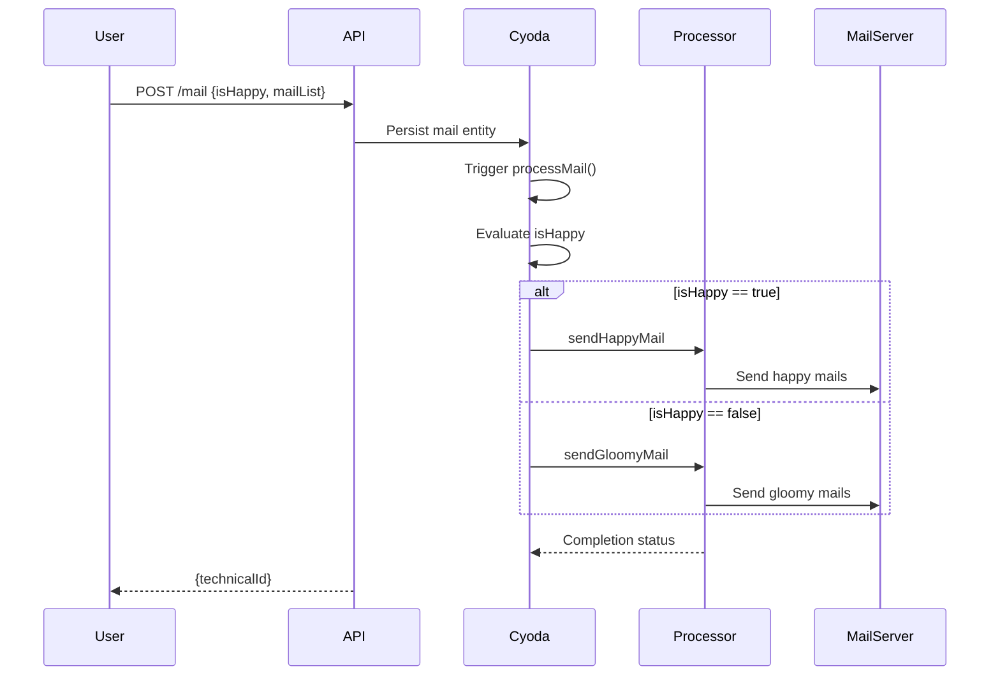

### 1. Entity Definitions

``` 
Mail: 
- isHappy: Boolean (Determines if the mail is happy or gloomy)
- mailList: List<String> (List of recipient email addresses)
```

### 2. Process Method Flows

```
processMail() Flow:
1. Initial State: Mail entity is created with its fields (`isHappy`, `mailList`)
2. Criteria Check: Evaluate `isHappy` field
   - If true, trigger sendHappyMail()
   - If false, trigger sendGloomyMail()
3. Processing:
   - sendHappyMail(): Send happy mail to all addresses in `mailList`
   - sendGloomyMail(): Send gloomy mail to all addresses in `mailList`
4. Completion: Mail sending is considered complete after dispatch
```

### 3. API Endpoints Design

- **POST /mail**
  - Description: Create a new mail entity, triggers `processMail()` event automatically.
  - Request Body:
    ```json
    {
      "isHappy": true,
      "mailList": ["email1@example.com", "email2@example.com"]
    }
    ```
  - Response Body:
    ```json
    {
      "technicalId": "generated-unique-id"
    }
    ```
- **GET /mail/{technicalId}**
  - Description: Retrieve stored mail entity by its technicalId.
  - Response Body:
    ```json
    {
      "isHappy": true,
      "mailList": ["email1@example.com", "email2@example.com"]
    }
    ```

- No update or delete endpoints as per EDA principle (immutable creation).

### 4. Event Processing Workflows

- When a Mail entity is saved via POST, Cyoda automatically triggers `processMail()` event.
- Inside `processMail()`:
  - Criteria `checkMailIsHappy` is evaluated on `isHappy`.
  - If true, `sendHappyMail()` processor sends emails.
  - Otherwise, `sendGloomyMail()` processor sends emails.
- Each processor iterates over `mailList` and sends mail accordingly.
- No state updates on Mail entity after creation (immutable event log).

---

### Visual Representations

#### Entity Lifecycle State Diagram


```mermaid
stateDiagram-v2
    [*] --> MailCreated
    MailCreated --> Processing : processMail()
    Processing --> HappyMailSent : isHappy == true
    Processing --> GloomyMailSent : isHappy == false
    HappyMailSent --> [*]
    GloomyMailSent --> [*]
```

#### Event-Driven Processing Chain

```mermaid
graph TD
    A[POST /mail (create mail)] --> B[Mail entity persisted]
    B --> C{checkMailIsHappy criteria}
    C -->|true| D[sendHappyMail processor]
    C -->|false| E[sendGloomyMail processor]
    D --> F[Send happy mails to mailList]
    E --> G[Send gloomy mails to mailList]
```

#### User Interaction Sequence Flow


```mermaid
sequenceDiagram
    participant User
    participant API
    participant Cyoda
    participant Processor

    User->>API: POST /mail {isHappy, mailList}
    API->>Cyoda: Persist mail entity
    Cyoda->>Cyoda: Trigger processMail()
    Cyoda->>Cyoda: Evaluate isHappy
    alt isHappy == true
        Cyoda->>Processor: sendHappyMail
        Processor->>MailServer: Send happy mails
    else isHappy == false
        Cyoda->>Processor: sendGloomyMail
        Processor->>MailServer: Send gloomy mails
    end
    Processor-->>Cyoda: Completion status
    API-->>User: {technicalId}
```