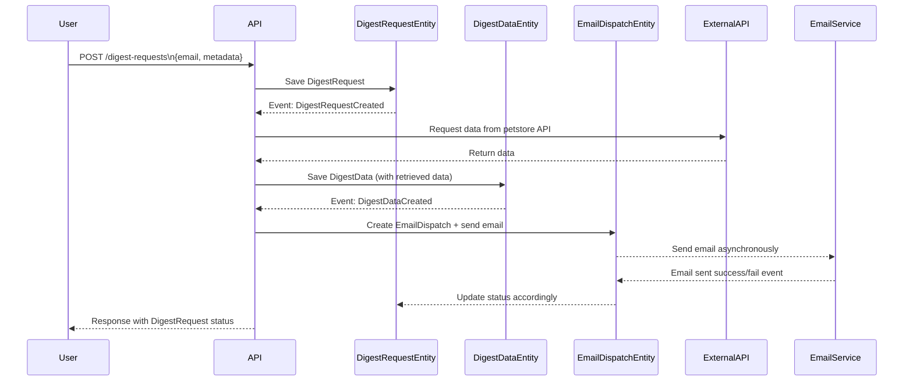

# Functional Requirements for Digest Processing System (Event-Driven Architecture)

## 1. Business Entities

- **DigestRequest**  
  *Fields:*  
  - `id` (UUID)  
  - `email` (String)  
  - `metadata` (Map<String, Object>)  
  - `status` (Enum: RECEIVED, PROCESSING, COMPLETED, FAILED)  
  - `createdAt` (Timestamp)  
  
- **DigestData**  
  *Fields:*  
  - `id` (UUID)  
  - `digestRequestId` (UUID, FK)  
  - `data` (JSON / String)  
  - `format` (Enum: PLAIN_TEXT, HTML, ATTACHMENT)  
  - `createdAt` (Timestamp)  
  
- **EmailDispatch**  
  *Fields:*  
  - `id` (UUID)  
  - `digestRequestId` (UUID, FK)  
  - `email` (String)  
  - `sentAt` (Timestamp)  
  - `status` (Enum: PENDING, SENT, FAILED)  
  - `errorMessage` (String, nullable)  

---

## 2. API Endpoints

### POST /digest-requests  
- Description: Create or update a DigestRequest entity. Triggers event to start processing workflow.  
- Request:  
  ```json
  {
    "email": "user@example.com",
    "metadata": {
      "someKey": "someValue"
    }
  }
  ```  
- Response:  
  ```json
  {
    "id": "uuid",
    "status": "RECEIVED"
  }
  ```

### GET /digest-requests/{id}  
- Description: Retrieve the status and details of a digest request including dispatch status.  
- Response:  
  ```json
  {
    "id": "uuid",
    "email": "user@example.com",
    "metadata": {...},
    "status": "COMPLETED",
    "digestData": {
      "format": "HTML",
      "data": "<html>...</html>"
    },
    "emailDispatch": {
      "status": "SENT",
      "sentAt": "timestamp"
    }
  }
  ```

---

## 3. Event Processing Workflows

- **On DigestRequest Created/Updated**  
  1. Event triggers data retrieval from external API (`petstore.swagger.io`), result saved as DigestData.  
  2. After DigestData saved, compile digest in requested or default format.  
  3. Create EmailDispatch entity and send email asynchronously.  
  4. Update statuses on DigestRequest and EmailDispatch entities accordingly.

---

## 4. Request/Response Formats

- JSON for all POST and GET requests/responses.  
- DigestData `data` field can hold HTML or plain text as string.  

---

## 5. User-App Interaction Mermaid Diagram


```mermaid
sequenceDiagram
  participant User
  participant API
  participant DigestRequestEntity
  participant DigestDataEntity
  participant EmailDispatchEntity
  participant ExternalAPI
  participant EmailService

  User->>API: POST /digest-requests\n{email, metadata}
  API->>DigestRequestEntity: Save DigestRequest
  DigestRequestEntity-->>API: Event: DigestRequestCreated
  API->>ExternalAPI: Request data from petstore API
  ExternalAPI-->>API: Return data
  API->>DigestDataEntity: Save DigestData (with retrieved data)
  DigestDataEntity-->>API: Event: DigestDataCreated
  API->>EmailDispatchEntity: Create EmailDispatch + send email
  EmailDispatchEntity-->>EmailService: Send email asynchronously
  EmailService-->>EmailDispatchEntity: Email sent success/fail event
  EmailDispatchEntity-->>DigestRequestEntity: Update status accordingly
  API-->>User: Response with DigestRequest status
```
