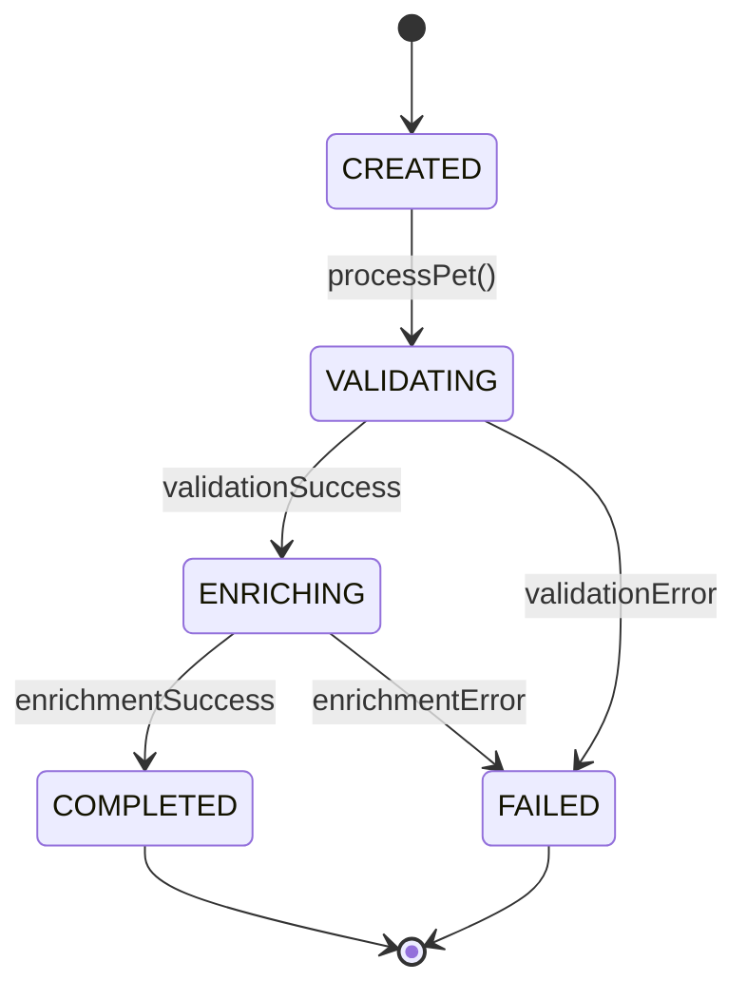
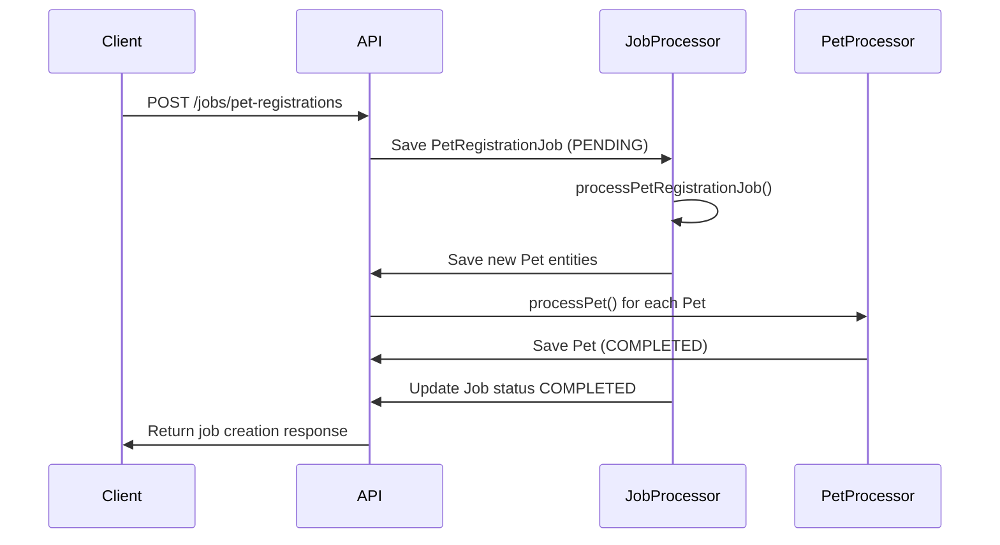

### 1. Entity Definitions

``` 
PetRegistrationJob:  
- jobId: String (unique identifier for the job)  
- source: String (data source or trigger info, e.g., Petstore API)  
- createdAt: DateTime (timestamp when job was created)  
- status: StatusEnum (PENDING, PROCESSING, COMPLETED, FAILED)  

Pet:  
- petId: String (unique pet identifier)  
- name: String (pet's name)  
- category: String (type of pet, e.g., cat, dog)  
- photoUrls: List<String> (image URLs)  
- tags: List<String> (tags describing pet traits)  
- status: StatusEnum (available, pending, sold)  
```

---

### 2. Process Method Flows

``` 
processPetRegistrationJob() Flow:  
1. Initial State: PetRegistrationJob created with PENDING status  
2. Validation: Verify data source connectivity and job parameters  
3. Fetch Data: Pull Pet data from Petstore API  
4. Transformation: Map Petstore data to Pet entities  
5. Persistence: Save new Pet entities (immutable creations)  
6. Completion: Update PetRegistrationJob status to COMPLETED or FAILED  
7. Notification: Log results or notify downstream systems  
```

``` 
processPet() Flow:  
1. Initial State: Pet entity created with given status (e.g., available)  
2. Validation: Confirm mandatory fields (name, category)  
3. Optional Enrichment: Tag normalization or photo URL validation  
4. Persistence: Finalize Pet record storage  
5. Completion: Status remains as set, ready for retrieval  
```

---

### 3. API Endpoints Design Rules

- **POST /jobs/pet-registrations**  
  - Creates a new `PetRegistrationJob` to trigger ingestion from Petstore API  
  - Request triggers `processPetRegistrationJob()` event  
  - Immutable creation of job; no updates, only new job entries  

- **POST /pets**  
  - Creates a new `Pet` entity (e.g., manual addition or correction)  
  - Triggers `processPet()` event  
  - Immutable creation; no PUT/PATCH/DELETE  

- **GET /pets**  
  - Retrieves list of Pets with optional filtering by `status` or `category`  

- **GET /pets/{petId}**  
  - Retrieves details of a specific Pet  

---

### 4. Request/Response Formats

**POST /jobs/pet-registrations**  
_Request:_  
```json  
{  
  "source": "PetstoreAPI"  
}  
```  
_Response:_  
```json  
{  
  "jobId": "string",  
  "status": "PENDING",  
  "createdAt": "2024-06-01T12:00:00Z"  
}  
```  

**POST /pets**  
_Request:_  
```json  
{  
  "name": "Fluffy",  
  "category": "cat",  
  "photoUrls": ["http://example.com/fluffy.jpg"],  
  "tags": ["cute", "white"],  
  "status": "available"  
}  
```  
_Response:_  
```json  
{  
  "petId": "string",  
  "status": "available"  
}  
```  

**GET /pets**  
_Response:_  
```json  
[  
  {  
    "petId": "string",  
    "name": "Fluffy",  
    "category": "cat",  
    "photoUrls": ["http://example.com/fluffy.jpg"],  
    "tags": ["cute", "white"],  
    "status": "available"  
  }  
]  
```  

---

### Visual Representations

**PetRegistrationJob Lifecycle State Diagram**  

```mermaid  
stateDiagram-v2  
    [*] --> PENDING  
    PENDING --> PROCESSING : processPetRegistrationJob()  
    PROCESSING --> COMPLETED : success  
    PROCESSING --> FAILED : error  
    COMPLETED --> [*]  
    FAILED --> [*]  
```  

**Pet Lifecycle State Diagram**  

```mermaid  
stateDiagram-v2  
    [*] --> CREATED  
    CREATED --> VALIDATING : processPet()  
    VALIDATING --> ENRICHING : validationSuccess  
    VALIDATING --> FAILED : validationError  
    ENRICHING --> COMPLETED : enrichmentSuccess  
    ENRICHING --> FAILED : enrichmentError  
    COMPLETED --> [*]  
    FAILED --> [*]  
```  

**Event-Driven Processing Chain**  

```mermaid  
sequenceDiagram  
    participant Client  
    participant API  
    participant JobProcessor  
    participant PetProcessor  
    Client->>API: POST /jobs/pet-registrations  
    API->>JobProcessor: Save PetRegistrationJob (PENDING)  
    JobProcessor->>JobProcessor: processPetRegistrationJob()  
    JobProcessor->>API: Save new Pet entities  
    API->>PetProcessor: processPet() for each Pet  
    PetProcessor->>API: Save Pet (COMPLETED)  
    JobProcessor->>API: Update Job status COMPLETED  
    API->>Client: Return job creation response  
```