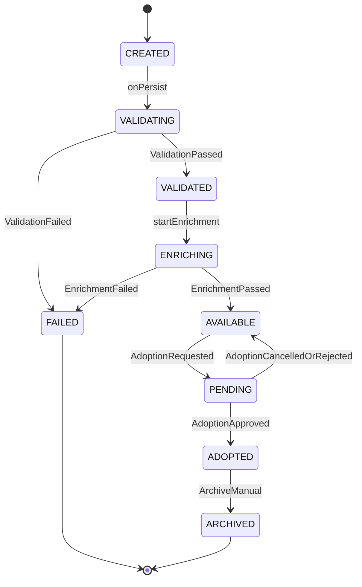
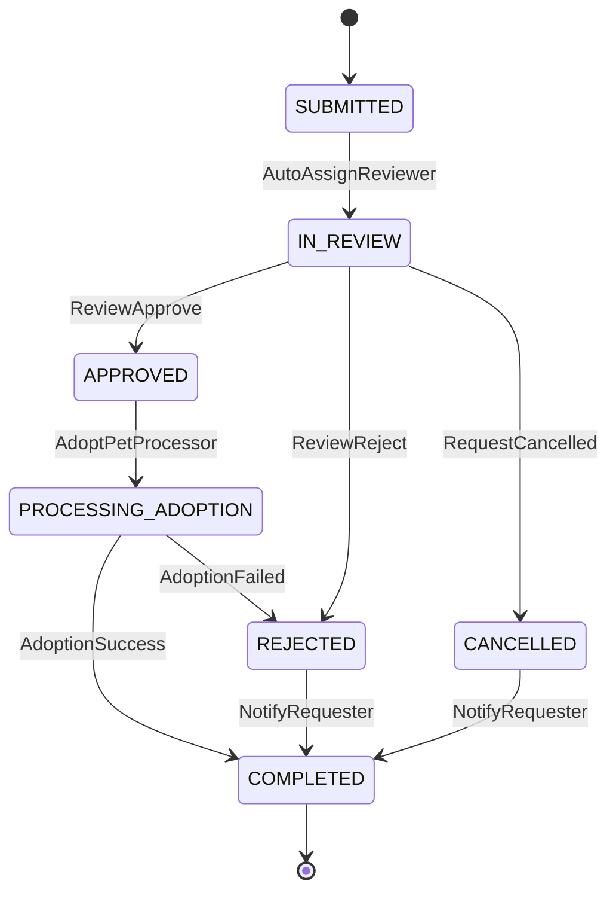
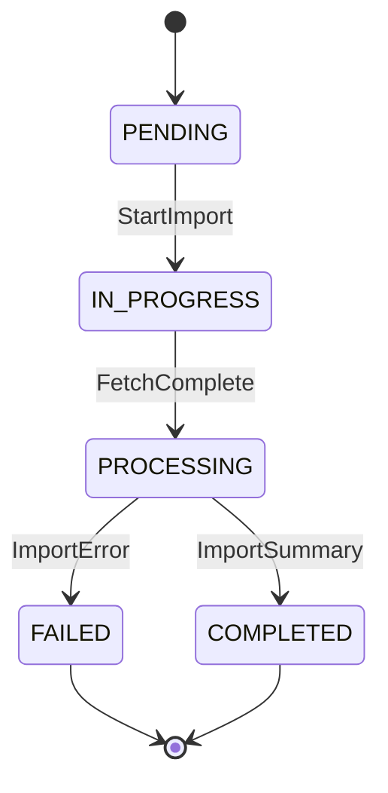

# Functional Requirements

## Overview
This document defines entities, workflows, processors, and API behavior for the Pet adoption prototype. It standardizes entity fields and state machines, clarifies processors' responsibilities, and describes API endpoints and request/response formats. All statuses and transitions use consistent enum-style values.

---

## 1. Entity Definitions
Notes:
- Each persisted entity exposes an internal technical id (technicalId) used by our API and datastore.
- When integrating with an external Petstore, we store that external id as externalId (e.g. Pet.externalId).
- All status values are enumerated (uppercase) for consistency.

### Pet
- technicalId: string (internal datastore id)
- externalId: string (external Petstore id, optional)
- name: string
- species: string (cat/dog/etc)
- breed: string
- age: integer (years or months; prefer years unless otherwise specified)
- gender: string
- description: string
- tags: array<string>
- images: array<string> (urls)
- status: string (enum)
  - Allowed values: CREATED, VALIDATING, VALIDATED, ENRICHING, AVAILABLE, PENDING, ADOPTED, ARCHIVED, FAILED
- source: string (Petstore/local)
- createdAt: datetime
- updatedAt: datetime
- adopter: object (optional) -- recorded when adopted; contains requesterName, requesterContact, adoptedAt, adoptionRequestId

Rationale: differentiate technicalId (internal) vs externalId (3rd-party id). Record adopter details for auditing.

### AdoptionRequest
- technicalId: string (internal datastore id)
- requestId: string (business id, optional)
- petTechnicalId: string (links to Pet.technicalId) -- prefer internal linking
- petExternalId: string (optional, original pet external id)
- requesterName: string
- requesterContact: string (email/phone)
- submittedAt: datetime
- status: string (enum)
  - Allowed values: SUBMITTED, IN_REVIEW, APPROVED, REJECTED, CANCELLED, COMPLETED
- notes: string
- reviewer: string (user id or name, optional)
- decisionAt: datetime (when APPROVED/REJECTED)

Rationale: use internal linkage for reliability; keep external id for traceability.

### ImportJob
- technicalId: string (internal datastore id)
- jobId: string (business id, optional)
- initiatedBy: string (user/admin)
- sourceUrl: string (Petstore endpoint)
- startedAt: datetime (when processing actually started)
- completedAt: datetime (when processing completed or failed)
- status: string (enum)
  - Allowed values: PENDING, IN_PROGRESS, PROCESSING, COMPLETED, FAILED
- importedCount: integer
- errorMessage: string (optional)
- createdAt: datetime
- updatedAt: datetime

Rationale: Import jobs are orchestration entities with lifecycle and metrics.

---

## 2. Status Enums (canonical)
- Pet.status: CREATED | VALIDATING | VALIDATED | ENRICHING | AVAILABLE | PENDING | ADOPTED | ARCHIVED | FAILED
- AdoptionRequest.status: SUBMITTED | IN_REVIEW | APPROVED | REJECTED | CANCELLED | COMPLETED
- ImportJob.status: PENDING | IN_PROGRESS | PROCESSING | COMPLETED | FAILED

Notes: Use these canonical values consistently across processors, API responses and persistence.

---

## 3. Entity Workflows
All state changes should be event-driven where possible. Processors and criteria should emit or react to domain events so each transition is observable.

### Pet workflow
1. CREATED: when persisted (via ImportJob upsert or manual ingest) set status = CREATED.
2. VALIDATING: validation triggered automatically (PetValidationProcessor).
3. VALIDATED or FAILED: validation outcome.
4. ENRICHING: if VALIDATED, enrichment runs (PetEnrichProcessor).
5. AVAILABLE: if enrichment succeeds and pet is eligible for adoption.
6. PENDING: when an AdoptionRequest is SUBMITTED and assigned/confirmed for that pet (or when an admin marks it pending).
7. ADOPTED: on successful adoption (AdoptionRequest APPROVED followed by AdoptPetProcessor success).
8. ARCHIVED: manual archival of record (administrative action).

State diagram (mermaid):


```mermaid
stateDiagram-v2
    [*] --> CREATED
    CREATED --> VALIDATING : onPersist
    VALIDATING --> VALIDATED : ValidationPassed
    VALIDATING --> FAILED : ValidationFailed
    VALIDATED --> ENRICHING : startEnrichment
    ENRICHING --> AVAILABLE : EnrichmentPassed
    ENRICHING --> FAILED : EnrichmentFailed
    AVAILABLE --> PENDING : AdoptionRequested
    PENDING --> ADOPTED : AdoptionApproved
    PENDING --> AVAILABLE : AdoptionCancelledOrRejected
    ADOPTED --> ARCHIVED : ArchiveManual
    FAILED --> [*]
    ARCHIVED --> [*]
```

Notes/clarifications:
- CREATED -> VALIDATING is automatic and should be idempotent (re-runnable for the same pet).
- VALIDATION failure sets Pet.status = FAILED and halts enrichment.
- Enrichment failure may set FAILED or leave VALIDATED depending on severity; prefer FAILED if critical data missing.
- When an AdoptionRequest is submitted for a pet, the pet may move to PENDING automatically (if business logic requires) — include checks to avoid race conditions.

### AdoptionRequest workflow
1. SUBMITTED: POST creates request with status SUBMITTED.
2. IN_REVIEW: automatic reviewer assignment or queueing.
3. APPROVED or REJECTED (or CANCELLED by requester/admin).
4. If APPROVED: an AdoptPetProcessor runs to update the Pet to ADOPTED and records adopter details. AdoptionRequest then moves to COMPLETED.
5. If REJECTED or CANCELLED: move to COMPLETED after notifications if any.

State diagram (mermaid):


```mermaid
stateDiagram-v2
    [*] --> SUBMITTED
    SUBMITTED --> IN_REVIEW : AutoAssignReviewer
    IN_REVIEW --> APPROVED : ReviewApprove
    IN_REVIEW --> REJECTED : ReviewReject
    IN_REVIEW --> CANCELLED : RequestCancelled
    APPROVED --> PROCESSING_ADOPTION : AdoptPetProcessor
    PROCESSING_ADOPTION --> COMPLETED : AdoptionSuccess
    PROCESSING_ADOPTION --> REJECTED : AdoptionFailed
    REJECTED --> COMPLETED : NotifyRequester
    CANCELLED --> COMPLETED : NotifyRequester
    COMPLETED --> [*]
```

Notes:
- Approval is a manual admin decision; the actual adoption change to the Pet is performed by an automatic AdoptPetProcessor.
- The AdoptPetProcessor should be idempotent and handle concurrency (e.g., two requests for the same pet).

### ImportJob workflow
1. PENDING: created via POST; not yet started.
2. IN_PROGRESS: job worker picks up, marks startedAt and status = IN_PROGRESS.
3. PROCESSING: fetching of remote data completed and the job begins upserting pets.
4. COMPLETED or FAILED: upon successful upsert of all items or on fatal error.

State diagram (mermaid):


```mermaid
stateDiagram-v2
    [*] --> PENDING
    PENDING --> IN_PROGRESS : StartImport
    IN_PROGRESS --> PROCESSING : FetchComplete
    PROCESSING --> COMPLETED : ImportSummary
    PROCESSING --> FAILED : ImportError
    FAILED --> [*]
    COMPLETED --> [*]
```

Notes:
- Import processing should be incremental and resilient: failures for individual pets should not necessarily fail the entire job unless configured.
- importedCount should reflect successfully persisted pets.

---

## 4. Processor / Criterion Classes
Responsibilities are clarified and made explicit. Processors should follow clear contracts: idempotent where applicable, persist state changes, emit domain events, and handle transient failures with retries.

List of processors/criteria:
- PetValidationCriterion (rule-set used by PetValidationProcessor)
- PetValidationProcessor
  - Validates required fields and consistency
  - Transitions pet.status: CREATED -> VALIDATING -> VALIDATED | FAILED
  - Emits ValidationPassed or ValidationFailed events
- PetEnrichProcessor
  - Enriches images, tags and any missing metadata
  - Transitions pet.status: VALIDATED -> ENRICHING -> AVAILABLE | FAILED
  - Can optionally leave pet VALIDATED if enrichment is non-critical
- AdoptPetProcessor
  - Triggered when an AdoptionRequest is APPROVED (or explicitly invoked by admin)
  - Responsible for:
    - Fetching the latest Pet record
    - Checking Pet.status is AVAILABLE (or PENDING according to business rule)
    - Atomically setting Pet.status = ADOPTED and recording adopter details on Pet.adopter
    - Marking AdoptionRequest.status = COMPLETED (or APPROVED then COMPLETED depending on audit requirements)
    - Emitting AdoptionCompleted or AdoptionFailed events
  - Must handle concurrency: only one AdoptPetProcessor should succeed for a given pet; others should fail and result in the corresponding AdoptionRequest set to REJECTED or COMPLETED with failure reason
- AdoptionAssignReviewerCriterion / Processor
  - Assigns reviewer or puts request into a review queue
- AdoptionNotifyProcessor
  - Sends notifications (email/SMS) when requests are approved/rejected/completed
- ImportFetchProcessor
  - Calls the Petstore endpoint (job.sourceUrl) and returns payload or error
  - On non-fatal remote errors, retries with backoff
- ImportUpsertProcessor
  - Upserts Pet entities from fetched payload
  - Emits per-pet persist events that trigger the Pet workflow
  - Updates ImportJob.importedCount incrementally
- ImportSummaryProcessor
  - Aggregates results and transitions ImportJob to COMPLETED or FAILED

---

## 5. Pseudocode for Key Processors (updated)

PetValidationProcessor:
```
process(pet):
  if pet.status not in {CREATED, VALIDATING}:
    return  // idempotent guard

  pet.status = VALIDATING
  save(pet)

  errors = validate(pet)
  if errors.present:
    pet.status = FAILED
    pet.errorDetails = errors
    save(pet)
    emit(ValidationFailed, pet)
    return

  pet.status = VALIDATED
  save(pet)
  emit(ValidationPassed, pet)
```

ImportFetchProcessor / ImportJob processing (simplified):
```
process(importJob):
  if importJob.status != PENDING:
    return

  importJob.status = IN_PROGRESS
  importJob.startedAt = now()
  save(importJob)

  response = fetch(importJob.sourceUrl)
  if response.error:
    importJob.status = FAILED
    importJob.errorMessage = response.error
    importJob.completedAt = now()
    save(importJob)
    emit(ImportFailed, importJob)
    return

  importJob.status = PROCESSING
  save(importJob)

  successCount = 0
  for item in response.pets:
    try:
      upsertPet(item)  // ImportUpsertProcessor handles per-pet upsert and emits persist event
      successCount += 1
    except NonFatalError as e:
      log.warn(e)
      // continue; optionally collect per-item errors
    except FatalError as e:
      importJob.status = FAILED
      importJob.errorMessage = e.message
      break

  importJob.importedCount = successCount
  importJob.completedAt = now()
  importJob.status = (FAILED if importJob.status == FAILED else COMPLETED)
  save(importJob)
  emit(ImportCompleted, importJob)
```

AdoptPetProcessor (updated with concurrency handling):
```
process(adoptionRequest):
  if adoptionRequest.status not in {APPROVED, SUBMITTED}:
    return

  // idempotent and optimistic locking pattern
  pet = findPetForUpdate(adoptionRequest.petTechnicalId)
  if pet == null:
    adoptionRequest.status = REJECTED
    adoptionRequest.notes = 'Pet not found'
    save(adoptionRequest)
    NotifyRequester(adoptionRequest)
    return

  if pet.status in {ADOPTED, ARCHIVED}:
    adoptionRequest.status = REJECTED
    adoptionRequest.notes = 'Pet not available'
    save(adoptionRequest)
    NotifyRequester(adoptionRequest)
    return

  if pet.status in {AVAILABLE, PENDING}:
    pet.status = ADOPTED
    pet.adopter = {
      requesterName: adoptionRequest.requesterName,
      requesterContact: adoptionRequest.requesterContact,
      adoptedAt: now(),
      adoptionRequestId: adoptionRequest.technicalId
    }
    save(pet)

    adoptionRequest.status = COMPLETED
    adoptionRequest.decisionAt = now()
    save(adoptionRequest)

    NotifyRequester(adoptionRequest)
    emit(AdoptionCompleted, {adoptionRequest, pet})
    return

  // fallback
  adoptionRequest.status = REJECTED
  save(adoptionRequest)
  NotifyRequester(adoptionRequest)
```

Notes:
- findPetForUpdate() should perform an atomic read/lock or use optimistic locking to avoid race conditions.
- AdoptPetProcessor should be invoked after an admin APPROVES the request (or by an automated rule if configured).

---

## 6. API Endpoints Design Rules & Request / Response formats
Rules:
- POST endpoints return only technicalId in the immediate response to keep create operations lightweight and asynchronous-friendly (requests may cause background processing).
- Orchestration entities (ImportJob) are created via POST and their full state is available via GET by technicalId.
- AdoptionRequest is created via POST (user action) and can be retrieved via GET by technicalId.
- Pet entities are read-only via API: created/upserted only by ImportJob flow. Provide GET list and GET by technicalId and support basic filters.
- All GET responses return the full persisted object as JSON with canonical status enums.

Endpoints:

POST /importJobs
Request JSON:
{
  "initiatedBy": "string",
  "sourceUrl": "string"
}
Response JSON:
{ "technicalId": "string" }
Behavior: Creates ImportJob with status PENDING. Workers will pick it up asynchronously.

GET /importJobs/{technicalId}
Response JSON: ImportJob object (full persisted state)

POST /adoptionRequests
Request JSON:
{
  "petTechnicalId": "string",    // prefer internal id linkage
  "petExternalId": "string",    // optional
  "requesterName": "string",
  "requesterContact": "string",
  "notes": "string"
}
Response JSON:
{ "technicalId": "string" }
Behavior: Creates AdoptionRequest with status SUBMITTED. May trigger auto-review assignment.

GET /adoptionRequests/{technicalId}
Response JSON: AdoptionRequest object (full persisted state)

GET /pets/{technicalId}
Response JSON: Pet object (full persisted state)

GET /pets
Query params support (optional): species, status, page, size, sort
Response JSON: array of Pet objects (paginated)

Examples (abridged):
- POST /importJobs -> { "technicalId": "ij-123" }
- POST /adoptionRequests -> { "technicalId": "ar-456" }
- GET /pets?species=dog&status=AVAILABLE -> [ {pet1}, {pet2}, ... ]

Notes:
- When a POST triggers asynchronous work, the response does not wait for work completion. Clients must poll the relevant GET endpoint to observe progress (e.g., GET /importJobs/{id}).
- For AdoptionRequest, once an admin APPROVES, the AdoptPetProcessor will attempt to update the Pet; clients should observe adoption via GET /pets/{petTechnicalId} or GET /adoptionRequests/{id}.

---

## 7. Operational Considerations
- Idempotency: create/upsert processors should support idempotency keys or safe re-runs.
- Concurrency: AdoptPetProcessor must use locking or optimistic concurrency to avoid double-adoptions.
- Observability: processors should emit domain events and log critical steps and errors. ImportJob should capture per-item errors for inspection.
- Retries: transient external calls (Petstore fetch, enrichment lookups, notification sending) should use retry/backoff.
- Backpressure: large imports should be chunked and ImportJob should support progress reporting.

---

## 8. Extension ideas (future)
- Add a User entity with roles (admin, reviewer, requester) and use user ids for initiatedBy and reviewer fields.
- Support GET filters for adoptionRequests (by requesterContact, status, date range).
- Add bulk adoption/transfer workflows for shelters.


