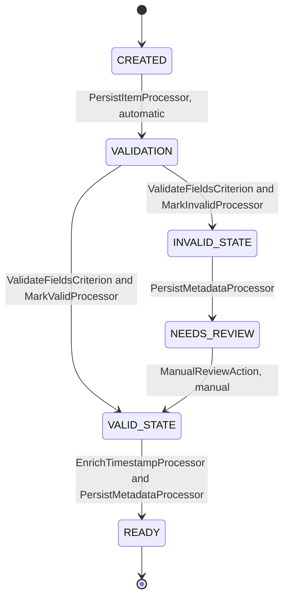
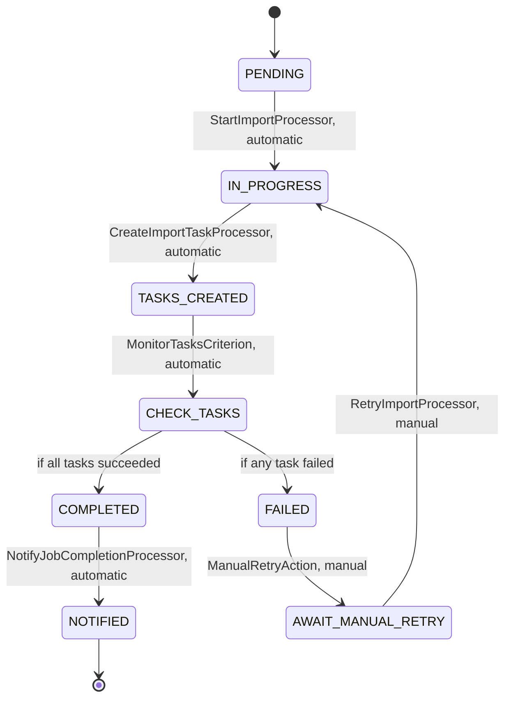
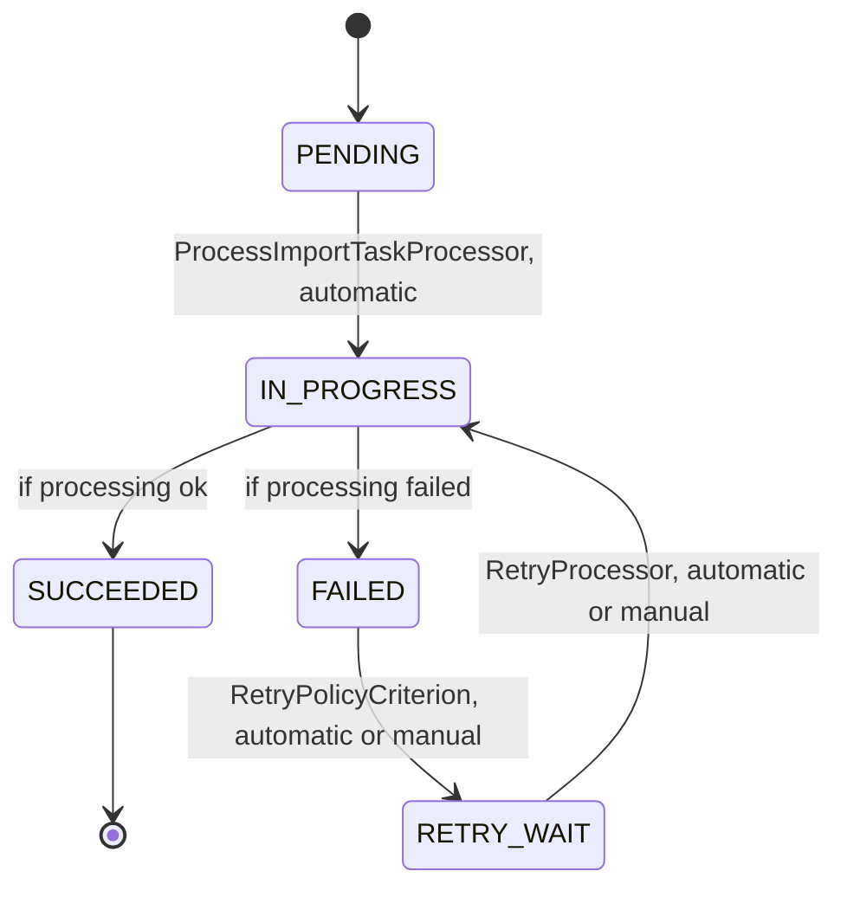
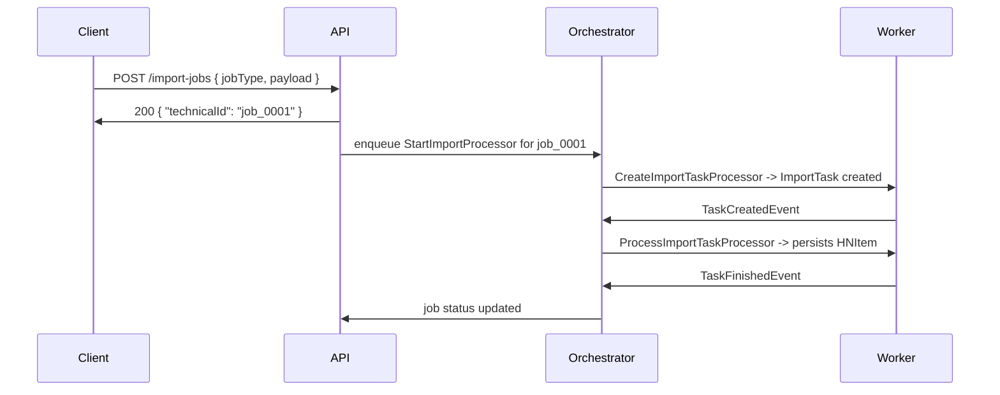
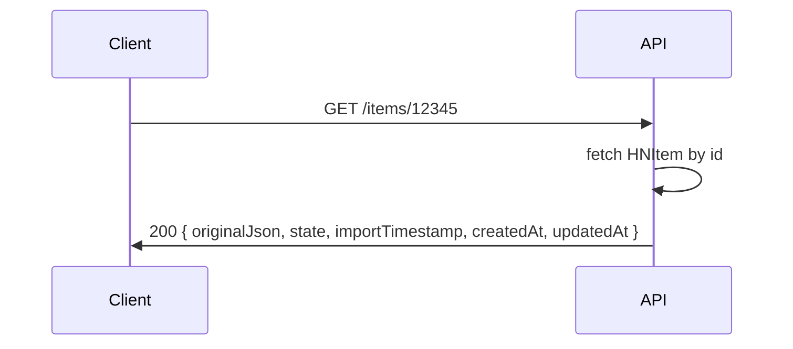

### Entity Definitions
```
HNItem:
- id: Long (Hacker News item identifier from the Firebase HN API JSON)
- type: String (Hacker News item type from the Firebase HN API JSON)
- originalJson: JSON (the complete original JSON object in the Firebase HN API format; stored verbatim and not mutated)
- importTimestamp: String (ISO-8601 UTC timestamp when the item was imported; kept separate from originalJson)
- state: String (VALID or INVALID determined by validation of required fields)
- createdAt: String (ISO-8601 UTC timestamp when record persisted in datastore)
- updatedAt: String (ISO-8601 UTC timestamp when last updated)

ImportJob:
- jobType: String (type of import job, e.g., single_item_import or batch_import)
- payload: JSON (input payload for the job; for single_item_import this is the Firebase HN API item JSON)
- status: String (PENDING, IN_PROGRESS, COMPLETED, FAILED)
- errorMessage: String (optional error description if the job fails)
- createdAt: String (ISO-8601 UTC timestamp when job created)
- startedAt: String (ISO-8601 UTC timestamp when job processing started)
- finishedAt: String (ISO-8601 UTC timestamp when job processing finished)
- technicalId: String (datastore-specific technical identifier returned by POST /import-jobs)

ImportTask:
- jobTechnicalId: String (reference to ImportJob.technicalId)
- attemptNumber: Integer (1-based attempt counter)
- attemptedAt: String (ISO-8601 UTC timestamp for the attempt)
- result: JSON (result details, e.g., persisted HNItem id or error info)
- status: String (PENDING, IN_PROGRESS, SUCCEEDED, FAILED)
- technicalId: String (datastore-specific technical identifier returned by system when task created)
```

---

## 2. Entity workflows

HNItem workflow:
1. Initial State: HNItem created (persisted) with state UNKNOWN and importTimestamp set by importer
2. Validation: Validate presence of fields id and type in originalJson
3. Mark State: If id and type present → set state to VALID; otherwise set state to INVALID
4. Persist Metadata: Ensure importTimestamp, createdAt, updatedAt persisted separately from originalJson
5. Post-processing:
   - If VALID: mark record Ready and optionally emit ItemImported event for downstream consumers
   - If INVALID: mark record NeedsReview and optionally notify manual review queue
Transitions: validation and marking are automatic (system). Manual transition possible from NeedsReview to VALID after human correction.

HNItem state diagram


```mermaid
stateDiagram-v2
    [*] --> CREATED
    CREATED --> VALIDATION : PersistItemProcessor, automatic
    VALIDATION --> VALID_STATE : ValidateFieldsCriterion and MarkValidProcessor
    VALIDATION --> INVALID_STATE : ValidateFieldsCriterion and MarkInvalidProcessor
    VALID_STATE --> READY : EnrichTimestampProcessor and PersistMetadataProcessor
    INVALID_STATE --> NEEDS_REVIEW : PersistMetadataProcessor
    NEEDS_REVIEW --> VALID_STATE : ManualReviewAction, manual
    READY --> [*]
```

HNItem - criterion and processor classes needed:
- ValidateFieldsCriterion
  - Responsibility: Inspect originalJson and check presence of fields id and type.
  - Pseudocode:
    - boolean evaluate(JsonNode originalJson) { return originalJson.has("id") && originalJson.has("type"); }
- EnrichTimestampProcessor
  - Responsibility: Generate importTimestamp (UTC ISO-8601) and set createdAt/updatedAt if missing.
  - Pseudocode:
    - void process(HNItem item) {
        String ts = Instant.now().toString();
        item.importTimestamp = ts;
        if item.createdAt is null then item.createdAt = ts;
        item.updatedAt = ts;
      }
- PersistItemProcessor
  - Responsibility: Persist HNItem into datastore separating originalJson from metadata.
  - Pseudocode:
    - void process(HNItem item) { datastore.insertOrUpdate(item.id, item.originalJson, item.importTimestamp, item.state, item.createdAt, item.updatedAt); }
- MarkValidProcessor / MarkInvalidProcessor
  - Responsibility: Set item.state to VALID or INVALID and update updatedAt.
  - Pseudocode:
    - void process(HNItem item) { item.state = "VALID"; item.updatedAt = Instant.now().toString(); persist(item); }
- NotifyInvalidItemProcessor (optional)
  - Responsibility: Send notification or push to review queue when state is INVALID.

ImportJob workflow:
1. Initial State: ImportJob created via POST /import-jobs with status PENDING (POST returns only technicalId)
2. Scheduling/Start: System automatically triggers StartImportProcessor which moves status to IN_PROGRESS and sets startedAt
3. Execution: For jobType single_item_import → create ImportTask and call ProcessImportTaskProcessor to handle payload
4. Completion: If all tasks succeed → set job status to COMPLETED and finishedAt; if any task fails → set job status to FAILED and finishedAt with errorMessage
5. Notification: Emit JobCompleted event or persist job result for GET by technicalId
Transitions: job start and execution are automatic. Manual retry allowed via manual POST /import-jobs/{technicalId}/retry (optional manual transition).

ImportJob state diagram


```mermaid
stateDiagram-v2
    [*] --> PENDING
    PENDING --> IN_PROGRESS : StartImportProcessor, automatic
    IN_PROGRESS --> TASKS_CREATED : CreateImportTaskProcessor, automatic
    TASKS_CREATED --> CHECK_TASKS : MonitorTasksCriterion, automatic
    CHECK_TASKS --> COMPLETED : if all tasks succeeded
    CHECK_TASKS --> FAILED : if any task failed
    COMPLETED --> NOTIFIED : NotifyJobCompletionProcessor, automatic
    NOTIFIED --> [*]
    FAILED --> AWAIT_MANUAL_RETRY : ManualRetryAction, manual
    AWAIT_MANUAL_RETRY --> IN_PROGRESS : RetryImportProcessor, manual
```

ImportJob - criterion and processor classes needed:
- StartImportProcessor
  - Responsibility: Mark job IN_PROGRESS, set startedAt, create tasks.
  - Pseudocode:
    - void process(ImportJob job) {
        job.status = "IN_PROGRESS";
        job.startedAt = Instant.now().toString();
        persist(job);
        createImportTasks(job);
      }
- CreateImportTaskProcessor
  - Responsibility: For each payload item create an ImportTask and persist; return technicalIds.
  - Pseudocode:
    - void process(ImportJob job) {
        ImportTask task = new ImportTask(...); task.status = "PENDING"; persist(task);
        publishEvent(TaskCreatedEvent(task.technicalId));
      }
- ProcessImportTaskProcessor
  - Responsibility: Take ImportTask, attempt to persist HNItem via HNItem processors (EnrichTimestampProcessor, ValidateFieldsCriterion, PersistItemProcessor) and update task status/result.
  - Pseudocode:
    - void process(ImportTask task) {
        task.status = "IN_PROGRESS";
        persist(task);
        try {
          HNItem item = buildFromJobPayload(task);
          EnrichTimestampProcessor.process(item);
          boolean valid = ValidateFieldsCriterion.evaluate(item.originalJson);
          if(valid) MarkValidProcessor.process(item); else MarkInvalidProcessor.process(item);
          PersistItemProcessor.process(item);
          task.result = { persistedId: item.id };
          task.status = "SUCCEEDED";
        } catch(Exception e) {
          task.status = "FAILED";
          task.result = { error: e.message };
        } finally {
          task.attemptedAt = Instant.now().toString();
          persist(task);
          publishEvent(TaskFinishedEvent(task.technicalId));
        }
      }
- MonitorTasksCriterion
  - Responsibility: Periodically check tasks for job and decide job completion or failure.
  - Pseudocode:
    - boolean evaluate(ImportJob job) {
        tasks = findTasksByJob(job.technicalId);
        return all tasks.status in SUCCEEDED | FAILED and map accordingly;
      }
- NotifyJobCompletionProcessor
  - Responsibility: Persist final job state and emit JobCompleted event for subscribers.

ImportTask workflow:
1. Initial State: ImportTask created with status PENDING
2. Execution: ProcessImportTaskProcessor runs and sets status IN_PROGRESS
3. Result: On success -> status SUCCEEDED; on failure -> status FAILED
4. Retry: Manual retry action or automatic retry policy can re-run ProcessImportTaskProcessor (optional)
5. Finalization: TaskFinishedEvent published

ImportTask state diagram


```mermaid
stateDiagram-v2
    [*] --> PENDING
    PENDING --> IN_PROGRESS : ProcessImportTaskProcessor, automatic
    IN_PROGRESS --> SUCCEEDED : if processing ok
    IN_PROGRESS --> FAILED : if processing failed
    FAILED --> RETRY_WAIT : RetryPolicyCriterion, automatic or manual
    RETRY_WAIT --> IN_PROGRESS : RetryProcessor, automatic or manual
    SUCCEEDED --> [*]
```

ImportTask - criterion and processor classes needed:
- ProcessImportTaskProcessor (see pseudo above under ImportJob)
- RetryPolicyCriterion
  - Responsibility: Decide if a failed task should be retried (backoff, max attempts)
- RetryProcessor
  - Responsibility: Increment attemptNumber, update attemptedAt, re-invoke ProcessImportTaskProcessor

---

## 3. API Endpoints (Design rules observed)

Notes:
- POST endpoints create orchestration entities and must return only technicalId in the response body.
- GET endpoints used only for retrieving stored results.
- GET by technicalId present for orchestration entities created via POST.
- Business entity HNItem is persisted by the process machinery; retrieval endpoint for HNItem by id is provided per requirement.

Endpoints:

1) POST /import-jobs
- Purpose: Create an ImportJob to import one or more HN items. Triggers StartImportProcessor.
- Request JSON:
  - jobType: String
  - payload: JSON (for single_item_import this is the Firebase HN API item JSON; for batch_import an array)
- Response JSON:
  - technicalId: String
- Example Request:
  {
    "jobType": "single_item_import",
    "payload": { ...Firebase HN API item JSON... }
  }
- Example Response:
  {
    "technicalId": "job_0001_abcd1234"
  }

2) GET /import-jobs/{technicalId}
- Purpose: Retrieve ImportJob status and metadata (result of orchestration)
- Response JSON:
  - technicalId: String
  - jobType: String
  - status: String
  - createdAt: String
  - startedAt: String (nullable)
  - finishedAt: String (nullable)
  - errorMessage: String (nullable)
  - tasks: [ { technicalId, status, attemptedAt, attemptNumber, result } ] (optional)
- Example Response:
  {
    "technicalId": "job_0001_abcd1234",
    "jobType": "single_item_import",
    "status": "COMPLETED",
    "createdAt": "2025-08-15T12:00:00Z",
    "startedAt": "2025-08-15T12:00:01Z",
    "finishedAt": "2025-08-15T12:00:02Z",
    "errorMessage": null,
    "tasks": [ { "technicalId": "task_0001_xxx", "status": "SUCCEEDED", "attemptedAt": "2025-08-15T12:00:01Z", "attemptNumber": 1, "result": { "persistedId": 12345 } } ]
  }

3) GET /items/{id}
- Purpose: Retrieve stored HNItem by its HN id (business id). Returns original JSON together with state and importTimestamp as required.
- Response JSON:
  - originalJson: JSON (the verbatim Firebase HN API item JSON)
  - state: String (VALID or INVALID)
  - importTimestamp: String (ISO-8601 UTC)
  - createdAt: String
  - updatedAt: String
- If not found, return HTTP 404.
- Example Response:
  {
    "originalJson": { ...Firebase HN API item JSON... },
    "state": "VALID",
    "importTimestamp": "2025-08-15T12:00:01Z",
    "createdAt": "2025-08-15T12:00:01Z",
    "updatedAt": "2025-08-15T12:00:01Z"
  }

API request/response flow diagrams


```mermaid
sequenceDiagram
    participant Client
    participant API
    participant Orchestrator
    participant Worker
    Client->>API: POST /import-jobs { jobType, payload }
    API->>Client: 200 { "technicalId": "job_0001" }
    API->>Orchestrator: enqueue StartImportProcessor for job_0001
    Orchestrator->>Worker: CreateImportTaskProcessor -> ImportTask created
    Worker->>Orchestrator: TaskCreatedEvent
    Orchestrator->>Worker: ProcessImportTaskProcessor -> persists HNItem
    Worker->>Orchestrator: TaskFinishedEvent
    Orchestrator->>API: job status updated
```


```mermaid
sequenceDiagram
    participant Client
    participant API
    Client->>API: GET /items/12345
    API->>API: fetch HNItem by id
    API->>Client: 200 { originalJson, state, importTimestamp, createdAt, updatedAt }
```

---

## 4. Request/Response JSON schemas (concise)

- POST /import-jobs request
  - Schema:
    {
      "jobType": "string",
      "payload": JSON | [JSON]
    }

- POST /import-jobs response
  - Schema:
    {
      "technicalId": "string"
    }

- GET /import-jobs/{technicalId} response
  - Schema:
    {
      "technicalId": "string",
      "jobType": "string",
      "status": "string",
      "createdAt": "string",
      "startedAt": "string|null",
      "finishedAt": "string|null",
      "errorMessage": "string|null",
      "tasks": [ { "technicalId": "string", "status": "string", "attemptedAt": "string", "attemptNumber": integer, "result": JSON } ]
    }

- GET /items/{id} response
  - Schema:
    {
      "originalJson": JSON,
      "state": "VALID" | "INVALID",
      "importTimestamp": "string",
      "createdAt": "string",
      "updatedAt": "string"
    }

---

Please review the generated entities and workflows. If you need any changes, please let me know. Feel free to click Approve if this requirement meets your expectations or if you are ready to proceed.