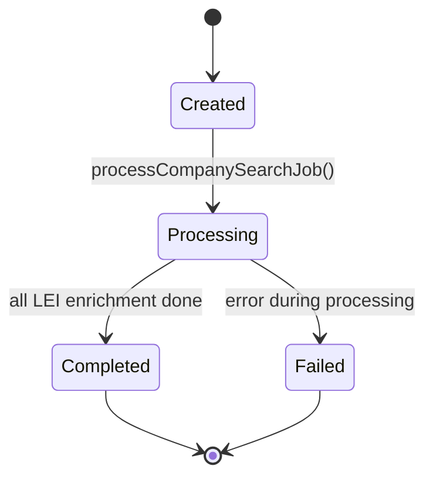
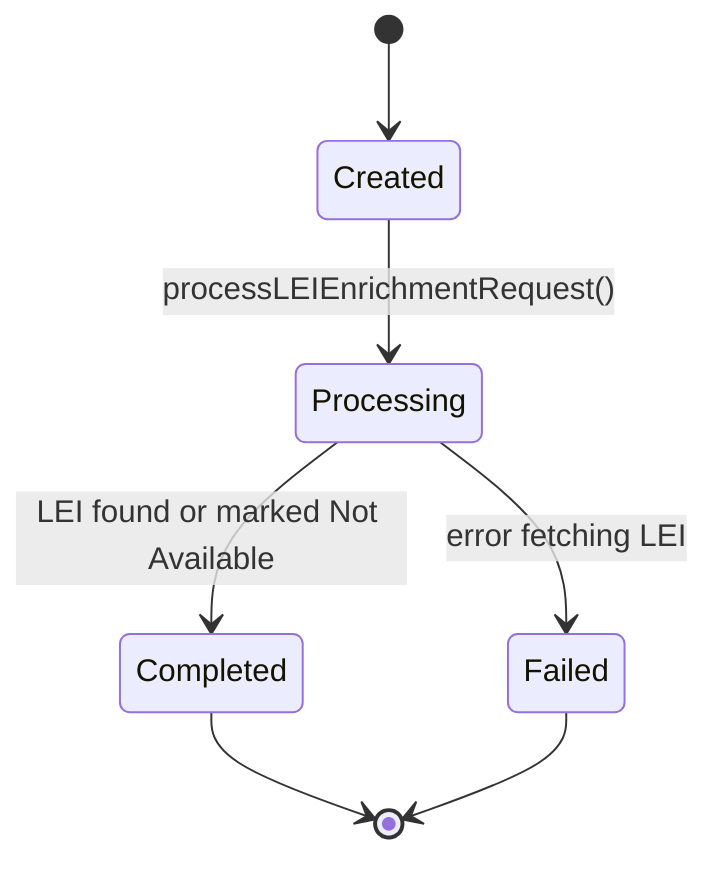
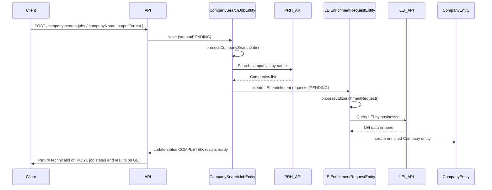

### 1. Entity Definitions

``` 
CompanySearchJob:
- companyName: String (The name or partial name to search for in Finnish Companies Registry)
- status: String (Job status: PENDING, PROCESSING, COMPLETED, FAILED)
- createdAt: String (ISO 8601 timestamp when job was created)
- completedAt: String (ISO 8601 timestamp when job finished, optional)
- outputFormat: String (Desired output format: JSON or CSV)

Company:
- companyName: String (Official company name)
- businessId: String (Finnish business ID)
- companyType: String (Type of company, e.g., OY, AOY)
- registrationDate: String (ISO 8601 date of company registration)
- status: String (Active or Inactive)
- lei: String (Legal Entity Identifier or "Not Available")

LEIEnrichmentRequest:
- businessId: String (Business ID of the company to enrich)
- leiSource: String (Source used for LEI enrichment - optional)
- status: String (Status of enrichment: PENDING, COMPLETED, FAILED)
- lei: String (Found LEI or "Not Available")
```

---

### 2. Process Method Flows

``` 
processCompanySearchJob() Flow:
1. Initial State: CompanySearchJob created with status PENDING.
2. Validation: Check companyName is not empty, outputFormat is valid (JSON/CSV).
3. Processing:
   - Call PRH Avoindata YTJ API to search companies by companyName.
   - Filter results to keep only active companies.
   - For each active company, create LEIEnrichmentRequest entity with status PENDING.
4. Update CompanySearchJob status to PROCESSING.
5. Trigger asynchronous processing of each LEIEnrichmentRequest.
6. On completion of all LEI enrichments, aggregate enriched Company entities.
7. Update CompanySearchJob status to COMPLETED and record completedAt timestamp.

processLEIEnrichmentRequest() Flow:
1. Initial State: LEIEnrichmentRequest created with status PENDING.
2. Processing:
   - Query external LEI sources (e.g., GLEIF API) using businessId.
   - If LEI found, update lei field; else set "Not Available".
3. Update status to COMPLETED or FAILED accordingly.
4. Persist enriched Company entity combining original company data and LEI.
```

---

### 3. API Endpoints Design

| Method | Path                        | Description                                      | Request Body                      | Response                      |
|--------|-----------------------------|------------------------------------------------|---------------------------------|-------------------------------|
| POST   | /company-search-jobs         | Create a new company search job (triggers search and enrichment) | `{ "companyName": "...", "outputFormat": "JSON" }` | `{ "technicalId": "uuid" }`   |
| GET    | /company-search-jobs/{id}    | Retrieve job status and results by technicalId | N/A                             | `{ job details with enriched companies }` |
| GET    | /companies/{businessId}      | Retrieve enriched company data by businessId   | N/A                             | `{ company details including LEI }` |

- POST only for `CompanySearchJob` as orchestration entity.
- Creation of `LEIEnrichmentRequest` and `Company` entities happens internally via event processing.
- Immutable creation only, no update/delete endpoints.
- GET endpoints for retrieval by technicalId or businessId only.
- Output format requested in job creation affects result serialization.

---

### 4. Request/Response Formats

**POST /company-search-jobs Request JSON**

```json
{
  "companyName": "Example Oy",
  "outputFormat": "JSON"
}
```

**POST /company-search-jobs Response JSON**

```json
{
  "technicalId": "123e4567-e89b-12d3-a456-426614174000"
}
```

**GET /company-search-jobs/{technicalId} Response JSON (success example)**

```json
{
  "technicalId": "123e4567-e89b-12d3-a456-426614174000",
  "companyName": "Example Oy",
  "status": "COMPLETED",
  "createdAt": "2024-06-01T10:00:00Z",
  "completedAt": "2024-06-01T10:02:00Z",
  "companies": [
    {
      "companyName": "Example Oy",
      "businessId": "1234567-8",
      "companyType": "OY",
      "registrationDate": "2010-05-12",
      "status": "Active",
      "lei": "5493001KJTIIGC8Y1R12"
    },
    {
      "companyName": "Another Oy",
      "businessId": "8765432-1",
      "companyType": "OY",
      "registrationDate": "2015-08-20",
      "status": "Active",
      "lei": "Not Available"
    }
  ]
}
```

---

### 5. Mermaid Diagrams

**Entity Lifecycle State Diagram for CompanySearchJob**


```mermaid
stateDiagram-v2
    [*] --> Created
    Created --> Processing : processCompanySearchJob()
    Processing --> Completed : all LEI enrichment done
    Processing --> Failed : error during processing
    Completed --> [*]
    Failed --> [*]
```

**Entity Lifecycle State Diagram for LEIEnrichmentRequest**


```mermaid
stateDiagram-v2
    [*] --> Created
    Created --> Processing : processLEIEnrichmentRequest()
    Processing --> Completed : LEI found or marked Not Available
    Processing --> Failed : error fetching LEI
    Completed --> [*]
    Failed --> [*]
```

**Event-Driven Processing Chain**


```mermaid
sequenceDiagram
    participant Client
    participant API
    participant CompanySearchJobEntity
    participant PRH_API
    participant LEIEnrichmentRequestEntity
    participant LEI_API
    participant CompanyEntity

    Client->>API: POST /company-search-jobs { companyName, outputFormat }
    API->>CompanySearchJobEntity: save (status=PENDING)
    CompanySearchJobEntity->>CompanySearchJobEntity: processCompanySearchJob()
    CompanySearchJobEntity->>PRH_API: Search companies by name
    PRH_API-->>CompanySearchJobEntity: Companies list
    CompanySearchJobEntity->>LEIEnrichmentRequestEntity: create LEI enrichment requests (PENDING)
    LEIEnrichmentRequestEntity->>LEIEnrichmentRequestEntity: processLEIEnrichmentRequest()
    LEIEnrichmentRequestEntity->>LEI_API: Query LEI by businessId
    LEI_API-->>LEIEnrichmentRequestEntity: LEI data or none
    LEIEnrichmentRequestEntity->>CompanyEntity: create enriched Company entity
    CompanySearchJobEntity->>API: update status COMPLETED, results ready
    API->>Client: Return technicalId on POST, job status and results on GET
```

---

This completes the functional requirements for your Finnish Companies Data Retrieval and Enrichment Application using an Event-Driven Architecture approach. Please let me know if you need any further details or adjustments.