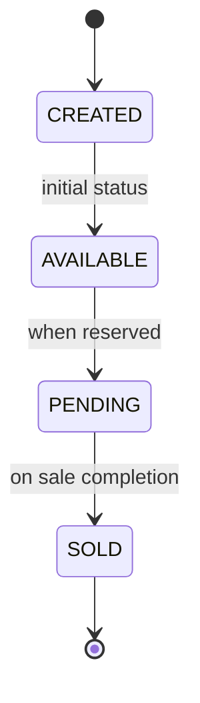
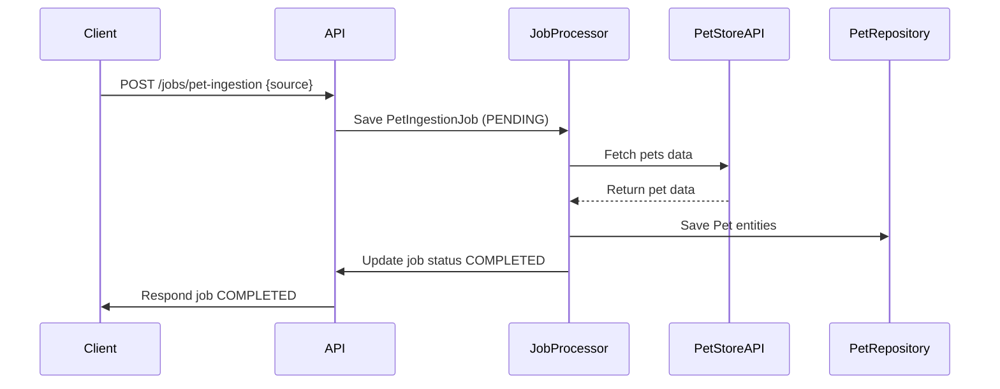

### 1. Entity Definitions

```
PetIngestionJob:
- jobId: String (unique identifier for the ingestion job)
- source: String (data source reference, e.g., Petstore API)
- createdAt: DateTime (timestamp of job creation)
- status: JobStatusEnum (PENDING, PROCESSING, COMPLETED, FAILED)

Pet:
- petId: String (unique identifier for the pet)
- name: String (name of the pet)
- category: String (e.g., Cat, Dog, Bird)
- photoUrls: List<String> (URLs of pet images)
- tags: List<String> (descriptive tags)
- status: PetStatusEnum (AVAILABLE, PENDING, SOLD)
```

---

### 2. Process Method Flows

```
processPetIngestionJob() Flow:
1. Initial State: PetIngestionJob created with PENDING status
2. Validation: Verify source URL and job parameters
3. Fetch Data: Retrieve pet data from Petstore API
4. Transformation: Map external data to Pet entities
5. Persistence: Save immutable Pet entities with status AVAILABLE or as per source data
6. Completion: Update job status to COMPLETED or FAILED
7. Notification: Log results or notify downstream consumers
```

---

### 3. API Endpoints Design

- **POST /jobs/pet-ingestion**  
  Request: Creates a new PetIngestionJob, triggers `processPetIngestionJob()`  
  Response: Job creation confirmation with jobId and status

- **POST /pets**  
  Request: Creates a new Pet entity (immutable creation)  
  Response: Newly created Pet details

- **GET /pets**  
  Request: Retrieves stored pets, optionally filtered by category or status  
  Response: List of Pet entities matching criteria

---

### 4. Request/Response Formats

**POST /jobs/pet-ingestion**  
Request JSON:
```json
{
  "source": "https://petstore.swagger.io/v2/pet"
}
```
Response JSON:
```json
{
  "jobId": "job-12345",
  "status": "PENDING",
  "createdAt": "2024-06-01T12:00:00Z"
}
```

**POST /pets**  
Request JSON:
```json
{
  "name": "Whiskers",
  "category": "Cat",
  "photoUrls": ["http://example.com/image1.jpg"],
  "tags": ["playful", "indoor"],
  "status": "AVAILABLE"
}
```
Response JSON:
```json
{
  "petId": "pet-67890",
  "name": "Whiskers",
  "category": "Cat",
  "photoUrls": ["http://example.com/image1.jpg"],
  "tags": ["playful", "indoor"],
  "status": "AVAILABLE"
}
```

**GET /pets**  
Response JSON:
```json
[
  {
    "petId": "pet-67890",
    "name": "Whiskers",
    "category": "Cat",
    "photoUrls": ["http://example.com/image1.jpg"],
    "tags": ["playful", "indoor"],
    "status": "AVAILABLE"
  }
]
```

---

### 5. Visual Representations

**PetIngestionJob State Diagram**


```mermaid
stateDiagram-v2
    [*] --> PENDING
    PENDING --> PROCESSING : processPetIngestionJob()
    PROCESSING --> COMPLETED : success
    PROCESSING --> FAILED : error
    COMPLETED --> [*]
    FAILED --> [*]
```

**Pet Entity Lifecycle**


```mermaid
stateDiagram-v2
    [*] --> CREATED
    CREATED --> AVAILABLE : initial status
    AVAILABLE --> PENDING : when reserved
    PENDING --> SOLD : on sale completion
    SOLD --> [*]
```

**Event-Driven Processing Chain**


```mermaid
sequenceDiagram
    participant Client
    participant API
    participant JobProcessor
    participant PetStoreAPI
    participant PetRepository

    Client->>API: POST /jobs/pet-ingestion {source}
    API->>JobProcessor: Save PetIngestionJob (PENDING)
    JobProcessor->>PetStoreAPI: Fetch pets data
    PetStoreAPI-->>JobProcessor: Return pet data
    JobProcessor->>PetRepository: Save Pet entities
    JobProcessor->>API: Update job status COMPLETED
    API->>Client: Respond job COMPLETED
```

---

If you need any further adjustments or additional features, please feel free to ask!