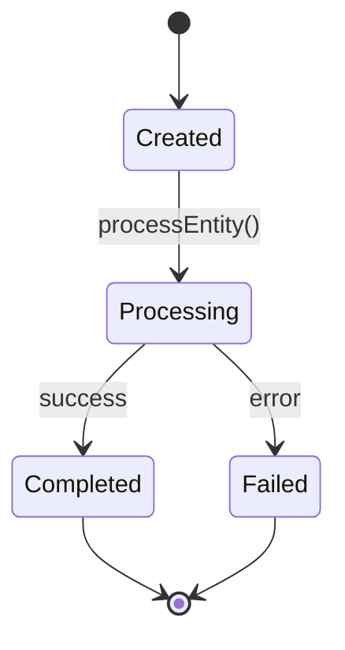
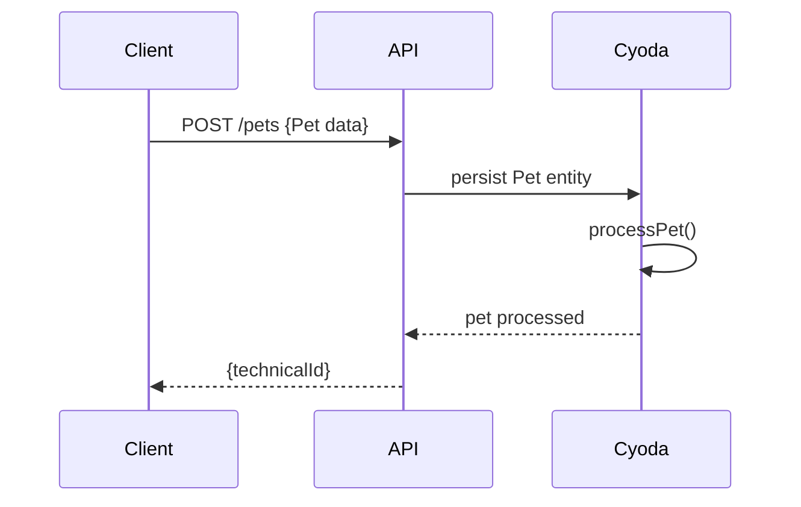
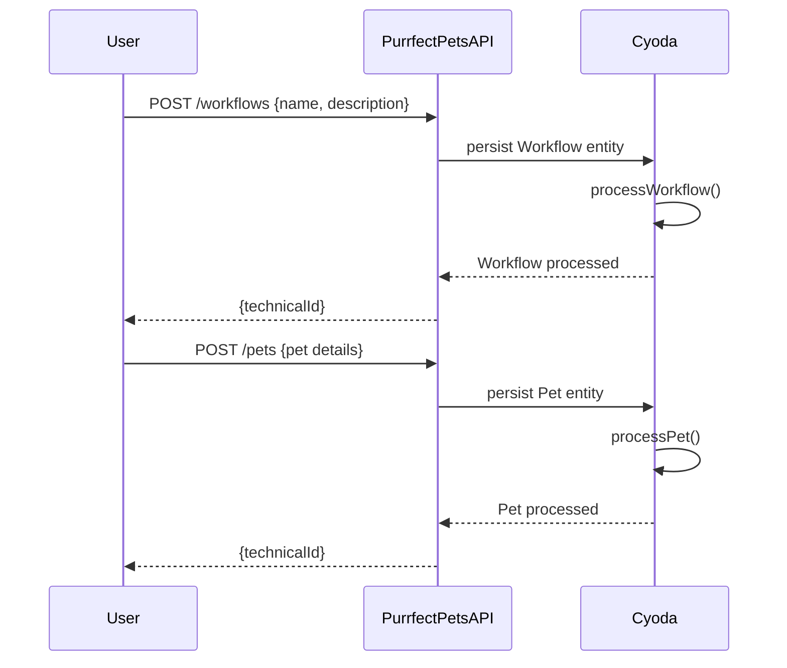

### 1. Entity Definitions

``` 
Workflow: 
- name: String (Name of the workflow instance, e.g. "PetOrderProcessing") 
- description: String (Optional description of the workflow purpose) 
- status: String (Current state, e.g. PENDING, RUNNING, COMPLETED, FAILED) 
- createdAt: String (ISO timestamp when workflow was created) 

Pet: 
- name: String (Pet's name) 
- category: String (Pet category, e.g. "Cat", "Dog") 
- photoUrls: List<String> (List of image URLs for the pet) 
- tags: List<String> (Tags/keywords associated with the pet) 
- status: String (Pet availability status, e.g. available, pending, sold) 

Order: 
- petId: String (Reference to the Pet entity) 
- quantity: Integer (Number of pets ordered) 
- shipDate: String (ISO timestamp for shipping date) 
- status: String (Order status, e.g. placed, approved, delivered) 
- complete: Boolean (Whether the order is complete) 
```

---

### 2. Process Method Flows

```
processWorkflow() Flow:
1. Initial State: Workflow created with PENDING status
2. Validation: Validate workflow configuration and initial parameters
3. Execution: Trigger orchestrated entity creations (e.g. Pet creation, Order placement)
4. Monitoring: Track progress of all involved entities
5. Completion: Mark workflow as COMPLETED or FAILED depending on results
6. Notification: Optionally send notifications or logs about workflow result

processPet() Flow:
1. Initial State: Pet entity created with status (available, pending, sold)
2. Validation: Validate pet fields (e.g. name not empty, valid category)
3. Business Logic: Assign default tags or photo URLs if missing, enrich data
4. Persistence: Save immutable pet entity version
5. Notification: Trigger downstream events if needed (e.g. notify inventory system)

processOrder() Flow:
1. Initial State: Order entity created with status (placed)
2. Validation: Check petId exists and quantity is positive
3. Business Logic: Calculate estimated ship date, verify stock availability
4. Persistence: Save immutable order entity version
5. Completion: Update order status to approved or rejected based on validation
6. Notification: Trigger shipment or billing workflows if approved
```

---

### 3. API Endpoints Design

| Entity    | POST Endpoint                  | POST Payload Example                        | Returns             | GET Endpoint (by technicalId)      | GET by Condition Endpoint (optional)                  |
|-----------|-------------------------------|--------------------------------------------|---------------------|-----------------------------------|-------------------------------------------------------|
| Workflow  | POST /workflows                | `{ "name": "PetOrderProcessing", "description": "..." }` | `{ "technicalId": "uuid" }` | GET /workflows/{technicalId}       | N/A                                                   |
| Pet       | POST /pets                    | `{ "name": "Mittens", "category": "Cat", "status": "available" }` | `{ "technicalId": "uuid" }` | GET /pets/{technicalId}            | GET /pets?status=available (optional)                 |
| Order     | POST /orders                  | `{ "petId": "uuid", "quantity": 2, "shipDate": "2024-07-01", "status": "placed" }` | `{ "technicalId": "uuid" }` | GET /orders/{technicalId}          | GET /orders?status=placed (optional)                  |

---

### 4. Request/Response Formats

**POST /pets Request Example:**

```json
{
  "name": "Whiskers",
  "category": "Cat",
  "photoUrls": ["https://example.com/photo1.jpg"],
  "tags": ["cute", "playful"],
  "status": "available"
}
```

**POST /pets Response Example:**

```json
{
  "technicalId": "123e4567-e89b-12d3-a456-426614174000"
}
```

**GET /pets/{technicalId} Response Example:**

```json
{
  "name": "Whiskers",
  "category": "Cat",
  "photoUrls": ["https://example.com/photo1.jpg"],
  "tags": ["cute", "playful"],
  "status": "available"
}
```

---

### Mermaid Diagrams

**Entity Lifecycle State Diagram**


```mermaid
stateDiagram-v2
    [*] --> Created
    Created --> Processing : processEntity()
    Processing --> Completed : success
    Processing --> Failed : error
    Completed --> [*]
    Failed --> [*]
```

**Event-Driven Processing Chain**


```mermaid
sequenceDiagram
    participant Client
    participant API
    participant Cyoda
    Client->>API: POST /pets {Pet data}
    API->>Cyoda: persist Pet entity
    Cyoda->>Cyoda: processPet()
    Cyoda-->>API: pet processed
    API-->>Client: {technicalId}
```

**User Interaction Sequence Flow**


```mermaid
sequenceDiagram
    participant User
    participant PurrfectPetsAPI
    User->>PurrfectPetsAPI: POST /workflows {name, description}
    PurrfectPetsAPI->>Cyoda: persist Workflow entity
    Cyoda->>Cyoda: processWorkflow()
    Cyoda-->>PurrfectPetsAPI: Workflow processed
    PurrfectPetsAPI-->>User: {technicalId}
    User->>PurrfectPetsAPI: POST /pets {pet details}
    PurrfectPetsAPI->>Cyoda: persist Pet entity
    Cyoda->>Cyoda: processPet()
    Cyoda-->>PurrfectPetsAPI: Pet processed
    PurrfectPetsAPI-->>User: {technicalId}
```

---

Please let me know if you need any further details or adjustments!