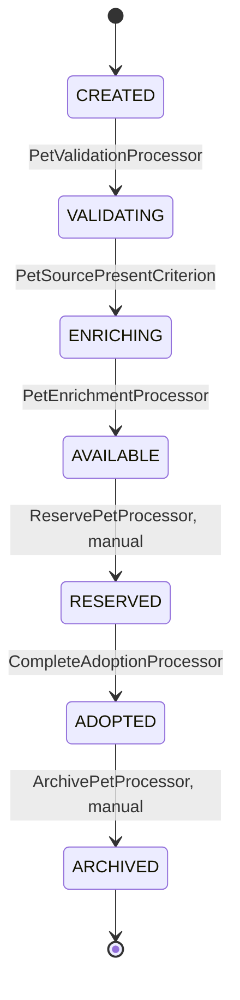
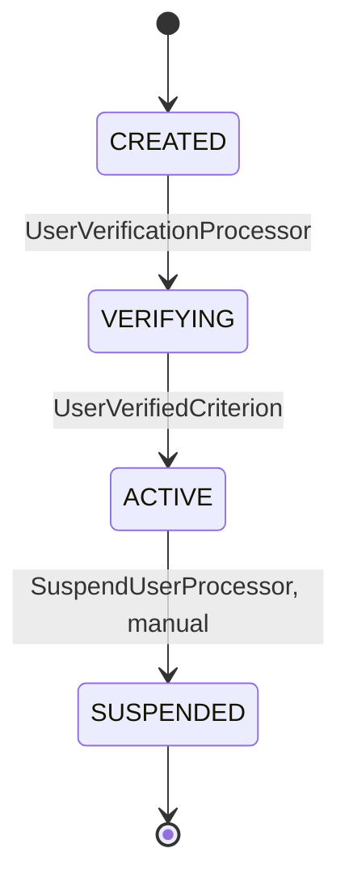
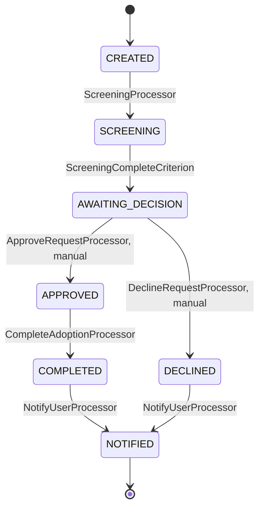

### 1. Entity Definitions
```
Pet:
- id: String (business id from source or local)
- name: String (pet name)
- species: String (dog/cat/...)
- breed: String (breed info)
- age: Integer (years/months)
- photos: Array(String) (urls)
- status: String (available/reserved/adopted/archived)
- description: String (notes)
- sourceId: String (Petstore source id if any)
- sourceUrl: String (origin URL)

User:
- id: String (business id)
- name: String (full name)
- email: String (contact)
- phone: String (contact phone)
- address: String (optional)
- status: String (new/verified/suspended)
- preferences: Array(String) (saved preferences)

AdoptionRequest:
- id: String (business id)
- petId: String (linked Pet.id)
- userId: String (linked User.id)
- requestedDate: String (ISO date)
- status: String (pending/screening/approved/declined/completed)
- notes: String (applicant notes)
```

### 2. Entity workflows

Pet workflow:
1. Created: Pet persisted (event)
2. Validation: automatic validation of fields
3. Enrichment: automatic enrich from source if sourceId present
4. Available: set to available for adoption
5. Reserved: manual when an adoption is approved
6. Adopted: automatic when adoption completed
7. Archived: manual cleanup


```mermaid
stateDiagram-v2
    [*] --> CREATED
    CREATED --> VALIDATING : PetValidationProcessor
    VALIDATING --> ENRICHING : PetSourcePresentCriterion
    ENRICHING --> AVAILABLE : PetEnrichmentProcessor
    AVAILABLE --> RESERVED : ReservePetProcessor, manual
    RESERVED --> ADOPTED : CompleteAdoptionProcessor
    ADOPTED --> ARCHIVED : ArchivePetProcessor, manual
    ARCHIVED --> [*]
```

Pet processors/criteria:
- Processors: PetValidationProcessor, PetEnrichmentProcessor, ReservePetProcessor, CompleteAdoptionProcessor, ArchivePetProcessor
- Criteria: PetSourcePresentCriterion, PetValidDataCriterion

User workflow:
1. Created: persisted
2. Verification: automatic/email/manual verification
3. Active: verified users can request adoptions
4. Suspended: manual/admin action


```mermaid
stateDiagram-v2
    [*] --> CREATED
    CREATED --> VERIFYING : UserVerificationProcessor
    VERIFYING --> ACTIVE : UserVerifiedCriterion
    ACTIVE --> SUSPENDED : SuspendUserProcessor, manual
    SUSPENDED --> [*]
```

User processors/criteria:
- Processors: UserVerificationProcessor, SuspendUserProcessor
- Criteria: UserVerifiedCriterion

AdoptionRequest workflow (orchestration):
1. Created: request persisted (event)
2. Screening: automatic background checks and document check
3. Decision: manual approval or decline
4. Completion: when approved and pet status updated to adopted
5. Notification: notify user and shelter


```mermaid
stateDiagram-v2
    [*] --> CREATED
    CREATED --> SCREENING : ScreeningProcessor
    SCREENING --> AWAITING_DECISION : ScreeningCompleteCriterion
    AWAITING_DECISION --> APPROVED : ApproveRequestProcessor, manual
    AWAITING_DECISION --> DECLINED : DeclineRequestProcessor, manual
    APPROVED --> COMPLETED : CompleteAdoptionProcessor
    COMPLETED --> NOTIFIED : NotifyUserProcessor
    NOTIFIED --> [*]
    DECLINED --> NOTIFIED : NotifyUserProcessor
```

AdoptionRequest processors/criteria:
- Processors: ScreeningProcessor, ApproveRequestProcessor, DeclineRequestProcessor, CompleteAdoptionProcessor, NotifyUserProcessor
- Criteria: ScreeningCompleteCriterion, PetAvailableCriterion

### 3. Pseudo code for processor classes
PetValidationProcessor:
```
class PetValidationProcessor {
  process(pet) {
    ensure required fields present
    if invalid emit ValidationFailed event
    else mark pet.valid = true
  }
}
```
PetEnrichmentProcessor:
```
class PetEnrichmentProcessor {
  process(pet) {
    if pet.sourceId present
      fetch minimal source metadata via Cyoda configured connector
      merge fields into pet (photos, description)
  }
}
```
ScreeningProcessor:
```
class ScreeningProcessor {
  process(request) {
    verify user status via User datastore
    check PetAvailableCriterion
    run basic checks (contact info present)
    mark request.screening = done
  }
}
```
ApproveRequestProcessor:
```
class ApproveRequestProcessor {
  process(request) {
    set request.status = approved
    emit ReservePet event (triggers ReservePetProcessor)
  }
}
```
CompleteAdoptionProcessor:
```
class CompleteAdoptionProcessor {
  process(request) {
    update Pet.status = adopted
    set request.status = completed
    emit Notification events
  }
}
```

### 4. API Endpoints Design Rules (per Cyoda EDA)
- POST endpoints create entity events and must return only technicalId.
- GET by technicalId for all POST-created entities.
- GET by condition only if requested (not included).

Endpoints:

1) Create Pet
POST /pets
Request:
```json
{
  "id":"string",
  "name":"string",
  "species":"string",
  "breed":"string",
  "age":3,
  "photos":["string"],
  "description":"string",
  "sourceId":"string",
  "sourceUrl":"string"
}
```
Response:
```json
{ "technicalId":"string" }
```
GET /pets/{technicalId}
Response:
```json
{
  "technicalId":"string",
  "entity": { /* Pet fields as above */ }
}
```

2) Create User
POST /users
Request:
```json
{
  "id":"string",
  "name":"string",
  "email":"string",
  "phone":"string",
  "address":"string",
  "preferences":["string"]
}
```
Response:
```json
{ "technicalId":"string" }
```
GET /users/{technicalId}
Response:
```json
{
  "technicalId":"string",
  "entity": { /* User fields */ }
}
```

3) Create AdoptionRequest (orchestration)
POST /adoptionRequests
Request:
```json
{
  "id":"string",
  "petId":"string",
  "userId":"string",
  "requestedDate":"2025-01-01T00:00:00Z",
  "notes":"string"
}
```
Response:
```json
{ "technicalId":"string" }
```
GET /adoptionRequests/{technicalId}
Response:
```json
{
  "technicalId":"string",
  "entity": { /* AdoptionRequest fields */ }
}
```

Notes
- Each POST triggers Cyoda to start that entity workflow (processors/criteria listed).
- If you want a dedicated PetSyncJob orchestration for scheduled Petstore ingestion we can replace one entity or add up to 10 entities — tell me if you want to expand.