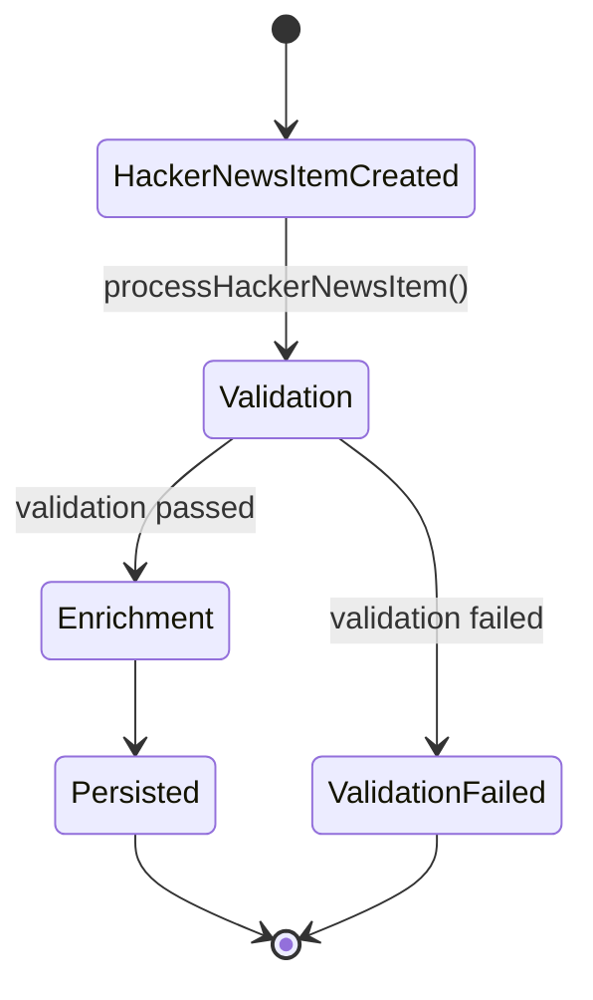
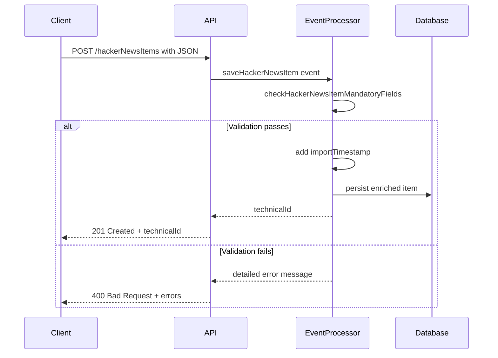
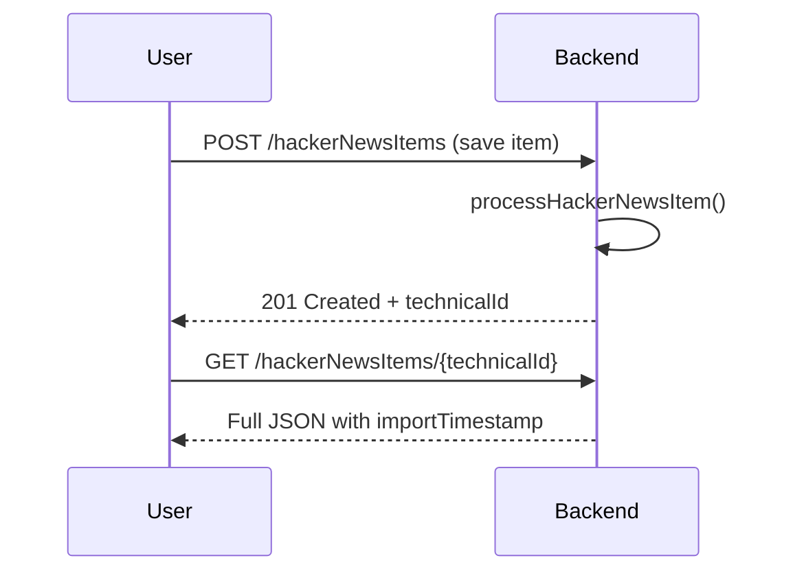

### 1. Entity Definitions

``` 
HackerNewsItem:
- id: Long (unique identifier from Hacker News)
- type: String (item type, e.g., story, comment)
- jsonData: String (full JSON payload as received, except importTimestamp)
- importTimestamp: String (ISO 8601 timestamp when item was saved)
```

### 2. Process Method Flows

``` 
processHackerNewsItem() Flow:
1. Initial State: HackerNewsItem entity created (immutable)
2. Validation: Invoke checkHackerNewsItemMandatoryFields to ensure 'id' and 'type' are present; if missing, reject with detailed errors
3. Enrichment: Add importTimestamp (current time in ISO 8601)
4. Persistence: Save the enriched HackerNewsItem entity with full JSON data including importTimestamp
5. Completion: Return technicalId for the stored entity
```

### 3. API Endpoints Design

| Method | Endpoint             | Purpose                                     | Request Body                      | Response                      |
|--------|----------------------|---------------------------------------------|---------------------------------|-------------------------------|
| POST   | /hackerNewsItems     | Create/save HackerNewsItem (triggers event) | JSON of HackerNewsItem without importTimestamp | `{ "technicalId": "<generated-id>" }` |
| GET    | /hackerNewsItems/{technicalId} | Retrieve stored HackerNewsItem by technicalId | -                               | Full JSON including importTimestamp |

- Only POST and GET endpoints as per EDA principles.
- No update or delete endpoints.
- POST returns only technicalId.
- GET returns full stored JSON.

### 4. Request/Response Formats

**POST /hackerNewsItems**  
_Request Body Example:_

```json
{
  "id": 8863,
  "type": "story",
  "by": "dhouston",
  "time": 1175714200,
  "text": "Example story text",
  "url": "https://example.com/story"
}
```

_Response Body Example:_

```json
{
  "technicalId": "abc123xyz"
}
```

**GET /hackerNewsItems/{technicalId}**  
_Response Body Example:_

```json
{
  "id": 8863,
  "type": "story",
  "by": "dhouston",
  "time": 1175714200,
  "text": "Example story text",
  "url": "https://example.com/story",
  "importTimestamp": "2024-04-27T15:30:00Z"
}
```

### 5. Mermaid Diagrams

**Entity Lifecycle State Diagram**


```mermaid
stateDiagram-v2
    [*] --> HackerNewsItemCreated
    HackerNewsItemCreated --> Validation : processHackerNewsItem()
    Validation --> Enrichment : validation passed
    Validation --> ValidationFailed : validation failed
    Enrichment --> Persisted
    Persisted --> [*]
    ValidationFailed --> [*]
```

**Event-Driven Processing Chain**


```mermaid
sequenceDiagram
    participant Client
    participant API
    participant EventProcessor
    Client->>API: POST /hackerNewsItems with JSON
    API->>EventProcessor: saveHackerNewsItem event
    EventProcessor->>EventProcessor: checkHackerNewsItemMandatoryFields
    alt Validation passes
        EventProcessor->>EventProcessor: add importTimestamp
        EventProcessor->>Database: persist enriched item
        EventProcessor-->>API: technicalId
        API-->>Client: 201 Created + technicalId
    else Validation fails
        EventProcessor-->>API: detailed error message
        API-->>Client: 400 Bad Request + errors
    end
```

**User Interaction Sequence Flow**


```mermaid
sequenceDiagram
    participant User
    participant Backend
    User->>Backend: POST /hackerNewsItems (save item)
    Backend->>Backend: processHackerNewsItem()
    Backend-->>User: 201 Created + technicalId
    User->>Backend: GET /hackerNewsItems/{technicalId}
    Backend-->>User: Full JSON with importTimestamp
```

---

This completes the confirmed functional requirements specification for your Hacker News item storage service using Event-Driven Architecture on Cyoda.

If you need further refinements or next steps, feel free to ask!