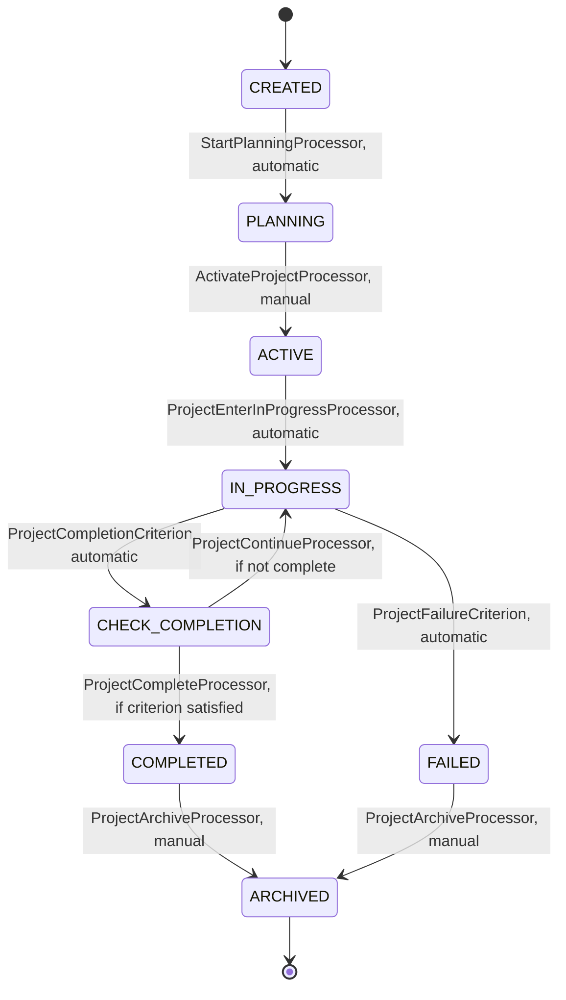
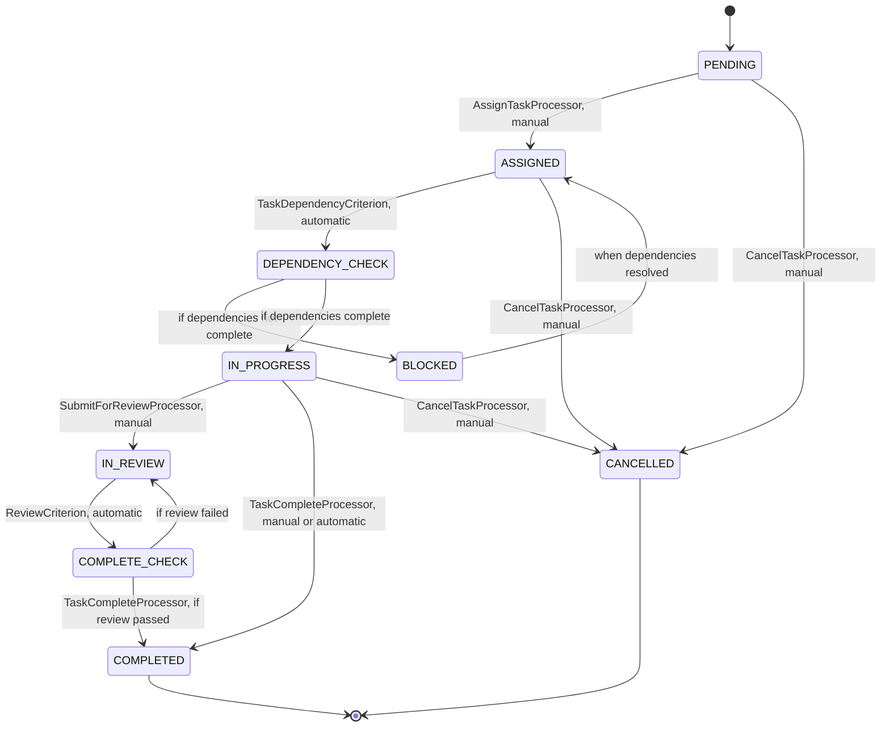
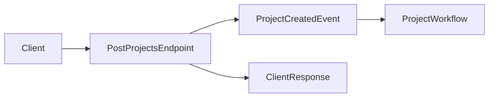
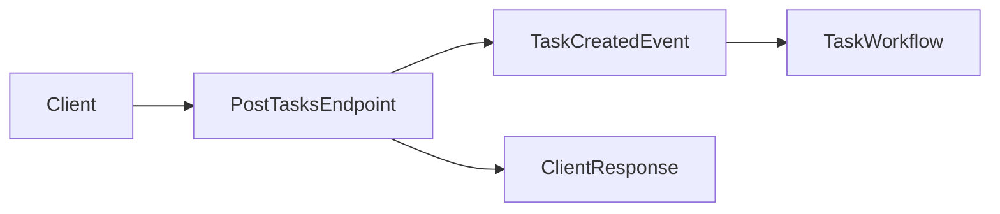
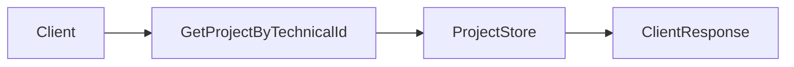
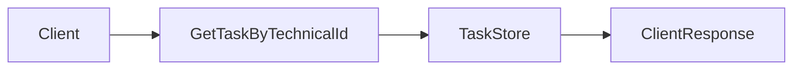

### Entity Definitions

Project:
- id: String (business identifier for the project)
- name: String (project title)
- description: String (project description and goals)
- startDate: String (ISO 8601 start date)
- endDate: String (ISO 8601 end date)
- status: String (current lifecycle status of the project, e.g., created, planning, active, completed, archived)
- ownerId: String (reference id for the project owner)
- createdAt: String (ISO 8601 datetime when the entity was created)
- updatedAt: String (ISO 8601 datetime when the entity was last updated)
- metadata: Object (freeform key/value map for custom attributes)

Task:
- id: String (business identifier for the task)
- projectId: String (reference to the parent project.id)
- title: String (task title)
- description: String (task description)
- status: String (current lifecycle status of the task, e.g., pending, assigned, in_progress, in_review, completed, cancelled)
- assigneeId: String (reference id to the person assigned; may be null)
- dueDate: String (ISO 8601 due date; may be null)
- priority: String (priority label, e.g., low/medium/high)
- dependencies: Array(String) (list of task ids that must complete before this task starts)
- createdAt: String (ISO 8601 datetime when the entity was created)
- updatedAt: String (ISO 8601 datetime when the entity was last updated)
- metadata: Object (freeform key/value map for custom attributes)

---

## Entity Workflows

Project workflow:
1. Initial State: Project persisted with status created (automatic on POST)
2. Planning: Team populates tasks, milestones and scope (manual)
3. Activate: Project moved to active when planning completed (manual) or when a StartProjectProcessor is triggered (automatic)
4. In Progress: Tasks are being executed; project monitors aggregated task progress (automatic)
5. Completion Check: ProjectCompletionCriterion monitors if all tasks are completed (automatic)
6. Completed: If completion criterion satisfied, transition to completed (automatic)
7. Archive: Project can be archived by user or archived automatically after retention period (manual or automatic)
8. Failed/Cancelled: Manual cancellation or automatic failure if critical blockers persist beyond threshold (manual/automatic)
9. Notifications: On major transitions send notifications (automatic)

Project state diagram

```mermaid
stateDiagram-v2
    [*] --> CREATED
    CREATED --> PLANNING : StartPlanningProcessor, automatic
    PLANNING --> ACTIVE : ActivateProjectProcessor, manual
    ACTIVE --> IN_PROGRESS : ProjectEnterInProgressProcessor, automatic
    IN_PROGRESS --> CHECK_COMPLETION : ProjectCompletionCriterion, automatic
    CHECK_COMPLETION --> COMPLETED : ProjectCompleteProcessor, if criterion satisfied
    CHECK_COMPLETION --> IN_PROGRESS : ProjectContinueProcessor, if not complete
    COMPLETED --> ARCHIVED : ProjectArchiveProcessor, manual
    IN_PROGRESS --> FAILED : ProjectFailureCriterion, automatic
    FAILED --> ARCHIVED : ProjectArchiveProcessor, manual
    ARCHIVED --> [*]
```

Project processors and criteria (brief)
- ProjectCompletionCriterion
  - Purpose: Check aggregated state of tasks for this project (all tasks status == completed)
  - Pseudo:
    - boolean evaluate(Project p) {
      List<Task> tasks = TaskRepository.findByProjectId(p.id);
      return tasks.size() > 0 && tasks.stream().allMatch(t -> t.status.equals("completed"));
    }
- ProjectCompleteProcessor
  - Purpose: Mark project as completed, set completedAt, trigger notifications
  - Pseudo:
    - void process(Project p) {
      p.status = "completed";
      p.updatedAt = now();
      ProjectRepository.save(p);
      NotificationService.notifyProjectCompleted(p.id);
    }
- StartPlanningProcessor
  - Purpose: Initialize default milestones/metadata when project created
  - Pseudo:
    - void process(Project p) {
      initializeDefaultMilestones(p.id);
      p.status = "planning";
      ProjectRepository.save(p);
    }
- ProjectArchiveProcessor
  - Purpose: Archive project and cleanup ephemeral resources
  - Pseudo:
    - void process(Project p) {
      p.status = "archived";
      p.updatedAt = now();
      ProjectRepository.save(p);
      StorageService.moveProjectFilesToArchive(p.id);
    }
- ProjectFailureCriterion
  - Purpose: Detect repeated critical failures/blockers beyond threshold
  - Pseudo:
    - boolean evaluate(Project p) { return p.metadata.failureCount > threshold; }

---

Task workflow:
1. Initial State: Task persisted with status pending (automatic on POST)
2. Assignment: Task can be assigned to a user (manual via AssignTaskProcessor)
3. Dependency Check: On assignment/start, TaskDependencyCriterion verifies dependencies completed (automatic)
4. Start Work: When assignee starts task, transition to in_progress (manual)
5. In Progress Processing: Work occurs; periodic TaskProgressMonitorProcessor may update progress (automatic)
6. Review: If task requires review then transition to in_review (manual)
7. Complete: When work and review criteria met transition to completed (automatic/manual)
8. Cancel: Task may be cancelled manually (manual)
9. Overdue Handling: TaskDueDateMonitorProcessor marks overdue and triggers notifications (automatic)
10. Notifications: On assignment, completion, overdue, and cancellations send notifications (automatic)

Task state diagram

```mermaid
stateDiagram-v2
    [*] --> PENDING
    PENDING --> ASSIGNED : AssignTaskProcessor, manual
    ASSIGNED --> DEPENDENCY_CHECK : TaskDependencyCriterion, automatic
    DEPENDENCY_CHECK --> BLOCKED : if dependencies not complete
    DEPENDENCY_CHECK --> IN_PROGRESS : if dependencies complete
    BLOCKED --> ASSIGNED : when dependencies resolved
    IN_PROGRESS --> IN_REVIEW : SubmitForReviewProcessor, manual
    IN_REVIEW --> COMPLETE_CHECK : ReviewCriterion, automatic
    COMPLETE_CHECK --> COMPLETED : TaskCompleteProcessor, if review passed
    COMPLETE_CHECK --> IN_REVIEW : if review failed
    IN_PROGRESS --> COMPLETED : TaskCompleteProcessor, manual or automatic
    PENDING --> CANCELLED : CancelTaskProcessor, manual
    ASSIGNED --> CANCELLED : CancelTaskProcessor, manual
    IN_PROGRESS --> CANCELLED : CancelTaskProcessor, manual
    COMPLETED --> [*]
    CANCELLED --> [*]
```

Task processors and criteria (brief)
- TaskDependencyCriterion
  - Purpose: Ensure all dependency task ids are completed
  - Pseudo:
    - boolean evaluate(Task t) {
      for id in t.dependencies:
        Task dep = TaskRepository.findById(id);
        if dep == null or dep.status != "completed": return false;
      return true;
    }
- AssignTaskProcessor
  - Purpose: Set assigneeId, set status assigned, notify assignee
  - Pseudo:
    - void process(Task t, String assignee) {
      t.assigneeId = assignee;
      t.status = "assigned";
      t.updatedAt = now();
      TaskRepository.save(t);
      NotificationService.notifyAssignee(t.id, assignee);
    }
- TaskCompleteProcessor
  - Purpose: Mark task completed, propagate to project completion criterion
  - Pseudo:
    - void process(Task t) {
      t.status = "completed";
      t.updatedAt = now();
      TaskRepository.save(t);
      EventBus.emit(ProjectCompletionEvent for t.projectId);
      NotificationService.notifyTaskCompleted(t.id);
    }
- TaskDueDateMonitorProcessor
  - Purpose: Periodic job that detects overdue tasks and updates status/notifications
  - Pseudo:
    - void process() {
      List<Task> overdue = TaskRepository.findWhere(dueDate < now() && status not in completed,cancelled);
      for t in overdue:
        t.metadata.overdueNotified = true;
        TaskRepository.save(t);
        NotificationService.notifyOverdue(t.id);
    }
- SubmitForReviewProcessor
  - Purpose: Transition task to in_review and assign reviewers if needed
  - Pseudo:
    - void process(Task t) {
      t.status = "in_review";
      TaskRepository.save(t);
      NotificationService.notifyReviewers(t.id);
    }

---

## API Endpoints (EDA rules applied)

Base URL: https://api.taskmanager.com/v1
Authentication: Authorization: Bearer <token>

Design rules applied:
- POST endpoints create entities and emit events. POST responses return only technicalId.
- All created entities expose GET by technicalId to retrieve stored results.
- GET endpoints are read-only and return stored application results.
- GET by condition not included (not explicitly requested).
- GET all endpoints are included as optional read endpoints.

Endpoints summary:
- POST /projects
  - Purpose: Create Project entity (triggers Project workflow)
  - Request JSON:
    {
      "name": "Website Redesign",
      "description": "Redesign the corporate website",
      "startDate": "2025-03-01",
      "endDate": "2025-04-01",
      "ownerId": "user-123",
      "metadata": {}
    }
  - Response JSON (must contain only technicalId):
    {
      "technicalId": "proj-tech-0001"
    }
  - Behavior: Persist Project, then event emitted to start Project workflow (StartPlanningProcessor invoked automatically).

- GET /projects/{technicalId}
  - Purpose: Retrieve stored Project result by technicalId
  - Response JSON:
    {
      "technicalId": "proj-tech-0001",
      "id": "PRJ-001",
      "name": "Website Redesign",
      "description": "Redesign the corporate website",
      "startDate": "2025-03-01",
      "endDate": "2025-04-01",
      "status": "planning",
      "ownerId": "user-123",
      "createdAt": "2025-02-01T12:00:00Z",
      "updatedAt": "2025-02-02T09:00:00Z",
      "metadata": {}
    }

- GET /projects
  - Purpose: Optional: list stored projects (read-only)
  - Response JSON:
    [
      { project JSON objects as above }
    ]

- POST /projects/{projectTechnicalId}/tasks
  - Purpose: Create Task entity under a project (triggers Task workflow)
  - Request JSON:
    {
      "title": "Design Homepage",
      "description": "Create a modern homepage design",
      "assigneeId": "user-234",
      "dueDate": "2025-03-15",
      "priority": "high",
      "dependencies": [],
      "metadata": {}
    }
  - Response JSON (only technicalId):
    {
      "technicalId": "task-tech-0001"
    }
  - Behavior: Persist Task, emit TaskCreatedEvent which starts Task workflow (initial processors run, e.g., TaskDependencyCriterion evaluation and StartAssignmentProcessor if provided).

- GET /tasks/{technicalId}
  - Purpose: Retrieve stored Task result by technicalId
  - Response JSON:
    {
      "technicalId": "task-tech-0001",
      "id": "TASK-001",
      "projectId": "PRJ-001",
      "title": "Design Homepage",
      "description": "Create a modern homepage design",
      "status": "pending",
      "assigneeId": "user-234",
      "dueDate": "2025-03-15",
      "priority": "high",
      "dependencies": [],
      "createdAt": "2025-02-10T10:00:00Z",
      "updatedAt": "2025-02-10T10:00:00Z",
      "metadata": {}
    }

- GET /projects/{projectTechnicalId}/tasks
  - Purpose: Optional: list tasks for a project (read-only)
  - Response JSON:
    [
      { task JSON objects as above }
    ]

- PUT /projects/{technicalId}
  - Purpose: Update project (read/write) — allowed but not used to trigger orchestration; updates persist and may trigger workflow processors if modified fields are relevant (e.g., status)
  - Request/Response: full project object; response returns full stored project JSON (not technicalId only because POST-only rule applies to creation)

- PUT /tasks/{technicalId}, PATCH /tasks/{technicalId}, DELETE /tasks/{technicalId}, DELETE /projects/{technicalId}
  - Purpose: Update/partial update/delete stored entities (read/write). These operations persist changes and may emit events that drive workflow transitions (e.g., cancellation emits TaskCancelledEvent).

Note: All POST create endpoints MUST return only the field technicalId in the response body.

---

## Request/Response Visualizations (Mermaid)

POST /projects request/response

```mermaid
flowchart LR
    Client --> PostProjectsEndpoint
    PostProjectsEndpoint --> ProjectCreatedEvent
    ProjectCreatedEvent --> ProjectWorkflow
    PostProjectsEndpoint --> ClientResponse
```

POST /projects/{projectTechnicalId}/tasks request/response

```mermaid
flowchart LR
    Client --> PostTasksEndpoint
    PostTasksEndpoint --> TaskCreatedEvent
    TaskCreatedEvent --> TaskWorkflow
    PostTasksEndpoint --> ClientResponse
```

GET /projects/{technicalId} read flow

```mermaid
flowchart LR
    Client --> GetProjectByTechnicalId
    GetProjectByTechnicalId --> ProjectStore
    ProjectStore --> ClientResponse
```

GET /tasks/{technicalId} read flow

```mermaid
flowchart LR
    Client --> GetTaskByTechnicalId
    GetTaskByTechnicalId --> TaskStore
    TaskStore --> ClientResponse
```

Note: In all above diagrams, PostProjectsEndpoint returns only a JSON object with technicalId and no additional fields.

---

## Event and Processing Summary

- Events emitted on persistence:
  - ProjectCreatedEvent -> triggers StartPlanningProcessor and initial workflow for project.
  - TaskCreatedEvent -> triggers TaskDependencyCriterion and initial Task workflow.
  - TaskUpdatedEvent / TaskCancelledEvent / TaskCompletedEvent -> triggers relevant processors (e.g., ProjectCompletionCriterion evaluation).
- Event Bus: reliable internal event bus required (e.g., Kafka, RabbitMQ) — implementation detail left to infra.
- Periodic processors (cron or scheduled workers):
  - TaskDueDateMonitorProcessor
  - ProjectRetentionArchiveProcessor

---

## Required Criterion and Processor Class List (per entity)

Project:
- Criteria:
  - ProjectCompletionCriterion
  - ProjectFailureCriterion
- Processors:
  - StartPlanningProcessor
  - ActivateProjectProcessor
  - ProjectEnterInProgressProcessor
  - ProjectCompleteProcessor
  - ProjectArchiveProcessor

Task:
- Criteria:
  - TaskDependencyCriterion
  - ReviewCriterion
- Processors:
  - AssignTaskProcessor
  - SubmitForReviewProcessor
  - TaskCompleteProcessor
  - CancelTaskProcessor
  - TaskDueDateMonitorProcessor
  - TaskProgressMonitorProcessor

Example pseudo-code (Java-like) for a processor

AssignTaskProcessor pseudo:
```
class AssignTaskProcessor {
    void process(Task t, String assigneeId) {
        t.assigneeId = assigneeId;
        t.status = "assigned";
        t.updatedAt = Instant.now().toString();
        TaskRepository.save(t);
        EventBus.emit(new TaskAssignedEvent(t.technicalId, assigneeId));
        NotificationService.notifyUser(assigneeId, "You have been assigned task " + t.id);
    }
}
```

TaskDependencyCriterion pseudo:
```
class TaskDependencyCriterion {
    boolean evaluate(Task t) {
        for(String depId : t.dependencies) {
            Task dep = TaskRepository.findById(depId);
            if(dep == null || !dep.status.equals("completed")) return false;
        }
        return true;
    }
}
```

ProjectCompletionCriterion pseudo:
```
class ProjectCompletionCriterion {
    boolean evaluate(Project p) {
        List<Task> tasks = TaskRepository.findByProjectId(p.id);
        if(tasks.isEmpty()) return false;
        return tasks.stream().allMatch(t -> t.status.equals("completed"));
    }
}
```

---

Please review the generated entities and workflows. If you need any changes, please let me know. Feel free to click Approve if this requirement meets your expectations or if you are ready to proceed.