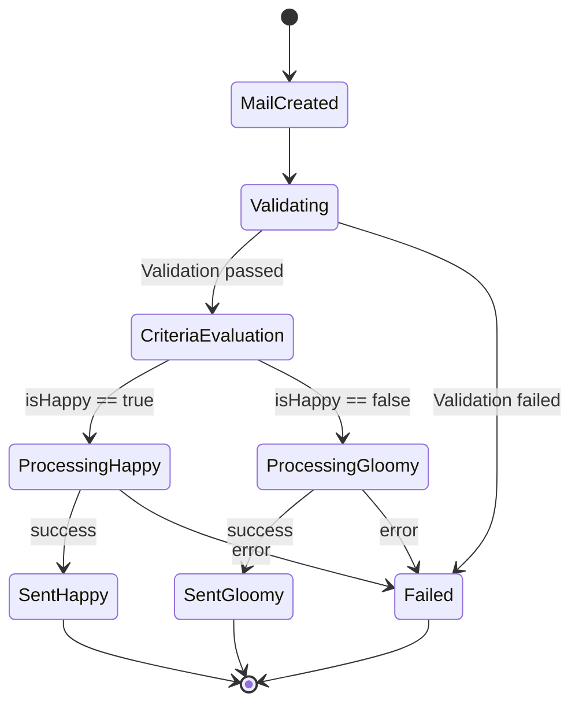
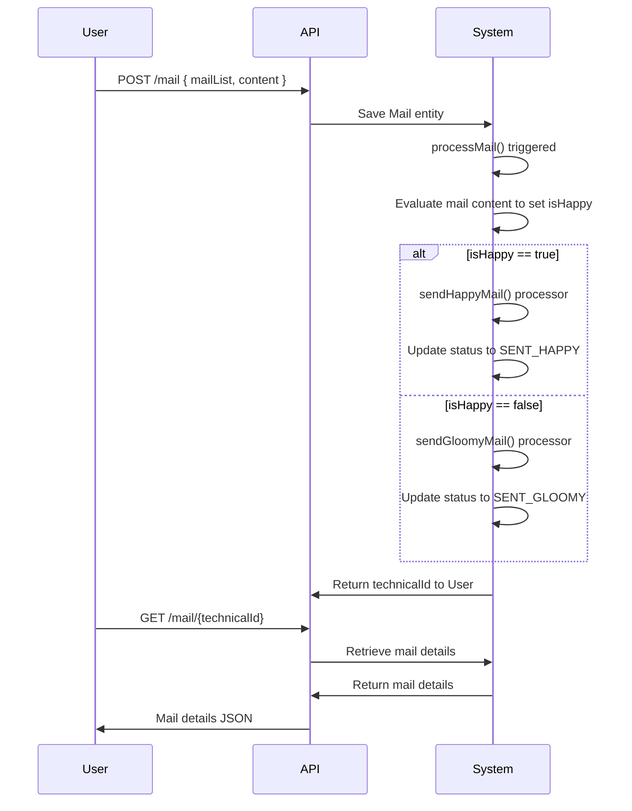

### 1. Entity Definitions

``` 
Mail:
- isHappy: Boolean (Indicates if the mail is happy or gloomy)
- mailList: List<String> (List of recipient email addresses)
- content: String (Mail content used for determining happy or gloomy)
- status: String (Processing status: e.g., PENDING, SENT_HAPPY, SENT_GLOOMY, FAILED)
```

### 2. Process Method Flows

```
processMail() Flow:
1. Initial State: Mail entity created with status = PENDING
2. Validation: Optionally check mailList is not empty and content is present
3. Criteria Evaluation: Determine if mail is happy or gloomy based on the content analysis (e.g., keyword or sentiment based)
4. Update isHappy flag accordingly (true = happy, false = gloomy)
5. Processing:
   - If isHappy == true → call sendHappyMail() processor to send happy mail
   - If isHappy == false → call sendGloomyMail() processor to send gloomy mail
6. Completion:
   - On success: update status to SENT_HAPPY or SENT_GLOOMY accordingly
   - On failure: update status to FAILED
7. Notification: Optional event or log indicating mail has been processed
```

---

### 3. API Endpoints Design

- **POST /mail**  
  - Creates a new `Mail` entity (immutable creation)  
  - Triggers `processMail()` event automatically  
  - Request body contains `mailList` and `content` (no `isHappy` or `status` input)  
  - Response: `{ "technicalId": "<generated_id>" }`

- **GET /mail/{technicalId}**  
  - Retrieves mail entity details and status by `technicalId`

- **No update or delete endpoints** (to keep immutable design)

---

### 4. Request / Response Formats

**POST /mail Request**  
```json
{
  "mailList": ["recipient1@example.com", "recipient2@example.com"],
  "content": "Today is a wonderful day! Stay happy."
}
```

**POST /mail Response**  
```json
{
  "technicalId": "abc123"
}
```

**GET /mail/{technicalId} Response**  
```json
{
  "technicalId": "abc123",
  "isHappy": true,
  "mailList": ["recipient1@example.com", "recipient2@example.com"],
  "content": "Today is a wonderful day! Stay happy.",
  "status": "SENT_HAPPY"
}
```

---

### Visual Representations

**Mail Entity Lifecycle State Diagram**


```mermaid
stateDiagram-v2
    [*] --> MailCreated
    MailCreated --> Validating
    Validating --> CriteriaEvaluation : Validation passed
    Validating --> Failed : Validation failed
    CriteriaEvaluation --> ProcessingHappy : isHappy == true
    CriteriaEvaluation --> ProcessingGloomy : isHappy == false
    ProcessingHappy --> SentHappy : success
    ProcessingHappy --> Failed : error
    ProcessingGloomy --> SentGloomy : success
    ProcessingGloomy --> Failed : error
    SentHappy --> [*]
    SentGloomy --> [*]
    Failed --> [*]
```

**Event-Driven Processing Chain**

```mermaid
flowchart TD
    A[POST /mail - Create Mail] --> B[Save Mail Entity]
    B --> C[Trigger processMail() Event]
    C --> D{Evaluate mail content}
    D -->|Happy| E[sendHappyMail() Processor]
    D -->|Gloomy| F[sendGloomyMail() Processor]
    E --> G[Update status SENT_HAPPY]
    F --> H[Update status SENT_GLOOMY]
    G --> I[Notify Success]
    H --> I[Notify Success]
```

**User Interaction Sequence Flow**


```mermaid
sequenceDiagram
    participant User
    participant API
    participant System

    User->>API: POST /mail { mailList, content }
    API->>System: Save Mail entity
    System->>System: processMail() triggered
    System->>System: Evaluate mail content to set isHappy
    alt isHappy == true
        System->>System: sendHappyMail() processor
        System->>System: Update status to SENT_HAPPY
    else isHappy == false
        System->>System: sendGloomyMail() processor
        System->>System: Update status to SENT_GLOOMY
    end
    System->>API: Return technicalId to User
    User->>API: GET /mail/{technicalId}
    API->>System: Retrieve mail details
    System->>API: Return mail details
    API->>User: Mail details JSON
```

---

This completes the confirmed functional requirements for your Happy Mails application following the Event-Driven Architecture principles on Cyoda platform.