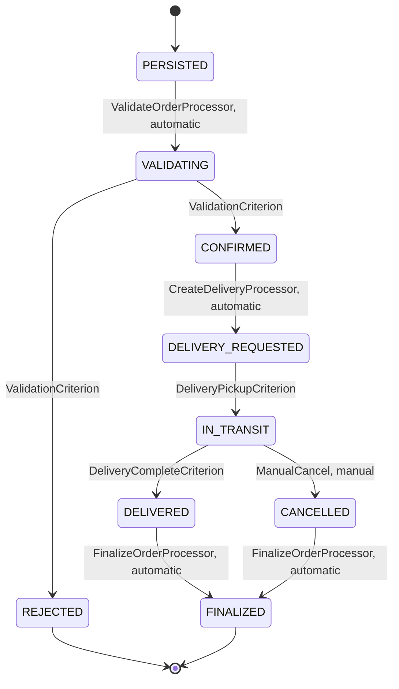
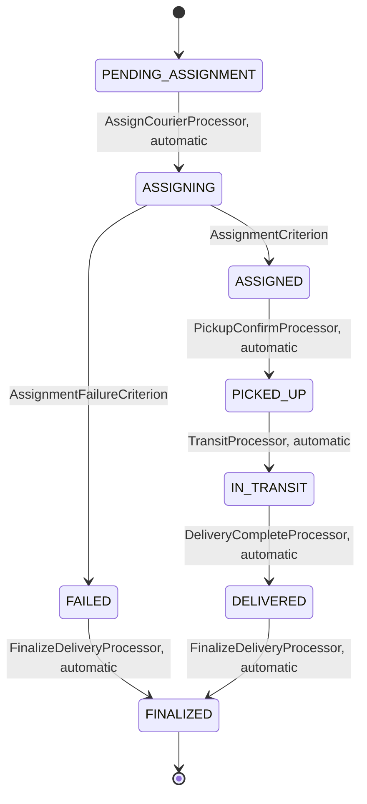
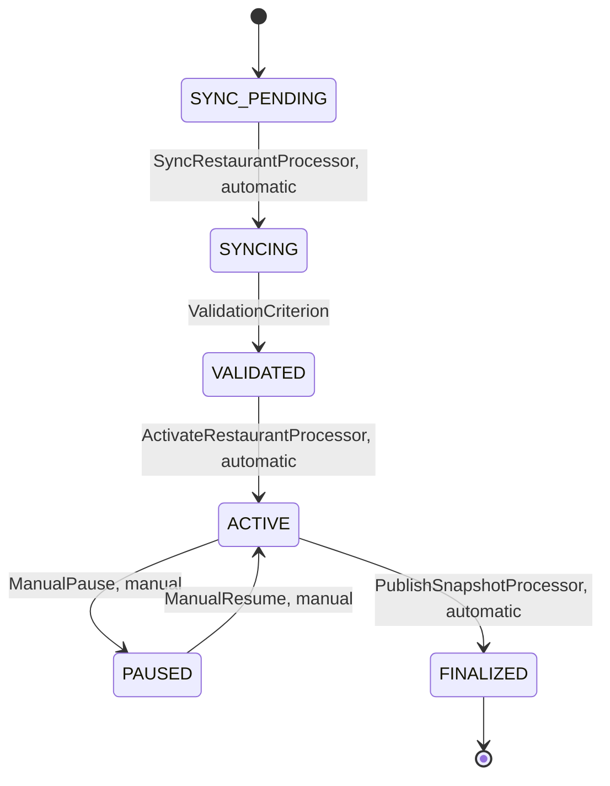

### 1. Entity Definitions

```
Order:
- orderId: String (external order identifier from partner/merchant)
- customerId: String (customer identifier)
- restaurantId: String (merchant/restaurant identifier)
- items: Array(Object) (list of ordered items with itemId, name, quantity, price)
- totalAmount: Number (order total)
- deliveryAddress: String (full delivery address)
- status: String (current business status, e.g., PENDING/CONFIRMED/IN_TRANSIT/DELIVERED/CANCELLED)
- placedAt: String (ISO timestamp when order was created)
- paymentStatus: String (payment related status)
- metadata: Object (free-form additional data)
```

```
DeliveryJob:
- deliveryRequestId: String (external or internal id for the delivery request)
- orderId: String (linked Order.orderId)
- courierId: String (assigned courier identifier; may be null at creation)
- pickupEtaMinutes: Number (estimated minutes to pickup)
- deliveryEtaMinutes: Number (estimated minutes to delivery)
- status: String (job lifecycle status)
- createdAt: String (ISO timestamp)
- lastUpdatedAt: String (ISO timestamp)
- routeInfo: Object (pickup/drop coordinates and routing hints)
- failureReason: String (optional description if job failed)
```

```
Restaurant:
- restaurantId: String (external or internal id)
- name: String (restaurant name)
- address: String (restaurant address)
- phone: String (contact phone)
- openingHours: String (human readable hours)
- status: String (active/paused/closed)
- menuSnapshot: Object (cached menu data or pointer)
- metadata: Object (free-form)
- lastSyncedAt: String (ISO timestamp of last data sync)
```

---

### 2. Entity workflows

Order workflow:
1. Initial State: Order persisted by POST → status = PENDING (automatic)
2. Validation: Validate items, payment status and restaurant availability (automatic)
3. Confirmation: If valid set status = CONFIRMED; if invalid set status = REJECTED (automatic)
4. Delivery Request: On CONFIRMED create DeliveryJob (automatic, triggers DeliveryJob POST/event)
5. In-Progress: Order moves to IN_TRANSIT when DeliveryJob reports pickup (automatic)
6. Completion: Order moves to DELIVERED when DeliveryJob reports delivered (automatic)
7. Exception/Manual: Customer support may CANCEL or REOPEN orders (manual)
8. Finalization: Update records, notify stakeholders (automatic)

Mermaid state diagram for Order:

```mermaid
stateDiagram-v2
    [*] --> PERSISTED
    PERSISTED --> VALIDATING : ValidateOrderProcessor, automatic
    VALIDATING --> CONFIRMED : ValidationCriterion
    VALIDATING --> REJECTED : ValidationCriterion
    CONFIRMED --> DELIVERY_REQUESTED : CreateDeliveryProcessor, automatic
    DELIVERY_REQUESTED --> IN_TRANSIT : DeliveryPickupCriterion
    IN_TRANSIT --> DELIVERED : DeliveryCompleteCriterion
    IN_TRANSIT --> CANCELLED : ManualCancel, manual
    REJECTED --> [*]
    DELIVERED --> FINALIZED : FinalizeOrderProcessor, automatic
    FINALIZED --> [*]
    CANCELLED --> FINALIZED : FinalizeOrderProcessor, automatic
```

Order processors & criteria
- Processors:
  - ValidateOrderProcessor: checks item availability, price sanity, payment status
  - CreateDeliveryProcessor: emits event to create DeliveryJob for confirmed orders
  - FinalizeOrderProcessor: closes order, triggers notifications and analytics
- Criteria:
  - ValidationCriterion: determines if order is valid (returns true/false)
  - DeliveryPickupCriterion: checks if a delivery job reported pickup
  - DeliveryCompleteCriterion: checks if delivery job reported completed

Example pseudo code (processor):
```text
class ValidateOrderProcessor {
  void process(Order order) {
    if (!itemsExist(order.items) || !paymentOk(order.paymentStatus)) {
      order.status = REJECTED;
    } else {
      order.status = CONFIRMED;
    }
    persist(order);
  }
}
```

DeliveryJob workflow:
1. Initial State: DeliveryJob persisted by POST (created by CreateDeliveryProcessor or external) → PENDING_ASSIGNMENT
2. Assignment: Attempt to assign courier(s) (automatic)
3. Accepted: Courier accepts and job becomes ASSIGNED (automatic)
4. Pickup: Courier confirms PICKED_UP (automatic)
5. Transit: Courier enroute to customer (automatic)
6. Delivered: Courier confirms DELIVERED → COMPLETED (automatic)
7. Failure/Exception: If no courier found or errors occur → FAILED (automatic or manual)
8. Post-processing: Record metrics, notify order and partners (automatic)

Mermaid state diagram for DeliveryJob:

```mermaid
stateDiagram-v2
    [*] --> PENDING_ASSIGNMENT
    PENDING_ASSIGNMENT --> ASSIGNING : AssignCourierProcessor, automatic
    ASSIGNING --> ASSIGNED : AssignmentCriterion
    ASSIGNED --> PICKED_UP : PickupConfirmProcessor, automatic
    PICKED_UP --> IN_TRANSIT : TransitProcessor, automatic
    IN_TRANSIT --> DELIVERED : DeliveryCompleteProcessor, automatic
    ASSIGNING --> FAILED : AssignmentFailureCriterion
    FAILED --> FINALIZED : FinalizeDeliveryProcessor, automatic
    DELIVERED --> FINALIZED : FinalizeDeliveryProcessor, automatic
    FINALIZED --> [*]
```

DeliveryJob processors & criteria
- Processors:
  - AssignCourierProcessor: finds and notifies couriers
  - PickupConfirmProcessor: records pickup event and updates ETA
  - DeliveryCompleteProcessor: records delivery completion, updates order
  - FinalizeDeliveryProcessor: aggregates metrics, updates order state
- Criteria:
  - AssignmentCriterion: courier accepted assignment
  - AssignmentFailureCriterion: no courier accepted within threshold

Example pseudo code (processor):
```text
class AssignCourierProcessor {
  void process(DeliveryJob job) {
    List candidates = findNearbyCouriers(job.routeInfo);
    notifyCouriers(candidates, job.deliveryRequestId);
    job.status = ASSIGNING;
    persist(job);
  }
}
```

Restaurant workflow:
1. Initial State: Restaurant record available/ingested → SYNC_PENDING
2. Sync: Pull or receive menu and status updates (automatic)
3. Validated: Verify restaurant can accept orders (automatic)
4. Active: Restaurant available to receive orders (automatic)
5. Paused/Closed: Manual override by restaurant or admin (manual)
6. Update propagation: Push menu/status changes to consumers and cached snapshots (automatic)

Mermaid state diagram for Restaurant:

```mermaid
stateDiagram-v2
    [*] --> SYNC_PENDING
    SYNC_PENDING --> SYNCING : SyncRestaurantProcessor, automatic
    SYNCING --> VALIDATED : ValidationCriterion
    VALIDATED --> ACTIVE : ActivateRestaurantProcessor, automatic
    ACTIVE --> PAUSED : ManualPause, manual
    PAUSED --> ACTIVE : ManualResume, manual
    ACTIVE --> FINALIZED : PublishSnapshotProcessor, automatic
    FINALIZED --> [*]
```

Restaurant processors & criteria
- Processors:
  - SyncRestaurantProcessor: ingests restaurant data and menu snapshot
  - ActivateRestaurantProcessor: enables restaurant in marketplace if validated
  - PublishSnapshotProcessor: updates caches and notifies downstream systems
- Criteria:
  - ValidationCriterion: checks required fields, hours and menu correctness

Note: On entity persistence Cyoda will start respective workflows automatically (Order → Order workflow, DeliveryJob → DeliveryJob workflow, Restaurant → Restaurant workflow).

---

### 3. Pseudo code for processor classes

(Concise examples, intended as behaviour descriptions)

```text
class ValidateOrderProcessor {
  void process(Order order) {
    boolean valid = checkItems(order.items) && checkPayment(order.paymentStatus)
    if (!valid) order.status = REJECTED
    else order.status = CONFIRMED
    persist(order)
    if (order.status == CONFIRMED) emitCreateDeliveryEvent(order.orderId)
  }
}
```

```text
class CreateDeliveryProcessor {
  void process(Order order) {
    DeliveryJob job = new DeliveryJob(orderId=order.orderId, status=PENDING_ASSIGNMENT, routeInfo=deriveRoute(order))
    persist(job)  // triggers DeliveryJob workflow in Cyoda
  }
}
```

```text
class AssignCourierProcessor {
  void process(DeliveryJob job) {
    candidates = findCouriers(job.routeInfo)
    if (candidates.empty) {
      job.status = FAILED
      job.failureReason = "no_courier"
      persist(job)
      return
    }
    notify(candidates, job.deliveryRequestId)
    job.status = ASSIGNING
    persist(job)
  }
}
```

```text
class FinalizeDeliveryProcessor {
  void process(DeliveryJob job) {
    updateOrderStatus(job.orderId, DELIVERED)
    recordMetrics(job)
    persist(job)
  }
}
```

Criteria pseudo-examples:
- ValidationCriterion: returns true if items exist and payment is OK.
- AssignmentCriterion: true when courier accepted assignment within timeout.
- DeliveryCompleteCriterion: true when courier reports delivered event.

---

### 4. API Endpoints Design Rules

General rules applied:
- Every POST that creates an entity triggers Cyoda workflows.
- POST responses return only {"technicalId": "..."}.
- GET by technicalId returns persisted entity data including technicalId.
- No GET by condition endpoints defined (not requested).
- All timestamps ISO strings; entities omit technicalId (it's datastore meta) but GET responses include technicalId.

Endpoints (examples)

1) Create Order (triggers Order workflow)
- POST /orders
Request:
```json
{
  "orderId": "ext-987",
  "customerId": "cust-123",
  "restaurantId": "rest-456",
  "items": [{"itemId":"item-1","name":"Burger","quantity":2,"price":5.5}],
  "totalAmount": 11.0,
  "deliveryAddress": "123 Main St",
  "paymentStatus": "AUTHORIZED",
  "metadata": {}
}
```
Response (must return only technicalId):
```json
{
  "technicalId": "tech-order-0001"
}
```

- GET /orders/{technicalId}
Response:
```json
{
  "technicalId": "tech-order-0001",
  "orderId": "ext-987",
  "customerId": "cust-123",
  "restaurantId": "rest-456",
  "items": [{"itemId":"item-1","name":"Burger","quantity":2,"price":5.5}],
  "totalAmount": 11.0,
  "deliveryAddress": "123 Main St",
  "status": "CONFIRMED",
  "placedAt": "2025-09-15T12:00:00Z",
  "paymentStatus": "AUTHORIZED",
  "metadata": {}
}
```

2) Create DeliveryJob (created automatically by Order workflow or can be created by partner)
- POST /delivery_jobs
Request:
```json
{
  "deliveryRequestId": "del-555",
  "orderId": "ext-987",
  "routeInfo": {"pickup":{"lat":40.1,"lng":23.5},"drop":{"lat":40.2,"lng":23.6}}
}
```
Response:
```json
{
  "technicalId": "tech-delivery-0001"
}
```

- GET /delivery_jobs/{technicalId}
Response:
```json
{
  "technicalId": "tech-delivery-0001",
  "deliveryRequestId": "del-555",
  "orderId": "ext-987",
  "courierId": "courier-42",
  "status": "ASSIGNED",
  "pickupEtaMinutes": 8,
  "deliveryEtaMinutes": 25,
  "createdAt": "2025-09-15T12:01:00Z",
  "routeInfo": {"pickup":{"lat":40.1,"lng":23.5},"drop":{"lat":40.2,"lng":23.6}}
}
```

3) Get Restaurant by technicalId (read-only in this API design)
- GET /restaurants/{technicalId}
Response:
```json
{
  "technicalId": "tech-rest-100",
  "restaurantId": "rest-456",
  "name": "Good Eats",
  "address": "45 Food St",
  "phone": "+1234567",
  "openingHours": "08:00-22:00",
  "status": "ACTIVE",
  "menuSnapshot": {},
  "lastSyncedAt": "2025-09-15T08:00:00Z"
}
```

Notes and considerations
- All POSTs persist the entity and Cyoda will start the corresponding workflow automatically.
- POST endpoints must return only technicalId to comply with the design rule.
- Additional GET endpoints (list, search by fields) can be added if you explicitly request them.
- Processors and criteria listed above are the core automated handlers; manual transitions (e.g., ManualCancel, ManualPause) require human-triggered actions via admin interfaces (outside this API spec) and should interact with Cyoda to persist state changes.

If you want, next we can:
- Expand to include Customer and Payment entities (up to 10 total), or
- Add GET-by-condition endpoints (search orders by customerId or restaurantId),
- Provide example event payloads emitted between Order → DeliveryJob workflows via Cyoda.