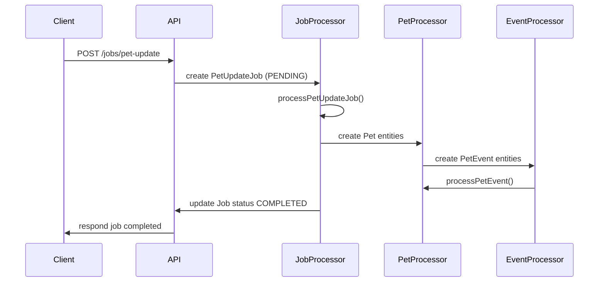
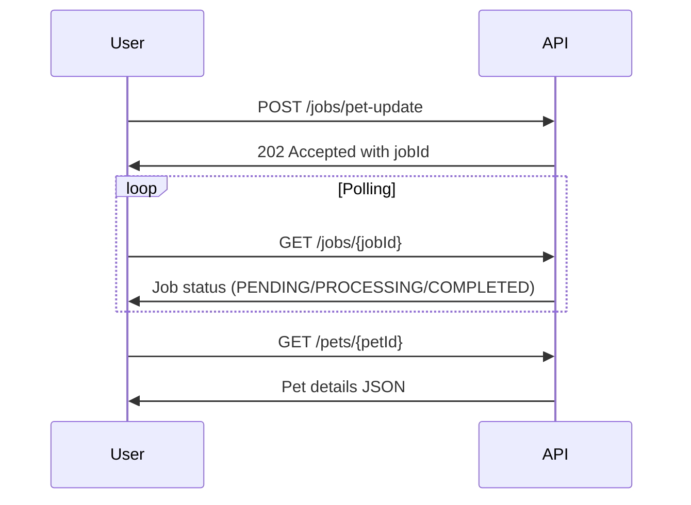

Certainly! Here is the well-formatted final version of your functional requirements for the 'Purrfect Pets' API app using Event-Driven Architecture:

---

### 1. Entity Definitions

``` 
PetUpdateJob: 
- jobId: String (unique identifier for the job)
- requestedAt: DateTime (timestamp when job was created)
- source: String (source of pet data ingestion, e.g., Petstore API)
- status: StatusEnum (PENDING, PROCESSING, COMPLETED, FAILED)

Pet:
- petId: String (unique identifier for the pet)
- name: String (pet's name)
- category: String (e.g., cat, dog)
- status: StatusEnum (AVAILABLE, PENDING_ADOPTION, ADOPTED)

PetEvent:
- eventId: String (unique event identifier)
- petId: String (associated pet's ID)
- eventType: String (e.g., CREATED, UPDATED)
- eventTimestamp: DateTime (when event occurred)
- payload: JSON (details of the event)
- status: StatusEnum (RECEIVED, PROCESSED, FAILED)
```

---

### 2. Process Method Flows

```
processPetUpdateJob() Flow:
1. Initial State: Job created with PENDING status
2. Validation: Verify job parameters and source availability
3. Processing: Fetch pet data from Petstore API, create Pet and PetEvent entities
4. Completion: Update job status to COMPLETED or FAILED based on success
5. Notification: Log completion or failure for monitoring

processPet() Flow:
1. Initial State: Pet entity created with AVAILABLE or PENDING_ADOPTION status
2. Validation: Check mandatory fields (name, category)
3. Processing: Update internal pet catalog, trigger any downstream events
4. Completion: Mark Pet as ADOPTED if relevant or keep status unchanged

processPetEvent() Flow:
1. Initial State: PetEvent created with RECEIVED status
2. Validation: Confirm associated Pet exists
3. Processing: Apply event payload to Pet state if needed
4. Completion: Mark PetEvent as PROCESSED or FAILED
```

---

### 3. API Endpoints Design

- **POST /jobs/pet-update**  
  Create a new PetUpdateJob → triggers `processPetUpdateJob()`  
  Response: Job creation acknowledgment with jobId and status

- **POST /pets**  
  Add new Pet → triggers `processPet()`  
  Response: Pet creation acknowledgment with petId and status

- **GET /pets/{petId}**  
  Retrieve pet details

- **GET /jobs/{jobId}**  
  Retrieve job status and results

---

### 4. Request/Response Formats

**POST /jobs/pet-update Request**

```json
{
  "source": "PetstoreAPI"
}
```

**Response**

```json
{
  "jobId": "job-12345",
  "status": "PENDING",
  "requestedAt": "2024-06-01T10:00:00Z"
}
```

---

**POST /pets Request**

```json
{
  "name": "Whiskers",
  "category": "cat",
  "status": "AVAILABLE"
}
```

**Response**

```json
{
  "petId": "pet-54321",
  "status": "AVAILABLE"
}
```

---

**GET /pets/{petId} Response**

```json
{
  "petId": "pet-54321",
  "name": "Whiskers",
  "category": "cat",
  "status": "AVAILABLE"
}
```

---

### Mermaid Diagrams

**Entity Lifecycle State Diagram for PetUpdateJob**


```mermaid
stateDiagram-v2
    [*] --> PENDING
    PENDING --> PROCESSING : processPetUpdateJob()
    PROCESSING --> COMPLETED : success
    PROCESSING --> FAILED : error
    COMPLETED --> [*]
    FAILED --> [*]
```

---

**Event-Driven Processing Chain**


```mermaid
sequenceDiagram
    participant Client
    participant API
    participant JobProcessor
    participant PetProcessor
    participant EventProcessor

    Client->>API: POST /jobs/pet-update
    API->>JobProcessor: create PetUpdateJob (PENDING)
    JobProcessor->>JobProcessor: processPetUpdateJob()
    JobProcessor->>PetProcessor: create Pet entities
    PetProcessor->>EventProcessor: create PetEvent entities
    EventProcessor->>PetProcessor: processPetEvent()
    JobProcessor->>API: update Job status COMPLETED
    API->>Client: respond job completed
```

---

**User Interaction Sequence Flow**


```mermaid
sequenceDiagram
    participant User
    participant API

    User->>API: POST /jobs/pet-update
    API->>User: 202 Accepted with jobId
    loop Polling
        User->>API: GET /jobs/{jobId}
        API->>User: Job status (PENDING/PROCESSING/COMPLETED)
    end
    User->>API: GET /pets/{petId}
    API->>User: Pet details JSON
```

---

If you need any further adjustments or additional details, please feel free to ask!