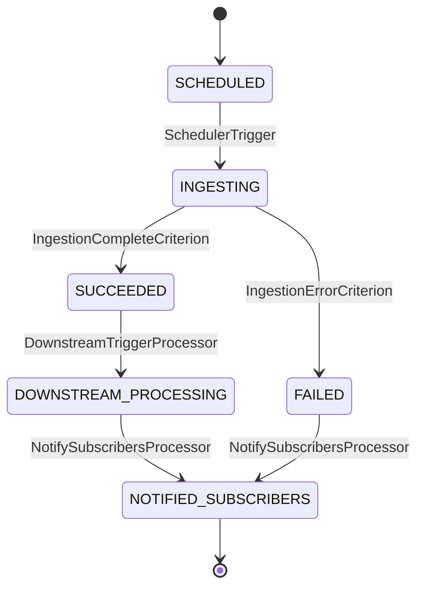
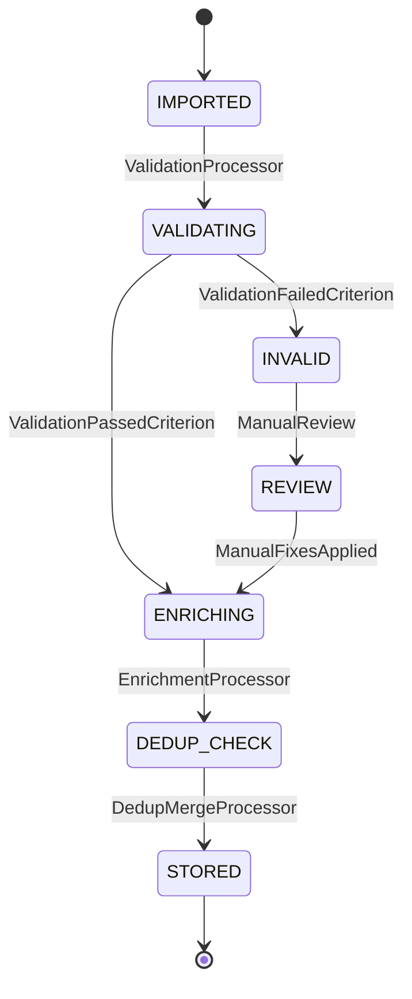
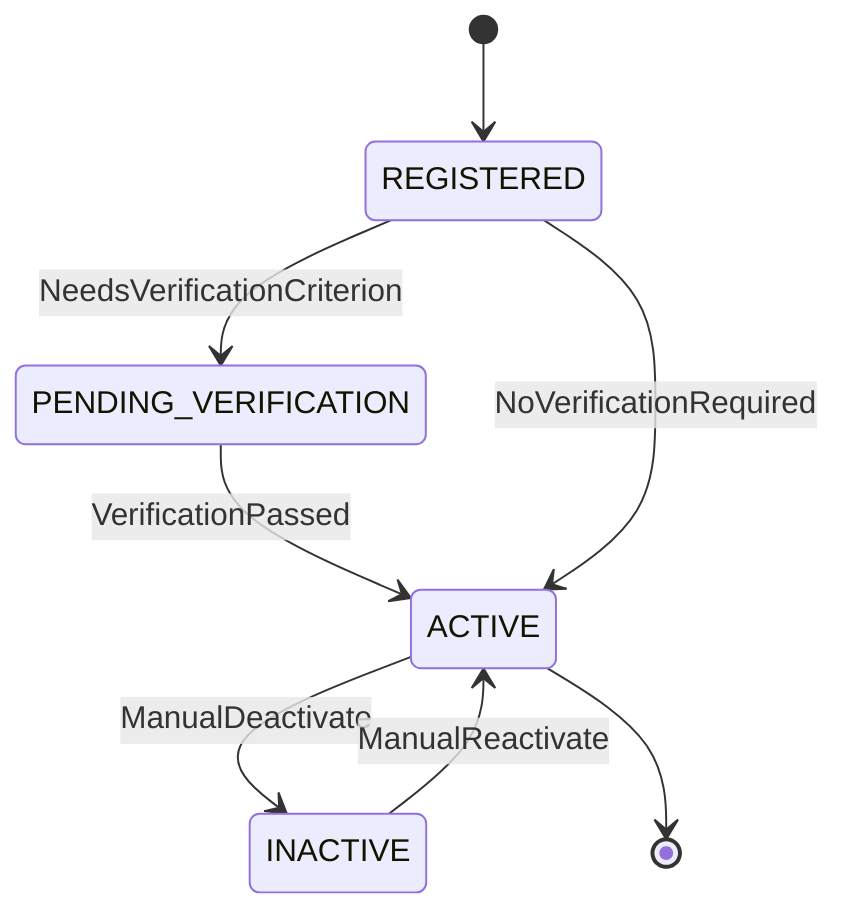
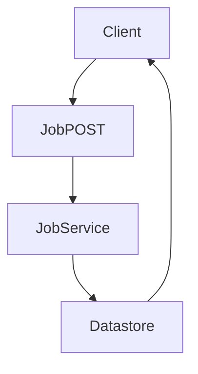
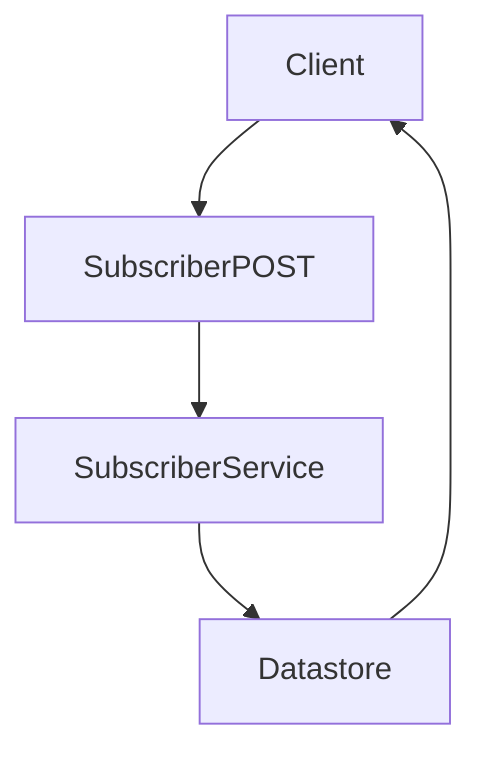
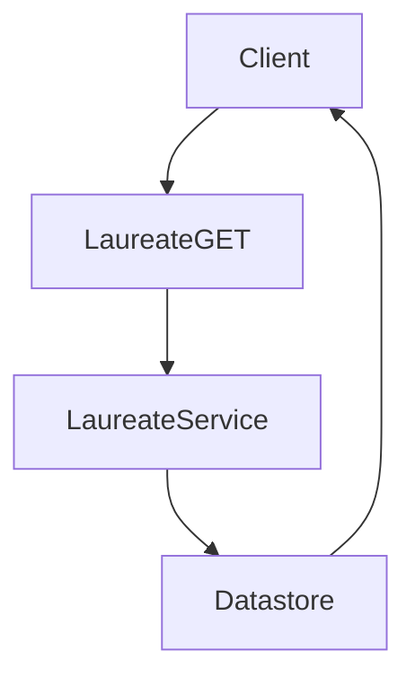

### 1. Entity Definitions

Job:
- id: String (domain identifier)
- technicalId: String (datastore-specific identifier returned by POST endpoints)
- name: String (human-friendly job name)
- scheduleCron: String (cron expression or schedule specification)
- sourceEndpoint: String (data source URL, e.g., https://public.opendatasoft.com/api/explore/v2.1/catalog/datasets/nobel-prize-laureates/records)
- limit: Integer (limit parameter for pagination)
- status: String (current workflow state)
- startedAt: String (ISO timestamp)
- finishedAt: String (ISO timestamp)
- resultSummary: String (summary of ingestion outcome)
- errorDetails: String (error messages / stack traces)
- createdBy: String (user or system that created the job)
- createdAt: String (ISO timestamp)
- updatedAt: String (ISO timestamp)
 Do not use enum - not supported temporarily.

Laureate:
- id: Integer (domain identifier from OpenDataSoft)
- firstname: String (given name)
- surname: String (family name)
- born: String (ISO date of birth)
- died: String (ISO date of death or null)
- borncountry: String (country name)
- borncountrycode: String (ISO country code)
- borncity: String (city of birth)
- gender: String (gender)
- year: String (award year)
- category: String (award category)
- motivation: String (award motivation)
- name: String (affiliation / organization name)
- city: String (affiliation city)
- country: String (affiliation country)
- calculatedAge: Integer (computed age at award or at death)
- normalizedCountryCode: String (standardized country code after enrichment)
- rawPayload: String (raw JSON response stored for audit)
 Example input structure (exact):
```json
{
"id": 853,
"firstname": "Akira",
"surname": "Suzuki",
"born": "1930-09-12",
"died": null,
"borncountry": "Japan",
"borncountrycode": "JP",
"borncity": "Mukawa",
"gender": "male",
"year": "2010",
"category": "Chemistry",
"motivation": ""for palladium-catalyzed cross couplings in organic synthesis"",
"name": "Hokkaido University",
"city": "Sapporo",
"country": "Japan"
}
```
 Do not use enum - not supported temporarily.

Subscriber:
- id: String (domain identifier)
- technicalId: String (datastore-specific identifier returned by POST endpoints)
- name: String (subscriber name or organization)
- email: String (contact email)
- webhookUrl: String (optional webhook endpoint)
- isActive: Boolean (whether subscriber receives notifications)
- filters: String (optional serialization of subscription filters, e.g., categories or years)
- createdAt: String (ISO timestamp)
- updatedAt: String (ISO timestamp)
 Do not use enum - not supported temporarily.

### 2. Entity workflows

Job workflow:
1. Initial State: Job created with SCHEDULED status (automatic start of process method triggers scheduling)
2. Schedule Trigger: Scheduler (Quartz or Spring Scheduler) triggers ingestion at configured scheduleCron → transition to INGESTING (automatic)
3. INGESTING: JobIngestionProcessor calls OpenDataSoft API endpoints (https://public.opendatasoft.com/api/explore/v2.1/catalog/datasets/nobel-prize-laureates/records?limit=1 or https://public.opendatasoft.com/api/explore/v2.1/catalog/datasets/nobel-prize-laureates/records) and persists Laureate entities via the Laureate process method (automatic)
4. Post-Ingest Validation: Check for ingestion completeness; if partial failures -> set status to FAILED with errorDetails else SUCCEEDED (automatic)
5. Downstream Processing: If SUCCEEDED, trigger downstream processors (e.g., aggregate, store raw payload, analytics) (automatic)
6. Notification: Notify all active Subscriber entities via NotifySubscribersProcessor; mark state NOTIFIED_SUBSCRIBERS after notifications are attempted (automatic, asynchronous)
7. Completion: Set finishedAt and update resultSummary; on unrecoverable errors set FAILED and include errorDetails (automatic)
Transitions can accept manual intervention for retries or job cancellation (manual).
Mermaid state diagram for Job:

```mermaid
stateDiagram-v2
    [*] --> SCHEDULED
    SCHEDULED --> INGESTING : SchedulerTrigger
    INGESTING --> SUCCEEDED : IngestionCompleteCriterion
    INGESTING --> FAILED : IngestionErrorCriterion
    SUCCEEDED --> DOWNSTREAM_PROCESSING : DownstreamTriggerProcessor
    DOWNSTREAM_PROCESSING --> NOTIFIED_SUBSCRIBERS : NotifySubscribersProcessor
    FAILED --> NOTIFIED_SUBSCRIBERS : NotifySubscribersProcessor
    NOTIFIED_SUBSCRIBERS --> [*]
```
Criterion and Processor classes needed:
- JobScheduleProcessor (invoked by scheduler to enqueue/transition job to INGESTING)
- JobIngestionProcessor (calls OpenDataSoft endpoints; uses Jackson or Gson to parse)
- IngestionErrorCriterion (detects failed HTTP calls, non-200 responses, malformed payloads)
- IngestionCompleteCriterion (verifies expected records retrieved and persisted)
- DownstreamTriggerProcessor (triggers downstream tasks, e.g., analytics or raw storage)
- NotifySubscribersProcessor (iterates active subscribers and calls email or webhook)
- JobRetryProcessor (handles retry logic with backoff)
- JobLoggingProcessor / ErrorHandlerProcessor (logs transitions, errors)
- PersistenceCriterion (ensures database writes completed)

Laureate workflow:
1. Initial State: Persisted by JobIngestionProcessor into temporary IMPORTED state (automatic - entity persistence triggers process method)
2. Validation: ValidationProcessor checks required fields (id, firstname/surname or name, year, category) and formats (dates, country codes). If validation fails → INVALID (automatic)
3. Enrichment: EnrichmentProcessor computes calculatedAge, normalizes country codes, enriches affiliation info (automatic)
4. Deduplication & Persist: Check existing laureate records (by id and name) and either merge or insert → STORED (automatic)
5. Post-store Notification: Optionally emit LaureateCreatedEvent for downstream consumers (automatic)
6. Manual Review: INVALID records can be moved to REVIEW (manual) for human correction and then re-processed to ENRICHMENT → STORED
Mermaid state diagram for Laureate:

```mermaid
stateDiagram-v2
    [*] --> IMPORTED
    IMPORTED --> VALIDATING : ValidationProcessor
    VALIDATING --> INVALID : ValidationFailedCriterion
    VALIDATING --> ENRICHING : ValidationPassedCriterion
    ENRICHING --> DEDUP_CHECK : EnrichmentProcessor
    DEDUP_CHECK --> STORED : DedupMergeProcessor
    INVALID --> REVIEW : ManualReview
    REVIEW --> ENRICHING : ManualFixesApplied
    STORED --> [*]
```
Criterion and Processor classes needed:
- LaureateValidationProcessor (ensures required fields non-null, date format checks)
- LaureateValidationFailedCriterion (determines invalid records)
- LaureateEnrichmentProcessor (calculate age, standardize borncountrycode, normalize strings)
- LaureateDedupMergeProcessor (merge duplicates or update existing records)
- LaureatePersistenceProcessor (persist final entity and raw payload)
- LaureateNotificationEmitter (optional, emits events for other services)
- LaureateManualReviewHandler (UI/back-office hooks for human fixes)

Subscriber workflow:
1. Initial State: Subscriber created via POST endpoint triggers persistence and optional verification → REGISTERED (automatic)
2. Verification: If webhook or email verification required → PENDING_VERIFICATION (manual/automatic if verification flows exist)
3. Active: After verification or immediately if no verification required → ACTIVE (manual or automatic)
4. Deactivation: Admin manual transition to INACTIVE (manual)
5. Notification Handling: When Job triggers NotifySubscribersProcessor, subscribers in ACTIVE state receive notifications; failures set an entry in subscriber delivery logs (automatic)
Mermaid state diagram for Subscriber:

```mermaid
stateDiagram-v2
    [*] --> REGISTERED
    REGISTERED --> PENDING_VERIFICATION : NeedsVerificationCriterion
    PENDING_VERIFICATION --> ACTIVE : VerificationPassed
    REGISTERED --> ACTIVE : NoVerificationRequired
    ACTIVE --> INACTIVE : ManualDeactivate
    INACTIVE --> ACTIVE : ManualReactivate
    ACTIVE --> [*]
```
Criterion and Processor classes needed:
- SubscriberRegistrationProcessor (persist subscriber, return technicalId)
- SubscriberVerificationProcessor (send verification email/webhook and validate)
- SubscriberActivationCriterion (checks verification status)
- SubscriberNotificationDeliveryProcessor (deliver notifications via email/webhook)
- SubscriberDeliveryFailureCriterion (retry or log delivery failures)

### 3. Pseudo code for processor classes

JobIngestionProcessor (pseudo Java-like)
```java
class JobIngestionProcessor {
    void process(Job job) {
        job.setStatus("INGESTING");
        persist(job);
        try {
            // Use configured sourceEndpoint or default OpenDataSoft endpoints
            String endpoint = job.getSourceEndpoint() != null ? job.getSourceEndpoint()
                : "https://public.opendatasoft.com/api/explore/v2.1/catalog/datasets/nobel-prize-laureates/records";
            // HTTP client call (use Apache HttpClient or Java HttpClient)
            HttpResponse resp = httpClient.get(endpoint + "?limit=" + job.getLimit());
            if (resp.status != 200) {
                job.setStatus("FAILED");
                job.setErrorDetails("HTTP " + resp.status);
                persist(job);
                return;
            }
            // Parse JSON using Jackson or Gson
            List<JsonNode> records = JsonParser.parseArray(resp.body);
            for (JsonNode rec : records) {
                // Persist laureate via domain process (entity persistence triggers Laureate workflow)
                Laureate laureate = mapToLaureate(rec);
                laureateRepository.save(laureate);
            }
            job.setStatus("SUCCEEDED");
            job.setResultSummary(records.size() + " records ingested");
            persist(job);
            // trigger downstream
            downstreamTriggerProcessor.process(job);
        } catch (Exception e) {
            job.setStatus("FAILED");
            job.setErrorDetails(stackTrace(e));
            persist(job);
        } finally {
            // asynchronous notification
            notifySubscribersProcessor.process(job);
            job.setStatus("NOTIFIED_SUBSCRIBERS");
            persist(job);
        }
    }
}
```

LaureateValidationProcessor (pseudo)
```java
class LaureateValidationProcessor {
    ValidationResult validate(Laureate l) {
        if (l.getId() == null) return fail("missing id");
        if (l.getYear() == null) return fail("missing year");
        if (l.getCategory() == null) return fail("missing category");
        // date format checks
        if (!isValidDate(l.getBorn())) return fail("born invalid");
        return success();
    }
}
```

LaureateEnrichmentProcessor (pseudo)
```java
class LaureateEnrichmentProcessor {
    void enrich(Laureate l) {
        // compute calculatedAge
        if (l.getBorn() != null) {
            l.setCalculatedAge(computeAgeAtYear(l.getBorn(), l.getYear()));
        }
        // normalize country codes using external mapping
        l.setNormalizedCountryCode(normalizeCountryCode(l.getBorncountrycode(), l.getBorncountry()));
        // store raw payload for audit
        l.setRawPayload(serializeToJson(l));
        persist(l);
    }
}
```

NotifySubscribersProcessor (pseudo)
```java
class NotifySubscribersProcessor {
    void process(Job job) {
        List<Subscriber> subs = subscriberRepository.findActive();
        for (Subscriber s : subs) {
            try {
                if (s.getWebhookUrl() != null) {
                    httpClient.post(s.getWebhookUrl(), buildPayload(job));
                } else if (s.getEmail() != null) {
                    emailService.send(s.getEmail(), buildEmailBody(job));
                }
                // log success to delivery logs
            } catch (Exception e) {
                // log failure and schedule retry according to policy
            }
        }
    }
}
```

DownstreamTriggerProcessor (pseudo)
```java
class DownstreamTriggerProcessor {
    void process(Job job) {
        // Example: store raw payload, produce analytics event, publish to message bus
        messageBus.publish("laureate.ingested.job", job.getTechnicalId());
        analyticsService.aggregate(job);
    }
}
```

ErrorHandler / Retry (pseudo)
```java
class JobRetryProcessor {
    boolean shouldRetry(Job job) {
        return job.getStatus().equals("FAILED") && job.getRetryCount() < MAX_RETRIES;
    }
    void scheduleRetry(Job job) {
        job.incrementRetryCount();
        job.setStatus("SCHEDULED");
        persist(job);
        scheduler.schedule(job.getScheduleCron(), job.technicalId);
    }
}
```

Notes about implementation:
- Use Jackson or Gson for JSON parsing exactly as specified.
- Use Quartz or Spring Scheduler for scheduling exactly as specified.
- Use asynchronous invocation (CompletableFuture, ExecutorService) for ingestion and notifications.

### 4. API Endpoints Design Rules

General rules applied:
- POST endpoints: Entity creation (triggers events). POST endpoint that adds an entity returns only entity technicalId (no other fields).
- GET endpoints: ONLY for retrieving stored application results.
- GET by technicalId: ONLY for retrieving stored application results by technicalId - present for all entities created via POST endpoints.
- GET by condition: ONLY if explicitly asked by user (not included).
- GET all: optional (will include for convenience where useful).

Endpoints

1) Job
- POST /jobs
  - Purpose: Create a Job (triggers scheduling and starts lifecycle). Returns only technicalId.
  - Request JSON:
    ```json
    {
      "name": "DailyIngest",
      "scheduleCron": "0 0 * * * ?",
      "sourceEndpoint": "https://public.opendatasoft.com/api/explore/v2.1/catalog/datasets/nobel-prize-laureates/records",
      "limit": 100
    }
    ```
  - Response JSON (only technicalId):
    ```json
    {
      "technicalId": "job-0001"
    }
    ```
- GET /jobs/{technicalId}
  - Purpose: Retrieve stored application result for a job.
  - Response JSON:
    ```json
    {
      "id": "job-0",
      "technicalId": "job-0001",
      "name": "DailyIngest",
      "scheduleCron": "0 0 * * * ?",
      "status": "NOTIFIED_SUBSCRIBERS",
      "startedAt": "2025-08-15T10:00:00Z",
      "finishedAt": "2025-08-15T10:00:30Z",
      "resultSummary": "100 records ingested",
      "errorDetails": null
    }
    ```

Mermaid request/response flow for Job POST

```mermaid
flowchart TD
    Client --> JobPOST
    JobPOST --> JobService
    JobService --> Datastore
    Datastore --> Client
```

2) Subscriber
- POST /subscribers
  - Purpose: Register a subscriber (triggers persistence and optional verification). Returns only technicalId.
  - Request JSON:
    ```json
    {
      "name": "NobelAlerts",
      "email": "alerts@example.com",
      "webhookUrl": "https://hooks.example.com/nobel"
    }
    ```
  - Response JSON (only technicalId):
    ```json
    {
      "technicalId": "sub-0001"
    }
    ```
- GET /subscribers/{technicalId}
  - Purpose: Retrieve stored subscriber details by technicalId.
  - Response JSON:
    ```json
    {
      "id": "sub-1",
      "technicalId": "sub-0001",
      "name": "NobelAlerts",
      "email": "alerts@example.com",
      "webhookUrl": "https://hooks.example.com/nobel",
      "isActive": true
    }
    ```

Mermaid request/response flow for Subscriber POST

```mermaid
flowchart TD
    Client --> SubscriberPOST
    SubscriberPOST --> SubscriberService
    SubscriberService --> Datastore
    Datastore --> Client
```

3) Laureate
- No POST endpoint (business entity persisted by JobIngestionProcessor via process method).
- GET /laureates/{id}
  - Purpose: Retrieve stored laureate record by domain id.
  - Response JSON (example matches stored attributes and rawPayload):
    ```json
    {
      "id": 853,
      "firstname": "Akira",
      "surname": "Suzuki",
      "born": "1930-09-12",
      "died": null,
      "borncountry": "Japan",
      "borncountrycode": "JP",
      "borncity": "Mukawa",
      "gender": "male",
      "year": "2010",
      "category": "Chemistry",
      "motivation": ""for palladium-catalyzed cross couplings in organic synthesis"",
      "name": "Hokkaido University",
      "city": "Sapporo",
      "country": "Japan",
      "calculatedAge": 80,
      "normalizedCountryCode": "JP",
      "rawPayload": "{ ... }"
    }
    ```

Mermaid request/response flow for Laureate GET

```mermaid
flowchart TD
    Client --> LaureateGET
    LaureateGET --> LaureateService
    LaureateService --> Datastore
    Datastore --> Client
```

Additional API design rules to implement:
- All POST create endpoints MUST return only the technicalId field.
- All persistence-triggering POSTs must immediately fire the entity process method in an event-driven way (asynchronous).
- Use HTTP status codes: 201 for created (with technicalId body), 200 for successful GET, 404 when not found, 400 for validation errors.
- For notification delivery, store delivery logs with timestamps and status (success/failure). These logs are accessible via internal admin APIs (optional, not defined here).

Implementation notes (preserve exact tech references):
- Use asynchronous processing for ingestion and notification.
- Provide error handling/logging per state transition.
- Prefer JSON parsing libraries like Jackson or Gson for processing responses.
- Configure job scheduling using libraries like Quartz or Spring Scheduler.
- Source endpoints: https://public.opendatasoft.com/api/explore/v2.1/catalog/datasets/nobel-prize-laureates/records?limit=1 and https://public.opendatasoft.com/api/explore/v2.1/catalog/datasets/nobel-prize-laureates/records

Limitations / constraints applied:
- Only the three user-specified entities (Job, Laureate, Subscriber) are included. No additional entities added.
- Maximum of 10 entities rule respected (3 used).