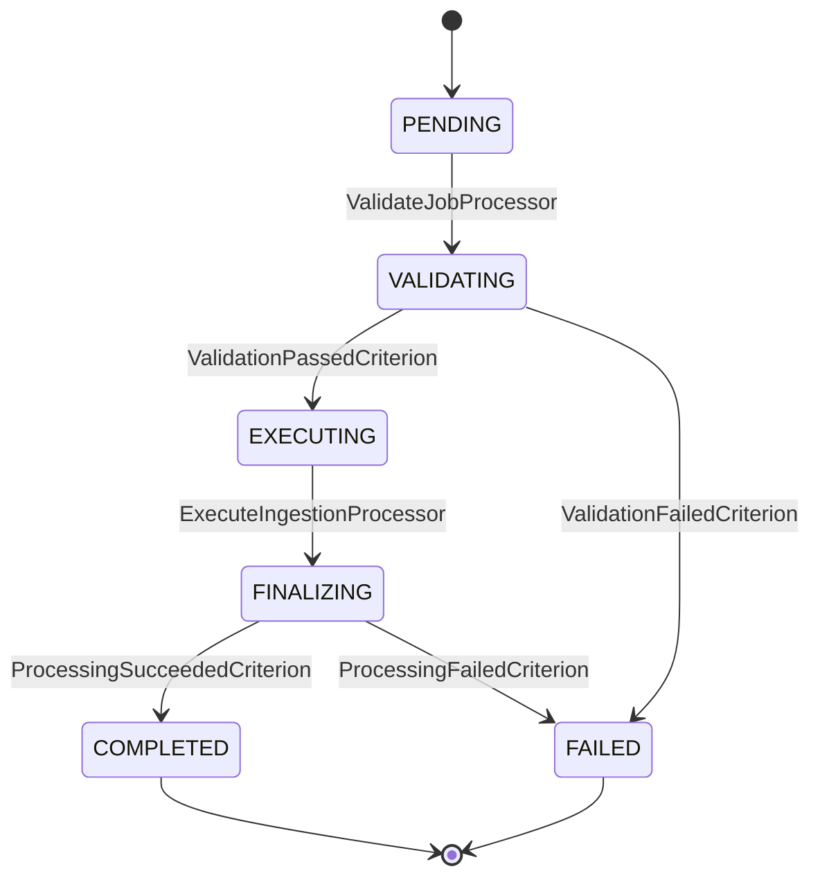
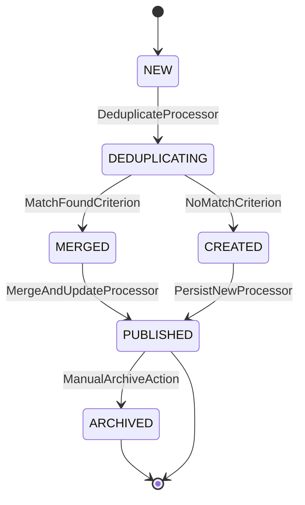
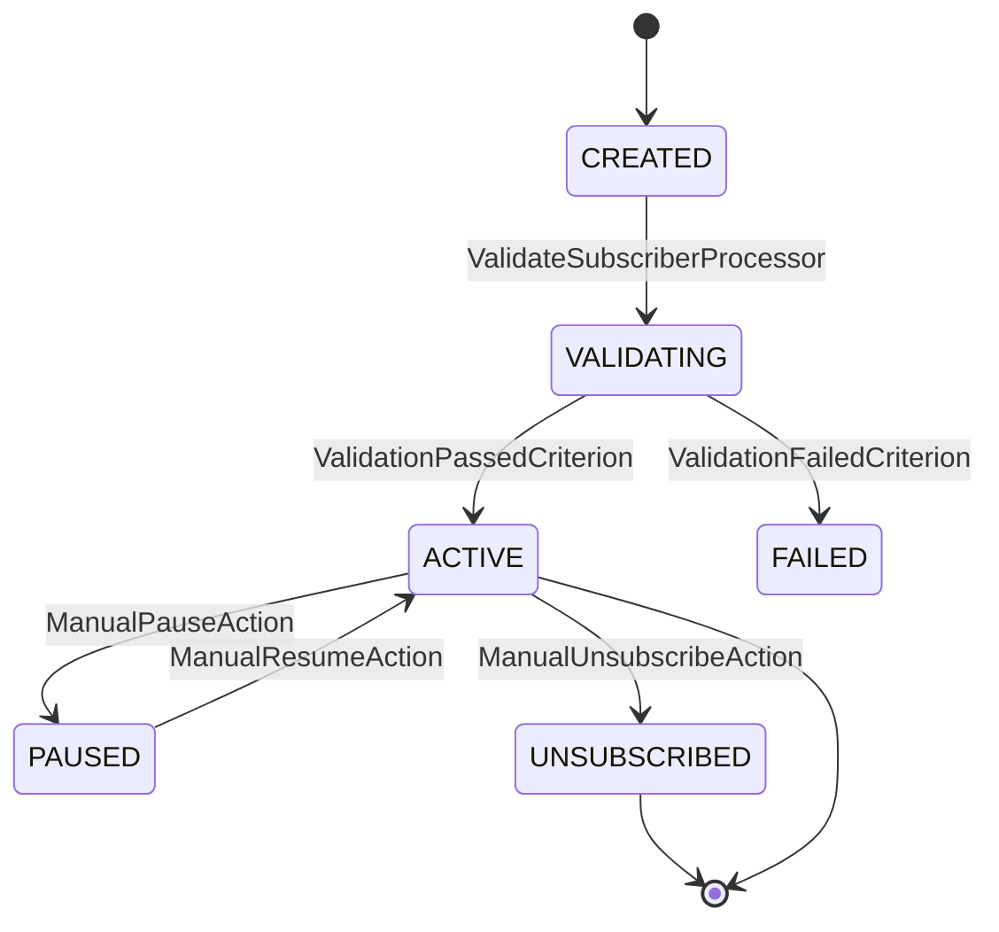

### 1. Entity Definitions
```
Job:
- name: String (human name of the job)
- scheduleType: String (one-time or recurring)
- scheduleSpec: String (cron or human schedule descriptor)
- sourceEndpoint: String (data source identifier)
- lastRunTimestamp: String (ISO timestamp of last run)
- status: String (current job status)
- enabled: Boolean (job enabled flag)
- lastResultSummary: String (summary of last run)

Laureate:
- externalId: String (id from source)
- fullName: String (display name)
- birthDate: String (ISO date if known)
- country: String (country of affiliation)
- prizeYear: Integer (year of prize)
- prizeCategory: String (category)
- motivation: String (prize motivation/description)
- rawPayload: String (raw source snapshot)
- firstSeenTimestamp: String
- lastSeenTimestamp: String
- changeSummary: String (high level change note)

Subscriber:
- name: String (subscriber name)
- contactMethod: String (email or webhook)
- contactDetails: String (email address or webhook URL)
- filters: String (JSON or DSL describing interests)
- preference: String (immediate, dailyDigest, weeklyDigest)
- status: String (active, paused, unsubscribed)
- createdTimestamp: String
```

### 2. Entity workflows

Job workflow:
1. Initial State: PENDING when Job entity persisted (event triggers processing)
2. Validation: Validate job parameters and sourceEndpoint (automatic)
3. Execution: Fetch and ingest data, emit Laureate add/update events (automatic)
4. Finalization: Mark COMPLETED or FAILED and record lastResultSummary (automatic)
5. Notification: Emit events for downstream processing (automatic)


```mermaid
stateDiagram-v2
    [*] --> PENDING
    PENDING --> VALIDATING : ValidateJobProcessor
    VALIDATING --> EXECUTING : ValidationPassedCriterion
    VALIDATING --> FAILED : ValidationFailedCriterion
    EXECUTING --> FINALIZING : ExecuteIngestionProcessor
    FINALIZING --> COMPLETED : ProcessingSucceededCriterion
    FINALIZING --> FAILED : ProcessingFailedCriterion
    COMPLETED --> [*]
    FAILED --> [*]
```

Processors/Criteria for Job:
- Processors: ValidateJobProcessor, ExecuteIngestionProcessor, FinalizeJobProcessor
- Criteria: ValidationPassedCriterion, ProcessingSucceededCriterion, ProcessingFailedCriterion

Laureate workflow:
1. Initial State: NEW when ingest event creates Laureate
2. Deduplication: Check if matches existing Laureate (automatic)
3. Merge/Update: Merge changes into existing record or mark as NEW_RECORD (automatic)
4. Publish: Mark PUBLISHED and emit notification events (automatic)
5. Archive: Optional manual archive (manual)


```mermaid
stateDiagram-v2
    [*] --> NEW
    NEW --> DEDUPLICATING : DeduplicateProcessor
    DEDUPLICATING --> MERGED : MatchFoundCriterion
    DEDUPLICATING --> CREATED : NoMatchCriterion
    MERGED --> PUBLISHED : MergeAndUpdateProcessor
    CREATED --> PUBLISHED : PersistNewProcessor
    PUBLISHED --> ARCHIVED : ManualArchiveAction
    ARCHIVED --> [*]
    PUBLISHED --> [*]
```

Processors/Criteria for Laureate:
- Processors: DeduplicateProcessor, MergeAndUpdateProcessor, PersistNewProcessor
- Criteria: MatchFoundCriterion, NoMatchCriterion

Subscriber workflow:
1. Initial State: CREATED when subscriber persisted (event triggers validation)
2. Validation: Validate contact details (automatic)
3. Active: Subscriber ready to receive notifications (automatic)
4. Paused/Unsubscribed: Manual transitions by user (manual)
5. Receiving: Notifications dispatched per preference (automatic)


```mermaid
stateDiagram-v2
    [*] --> CREATED
    CREATED --> VALIDATING : ValidateSubscriberProcessor
    VALIDATING --> ACTIVE : ValidationPassedCriterion
    VALIDATING --> FAILED : ValidationFailedCriterion
    ACTIVE --> PAUSED : ManualPauseAction
    PAUSED --> ACTIVE : ManualResumeAction
    ACTIVE --> UNSUBSCRIBED : ManualUnsubscribeAction
    UNSUBSCRIBED --> [*]
    ACTIVE --> [*]
```

Processors/Criteria for Subscriber:
- Processors: ValidateSubscriberProcessor, EnqueueNotificationProcessor
- Criteria: ValidationPassedCriterion, ValidationFailedCriterion

### 3. Pseudo code for processor classes
```text
ValidateJobProcessor.process(job):
  if job.sourceEndpoint empty or scheduleSpec invalid:
    mark job.status = FAILED
    set lastResultSummary
  else:
    mark job.status = VALIDATED

ExecuteIngestionProcessor.process(job):
  fetch records from job.sourceEndpoint
  for each record:
    normalize -> create Laureate entity (persist triggers Laureate workflow)
  set job.lastResultSummary and status COMPLETED

DeduplicateProcessor.process(laureate):
  existing = find by externalId or matching keys
  if existing:
    mark criterion MatchFound
  else:
    mark criterion NoMatch

MergeAndUpdateProcessor.process(existing, incoming):
  compute diffs
  update existing fields and lastSeenTimestamp
  append changeSummary
  persist existing -> emits updated event

ValidateSubscriberProcessor.process(subscriber):
  if contactDetails invalid:
    mark status = FAILED
  else:
    mark status = ACTIVE
```

### 4. API Endpoints Design Rules

Rules:
- POST endpoints create orchestration or subscription entities and return only technicalId.
- POST Jobs and POST Subscribers will trigger Cyoda workflows.
- Laureate records are created by Job processing (no POST).
- GET by technicalId available for all entities to retrieve stored results.

Examples:

POST create Job
```json
Request:
{
  "name":"Daily Laureates Ingest",
  "scheduleType":"recurring",
  "scheduleSpec":"0 0 * * *",
  "sourceEndpoint":"dataset_nobel_laureates",
  "enabled":true
}
Response:
{
  "technicalId":"job_technical_123"
}
```

GET Job by technicalId
```json
Response:
{
  "technicalId":"job_technical_123",
  "name":"Daily Laureates Ingest",
  "scheduleType":"recurring",
  "scheduleSpec":"0 0 * * *",
  "sourceEndpoint":"dataset_nobel_laureates",
  "lastRunTimestamp":null,
  "status":"PENDING",
  "enabled":true,
  "lastResultSummary":null
}
```

POST create Subscriber
```json
Request:
{
  "name":"Nobel Alerts",
  "contactMethod":"email",
  "contactDetails":"alerts@example.com",
  "filters":"{\"prizeCategory\":\"Physics\"}",
  "preference":"immediate"
}
Response:
{
  "technicalId":"sub_technical_456"
}
```

GET Laureate by technicalId
```json
Response:
{
  "technicalId":"laur_technical_789",
  "externalId":"ods_123",
  "fullName":"Marie Curie",
  "birthDate":"1867-11-07",
  "country":"Poland/France",
  "prizeYear":1903,
  "prizeCategory":"Physics",
  "motivation":"in recognition of...",
  "firstSeenTimestamp":"2025-01-01T00:00:00Z",
  "lastSeenTimestamp":"2025-01-01T00:00:00Z",
  "changeSummary":"initial import"
}
```

Would you like me to refine any entity fields, add sample filter DSL for Subscriber.filters, or expand retry/failure policies for jobs and notifications?