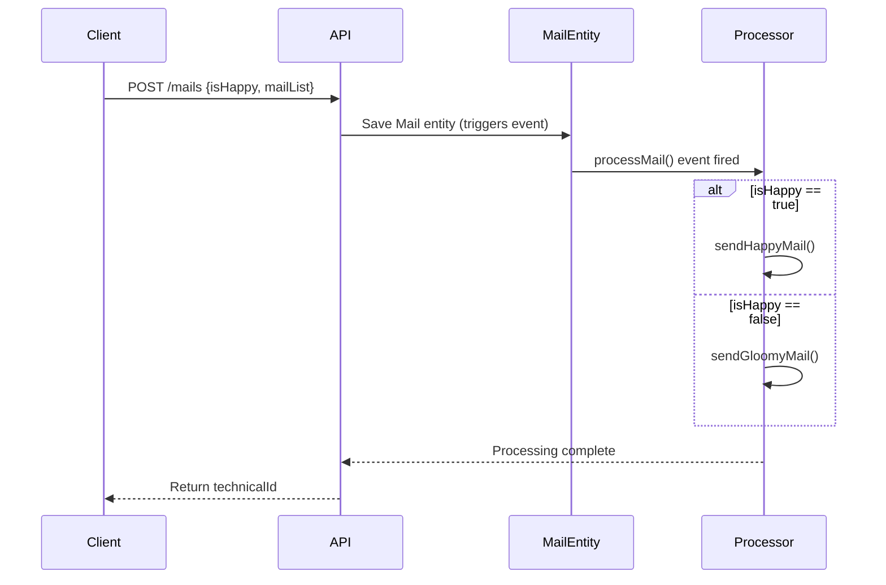

### 1. Entity Definitions

``` 
Mail: 
- isHappy: Boolean (indicates if the mail is happy or gloomy)
- mailList: List<String> (list of recipient email addresses)
```

### 2. Process Method Flows

``` 
processMail() Flow: 
1. Initial State: Mail entity is created with `isHappy` and `mailList` fields populated.
2. Processing: 
   - Automatically triggers the sending processor based on the `isHappy` flag.
   - If `isHappy` == true, `sendHappyMail` processor sends mails to all addresses in `mailList`.
   - If `isHappy` == false, `sendGloomyMail` processor sends mails to all addresses in `mailList`.
3. Completion: Mail sending process finishes (success or failure).
4. Notification: (Optional) Log the result or send notification.
```

### 3. API Endpoints Design

| Method | Endpoint                  | Purpose                                         | Request Body                 | Response                         |
|--------|---------------------------|------------------------------------------------|------------------------------|---------------------------------|
| POST   | /mails                    | Create a new Mail entity (triggers processing) | `{ "isHappy": true/false, "mailList": [emails...] }` | `{ "technicalId": "<generated-id>" }` |
| GET    | /mails/{technicalId}      | Retrieve a Mail entity by its technicalId       | N/A                          | `{ "technicalId": "<id>", "isHappy": true/false, "mailList": [emails...] }` |

### 4. Request/Response Formats

**POST /mails**

Request:

```json
{
  "isHappy": true,
  "mailList": ["user1@example.com", "user2@example.com"]
}
```

Response:

```json
{
  "technicalId": "abc123"
}
```

**GET /mails/{technicalId}**

Response:

```json
{
  "technicalId": "abc123",
  "isHappy": true,
  "mailList": ["user1@example.com", "user2@example.com"]
}
```

---

### Visual Representations

**Mail Entity Lifecycle State Diagram**


```mermaid
stateDiagram-v2
    [*] --> MailCreated
    MailCreated --> Processing : processMail()
    Processing --> HappyMailSent : isHappy == true
    Processing --> GloomyMailSent : isHappy == false
    HappyMailSent --> [*]
    GloomyMailSent --> [*]
```

**Event-Driven Processing Chain**


```mermaid
sequenceDiagram
    participant Client
    participant API
    participant MailEntity
    participant Processor

    Client->>API: POST /mails {isHappy, mailList}
    API->>MailEntity: Save Mail entity (triggers event)
    MailEntity->>Processor: processMail() event fired
    alt isHappy == true
        Processor->>Processor: sendHappyMail()
    else isHappy == false
        Processor->>Processor: sendGloomyMail()
    end
    Processor-->>API: Processing complete
    API-->>Client: Return technicalId
```

---

This completes the functional requirements based on your confirmation:

- `isHappy` boolean field directly determines happy or gloomy mails.
- Mail sending triggered automatically upon Mail entity creation.
- POST `/mails` endpoint to create mails.
- GET `/mails/{technicalId}` endpoint to retrieve mails by technicalId.
- No explicit criteria checks or GET all endpoint included.

Please let me know if you need anything else!