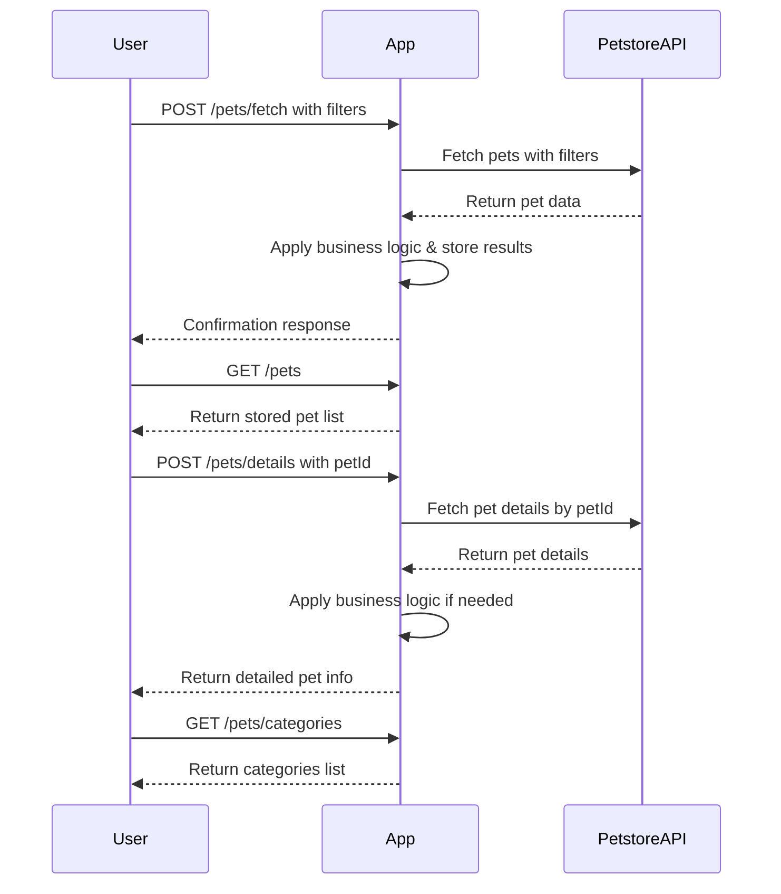

# Purrfect Pets API - Functional Requirements

## API Endpoints

### 1. POST /pets/fetch  
**Description:** Fetch pet data from the external Petstore API, apply any business logic or filtering, and store/cache results internally for retrieval.  
**Request:**  
```json
{
  "filters": {
    "status": "available",    // optional, e.g., available, pending, sold
    "tags": ["cute", "small"] // optional array of tags
  }
}
```  
**Response:**  
```json
{
  "message": "Pets fetched and stored successfully",
  "count": 10
}
```

---

### 2. GET /pets  
**Description:** Retrieve the list of pets previously fetched and stored by the application.  
**Response:**  
```json
[
  {
    "id": 1,
    "name": "Fluffy",
    "status": "available",
    "tags": ["cute", "small"],
    "category": "cat"
  },
  {
    "id": 2,
    "name": "Buddy",
    "status": "sold",
    "tags": ["friendly", "large"],
    "category": "dog"
  }
]
```

---

### 3. POST /pets/details  
**Description:** Retrieve detailed info for a pet by invoking external API or internal cache, with any business logic applied.  
**Request:**  
```json
{
  "petId": 1
}
```  
**Response:**  
```json
{
  "id": 1,
  "name": "Fluffy",
  "status": "available",
  "tags": ["cute", "small"],
  "category": "cat",
  "description": "A very fluffy cat who loves naps."
}
```

---

### 4. GET /pets/categories  
**Description:** Retrieve all pet categories available in the app (cached or from internal store).  
**Response:**  
```json
[
  "cat",
  "dog",
  "bird",
  "fish"
]
```

---

## User-App Interaction Sequence


```mermaid
sequenceDiagram
  participant User
  participant App
  participant PetstoreAPI

  User->>App: POST /pets/fetch with filters
  App->>PetstoreAPI: Fetch pets with filters
  PetstoreAPI-->>App: Return pet data
  App->>App: Apply business logic & store results
  App-->>User: Confirmation response

  User->>App: GET /pets
  App-->>User: Return stored pet list

  User->>App: POST /pets/details with petId
  App->>PetstoreAPI: Fetch pet details by petId
  PetstoreAPI-->>App: Return pet details
  App->>App: Apply business logic if needed
  App-->>User: Return detailed pet info

  User->>App: GET /pets/categories
  App-->>User: Return categories list
```
