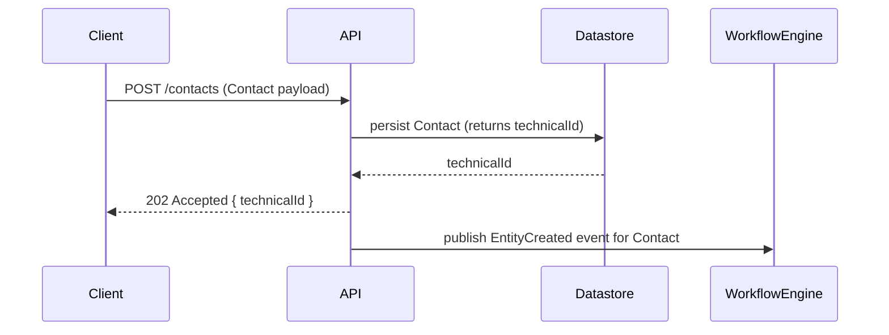
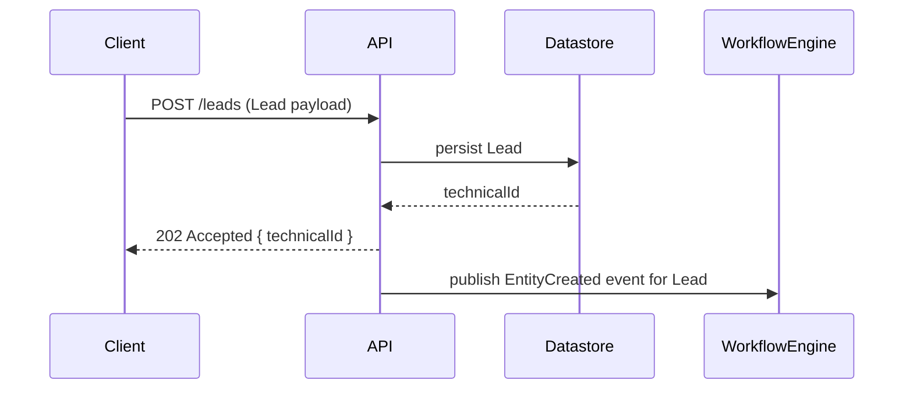
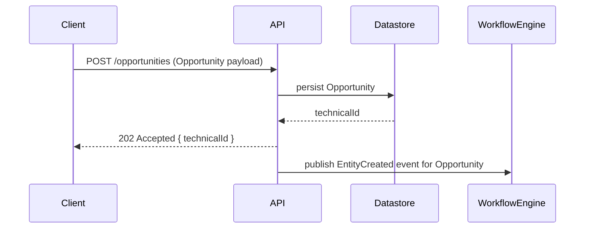

# Functional Requirements (Updated)

## Overview

This document defines the functional requirements for a CRM-focused application following an Event-Driven Architecture (EDA) approach using Cyoda design principles. The system manages contacts, leads, and opportunities. Each create/add operation for an entity is an EVENT that triggers automated workflows. The selected implementation language is Java (Spring Boot).

Key principles applied:
- Each entity persistence triggers the entity workflow.
- POST endpoints for entity creation return only a technicalId (datastore-imitation ID) and trigger processing workflows.
- GET endpoints are only for retrieving stored results.


---

## 1. Entity Definitions

Contact:
- firstName: String (contact first name)
- lastName: String (contact last name)
- email: String (contact email address)
- phone: String (contact phone number)
- company: String (company name)
- status: String (business status like NEW, VERIFIED, ARCHIVED)
- source: String (origin, e.g., manual, import, crm_api)

Lead:
- name: String (lead display name)
- email: String (lead email)
- phone: String (lead phone)
- company: String (lead company)
- source: String (origin of the lead)
- status: String (lead lifecycle status like NEW, CONTACTED, QUALIFIED, DISQUALIFIED)
- potentialValue: Number (estimated value in currency units)

Opportunity:
- title: String (opportunity title)
- contactId: String (reference technicalId to associated Contact)
- leadId: String (reference technicalId to associated Lead)
- amount: Number (monetary amount)
- stage: String (stage of sales cycle like PROSPECTING, NEGOTIATION, WON, LOST)
- closeProbability: Number (0-100 estimate)
- expectedCloseDate: String (ISO date)

Notes:
- No more than 3 business entities are defined here (default per spec).
- Fields are intentionally simple (no enums) so they map cleanly to Cyoda entities and workflows.


---

## 2. Entity Workflows

General guidance: Each entity creation is an EVENT. On persist, Cyoda starts the entity-specific workflow. Workflows contain automatic and manual transitions. Below each workflow we list required Criterion and Processor classes plus short pseudo-code for processors.

Contact workflow:
1. Initial State: CREATED (triggered by POST /contacts)
2. Validation: VALIDATE_CONTACT (automatic) — check required fields and email format
3. Enrichment: ENRICH_CONTACT (automatic) — call enrichment processors (e.g., company lookup)
4. Verification: PENDING_VERIFICATION (manual) — optional human review for high-risk contacts
5. Active: ACTIVE (automatic on successful validation/enrichment)
6. Archived: ARCHIVED (manual/automatic based on retention rules)

stateDiagram-v2
    [*] --> CREATED
    CREATED --> VALIDATE_CONTACT : ValidateContactCriterion / ValidateContactProcessor
    VALIDATE_CONTACT --> ENRICH_CONTACT : if valid
    VALIDATE_CONTACT --> ARCHIVED : if invalid
    ENRICH_CONTACT --> PENDING_VERIFICATION : if enrichment score low
    ENRICH_CONTACT --> ACTIVE : if enrichment OK
    PENDING_VERIFICATION --> ACTIVE : ManualApproveContact
    ACTIVE --> ARCHIVED : ArchiveContactProcessor
    ARCHIVED --> [*]

Contact - Criterion and Processor classes (examples):
- ValidateContactCriterion (checks presence of firstName/lastName/email and email format)
- ValidateContactProcessor (marks entity as invalid or passes forward)
  Pseudocode:
  ```java
  class ValidateContactProcessor {
      void process(Contact contact) {
          if (missing required fields or invalid email) {
              contact.status = "ARCHIVED"; // or set validation errors
          } else {
              // mark as ready for enrichment
          }
          persist(contact);
      }
  }
  ```
- EnrichContactProcessor (enrich company data, add metadata)
- ArchiveContactProcessor (applies retention rules)
- ManualApproveContact (manual action triggered by user via UI)


Lead workflow:
1. Initial State: CREATED (triggered by POST /leads)
2. Validation: VALIDATE_LEAD (automatic)
3. ContactAttempt: CONTACT_ATTEMPT (automatic/attempt processors) — schedule outbound contact attempts
4. Qualification: QUALIFICATION (automatic, may use scoring)
5. Qualified: QUALIFIED (automatic) OR Disqualified: DISQUALIFIED (manual or automatic)
6. Converted: CONVERTED (automatic when converted to Contact and Opportunity)

stateDiagram-v2
    [*] --> CREATED
    CREATED --> VALIDATE_LEAD : ValidateLeadCriterion / ValidateLeadProcessor
    VALIDATE_LEAD --> CONTACT_ATTEMPT : if valid
    VALIDATE_LEAD --> DISQUALIFIED : if invalid
    CONTACT_ATTEMPT --> QUALIFICATION : ContactAttemptProcessor
    QUALIFICATION --> QUALIFIED : if score >= threshold
    QUALIFICATION --> DISQUALIFIED : if score < threshold
    QUALIFIED --> CONVERTED : ConvertLeadProcessor
    CONVERTED --> [*]
    DISQUALIFIED --> [*]

Lead - Criterion and Processor classes:
- ValidateLeadCriterion
- ValidateLeadProcessor (basic checks similar to contact)
- ContactAttemptProcessor (schedules or triggers contact attempts; automatic)
- QualificationCriterion (computes score based on fields)
- QualificationProcessor (sets status to QUALIFIED/DISQUALIFIED)
- ConvertLeadProcessor (creates Contact and Opportunity entities in their CREATED state)
  Pseudocode for ConvertLeadProcessor:
  ```java
  class ConvertLeadProcessor {
      void process(Lead lead) {
          Contact c = new Contact(... from lead ...);
          String contactTechnicalId = persistEntityAndReturnTechnicalId(c);
          Opportunity o = new Opportunity(... link to contactTechnicalId ...);
          persistEntityAndReturnTechnicalId(o);
          lead.status = "CONVERTED";
          persist(lead);
      }
  }
  ```

Opportunity workflow:
1. Initial State: CREATED (triggered by POST /opportunities or created via Lead conversion)
2. Qualification: QUALIFY_OPPORTUNITY (automatic)
3. Negotiation: NEGOTIATION (manual/automatic actions like pricing updates)
4. Close: WON or LOST (manual or automatic based on criteria)
5. PostClose: FULFILLMENT or ARCHIVE

stateDiagram-v2
    [*] --> CREATED
    CREATED --> QUALIFY_OPPORTUNITY : QualifyOpportunityCriterion / QualifyOpportunityProcessor
    QUALIFY_OPPORTUNITY --> NEGOTIATION : if probability > 20
    QUALIFY_OPPORTUNITY --> LOST : if probability == 0
    NEGOTIATION --> WON : ManualCloseWon
    NEGOTIATION --> LOST : ManualCloseLost
    WON --> FULFILLMENT : FulfillmentProcessor
    FULFILLMENT --> ARCHIVE : ArchiveOpportunityProcessor
    ARCHIVE --> [*]

Opportunity - Criterion and Processor classes:
- QualifyOpportunityCriterion
- QualifyOpportunityProcessor (computes probability, flags for negotiation)
- FulfillmentProcessor (post-win actions such as notifying downstream systems)
- ArchiveOpportunityProcessor
- ManualCloseWon / ManualCloseLost (manual transitions triggered by users)


---

## 3. API Endpoints (Design Rules Applied)

General endpoint rules followed:
- POST endpoints create entities and return only technicalId (string)
- GET endpoints retrieve stored results
- GET by technicalId exists for all entities created via POST
- GET by non-technical fields is provided only when explicitly useful (not included by default)

Endpoints:
- POST /contacts
  - Creates Contact (triggers Contact workflow)
  - Response: { "technicalId": "<id>" }
- GET /contacts/{technicalId}
  - Retrieves stored Contact entity and its current workflow state
- GET /contacts (optional) - retrieve all contacts (read-only)

- POST /leads
  - Creates Lead (triggers Lead workflow)
  - Response: { "technicalId": "<id>" }
- GET /leads/{technicalId}
  - Retrieve stored Lead
- GET /leads (optional)

- POST /opportunities
  - Creates Opportunity (triggers Opportunity workflow)
  - Response: { "technicalId": "<id>" }
- GET /opportunities/{technicalId}
  - Retrieve stored Opportunity
- GET /opportunities (optional)

Notes on POST behavior:
- POST should return only a JSON body with the technicalId and HTTP 202 Accepted (or 201 Created). The creation event triggers asynchronous processing (workflows).
- The technicalId is generated by the datastore layer and not considered a field in the entity model payload.


---

## 4. Request and Response Formats

Contact - POST request example (body):
```json
{
  "firstName": "John",
  "lastName": "Doe",
  "email": "john.doe@example.com",
  "phone": "123-456-7890",
  "company": "Acme Inc",
  "source": "crm_api"
}
```

Contact - POST response:
```json
{
  "technicalId": "contact-0001"
}
```

Mermaid sequence diagram for POST /contacts:

```mermaid
sequenceDiagram
    Client->>API: POST /contacts (Contact payload)
    API->>Datastore: persist Contact (returns technicalId)
    Datastore-->>API: technicalId
    API-->>Client: 202 Accepted { technicalId }
    API->>WorkflowEngine: publish EntityCreated event for Contact
```

Contact - GET /contacts/{technicalId} response example (read-only result):
```json
{
  "technicalId": "contact-0001",
  "firstName": "John",
  "lastName": "Doe",
  "email": "john.doe@example.com",
  "phone": "123-456-7890",
  "company": "Acme Inc",
  "status": "ACTIVE",
  "source": "crm_api",
  "workflowState": "ACTIVE"
}
```

Lead - POST request example:
```json
{
  "name": "Acme Opportunity Lead",
  "email": "lead@acme.com",
  "phone": "555-111-2222",
  "company": "Acme Inc",
  "source": "web_form",
  "potentialValue": 12000
}
```

Lead - POST response:
```json
{
  "technicalId": "lead-0001"
}
```

Mermaid sequence diagram for POST /leads:

```mermaid
sequenceDiagram
    Client->>API: POST /leads (Lead payload)
    API->>Datastore: persist Lead
    Datastore-->>API: technicalId
    API-->>Client: 202 Accepted { technicalId }
    API->>WorkflowEngine: publish EntityCreated event for Lead
```

Lead - GET /leads/{technicalId} response example:
```json
{
  "technicalId": "lead-0001",
  "name": "Acme Opportunity Lead",
  "email": "lead@acme.com",
  "company": "Acme Inc",
  "status": "QUALIFIED",
  "potentialValue": 12000,
  "workflowState": "QUALIFIED"
}
```

Opportunity - POST request example:
```json
{
  "title": "Q4 Big Deal",
  "contactId": "contact-0001",
  "amount": 50000,
  "stage": "PROSPECTING",
  "closeProbability": 10,
  "expectedCloseDate": "2025-12-31"
}
```

Opportunity - POST response:
```json
{
  "technicalId": "opp-0001"
}
```

Mermaid sequence diagram for POST /opportunities:

```mermaid
sequenceDiagram
    Client->>API: POST /opportunities (Opportunity payload)
    API->>Datastore: persist Opportunity
    Datastore-->>API: technicalId
    API-->>Client: 202 Accepted { technicalId }
    API->>WorkflowEngine: publish EntityCreated event for Opportunity
```

Opportunity - GET /opportunities/{technicalId} response example:
```json
{
  "technicalId": "opp-0001",
  "title": "Q4 Big Deal",
  "contactId": "contact-0001",
  "amount": 50000,
  "stage": "NEGOTIATION",
  "closeProbability": 50,
  "expectedCloseDate": "2025-12-31",
  "workflowState": "NEGOTIATION"
}
```


---

## 5. Criteria and Processor Class Summary (by entity)

Contact:
- ValidateContactCriterion
- ValidateContactProcessor
- EnrichContactProcessor
- ArchiveContactProcessor
- ManualApproveContact (manual transition handler)

Lead:
- ValidateLeadCriterion
- ValidateLeadProcessor
- ContactAttemptProcessor
- QualificationCriterion
- QualificationProcessor
- ConvertLeadProcessor

Opportunity:
- QualifyOpportunityCriterion
- QualifyOpportunityProcessor
- FulfillmentProcessor
- ArchiveOpportunityProcessor
- ManualCloseWon
- ManualCloseLost

Notes on implementation:
- Criterion classes evaluate conditions on entity state (return boolean or branch keys) and are executed in the workflow engine.
- Processor classes execute side effects (persistence updates, calls to external systems, scheduling, creating related entities). Processors should be idempotent when possible.

Example pseudo-code for a generic processor pattern:
```java
class GenericProcessor<T> {
    void process(T entity) {
        // load latest entity state
        // perform checks / transformations
        // call external services if needed
        // persist updates and publish next events
    }
}
```


---

## 6. Additional Implementation Notes (Functional)
- All POST operations are asynchronous from business processing perspective: POST returns technicalId immediately and the workflow proceeds asynchronously.
- Conversions (e.g., Lead -> Contact + Opportunity) are implemented as processors that create new entity records and set source references.
- Manual transitions (Approve, Close Won/Lost) are triggered by user actions and invoke the corresponding processors.
- Error handling: processors should persist error metadata on entities (for diagnostics) and set appropriate workflow states (e.g., FAILED or PENDING_VERIFICATION).


---

Please review the generated entities and workflows. If you need any changes, please let me know. Feel free to click Approve if this requirement meets your expectations or if you are ready to proceed.