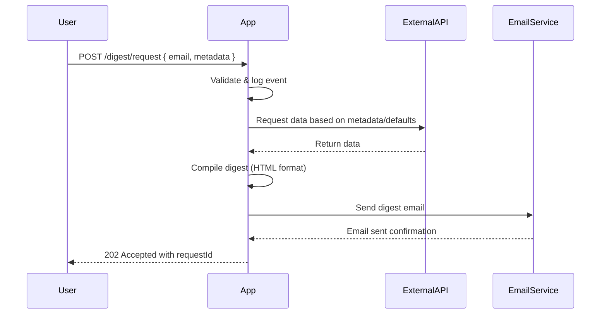
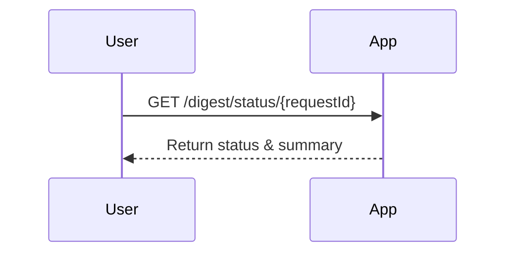

# Functional Requirements and API Design

## API Endpoints

### 1. POST /digest/request  
**Purpose:** Accept and log incoming digest request events, trigger data retrieval and email dispatch workflow.

- **Request body:**
```json
{
  "email": "user@example.com",
  "metadata": {
    "digestType": "petStatusDigest",
    "parameters": {
      "status": "available"
    }
  }
}
```

- **Response body:**
```json
{
  "requestId": "uuid-string",
  "status": "accepted"
}
```

- **Business logic:**  
  - Validate input data.  
  - Log event with email and metadata.  
  - Determine external API endpoint and parameters based on metadata or defaults.  
  - Retrieve data from external API (https://petstore.swagger.io/).  
  - Compile digest in HTML format.  
  - Send digest email to user email address.  
  - Persist request status for future retrieval.

---

### 2. GET /digest/status/{requestId}  
**Purpose:** Retrieve the status and result summary of a previously submitted digest request.

- **Response body:**
```json
{
  "requestId": "uuid-string",
  "email": "user@example.com",
  "status": "completed",
  "sentAt": "2024-06-10T15:30:00Z",
  "digestSummary": "Sent pet status digest with 12 entries"
}
```

---

# Mermaid Sequence Diagram: User Request to Digest Completion


```mermaid
sequenceDiagram
    participant User
    participant App
    participant ExternalAPI
    participant EmailService

    User->>App: POST /digest/request { email, metadata }
    App->>App: Validate & log event
    App->>ExternalAPI: Request data based on metadata/defaults
    ExternalAPI-->>App: Return data
    App->>App: Compile digest (HTML format)
    App->>EmailService: Send digest email
    EmailService-->>App: Email sent confirmation
    App-->>User: 202 Accepted with requestId
```

---

# Mermaid Sequence Diagram: User Checking Digest Status


```mermaid
sequenceDiagram
    participant User
    participant App

    User->>App: GET /digest/status/{requestId}
    App-->>User: Return status & summary
```