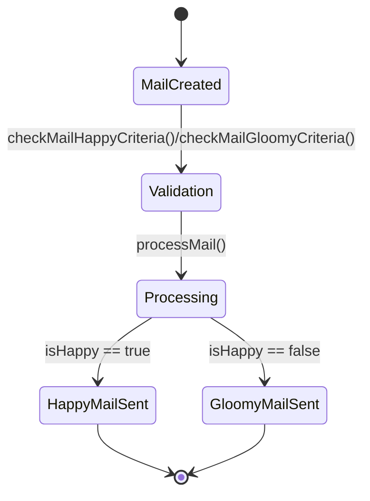
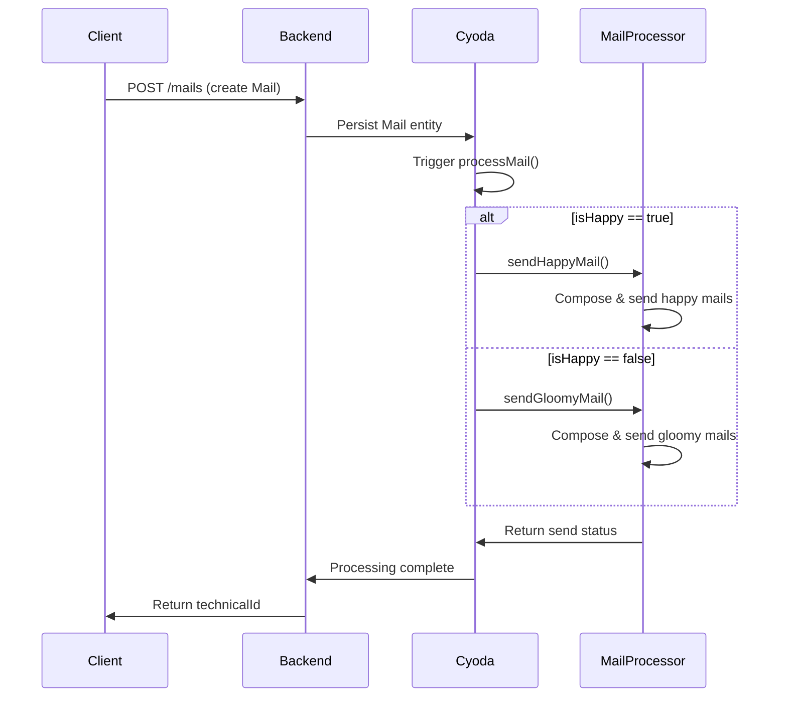

### 1. Entity Definitions

``` 
Mail:
- isHappy: Boolean (indicates if the mail is happy or gloomy)
- mailList: List<String> (list of recipient email addresses)
```

### 2. Process Method Flows

```
processMail() Flow:
1. Initial State: Mail entity is created and persisted with `isHappy` and `mailList` fields.
2. Validation: If explicitly requested, run checks to validate whether the mail meets happy or gloomy criteria (checkMailHappyCriteria(), checkMailGloomyCriteria()).
3. Processing: 
    - If `isHappy == true`, trigger sendHappyMail processor to compose and send happy mails.
    - If `isHappy == false`, trigger sendGloomyMail processor to compose and send gloomy mails.
4. Completion: Mail sending completes successfully or fails.
5. Notification: Log the sending status (success/failure).
```

### 3. API Endpoints Design

| Method | Endpoint           | Description                                   | Request Body                 | Response                    |
|--------|--------------------|-----------------------------------------------|-----------------------------|-----------------------------|
| POST   | /mails             | Create a new Mail entity and trigger processing | `{ "isHappy": true/false, "mailList": ["email1", "email2"] }` | `{ "technicalId": "string" }` |
| GET    | /mails/{technicalId} | Retrieve stored Mail entity by technicalId    | N/A                         | `{ "isHappy": true/false, "mailList": [...], "technicalId": "string" }` |

- No update or delete endpoints to preserve event history.
- No GET by condition unless explicitly requested.

### 4. Event Processing Workflows

- **On POST /mails:**
  - Mail entity is saved (immutable creation).
  - Cyoda triggers `processMail()` automatically (since only one processor group).
  - `processMail()` checks `isHappy`:
    - Calls `sendHappyMail()` processor if true.
    - Calls `sendGloomyMail()` processor if false.
  - Each processor sends mails to recipients in `mailList`.
  - Status logged but no status update on entity (immutable).

### 5. Request/Response Formats

**POST /mails**

- Request:
```json
{
  "isHappy": true,
  "mailList": [
    "user1@example.com",
    "user2@example.com"
  ]
}
```

- Response:
```json
{
  "technicalId": "abc123xyz"
}
```

**GET /mails/{technicalId}**

- Response:
```json
{
  "technicalId": "abc123xyz",
  "isHappy": true,
  "mailList": [
    "user1@example.com",
    "user2@example.com"
  ]
}
```

---

### Mermaid Diagrams

**Mail Entity Lifecycle State Diagram**


```mermaid
stateDiagram-v2
    [*] --> MailCreated
    MailCreated --> Validation : checkMailHappyCriteria()/checkMailGloomyCriteria()
    Validation --> Processing : processMail()
    Processing --> HappyMailSent : isHappy == true
    Processing --> GloomyMailSent : isHappy == false
    HappyMailSent --> [*]
    GloomyMailSent --> [*]
```

**Event-Driven Processing Chain**


```mermaid
sequenceDiagram
    participant Client
    participant Backend
    participant Cyoda
    participant MailProcessor

    Client->>Backend: POST /mails (create Mail)
    Backend->>Cyoda: Persist Mail entity
    Cyoda->>Cyoda: Trigger processMail()
    alt isHappy == true
        Cyoda->>MailProcessor: sendHappyMail()
        MailProcessor->>MailProcessor: Compose & send happy mails
    else isHappy == false
        Cyoda->>MailProcessor: sendGloomyMail()
        MailProcessor->>MailProcessor: Compose & send gloomy mails
    end
    MailProcessor->>Cyoda: Return send status
    Cyoda->>Backend: Processing complete
    Backend->>Client: Return technicalId
```

---

This completes the confirmed functional requirements for your Happy Mail Sender application using Event-Driven Architecture on Cyoda platform.