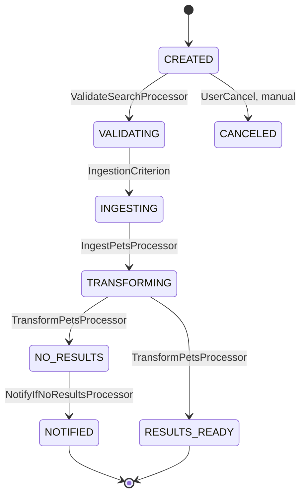
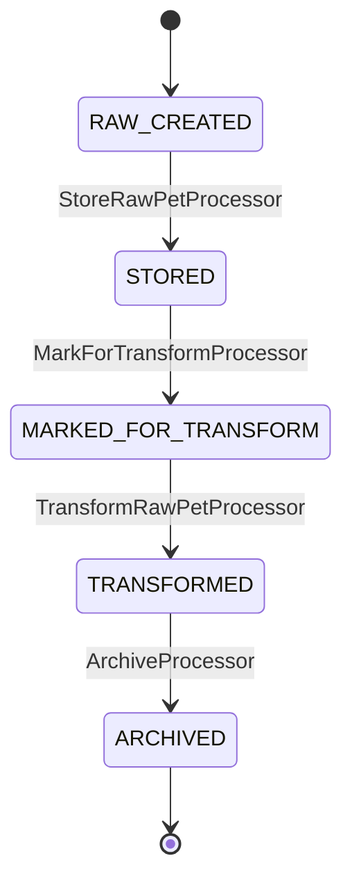
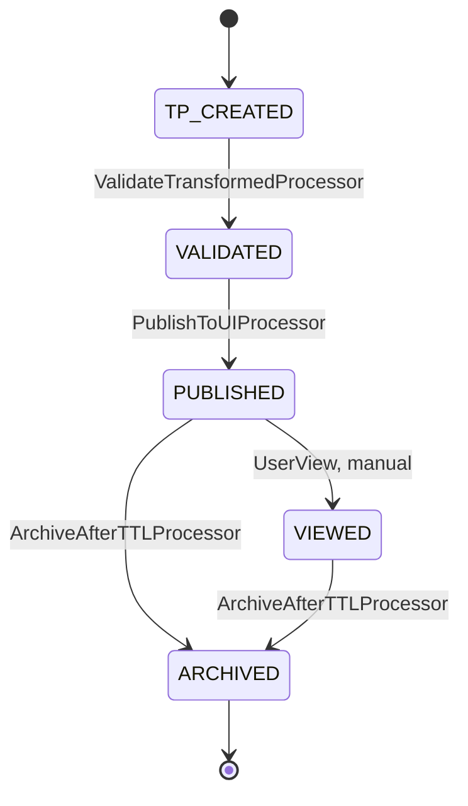

### 1. Entity Definitions
```
SearchRequest:
- species: String (filter e.g., dog)
- status: String (filter e.g., available)
- categoryId: Integer (filter)
- sortBy: String (optional)
- page: Integer (optional)
- pageSize: Integer (optional)
- userId: String (requester)
- notifyOnNoResults: Boolean (save/search alert)
- createdAt: String (timestamp)

RawPet:
- rawId: String (source id)
- payload: String (original JSON from external API)
- species: String
- status: String
- categoryId: Integer
- ingestedAt: String (timestamp)
- searchRequestId: String (link)

TransformedPet:
- id: Integer (business id)
- Name: String (from petName)
- Species: String
- Breed: String
- CategoryId: Integer
- Availability: String (friendly text)
- Age: String (derived)
- DisplayAttributes: String (summary)
- SourceMeta: String (rawId + ingestedAt)
- searchRequestId: String (link)
```

### 2. Entity workflows

SearchRequest workflow:
1. Initial State: CREATED (event = POST)
2. Validation: automatic ValidateSearchProcessor
3. Ingestion: automatic IngestPetsProcessor (creates RawPet entities)
4. Transformation: automatic TransformPetsProcessor (creates TransformedPet entities)
5. Results: RESULTS_READY or NO_RESULTS
6. Notification: automatic NotifyIfNoResultsProcessor if none
7. Manual: USER_CANCEL transitions to CANCELED


```mermaid
stateDiagram-v2
    [*] --> CREATED
    CREATED --> VALIDATING : ValidateSearchProcessor
    VALIDATING --> INGESTING : IngestionCriterion
    INGESTING --> TRANSFORMING : IngestPetsProcessor
    TRANSFORMING --> RESULTS_READY : TransformPetsProcessor
    TRANSFORMING --> NO_RESULTS : TransformPetsProcessor
    NO_RESULTS --> NOTIFIED : NotifyIfNoResultsProcessor
    NOTIFIED --> [*]
    RESULTS_READY --> [*]
    CREATED --> CANCELED : UserCancel, manual
```

Processors: ValidateSearchProcessor, IngestPetsProcessor, TransformPetsProcessor, NotifyIfNoResultsProcessor, CancelProcessor  
Criteria: IngestionCriterion, TransformationCompleteCriterion

RawPet workflow:
1. CREATED (when ingested)
2. STORED (StoreRawPetProcessor)
3. MARKED_FOR_TRANSFORM (MarkForTransformProcessor)
4. TRANSFORMED (TransformRawPetProcessor creates TransformedPet)
5. ARCHIVED


```mermaid
stateDiagram-v2
    [*] --> RAW_CREATED
    RAW_CREATED --> STORED : StoreRawPetProcessor
    STORED --> MARKED_FOR_TRANSFORM : MarkForTransformProcessor
    MARKED_FOR_TRANSFORM --> TRANSFORMED : TransformRawPetProcessor
    TRANSFORMED --> ARCHIVED : ArchiveProcessor
    ARCHIVED --> [*]
```

Processors: StoreRawPetProcessor, MarkForTransformProcessor, TransformRawPetProcessor, ArchiveProcessor  
Criteria: RawIntegrityCriterion

TransformedPet workflow:
1. CREATED
2. VALIDATED (ValidateTransformedProcessor)
3. PUBLISHED (PublishToUIProcessor)
4. VIEWED (user views) manual
5. ARCHIVED automatic after TTL


```mermaid
stateDiagram-v2
    [*] --> TP_CREATED
    TP_CREATED --> VALIDATED : ValidateTransformedProcessor
    VALIDATED --> PUBLISHED : PublishToUIProcessor
    PUBLISHED --> VIEWED : UserView, manual
    PUBLISHED --> ARCHIVED : ArchiveAfterTTLProcessor
    VIEWED --> ARCHIVED : ArchiveAfterTTLProcessor
    ARCHIVED --> [*]
```

Processors: ValidateTransformedProcessor, PublishToUIProcessor, ArchiveAfterTTLProcessor  
Criteria: TransformationQualityCriterion

### 3. Pseudo code for processor classes (concise)

ValidateSearchProcessor:
```
if missing required filters then mark SearchRequest invalid and fail
else set SearchRequest.valid = true
```

IngestPetsProcessor:
```
call external pet API with searchRequest parameters
for each pet in response:
    create RawPet(payload=petJson, rawId=pet.id, searchRequestId=sr.id)
mark SearchRequest.ingestionStarted = true
```

TransformRawPetProcessor:
```
for each RawPet with searchRequestId and not transformed:
   parse payload
   map fields -> TransformedPet (Name from petName, Availability from status)
   save TransformedPet(searchRequestId=raw.searchRequestId, SourceMeta=raw.rawId+ingestedAt)
   mark RawPet.transformed = true
```

NotifyIfNoResultsProcessor:
```
if no TransformedPet found for searchRequestId and searchRequest.notifyOnNoResults:
   create notification record / enqueue user alert
```

PublishToUIProcessor:
```
aggregate TransformedPet for searchRequestId
prepare results summary (totalCount,page)
set SearchRequest.status = RESULTS_READY
```

### 4. API Endpoints Design Rules

POST /searchRequests
- Description: create a SearchRequest (triggers EDA processing)
- Response: only technicalId

Request example:
```json
{
  "species": "dog",
  "status": "available",
  "categoryId": 42,
  "page": 1,
  "pageSize": 20,
  "notifyOnNoResults": true,
  "userId": "user-789"
}
```

Response example:
```json
{
  "technicalId": "sr-0001"
}
```

GET /searchRequests/{technicalId}
- Returns stored SearchRequest status and results (transformed pets)

Response example:
```json
{
  "technicalId": "sr-0001",
  "searchRequest": {
    "species": "dog",
    "status": "available",
    "categoryId": 42,
    "createdAt": "2025-08-21T10:00:00Z",
    "status": "RESULTS_READY"
  },
  "results": {
    "totalCount": 2,
    "page": 1,
    "pageSize": 20,
    "transformedPets": [
      {
        "id": 123,
        "Name": "Buddy",
        "Species": "dog",
        "Breed": "Labrador",
        "Availability": "Available now",
        "SourceMeta": "raw-555|2025-08-21T10:00:10Z"
      }
    ]
  }
}
```

Notes:
- Only POST for orchestration entity SearchRequest. RawPet and TransformedPet are created by processors (events).
- GET by technicalId implemented for SearchRequest as required.
- All entity persistence triggers Cyoda workflows described above.

If you want, I can expand to include Notification entity or saved-search management (up to 10 entities). Which would you like next?